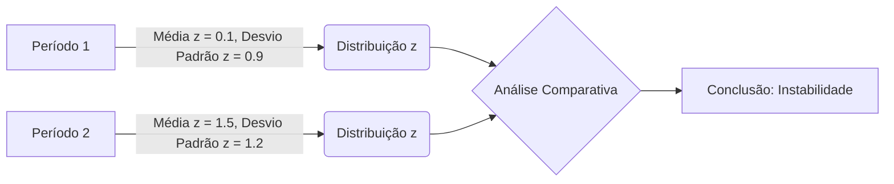

## Model Verification Based on Failure Rates: Normal Approximation and Standardized Scores

### Introdução
Em continuidade à discussão sobre a verificação de modelos VAR baseada em taxas de falha, este capítulo aprofunda a análise, explorando o uso da aproximação normal da distribuição binomial para facilitar os cálculos estatísticos. Conforme estabelecido anteriormente, a validação de modelos VAR exige uma comparação rigorosa entre as perdas previstas e as perdas reais [^1]. O objetivo é determinar se o número de exceções observadas é consistente com o nível de confiança do modelo. Esta seção se concentra na aplicação da aproximação normal e no uso do *z-score* para determinar se um modelo está mal calibrado. Conforme demonstrado no tópico anterior, a taxa de falha, calculada como $N/T$, onde $N$ é o número de exceções e $T$ é o número total de observações, é um estimador consistente para a probabilidade de exceção $p$. O teste de hipótese usando a distribuição binomial permite que avaliemos se o número de exceções $N$ é estatisticamente compatível com o nível de confiança do VAR.

### Conceitos Fundamentais

Conforme discutido anteriormente, o número de exceções $x$ em um período de $T$ observações segue uma distribuição binomial [^5]:

$$f(x) = \binom{T}{x} p^x (1-p)^{T-x}$$ [^5]

Onde $p$ representa a probabilidade de exceção definida pelo modelo. Para valores grandes de $T$, essa distribuição binomial pode ser aproximada por uma distribuição normal. Esta aproximação é uma consequência do Teorema do Limite Central.

**Lema 2** A distribuição binomial com parâmetros $T$ e $p$ pode ser aproximada por uma distribuição normal com média $E(x) = pT$ e variância $V(x) = p(1-p)T$ quando $T$ é suficientemente grande.

*Proof:*
I. O Teorema do Limite Central afirma que a soma de um grande número de variáveis aleatórias independentes e identicamente distribuídas se aproxima de uma distribuição normal.
II.  Em um processo de Bernoulli, cada observação é independente e segue uma distribuição Bernoulli com probabilidade de sucesso $p$.
III.  A distribuição binomial é a soma de $T$ variáveis aleatórias Bernoulli independentes.
IV. Quando $T$ é suficientemente grande (uma regra comum é que $Tp \geq 5$ e $T(1-p) \geq 5$), a distribuição binomial pode ser aproximada por uma distribuição normal com média $E(x) = pT$ e variância $V(x) = p(1-p)T$.
V. Esta aproximação simplifica os cálculos e permite usar a distribuição normal padrão para realizar testes de hipótese. ■

> 💡 **Exemplo Numérico:** Vamos considerar um modelo VAR com um nível de confiança de 99%, o que implica uma probabilidade de exceção $p = 0.01$. Se analisarmos esse modelo em um período de $T = 500$ dias, o número esperado de exceções seria $E(x) = pT = 0.01 \times 500 = 5$. A variância seria $V(x) = p(1-p)T = 0.01 \times 0.99 \times 500 = 4.95$. O desvio padrão seria $\sqrt{4.95} \approx 2.22$. Se observarmos um número de exceções $x$ próximo de 5, a aproximação normal será uma boa representação da distribuição binomial. Se observarmos, por exemplo, 10 exceções, podemos usar essa aproximação para avaliar a probabilidade desse evento.

**Lema 2.1** A aproximação normal da distribuição binomial pode ser aprimorada pela correção de continuidade.

*Proof:*
I. A aproximação normal aproxima uma distribuição discreta (binomial) por uma distribuição contínua (normal).
II. Ao usar a distribuição normal para aproximar a distribuição binomial, o valor inteiro $x$ da distribuição binomial é mapeado para um intervalo na distribuição normal.
III. Para melhorar a aproximação, uma correção de continuidade ajusta os limites de cada valor inteiro.
IV.  Ao calcular a probabilidade de $X \leq x$, usamos $X \leq x + 0.5$ na aproximação normal, e ao calcular a probabilidade de $X \geq x$, usamos $X \geq x - 0.5$.
V. Esta correção melhora a precisão da aproximação, especialmente quando o tamanho da amostra é pequeno ou quando $p$ se distancia de 0.5.
VI. Portanto, a correção de continuidade adiciona precisão à aproximação normal da distribuição binomial. ■

> 💡 **Exemplo Numérico:** Se quisermos calcular a probabilidade de observar 7 ou menos exceções em um teste com $T=100$ e $p=0.05$, usando a aproximação normal, sem a correção de continuidade, usaríamos o valor 7. Com a correção de continuidade, usaríamos 7.5. Isso significa que ao invés de calcular $P(X \le 7)$, calculamos $P(X \le 7.5)$ usando a distribuição normal, o que aumenta a precisão da estimativa.

**Lema 2.2** A correção de continuidade é particularmente importante quando o tamanho da amostra *T* é pequeno ou quando a probabilidade *p* é próxima de 0 ou 1.

*Proof:*
I. A correção de continuidade é mais relevante quando a distribuição binomial é menos simétrica e mais discreta.
II. Distribuições binomiais com tamanho de amostra pequeno e probabilidades de sucesso ou fracasso próximas de 0 ou 1 tendem a ser mais assimétricas e menos adequadas para aproximação normal.
III. A correção de continuidade ajusta as fronteiras discretas da binomial para melhorar a aproximação pela distribuição normal contínua.
IV. A diferença entre a probabilidade discreta da binomial e a probabilidade contínua da normal é maior nesses casos.
V. Portanto, a correção de continuidade é mais importante nessas condições para garantir uma aproximação normal mais precisa. ■

> 💡 **Exemplo Numérico:** Vamos comparar duas situações. Primeiro, com $T=20$ e $p=0.5$, a distribuição binomial é relativamente simétrica, e a correção de continuidade terá um efeito menor. No segundo caso, com $T=20$ e $p=0.05$, a distribuição binomial é mais assimétrica, e a correção de continuidade terá um impacto maior na precisão da aproximação normal. Em ambos os casos, a correção melhora a aproximação, mas ela é mais importante no segundo caso, devido à assimetria da distribuição.

Essa aproximação é crucial, pois nos permite calcular o *z-score* que segue uma distribuição normal padrão. O *z-score*, também apresentado no tópico anterior [^6], é dado por:

$$z = \frac{x - pT}{\sqrt{p(1-p)T}}$$ [^6]

Este *z-score* quantifica o desvio entre o número de exceções observadas $x$ e o número de exceções esperado $pT$, em unidades de desvio padrão. O uso do *z-score* simplifica o processo de teste de hipótese, permitindo-nos verificar se o modelo está bem calibrado usando um valor de referência da distribuição normal padrão.

> 💡 **Exemplo Numérico:** Considere um modelo VAR com um nível de confiança de 99% ($p = 0.01$). Em um período de 1000 dias ($T = 1000$), observamos 15 exceções ($x = 15$). O número esperado de exceções é $E(x) = pT = 0.01 \times 1000 = 10$. O desvio padrão do número de exceções é $\sqrt{p(1-p)T} = \sqrt{0.01 \times 0.99 \times 1000} \approx 3.15$. Calculamos o z-score: $z = \frac{15 - 10}{3.15} \approx 1.59$. Em um teste bicaudal com um nível de confiança de 95%, o valor crítico do z-score é 1.96. Como $|1.59| < 1.96$, não rejeitamos a hipótese nula ao nível de confiança de 95%, sugerindo que o modelo não apresenta evidências estatísticas de estar subestimando o risco neste exemplo.

O *z-score* nos permite quantificar a distância entre o número observado de exceções e o número esperado de exceções, expressando essa distância em unidades de desvio padrão.  O uso da aproximação normal para a distribuição binomial simplifica o teste de hipóteses, permitindo utilizar um valor crítico tabelado da distribuição normal padrão para verificar se um modelo VAR está corretamente calibrado. Em um nível de confiança de 95% (teste bicaudal), rejeitamos a hipótese nula se $|z| > 1.96$. Esta é uma abordagem padrão na estatística e permite realizar testes de hipótese com um nível de significância predefinido.

**Proposição 2** Um modelo VAR é considerado mal calibrado quando o valor absoluto do *z-score* é maior que o valor crítico correspondente ao nível de significância escolhido.

*Proof:*
I. O *z-score* quantifica o desvio entre o número observado de exceções e o número esperado, em unidades de desvio padrão.
II.  Em um teste de hipótese, estabelecemos um nível de significância ($\alpha$) que representa a probabilidade de rejeitar a hipótese nula quando ela é verdadeira (erro tipo I).
III. O nível de significância corresponde a áreas nas caudas da distribuição normal padrão.
IV. Em um teste bicaudal com nível de significância $\alpha$, rejeitamos a hipótese nula se o valor absoluto do *z-score* for maior que o valor crítico $z_{\alpha/2}$, correspondente a $\alpha/2$.
V. Por exemplo, se $\alpha = 0.05$ (nível de confiança de 95%), o valor crítico bicaudal é $z_{0.025} = 1.96$.
VI. Se $|z| > z_{\alpha/2}$, concluímos que o desvio entre o número observado de exceções e o número esperado é estatisticamente significativo, indicando que o modelo VAR pode estar mal calibrado. ■

> 💡 **Exemplo Numérico:** Suponha um modelo VAR com um nível de confiança de 97.5% ($p=0.025$). Em um período de 500 dias ($T=500$), observamos 25 exceções ($x=25$). O número esperado de exceções é $E(x)=pT=0.025\times500=12.5$. O desvio padrão é $\sqrt{p(1-p)T}=\sqrt{0.025\times0.975\times500}\approx3.5$. O *z-score* é calculado como $z = \frac{25-12.5}{3.5} \approx 3.57$. Em um teste bicaudal com um nível de significância de 5% (confiança de 95%), o valor crítico é 1.96. Dado que $|3.57| > 1.96$, rejeitamos a hipótese nula, indicando que o modelo VAR está mal calibrado e subestima o risco.

O uso do *z-score* com a aproximação normal para a distribuição binomial permite que os testes de backtesting sejam realizados de forma eficiente e com resultados interpretáveis. O valor do *z-score* fornece uma medida da probabilidade de observar uma taxa de falha tão extrema quanto a observada, caso o modelo estivesse corretamente calibrado, sob a hipótese nula. No exemplo anterior, a probabilidade de observar um desvio de 3.57 desvios padrão da média é muito pequena, sugerindo que o modelo VAR está mal calibrado, sob a hipótese de que a probabilidade de exceção é 0.025.

**Corolário 2** A precisão da aproximação normal da distribuição binomial aumenta com o tamanho da amostra $T$ e com a proximidade de $p$ a 0.5.

*Proof:*
I. A aproximação normal da distribuição binomial é baseada no Teorema do Limite Central, que afirma que a distribuição da soma de variáveis aleatórias independentes e identicamente distribuídas se aproxima de uma distribuição normal quando o número de variáveis é grande.
II.  Quanto maior o número de observações $T$, mais próxima a distribuição binomial se torna da distribuição normal.
III.  Além disso, quando a probabilidade de sucesso $p$ se aproxima de 0.5, a distribuição binomial se torna mais simétrica, facilitando uma aproximação mais precisa pela distribuição normal.
IV. Quando $p$ se aproxima de 0 ou 1, a distribuição binomial torna-se mais assimétrica e a aproximação normal pode ser menos precisa.
V.  Como regra geral, a aproximação normal é considerada adequada quando $Tp \geq 5$ e $T(1-p) \geq 5$, o que garante que a distribuição binomial não seja muito assimétrica.
VI. No entanto, para valores de $p$ muito pequenos ou muito grandes, pode ser necessário um tamanho de amostra maior para que a aproximação normal seja válida.
VII. A precisão da aproximação normal da distribuição binomial aumenta com o tamanho da amostra $T$ e com a proximidade de $p$ a 0.5. ■

> 💡 **Exemplo Numérico:** Vamos comparar dois cenários: um com $T = 100$ e $p = 0.5$ e outro com $T = 100$ e $p = 0.01$. No primeiro cenário, a distribuição binomial será bem aproximada por uma normal, pois $Tp = 50$ e $T(1-p) = 50$. No segundo cenário, a aproximação normal será menos precisa, pois $Tp = 1$ e $T(1-p) = 99$. Para o segundo cenário, um tamanho de amostra maior seria recomendado para que a aproximação normal seja mais confiável.

**Corolário 2.1** Para pequenos valores de *p*, é recomendável utilizar a correção de continuidade ao aplicar a aproximação normal da distribuição binomial.

*Proof:*
I. Quando *p* é pequeno, a distribuição binomial é assimétrica, e a aproximação normal sem correção de continuidade pode não ser precisa.
II. A correção de continuidade ajusta os limites da distribuição discreta para a distribuição contínua, melhorando a precisão da aproximação.
III. Para valores pequenos de *p*, a diferença entre a probabilidade discreta e a probabilidade contínua da aproximação normal é mais significativa, tornando a correção de continuidade mais relevante.
IV. O uso da correção de continuidade é especialmente útil quando *T* também é pequeno, e a distribuição binomial é mais longe de ser simétrica.
V. Portanto, para pequenos valores de *p*, a correção de continuidade melhora a qualidade da aproximação normal da distribuição binomial. ■

> 💡 **Exemplo Numérico:** Considere um modelo VAR com $p = 0.01$ e $T = 100$. O número esperado de exceções é $E(x) = 1$. Se observarmos 3 exceções, o *z-score* sem a correção de continuidade seria: $z = \frac{3 - 1}{\sqrt{100 \times 0.01 \times 0.99}} \approx 2.01$. Com a correção de continuidade, usaríamos $x = 3 - 0.5 = 2.5$, resultando em: $z = \frac{2.5 - 1}{\sqrt{100 \times 0.01 \times 0.99}} \approx 1.51$. A diferença entre os *z-scores* mostra que a correção de continuidade tem um impacto significativo quando *p* é pequeno, ajustando o teste para uma melhor aproximação.

A aproximação normal da distribuição binomial, juntamente com o cálculo do *z-score*, oferece uma ferramenta poderosa para a avaliação de modelos VAR em cenários de *backtesting*. Essa abordagem permite realizar testes de hipótese de forma eficiente e intuitiva, mesmo com grandes conjuntos de dados.

**Proposição 2.1** A análise da distribuição do *z-score* ao longo de diferentes subperíodos pode fornecer informações sobre a estabilidade da calibração do modelo VAR.

*Proof:*
I.  A análise da distribuição do *z-score* em diferentes subperíodos ajuda a identificar variações no desempenho do modelo VAR.
II. Se o modelo estiver corretamente calibrado, a distribuição dos *z-scores* ao longo do tempo deve se manter aproximadamente constante, com a maioria dos valores próximos de zero.
III. Variações significativas na distribuição do *z-score* entre diferentes subperíodos podem indicar instabilidade ou uma mudança na calibração do modelo.
IV. Se a distribuição se deslocar para a direita, com mais *z-scores* positivos, pode significar que o modelo está subestimando o risco. O oposto ocorre com a mudança para a esquerda, o que significa que o modelo está sobrestimando o risco.
V. A avaliação da estabilidade da distribuição do *z-score* permite identificar períodos de tempo em que o modelo pode estar apresentando maior ou menor grau de erro.
VI. Esta análise fornece informações úteis para a recalibração do modelo e para a melhoria da sua capacidade de previsão. Portanto, a distribuição do *z-score* fornece informações relevantes sobre a estabilidade da calibração do modelo VAR. ■

> 💡 **Exemplo Numérico:**  Suponha que analisemos os *z-scores* de um modelo VAR ao longo de dois subperíodos de 250 dias cada. No primeiro subperíodo, a média dos *z-scores* seja 0.1 e o desvio padrão seja 0.9. No segundo subperíodo, a média passa para 1.5, e o desvio padrão sobe para 1.2. O deslocamento da média para um valor positivo sugere que o modelo está, em média, subestimando o risco no segundo subperíodo. O aumento do desvio padrão indica uma maior variabilidade nos resultados do modelo, sinalizando uma possível instabilidade na sua calibração ao longo do tempo. Uma análise mais detalhada poderia revelar as razões por trás dessas mudanças.

Além disso, como discutido no tópico anterior, o teste de razão de verossimilhança pode ser utilizado para testar a calibração do modelo VAR sem recorrer à aproximação normal, sendo válido também para amostras pequenas. O teste de razão de verossimilhança (LR) compara a verossimilhança dos dados sob a hipótese nula com a verossimilhança sob a hipótese alternativa. A estatística de teste LR é dada por:

$$LR = -2 \ln\left(\frac{L(p;x)}{L(\hat{p};x)}\right)$$

Onde $L(p;x)$ é a verossimilhança dos dados sob a hipótese nula, usando a probabilidade de exceção especificada pelo modelo $p$, e $L(\hat{p};x)$ é a verossimilhança sob a hipótese alternativa, usando a taxa de falha observada $\hat{p} = x/T$. Sob a hipótese nula, o LR segue uma distribuição qui-quadrado com 1 grau de liberdade, e rejeitamos a hipótese nula se LR for maior que o valor crítico da distribuição qui-quadrado para um nível de significância definido. Este método alternativo pode ser usado para verificar os resultados obtidos com a aproximação normal, especialmente quando o tamanho da amostra não é muito grande.

> 💡 **Exemplo Numérico:** Vamos supor um modelo com $p=0.01$ e $T=100$. Observamos 3 exceções ($x=3$). A taxa de falha observada é $\hat{p} = 3/100 = 0.03$. A verossimilhança sob a hipótese nula $L(p;x)$ é calculada com $p=0.01$ e a verossimilhança sob a hipótese alternativa $L(\hat{p};x)$ é calculada com $\hat{p} = 0.03$. Utilizando softwares estatísticos, podemos obter $L(0.01; 3) \approx 0.0061$ e $L(0.03;3) \approx 0.0213$. O LR é então: $LR = -2 \ln(0.0061/0.0213) \approx -2 \ln(0.2864) \approx 2.50$. O valor crítico da distribuição qui-quadrado com 1 grau de liberdade a 5% de significância é 3.84. Como $2.50 < 3.84$, não rejeitamos a hipótese nula neste caso, indicando que o modelo não está mal calibrado com base neste teste.

**Corolário 3** O uso conjunto da aproximação normal e do teste de razão de verossimilhança fornece uma abordagem robusta para o backtesting de modelos VAR, permitindo avaliar a calibração dos modelos sob diferentes condições.

*Proof:*
I. A aproximação normal da distribuição binomial simplifica os cálculos e possibilita a aplicação do *z-score*, o que facilita a comparação com valores críticos da distribuição normal.
II.  No entanto, a aproximação normal pode ser menos precisa quando o tamanho da amostra é pequeno ou quando a probabilidade de exceção $p$ é muito baixa ou alta.
III. O teste de razão de verossimilhança é válido mesmo com amostras pequenas e não depende da aproximação normal.
IV. O uso dos dois métodos conjuntamente permite verificar a consistência dos resultados e avaliar a robustez da conclusão sobre a calibração do modelo.
V. Se ambos os métodos conduzirem à mesma conclusão, há maior confiança na decisão tomada sobre o desempenho do modelo VAR.
VI.  A combinação da aproximação normal e do teste de razão de verossimilhança oferece uma abordagem robusta para o backtesting de modelos VAR, permitindo uma avaliação mais completa da sua calibração. ■

**Teorema 1** A escolha do nível de significância $\alpha$ no teste de hipóteses afeta diretamente o balanço entre os erros do tipo I e do tipo II, que podem influenciar as decisões sobre a calibração do modelo VAR.

*Proof:*
I. O nível de significância $\alpha$ representa a probabilidade de rejeitar a hipótese nula quando ela é verdadeira (erro tipo I).
II. Reduzir $\alpha$ (por exemplo, de 5% para 1%) diminui a probabilidade de um erro do tipo I, tornando o teste mais rigoroso.
III. No entanto, a redução de $\alpha$ aumenta a probabilidade de não rejeitar a hipótese nula quando ela é falsa (erro tipo II).
IV. Um erro do tipo II ocorre quando aceitamos um modelo VAR como corretamente calibrado quando, na verdade, ele está subestimando ou superestimando o risco.
V. A escolha de $\alpha$ envolve um compromisso entre os erros do tipo I e do tipo II, dependendo das consequências de cada tipo de erro.
VI. Em situações onde a subestimação do risco tem consequências graves, é preferível escolher um valor de $\alpha$ maior para reduzir a probabilidade de aceitar um modelo mal calibrado.
VII. Portanto, a seleção apropriada do nível de significância é essencial para calibrar o teste de hipótese e ajustar o balanço entre os erros tipo I e II. ■

> 💡 **Exemplo Numérico:** Ao usar um nível de significância $\alpha = 0.05$ (5%), estamos aceitando uma probabilidade de 5% de rejeitar um modelo VAR que esteja bem calibrado. Se reduzirmos $\alpha$ para 0.01 (1%), o teste se tornará mais rigoroso, mas aumentaremos a chance de não rejeitar um modelo VAR que esteja mal calibrado. A escolha depende do custo relativo de cada tipo de erro.

**Teorema 1.1** O poder estatístico do teste de hipóteses aumenta com o tamanho da amostra T, permitindo identificar modelos mal calibrados com maior precisão.

*Proof:*
I. O poder estatístico de um teste representa a probabilidade de rejeitar a hipótese nula quando ela é falsa, ou seja, de detectar um modelo VAR mal calibrado corretamente.
II. Com um tamanho de amostra maior T, a distribuição amostral da taxa de falha se torna mais concentrada em torno do verdadeiro valor da probabilidade de exceção p.
III. Como resultado, a diferença entre o número de exceções observado e o número esperado de exceções se torna mais fácil de detectar estatisticamente.
IV. Um tamanho de amostra maior reduz a variabilidade do estimador da taxa de falha e, consequentemente, aumenta o poder do teste.
V. Portanto, o poder do teste de hipóteses aumenta com o aumento do tamanho da amostra T, permitindo uma avaliação mais precisa da calibração do modelo VAR. ■

> 💡 **Exemplo Numérico:** Em um cenário onde $p = 0.01$, com $T=100$, observaríamos uma média de 1 exceção. Se observarmos 3, o desvio padrão é $\sqrt{100 \times 0.01 \times 0.99} \approx 0.99$. O z-score é $z = (3-1)/0.99 = 2.02$. Agora, com $T = 1000$, a média seria 10 exceções, o desvio padrão $\sqrt{1000 \times 0.01 \times 0.99} \approx 3.14$ e se observássemos 16 exceções, o z-score seria $z = (16-10)/3.14 = 1.91$. Com o aumento da amostra, a estatística z fica mais precisa, aumentando o poder do teste de detectar um desvio.

**Teorema 1.2** A análise conjunta dos z-scores e do teste de razão de verossimilhança pode ser formalizada através de um teste combinado, que agrega as informações de ambos os testes para aumentar o poder estatístico.

*Proof:*
I. O z-score e o teste de razão de verossimilhança fornecem informações complementares sobre a calibração do modelo VAR.
II. O z-score é baseado na aproximação normal, enquanto o teste de razão de verossimilhança é baseado na distribuição exata da binomial.
III. Ao combinar os dois testes, podemos obter uma medida mais robusta da calibração do modelo.
IV. Uma abordagem para combinar esses testes é usar o método de Fisher para combinar os valores-p dos dois testes.
V. Sob a hipótese nula, os valores-p são distribuídos uniformemente entre 0 e 1, e a estatística de teste combinada é $-2 \sum_{i=1}^k \ln(p_i)$, onde $p_i$ são os valores-p dos k testes individuais.
VI. Esta estatística segue uma distribuição qui-quadrado com 2k graus de liberdade.
VII. Portanto, a combinação dos testes do z-score e razão de verossimilhança através do método de Fisher pode melhorar o poder estatístico na identificação de modelos mal calibrados, oferecendo uma avaliação mais abrangente da calibração do VAR. ■

> 💡 **Exemplo Numérico:** Vamos supor que calculamos o valor-p para o z-score e para o teste de razão de verossimilhança e obtivemos respectivamente $p_1=0.04$ e $p_2=0.06$. Usando o método de Fisher, a estatística combinada seria $-2(\ln(0.04) + \ln(0.06)) \approx 11.47$. Com 4 graus de liberdade (2 testes), o valor crítico a 5% é 9.49. Rejeitamos a hipótese nula combinada. Se analisássemos cada teste isoladamente, os resultados poderiam não ser significativos no nível de 5%, mas ao combiná-los, aumenta-se o poder estatístico.

**Lema 3**  Em situações em que a amostra é muito pequena e a aproximação normal não é confiável, o teste exato binomial pode ser empregado.

*Proof:*
I. O teste exato binomial calcula a probabilidade exata de observar um número de exceções tão extremo ou mais extremo do que o observado, dada a probabilidade de exceção $p$ do modelo.
II. A probabilidade de observar $x$ ou mais exceções é dada pela soma das probabilidades binomiais:  $P(X \geq x) = \sum_{k=x}^{T} \binom{T}{k} p^k (1-p)^{T-k}$.
III. Da mesma forma, a probabilidade de observar $x$ ou menos exceções é: $P(X \leq x) = \sum_{k=0}^{x} \binom{T}{k} p^k (1-p)^{T-k}$.
IV.  O teste exato binomial não requer a aproximação normal, e é válido mesmo para pequenos valores de $T$ e para valores de $p$ próximos de 0 ou 1.
V. Este método é mais computacionalmente intenso do que a aproximação normal, mas fornece resultados precisos quando as condições para a aproximação normal não são satisfeitas.
VI. Assim, o teste exato binomial é uma alternativa valiosa ao z-score e ao teste de razão de verossimilhança quando a aproximação normal não é adequada, especialmente em amostras pequenas. ■

> 💡 **Exemplo Numérico:** Considere um modelo VAR com $p=0.05$ e $T=20$. Se observamos 3 exceções, calcular a probabilidade exata $P(X \geq 3)$ seria somar as probabilidades de 3, 4, 5, ... até 20 exceções. Usando a fórmula binomial, $P(X \geq 3) = \sum_{k=3}^{20} \binom{20}{k} 0.05^k 0.95^{20-k}$. O resultado exato é aproximadamente 0.1887. O uso da aproximação normal, mesmo com a correção de continuidade, pode não ser tão preciso com amostras pequenas.

### Conclusão

Esta seção demonstrou como a aproximação normal da distribuição binomial, juntamente com o cálculo do *z-score*, pode ser utilizada para simplificar e otimizar a análise das taxas de falha em modelos VAR. O *z-score* fornece uma medida padronizada do desvio entre o número de exceções observadas e o número de exceções esperadas, facilitando a identificação de modelos mal calibrados através da comparação com os valores críticos da distribuição normal padrão.  A precisão da aproximação normal aumenta com o tamanho da amostra e com a proximidade de $p$ a 0.5, mas existem métodos alternativos, como o teste de razão de verossimilhança, que permitem avaliar a calibração do modelo também em amostras pequenas e sem recorrer à aproximação normal. O uso conjunto de ambas as abordagens garante uma avaliação mais completa e confiável dos modelos VAR, contribuindo para uma gestão de risco mais eficaz. A introdução do teste exato binomial e de métodos de combinação de testes enriquece ainda mais a análise de backtesting de modelos VAR, garantindo uma avaliação mais robusta e abrangente.

### Referências
[^1]: *“This chapter turns to backtesting techniques for verifying the accuracy of VAR models.”*
[^5]: *“The simplest method to verify the accuracy of the model is to record the failure rate, which gives the proportion of times VAR is exceeded in a given sample...Ideally, the failure rate should give an unbiased measure of p, that is, should converge to p as the sample size increases...We want to know, at a given confidence level, whether N is too small or too large under the null hypothesis that p = 0.01 in a sample of size T.”*
[^6]: *“z= (x-pT)/sqrt(p(1-p)T) ~ N(0, 1)...If the decision rule is defined at the two-tailed 95 percent test confidence level, then the cutoff value of |z| is 1.96...Based on Equation (6.2), we have z = (x-pT)/√p(1-p) T = (20 - 0.05 × 252)/√0.05(0.95) 252 = 2.14...Therefore, we reject the hypothesis that the VAR model is unbiased.”*
<!-- END -->
