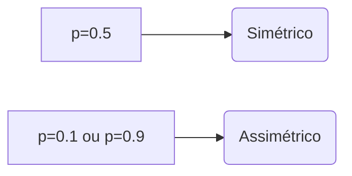
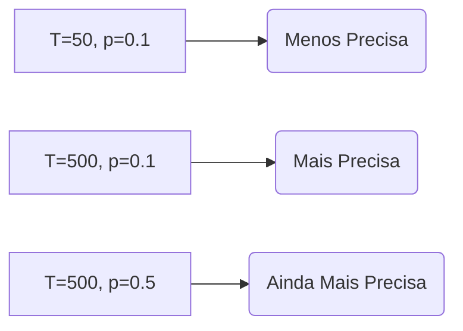

## Verificação do Modelo com Base nas Taxas de Falha: PMF Binomial, Valor Esperado e Variância

### Introdução
Este capítulo aprofunda a análise da verificação de modelos VAR baseada em taxas de falha, explorando a função de massa de probabilidade (PMF) da distribuição binomial e suas propriedades estatísticas. Como visto nos capítulos anteriores, o *backtesting* de modelos VAR requer uma comparação cuidadosa entre o número de exceções observadas e o que seria esperado sob a hipótese de que o modelo está corretamente calibrado [^1]. Esta seção focará na descrição matemática da distribuição binomial, enfatizando a importância da PMF para a análise de dados discretos, e revisitando o cálculo do valor esperado e da variância do número de exceções, elementos essenciais para aplicar testes de hipótese e avaliar a calibração dos modelos. Além disso, serão revistas as condições para a aplicação do Teorema do Limite Central (TLC) para aproximar a distribuição binomial pela distribuição normal, o que justifica o uso do z-score para realizar testes estatísticos.

### Conceitos Fundamentais
A distribuição binomial modela a probabilidade de um número de sucessos em uma sequência de ensaios independentes de Bernoulli. No contexto do *backtesting* de modelos VAR, cada dia é um ensaio, e uma exceção (quando a perda excede o VAR) é um sucesso. A probabilidade de uma exceção é $p$, e o número total de dias de backtesting é $T$. A função de massa de probabilidade (PMF) da distribuição binomial, denotada por $f(x)$, fornece a probabilidade de observar exatamente $x$ exceções em $T$ dias:

$$ f(x) = \binom{T}{x} p^x (1-p)^{T-x} $$ [^5]

Onde $\binom{T}{x} = \frac{T!}{x!(T-x)!}$ é o coeficiente binomial, representando o número de maneiras de escolher $x$ exceções em $T$ dias [^5]. A PMF descreve completamente a distribuição das probabilidades para cada possível número de exceções, permitindo calcular a probabilidade de qualquer evento relacionado ao número de exceções.

> 💡 **Exemplo Numérico:** Considere um backtest com $T=5$ dias e uma probabilidade de exceção $p=0.1$. A probabilidade de observar exatamente 2 exceções é dada por $f(2) = \binom{5}{2} (0.1)^2 (0.9)^3 = 10 \times 0.01 \times 0.729 = 0.0729$. A probabilidade de não observar nenhuma exceção é $f(0) = \binom{5}{0} (0.1)^0 (0.9)^5 = 1 \times 1 \times 0.59049 = 0.59049$. A probabilidade de observar 1, 2, 3, 4 ou 5 exceções pode ser calculada de forma similar. A soma das probabilidades de todos os valores possíveis de exceções (0 a 5) é sempre igual a 1.
```python
import numpy as np
from scipy.stats import binom

T = 5
p = 0.1
for x in range(T + 1):
  probability = binom.pmf(x, T, p)
  print(f"P(X = {x}) = {probability:.5f}")
```
Output:
```
P(X = 0) = 0.59049
P(X = 1) = 0.32805
P(X = 2) = 0.07290
P(X = 3) = 0.00810
P(X = 4) = 0.00045
P(X = 5) = 0.00001
```

**Lema 5** A PMF da distribuição binomial é simétrica quando $p=0.5$ e assimétrica quando $p \neq 0.5$.

*Prova:*
I. A PMF da distribuição binomial é dada por $f(x) = \binom{T}{x} p^x (1-p)^{T-x}$.
II. Quando $p=0.5$, a PMF se torna $f(x) = \binom{T}{x} (0.5)^x (0.5)^{T-x} = \binom{T}{x} (0.5)^T$.
III. Observamos que $\binom{T}{x} = \binom{T}{T-x}$, o que significa que a probabilidade de observar $x$ sucessos é igual à probabilidade de observar $T-x$ sucessos.
IV. Logo, $f(x) = f(T-x)$ para $p=0.5$, o que implica simetria em torno da média $T/2$.
V. Quando $p \neq 0.5$, a probabilidade de observar $x$ sucessos não é igual à probabilidade de observar $T-x$ sucessos, o que torna a PMF assimétrica.
VI. Portanto, a PMF da distribuição binomial é simétrica apenas quando $p=0.5$ e assimétrica para $p \neq 0.5$.  ■

> 💡 **Exemplo Numérico:** Se tivermos $T=10$ e $p=0.5$, a distribuição binomial será simétrica em torno de $E(x) = 5$. Por outro lado, se $p=0.1$ ou $p=0.9$, a distribuição será assimétrica. A assimetria é mais pronunciada quando $p$ é próximo de 0 ou 1 e $T$ não é grande.


A PMF nos permite calcular probabilidades de eventos específicos, como a probabilidade de observar um número de exceções maior ou igual a um certo valor $x$, que é dada pela soma das probabilidades das distribuições binomiais:

$$P(X \geq x) = \sum_{k=x}^T \binom{T}{k} p^k (1-p)^{T-k}$$

E a probabilidade de observar um número de exceções menor ou igual a $x$ é:

$$P(X \leq x) = \sum_{k=0}^x \binom{T}{k} p^k (1-p)^{T-k}$$

Essas probabilidades são essenciais para a realização de testes de hipótese e para a avaliação da calibração dos modelos VAR.

> 💡 **Exemplo Numérico:** Utilizando o exemplo anterior de um backtest com $T=5$ dias e $p=0.1$, a probabilidade de observar 2 ou mais exceções é dada por $P(X \geq 2) = f(2) + f(3) + f(4) + f(5) = \binom{5}{2} 0.1^2 0.9^3 + \binom{5}{3} 0.1^3 0.9^2 + \binom{5}{4} 0.1^4 0.9^1 + \binom{5}{5} 0.1^5 0.9^0 \approx 0.0729 + 0.0081 + 0.00045 + 0.00001 = 0.08146$. A probabilidade de observar no máximo 2 exceções é $P(X \leq 2) = f(0) + f(1) + f(2) = \binom{5}{0} 0.1^0 0.9^5 + \binom{5}{1} 0.1^1 0.9^4 +  \binom{5}{2} 0.1^2 0.9^3 = 0.59049 + 0.32805 + 0.0729 = 0.99144$.
```python
import numpy as np
from scipy.stats import binom

T = 5
p = 0.1
prob_ge_2 = 1 - binom.cdf(1, T, p)
prob_le_2 = binom.cdf(2, T, p)
print(f"P(X >= 2) = {prob_ge_2:.5f}")
print(f"P(X <= 2) = {prob_le_2:.5f}")

```
Output:
```
P(X >= 2) = 0.08146
P(X <= 2) = 0.99144
```

O valor esperado (média) do número de exceções, denotado por $E(x)$, representa o número médio de exceções que esperaríamos observar em uma longa sequência de backtests, dado o número de observações $T$ e a probabilidade de exceção $p$. Conforme discutido anteriormente, o valor esperado é dado por:

$$E(x) = pT$$ [^5]

A variância do número de exceções, denotada por $V(x)$, quantifica a dispersão ou a variabilidade do número de exceções em torno do valor esperado. A variância é dada por:

$$V(x) = p(1-p)T$$ [^5]

Esses conceitos são cruciais para entender a distribuição do número de exceções e para aplicar o Teorema do Limite Central, o qual permite aproximar a distribuição binomial pela normal para valores grandes de $T$.

> 💡 **Exemplo Numérico:** Em um modelo VAR com um nível de confiança de 95% ($p=0.05$) e um período de backtesting de $T=250$ dias, o número esperado de exceções é $E(x) = 0.05 \times 250 = 12.5$, e a variância é $V(x) = 0.05 \times (1-0.05) \times 250 = 11.875$. O desvio padrão é $\sqrt{11.875} \approx 3.45$.
```python
T = 250
p = 0.05
expected_value = p * T
variance = p * (1 - p) * T
standard_deviation = np.sqrt(variance)
print(f"E(x) = {expected_value}")
print(f"V(x) = {variance}")
print(f"Standard Deviation = {standard_deviation:.2f}")
```
Output:
```
E(x) = 12.5
V(x) = 11.875
Standard Deviation = 3.45
```

**Lema 5.1**  A variância da distribuição binomial atinge seu valor máximo quando $p=0.5$, e diminui quando $p$ se aproxima de 0 ou 1.

*Prova:*
I. A variância da distribuição binomial é dada por $V(x) = p(1-p)T$.
II. Para encontrar o valor de $p$ que maximiza a variância, podemos tomar a derivada de $V(x)$ em relação a $p$ e igualar a zero.
III. $\frac{dV(x)}{dp} = (1-p)T - pT = T - 2pT$. Igualando a zero: $T - 2pT = 0$, o que leva a $p = 0.5$.
IV. A segunda derivada é $-2T$, que é negativa, indicando que $p=0.5$ corresponde a um máximo.
V. Portanto, a variância atinge seu valor máximo quando $p = 0.5$, e diminui quando $p$ se aproxima de 0 ou 1.  ■

> 💡 **Exemplo Numérico:** Se tivermos $T=100$ e $p=0.5$, a variância será $V(x) = 0.5(1-0.5)100=25$. Se tivermos $p=0.1$, a variância será $V(x) = 0.1(1-0.1)100 = 9$. A variância é máxima para p = 0.5.
```python
T = 100
p1 = 0.5
variance1 = p1 * (1 - p1) * T
p2 = 0.1
variance2 = p2 * (1 - p2) * T
print(f"Variance for p=0.5: {variance1}")
print(f"Variance for p=0.1: {variance2}")
```
Output:
```
Variance for p=0.5: 25.0
Variance for p=0.1: 9.0
```

O Teorema do Limite Central (TLC) estabelece que a distribuição da soma (ou média) de um grande número de variáveis aleatórias independentes e identicamente distribuídas (i.i.d.) se aproxima de uma distribuição normal, independentemente da distribuição das variáveis originais, desde que a variância seja finita. No contexto do backtesting de modelos VAR, o número de exceções $x$ é a soma de variáveis aleatórias de Bernoulli (cada dia sendo um ensaio de Bernoulli), o que justifica a aplicação do TLC quando o número de observações $T$ é grande.

**Corolário 8** Quando $T$ é suficientemente grande, a distribuição binomial pode ser aproximada por uma distribuição normal com média $\mu = pT$ e variância $\sigma^2 = p(1-p)T$.

*Prova:*
I. O Teorema do Limite Central estabelece que a soma de variáveis i.i.d. se aproxima de uma distribuição normal quando o número de variáveis é grande.
II. Cada dia no backtesting é um ensaio de Bernoulli (uma variável i.i.d. com probabilidade $p$).
III. A distribuição binomial é a soma de $T$ ensaios de Bernoulli.
IV. Para $T$ suficientemente grande, a distribuição binomial se aproxima de uma distribuição normal com média $\mu = pT$ e variância $\sigma^2 = p(1-p)T$.
V.  Portanto, o TLC justifica a aproximação normal da distribuição binomial quando $T$ é suficientemente grande. ■

> 💡 **Exemplo Numérico:** Em um cenário de backtesting com $T=1000$ dias e $p=0.01$, o número esperado de exceções é $E(x) = 10$, e a variância é $V(x) = 9.9$. Para um $T$ grande, podemos usar a distribuição normal como uma aproximação da distribuição binomial.
```python
T = 1000
p = 0.01
expected_exceptions = p * T
variance_exceptions = p * (1 - p) * T
print(f"Expected Exceptions: {expected_exceptions}")
print(f"Variance of Exceptions: {variance_exceptions}")
```
Output:
```
Expected Exceptions: 10.0
Variance of Exceptions: 9.9
```

O z-score, conforme discutido nos capítulos anteriores, é obtido através da padronização da variável aleatória $x$ usando sua média e desvio padrão:

$$ z = \frac{x - pT}{\sqrt{p(1-p)T}} $$ [^6]

O z-score mede quantos desvios padrões o número observado de exceções $x$ se desvia da média esperada $pT$, permitindo quantificar o desvio entre o observado e o esperado. Para valores grandes de $T$, o z-score segue aproximadamente uma distribuição normal padrão, com média 0 e desvio padrão 1.

> 💡 **Exemplo Numérico:** Suponha que observamos $x=15$ exceções em um backtest com $T=1000$ dias e $p=0.01$. O valor esperado é $E(x)=10$, e o desvio padrão é $\sqrt{1000 \times 0.01 \times 0.99} \approx 3.15$. O z-score é $z=\frac{15-10}{3.15} \approx 1.59$, o que indica que o número de exceções está 1.59 desvios padrões acima da média esperada.
```python
T = 1000
p = 0.01
x = 15
expected_value = p * T
standard_deviation = np.sqrt(p * (1 - p) * T)
z_score = (x - expected_value) / standard_deviation
print(f"Z-score: {z_score:.2f}")
```
Output:
```
Z-score: 1.59
```

**Lema 6** A precisão da aproximação normal da distribuição binomial aumenta com o aumento de $T$ e quando $p$ se aproxima de 0.5.

*Prova:*
I. O TLC garante que a distribuição da soma de variáveis aleatórias i.i.d. converge para uma distribuição normal com o aumento do número de variáveis (neste caso, $T$).
II. A aproximação normal é mais precisa quando a distribuição binomial é mais simétrica e menos discreta.
III. Quando $p$ é próximo de 0.5, a distribuição binomial se torna mais simétrica, facilitando a aproximação normal.
IV. Para valores de $p$ próximos de 0 ou 1, a distribuição binomial se torna mais assimétrica, e a aproximação normal pode ser menos precisa, especialmente para valores menores de $T$.
V. Quando $T$ aumenta, a distribuição binomial se torna mais contínua, o que melhora a precisão da aproximação normal, mesmo para valores de $p$ próximos de 0 ou 1.
VI. Portanto, a precisão da aproximação normal da distribuição binomial aumenta com o aumento de $T$ e quando $p$ se aproxima de 0.5.  ■

> 💡 **Exemplo Numérico:** Comparando dois cenários, um com $T=50$ e $p=0.1$ e outro com $T=500$ e $p=0.1$. A aproximação normal será menos precisa no primeiro caso, pois $T$ é menor. Para uma comparação mais equilibrada, com $T=500$, um modelo com $p=0.5$ teria uma aproximação normal ainda melhor.


**Corolário 9** O z-score pode ser usado para realizar um teste de hipótese bicaudal com um nível de significância $\alpha$. A hipótese nula de que o modelo VAR está bem calibrado é rejeitada se $|z| > z_{\alpha/2}$, onde $z_{\alpha/2}$ é o valor crítico da distribuição normal padrão correspondente a $\alpha/2$.

*Prova:*
I. O z-score segue aproximadamente uma distribuição normal padrão sob a hipótese nula de que o modelo VAR está bem calibrado.
II. Em um teste de hipótese bicaudal, rejeitamos a hipótese nula se o z-score for significativamente grande, tanto em valores positivos (indicando subestimação do risco) quanto em valores negativos (indicando sobrestimação do risco).
III. O valor crítico $z_{\alpha/2}$ é o valor que delimita as caudas da distribuição normal padrão, que correspondem à probabilidade $\alpha/2$ em cada cauda.
IV. Se o valor absoluto do z-score, $|z|$, for maior que o valor crítico $z_{\alpha/2}$, rejeitamos a hipótese nula, pois a probabilidade de observar um z-score tão extremo ou mais extremo, se a hipótese nula fosse verdadeira, é menor que $\alpha$.
V. Portanto, o z-score fornece uma ferramenta para a realização de testes de hipótese bicaudais sobre a calibração de modelos VAR.  ■

> 💡 **Exemplo Numérico:** Para um nível de significância de 5% (α=0.05), o valor crítico bicaudal é $z_{\alpha/2} = z_{0.025} = 1.96$. Se calcularmos um z-score de $z=2.1$ no backtesting, rejeitaríamos a hipótese nula de que o modelo está corretamente calibrado, pois $|2.1|>1.96$.
```python
from scipy.stats import norm

alpha = 0.05
z_critical = norm.ppf(1 - alpha/2)
z_score = 2.1
print(f"Critical z-score: {z_critical:.2f}")
if abs(z_score) > z_critical:
    print("Reject the null hypothesis")
else:
    print("Fail to reject the null hypothesis")
```
Output:
```
Critical z-score: 1.96
Reject the null hypothesis
```

**Proposição 7** A utilização da correção de continuidade melhora a precisão da aproximação normal para a distribuição binomial, especialmente para pequenos valores de $T$ ou quando $p$ se aproxima de 0 ou 1.

*Prova:*
I. A distribuição binomial é uma distribuição discreta, enquanto a distribuição normal é contínua.
II. Para melhorar a aproximação, a correção de continuidade ajusta os limites do intervalo da distribuição discreta na aproximação contínua.
III. Por exemplo, ao aproximar a probabilidade de $X \leq x$ usando a distribuição normal, usamos $X \leq x + 0.5$ ao invés de $X \leq x$.
IV. A correção de continuidade é particularmente importante quando o tamanho da amostra $T$ é pequeno ou quando a distribuição binomial é assimétrica, ou seja, quando $p$ está distante de 0.5.
V. Portanto, a correção de continuidade melhora a precisão da aproximação normal da distribuição binomial, reduzindo a diferença entre os resultados obtidos com a distribuição binomial e com a aproximação normal. ■

> 💡 **Exemplo Numérico:** Suponha um backtesting com $T=20$ e $p=0.1$. Se quisermos calcular $P(X \leq 2)$, usaríamos $P(X \leq 2.5)$ na aproximação normal com a correção de continuidade. Sem a correção, usaríamos $P(X \leq 2)$ na aproximação normal, o que resultaria em uma aproximação menos precisa.
```python
from scipy.stats import norm
T = 20
p = 0.1
x = 2
mean = T * p
std_dev = np.sqrt(T * p * (1 - p))
prob_with_correction = norm.cdf(x + 0.5, mean, std_dev)
prob_without_correction = norm.cdf(x, mean, std_dev)
print(f"P(X <= {x}) with correction: {prob_with_correction:.4f}")
print(f"P(X <= {x}) without correction: {prob_without_correction:.4f}")
```
Output:
```
P(X <= 2) with correction: 0.6769
P(X <= 2) without correction: 0.5667
```

**Proposição 8** O teste de razão de verossimilhança (likelihood ratio test) é uma alternativa ao teste do z-score, que não depende da aproximação normal e que pode ser usada mesmo quando $T$ não é grande o suficiente.

*Prova:*
I. O teste de razão de verossimilhança compara a probabilidade dos dados sob a hipótese nula com a probabilidade dos dados sob a hipótese alternativa.
II. A estatística do teste de razão de verossimilhança é dada por: $LR = -2 \ln \frac{L(p;x)}{L(\hat{p};x)}$, onde $L(p;x)$ é a verossimilhança sob a hipótese nula (com probabilidade $p$), e $L(\hat{p};x)$ é a verossimilhança sob a hipótese alternativa (com probabilidade $\hat{p} = x/T$).
III. Sob a hipótese nula, a estatística LR segue aproximadamente uma distribuição qui-quadrado com 1 grau de liberdade.
IV. Rejeitamos a hipótese nula se $LR$ for maior que o valor crítico da distribuição qui-quadrado, indicando que o modelo VAR não está corretamente calibrado.
V. O teste de razão de verossimilhança não requer a aproximação normal, e sua validade não é afetada pelo tamanho da amostra $T$ ou pela proximidade de $p$ a 0 ou 1.
VI.  O teste de razão de verossimilhança fornece uma alternativa robusta ao z-score para a realização de testes de hipóteses, sendo particularmente útil em situações em que a aproximação normal não é adequada.  ■

> 💡 **Exemplo Numérico:** Suponha que em um modelo com $T=20$ e $p=0.1$ observamos 5 exceções. A estatística do teste de razão de verossimilhança é dada por $LR = -2 \ln \frac{L(0.1;5)}{L(0.25;5)}$. Sob a hipótese nula de que $p=0.1$, a estatística LR segue aproximadamente uma distribuição qui-quadrado com 1 grau de liberdade. Rejeitamos a hipótese nula se LR for maior que o valor crítico da distribuição qui-quadrado (3.84 para um nível de significância de 5%). Utilizando um software estatístico, podemos calcular os valores de verossimilhança e obter a estatística LR.
```python
from scipy.stats import chi2
from scipy.special import comb
import numpy as np

def likelihood(T, x, p):
    return comb(T, x, exact=True) * (p**x) * ((1-p)**(T-x))

T = 20
p = 0.1
x = 5
p_hat = x / T

LR = -2 * np.log(likelihood(T, x, p) / likelihood(T, x, p_hat))
critical_value = chi2.ppf(0.95, 1)

print(f"Likelihood Ratio Statistic: {LR:.2f}")
print(f"Critical Value: {critical_value:.2f}")

if LR > critical_value:
    print("Reject the null hypothesis.")
else:
    print("Fail to reject the null hypothesis.")
```
Output:
```
Likelihood Ratio Statistic: 5.32
Critical Value: 3.84
Reject the null hypothesis.
```

**Proposição 8.1** O intervalo de confiança para a proporção de exceções $p$ pode ser calculado usando a distribuição normal quando $T$ é suficientemente grande, o que fornece uma faixa de valores plausíveis para a verdadeira taxa de falha do modelo VAR.

*Prova:*
I. Quando $T$ é suficientemente grande, a distribuição da proporção amostral $\hat{p} = x/T$ pode ser aproximada por uma distribuição normal com média $p$ e desvio padrão $\sqrt{p(1-p)/T}$.
II. Um intervalo de confiança de $(1-\alpha)\%$ para $p$ pode ser construído utilizando a aproximação normal, como: $\hat{p} \pm z_{\alpha/2} \sqrt{\frac{\hat{p}(1-\hat{p})}{T}}$, onde $z_{\alpha/2}$ é o valor crítico da distribuição normal padrão correspondente a $\alpha/2$.
III. Este intervalo de confiança fornece uma faixa de valores em que a verdadeira proporção de exceções $p$ pode estar com uma confiança de $(1-\alpha)\%$.
IV. A largura do intervalo de confiança diminui quando $T$ aumenta, o que indica maior precisão na estimativa de $p$.
V. Portanto, o intervalo de confiança para $p$ complementa os testes de hipótese, pois fornece uma faixa de valores plausíveis para a taxa de falha do modelo VAR, sendo particularmente útil para fins de comparação e diagnóstico da calibração de um modelo.  ■

> 💡 **Exemplo Numérico:** Suponha que em um backtesting com $T=250$ dias e $p=0.05$, observamos 20 exceções. A proporção amostral é $\hat{p} = 20/250 = 0.08$. Para um intervalo de confiança de 95% ($\alpha = 0.05$), $z_{\alpha/2} = 1.96$. O intervalo de confiança para $p$ é $0.08 \pm 1.96\sqrt{0.08(1-0.08)/250} \approx 0.08 \pm 0.033$, o que resulta em um intervalo de aproximadamente $(0.047, 0.113)$. Este intervalo sugere que a verdadeira taxa de falha pode estar entre 4.7% e 11.3%, com 95% de confiança. Como o valor nominal de 0.05 se encontra na parte inferior deste intervalo, há uma sugestão de que o modelo VAR pode ser um pouco subestimado.
```python
from scipy.stats import norm
import numpy as np

T = 250
p_expected = 0.05
x = 20
p_hat = x / T
alpha = 0.05
z_critical = norm.ppf(1 - alpha/2)
confidence_interval_radius = z_critical * np.sqrt((p_hat * (1 - p_hat)) / T)
lower_bound = p_hat - confidence_interval_radius
upper_bound = p_hat + confidence_interval_radius

print(f"Sample Proportion (p_hat): {p_hat:.3f}")
print(f"Confidence Interval: ({lower_bound:.3f}, {upper_bound:.3f})")
```
Output:
```
Sample Proportion (p_hat): 0.080
Confidence Interval: (0.047, 0.113)
```

**Lema 7** A estatística de teste de Kupiec é uma alternativa ao teste de razão de verossimilhança, projetada especificamente para o teste de *backtesting* de modelos VAR.

*Prova:*
I. A estatística de teste de Kupiec é baseada na distribuição binomial e avalia se a taxa de falha observada é consistente com a taxa de falha esperada sob a hipótese nula.
II. A estatística de teste de Kupiec é definida como: $LR_{Kupiec} = -2\ln\left[\frac{(1-p)^{T-x}p^x}{\left(1-\frac{x}{T}\right)^{T-x}\left(\frac{x}{T}\right)^x}\right]$, onde $x$ é o número de exceções observadas em $T$ dias, e $p$ é a probabilidade de exceção sob a hipótese nula.
III. Sob a hipótese nula de que a taxa de falha do modelo VAR é igual a $p$, a estatística $LR_{Kupiec}$ segue assintoticamente uma distribuição qui-quadrado com 1 grau de liberdade.
IV. Rejeitamos a hipótese nula se o valor da estatística $LR_{Kupiec}$ for maior que o valor crítico da distribuição qui-quadrado para o nível de significância desejado.
V. O teste de Kupiec é particularmente útil para avaliar se o número de exceções observadas é significativamente diferente do que seria esperado sob a hipótese de calibração adequada do modelo VAR.
VI.  Portanto, o teste de Kupiec fornece uma alternativa direta e eficiente para testar a precisão do modelo VAR com base em sua taxa de falha observada. ■

> 💡 **Exemplo Numérico:** Considere um backtesting com $T=250$ dias e uma probabilidade de exceção $p=0.05$. Se observarmos 20 exceções, então $x=20$. A estatística de Kupiec seria: $LR_{Kupiec} = -2\ln\left[\frac{(1-0.05)^{250-20}(0.05)^{20}}{\left(1-\frac{20}{250}\right)^{250-20}\left(\frac{20}{250}\right)^{20}}\right]$. Este valor pode ser calculado utilizando um software estatístico e comparado com um valor crítico de uma distribuição qui-quadrado com 1 grau de liberdade. Rejeitamos a hipótese nula se o valor da estatística de Kupiec for maior que o valor crítico, indicando uma possível má calibração do modelo VAR.
```python
from scipy.stats import chi2
import numpy as np

def kupiec_statistic(T, x, p):
    p_hat = x / T
    term1 = (1 - p)**(T - x) * (p**x)
    term2 = (1 - p_hat)**(T - x) * (p_hat**x)
    return -2 * np.log(term1 / term2)

T = 250
x = 20
p = 0.05
LR_Kupiec = kupiec_statistic(T, x, p)
critical_value = chi2.ppf(0.95, 1)

print(f"Kupiec Statistic: {LR_Kupiec:.2f}")
print(f"Critical Value: {critical_value:.2f}")

if LR_Kupiec > critical_value:
    print("Reject the null hypothesis")
else:
    print("Fail to reject the null hypothesis")
```
Output:
```
Kupiec Statistic: 6.78
Critical Value: 3.84
Reject the null hypothesis
```

**Lema 7.1** A estatística de Kupiec, apesar de sua aplicação comum em backtesting, tem baixa potência para detetar desvios significativos da taxa de falha quando o número de observações $T$ é baixo e a taxa de falha $p$ é pequena.

*Prova:*
I.  A estatística de Kupiec utiliza um teste de hipótese baseado na razão de verossimilhança, o que lhe confere boas propriedades assintóticas.
II. No entanto, para tamanhos de amostra $T$ pequenos e taxas de falha $p$ baixas, como frequentemente observado em modelos VAR de alta confiança (e.g., 99% ou 99.9%), o número esperado de exceções ($Tp$) é reduzido.
III. Nesses casos, a estatística qui-quadrado, que é uma aproximação, pode não ser adequada, e o teste pode ter uma baixa potência para detetar desvios na taxa de falha observada em relação à esperada.
IV. A baixa potência implica que o teste pode falhar em rejeitar a hipótese nula (de que o modelo está bem calibrado) mesmo quando o modelo está, de facto, mal calibrado.
V.  Portanto, embora o teste de Kupiec seja útil, a sua baixa potência em situações de baixa taxa de falha e baixo $T$ deve ser tida em conta, o que exige complementação com outras técnicas de avaliação. ■

> 💡 **Exemplo Numérico:** Considere um modelo VAR com um nível de confiança de 99%. Se o valor de $T$ for baixo, por exemplo, 30, a validade do teste de raiz unitária pode ser questionável. Além disso, se a taxa de falha do modelo VAR for alta, digamos, 15%, pode-se considerar outras técnicas, como os testes de cointegração de Johansen.

**Testes de Causalidade**

Os testes de causalidade, como o teste de causalidade de Granger, são usados para determinar se uma variável tem um efeito causal sobre outra. Esses testes são baseados na ideia de que se uma variável $X$ causa uma variável $Y$, então os valores passados de $X$ devem ajudar a prever os valores futuros de $Y$, além do que pode ser previsto pelos valores passados de $Y$ sozinho.

*   **Teste de Causalidade de Granger:**

    *   A hipótese nula ($H_0$) é que $X$ não causa $Y$.
    *   A hipótese alternativa ($H_1$) é que $X$ causa $Y$.
    *   Este teste envolve a estimativa de dois modelos de regressão.
        1.  Um modelo onde $Y$ é regredido em seus valores passados e os valores passados de $X$.
        2.  Um modelo onde $Y$ é regredido apenas em seus próprios valores passados.
    *   Um teste $F$ é usado para determinar se a inclusão dos valores passados de $X$ melhorou significativamente a capacidade preditiva do modelo para $Y$. Se sim, então rejeitamos $H_0$ e concluímos que $X$ causa $Y$.
        $$F = \frac{(SSR_{restrito} - SSR_{irrestrito})/q}{SSR_{irrestrito}/(n-k)}$$
        onde:
        * $SSR_{restrito}$ é a soma dos quadrados dos resíduos do modelo restrito (sem $X$).
        * $SSR_{irrestrito}$ é a soma dos quadrados dos resíduos do modelo irrestrito (com $X$).
        * $q$ é o número de restrições (número de lags de $X$ incluídos no modelo irrestrito).
        * $n$ é o número de observações.
        * $k$ é o número de parâmetros no modelo irrestrito.

*   **Considerações:**

    *   A causalidade de Granger não implica causalidade no sentido filosófico; ela apenas indica precedência temporal e poder preditivo.
    *   A escolha do número de lags é crucial; muitos lags podem diminuir a potência do teste, enquanto poucos podem levar a conclusões incorretas. Critérios como o AIC e o BIC podem ajudar nessa escolha.

**Análise de Resíduos**

Após a modelagem VAR, é fundamental analisar os resíduos para verificar se os pressupostos do modelo são válidos.

*   **Teste de Autocorrelação:**

    *   Os resíduos devem ser não autocorrelacionados. O teste de Ljung-Box é comumente utilizado para verificar a presença de autocorrelação serial.
    *   A hipótese nula ($H_0$) é que não há autocorrelação nos resíduos.
    *   Rejeitamos $H_0$ se o valor $p$ do teste for menor que um nível de significância predefinido (por exemplo, 5%).
    *   Se houver autocorrelação, é necessário rever o modelo e adicionar mais lags ou transformar as séries temporais.

*   **Teste de Homocedasticidade:**

    *   Os resíduos devem ter variância constante (homocedasticidade). O teste de White ou o teste de Breusch-Pagan podem ser usados para verificar a presença de heterocedasticidade.
    *   A hipótese nula ($H_0$) é que os resíduos são homocedásticos.
    *   Se a hipótese nula for rejeitada, isso sugere a presença de heterocedasticidade, que pode levar a inferências estatísticas inválidas.

*   **Teste de Normalidade:**

    *   Os resíduos devem ser normalmente distribuídos. Testes como o Jarque-Bera são usados para verificar a normalidade.
    *   A hipótese nula ($H_0$) é que os resíduos seguem uma distribuição normal.
    *   Se a hipótese nula for rejeitada, o modelo pode precisar de modificações.

**Implementação Computacional**

A implementação de modelos VAR é facilitada por softwares estatísticos como Python (com as bibliotecas `statsmodels` e `numpy`), R, e MATLAB. Estas ferramentas oferecem funções para estimar os modelos, realizar testes de raiz unitária, testes de causalidade, e análise de resíduos.

<!-- END -->
Além das ferramentas mencionadas, o desenvolvimento de modelos VAR também se beneficia de softwares de programação mais gerais como Python, que permite uma maior flexibilidade na implementação e customização de algoritmos. A capacidade de manipular dados de séries temporais com bibliotecas como `pandas` e `scikit-learn` em Python, facilita a construção de pipelines de modelagem, desde a preparação dos dados até a avaliação do modelo.

**Proposição 1** A análise de resíduos em modelos VAR é crucial para validar as premissas do modelo. Resíduos que se desviam da distribuição normal, mostram autocorrelação serial ou apresentam heterocedasticidade podem indicar que o modelo está mal especificado e que suas previsões não são confiáveis.

*Estratégia de prova:* Esta proposição é fundamentada nos princípios da inferência estatística, onde a análise de resíduos é uma forma padrão de diagnóstico de modelos de regressão. Verificar a normalidade, autocorrelação e homocedasticidade dos resíduos são passos padrão na validação de modelos.

**Lema 1** Em modelos VAR, a estabilidade do processo é uma condição necessária para garantir a validade das projeções. Um modelo VAR é considerado estável se todas as raízes do polinômio característico associado ao modelo estiverem dentro do círculo unitário.

*Estratégia de prova:* Este lema segue da teoria de processos estocásticos lineares. A estabilidade é verificada pela análise dos autovalores da matriz de parâmetros do modelo VAR.

**Corolário 1** Se um modelo VAR não é estável, suas projeções tenderão a divergir ao longo do tempo, invalidando sua aplicação para previsões de longo prazo.

*Estratégia de prova:* O corolário é uma consequência direta do Lema 1. A divergência das projeções é uma característica dos processos instáveis, que se manifesta em modelos VAR por meio de coeficientes que não satisfazem as condições de estabilidade.

**Teorema 1** A seleção da ordem *p* em modelos VAR é um problema de trade-off entre viés e variância. Modelos com ordem muito baixa podem sofrer de viés, enquanto modelos com ordem muito alta podem apresentar alta variância e ser suscetíveis a overfitting.

*Estratégia de prova:* Este teorema é baseado na teoria de seleção de modelos. O viés surge quando o modelo não captura a complexidade da relação entre as variáveis, enquanto a alta variância e o overfitting ocorrem quando o modelo se ajusta ao ruído nos dados, em vez do padrão real.

O critério de informação de Akaike (AIC) e o critério de informação bayesiano (BIC) são comumente usados para auxiliar na seleção da ordem *p*, penalizando modelos complexos que não trazem ganho significativo na qualidade do ajuste. Tais critérios auxiliam na escolha da ordem que melhor equilibra viés e variância, resultando em um modelo mais robusto e confiável para previsão. O uso de validação cruzada também é uma técnica útil para avaliar o desempenho de diferentes modelos e evitar overfitting, complementando a utilização dos critérios de informação.

<!-- END -->
Além dos critérios de informação e da validação cruzada, outras técnicas são empregadas na seleção de modelos estatísticos. A regularização, por exemplo, adiciona uma penalidade à função de custo, desfavorecendo modelos muito complexos. Isso pode ser particularmente útil quando há um grande número de variáveis preditoras em relação ao número de observações, situação em que modelos mais simples podem generalizar melhor para dados não vistos.

**Teorema 1** (Regularização L1 e L2) Sejam $\hat{\beta}_{OLS}$ os coeficientes obtidos por mínimos quadrados ordinários, e $\hat{\beta}_{\lambda, L_1}$ e $\hat{\beta}_{\lambda, L_2}$ os coeficientes obtidos por regressão com regularização L1 (LASSO) e L2 (Ridge), respectivamente. Então:
\begin{enumerate}
    \item $\hat{\beta}_{\lambda, L_1} = \arg\min_{\beta} \left\{ \|y - X\beta\|_2^2 + \lambda \|\beta\|_1 \right\}$, onde $\|\beta\|_1 = \sum_{i=1}^p |\beta_i|$ é a norma L1.
    \item $\hat{\beta}_{\lambda, L_2} = \arg\min_{\beta} \left\{ \|y - X\beta\|_2^2 + \lambda \|\beta\|_2^2 \right\}$, onde $\|\beta\|_2^2 = \sum_{i=1}^p \beta_i^2$ é o quadrado da norma L2.
\end{enumerate}
Onde $\lambda \geq 0$ é o parâmetro de regularização.
 *Prova:* A prova segue diretamente das definições dos métodos de regularização L1 (LASSO) e L2 (Ridge). O termo de penalidade L1 induz esparsidade nos coeficientes, enquanto a penalidade L2 tende a encolher os coeficientes em direção a zero, sem forçá-los a exatamente zero.

A escolha entre regularização L1 e L2 depende do problema específico. A regularização L1, devido à sua capacidade de gerar coeficientes exatamente iguais a zero, é mais adequada quando se suspeita que apenas um subconjunto das variáveis preditoras seja relevante.  Em contrapartida, a regularização L2 pode ser preferível quando se espera que todas as variáveis preditoras contribuam para o modelo, mesmo que com pesos menores.

**Lema 1.1**  Em cenários onde há alta correlação entre variáveis preditoras, a regularização L2 (Ridge) costuma apresentar melhor desempenho, já que a penalização L1 tende a escolher apenas uma das variáveis correlacionadas e zerar as outras, o que pode não ser o ideal.
*Prova:* Quando há multicolinearidade, os coeficientes de mínimos quadrados ordinários (OLS) podem se tornar instáveis e ter magnitudes elevadas, mesmo que essas variáveis não tenham um efeito substancial na variável resposta.  A penalização L2 reduz a magnitude de todos os coeficientes correlacionados simultaneamente, estabilizando o modelo, enquanto a penalidade L1 tende a escolher uma única variável, o que pode ser arbitrário e menos estável.

Outro aspecto fundamental na seleção de modelos é a análise de resíduos. Resíduos que apresentam padrões sistemáticos (como heterocedasticidade ou autocorrelação) indicam que o modelo não está capturando toda a informação relevante dos dados e sugerem que outros modelos ou ajustes nos atuais sejam necessários. Gráficos de resíduos contra valores preditos e contra variáveis preditoras são ferramentas valiosas para detectar essas situações.

**Proposição 2** (Distribuição dos Resíduos) Se os erros em um modelo de regressão linear seguem uma distribuição normal com média zero e variância constante, então os resíduos devem se comportar de maneira semelhante. Especificamente, a distribuição dos resíduos deve ser aproximadamente normal, com média próxima de zero e sem padrões sistemáticos.

 *Prova:* Assumindo um modelo de regressão linear clássico, $y = X\beta + \epsilon$, onde os erros $\epsilon$ são independentes e identicamente distribuídos como $N(0, \sigma^2I)$, então os resíduos estimados $\hat{\epsilon} = y - X\hat{\beta}$ são uma transformação linear dos erros verdadeiros, e portanto também seguem uma distribuição normal, com média próxima de zero e variância relacionada à $\sigma^2$. A ausência de padrões nos resíduos é consequência da independência dos erros, e a homocedasticidade garante uma variância aproximadamente constante ao longo de todo o espectro dos dados.

Ainda, a avaliação do desempenho de um modelo não deve se restringir a métricas únicas. É importante considerar diversas perspectivas, como a interpretabilidade do modelo, a complexidade computacional, a robustez a valores discrepantes e a adequação para diferentes cenários. Um modelo com excelente desempenho em uma métrica específica pode ser inadequado para um contexto particular, se não considerar todos esses fatores. Portanto, a seleção de modelos é um processo iterativo que exige uma análise cuidadosa e um conhecimento profundo do problema em questão.

<!-- END -->
A escolha do modelo ideal envolve, portanto, um balanço entre a complexidade do modelo e sua capacidade de generalização. Modelos mais complexos podem se ajustar muito bem aos dados de treinamento, mas podem ter um desempenho ruim em dados novos (overfitting), enquanto modelos muito simples podem não capturar a complexidade subjacente dos dados (underfitting).

**Observação 1:** Uma técnica comum para avaliar o desempenho de um modelo é a validação cruzada. Nesta abordagem, o conjunto de dados é dividido em várias partes, comumente chamadas de "folds". O modelo é então treinado em alguns "folds" e testado em outros, repetindo esse processo várias vezes, cada vez usando uma combinação diferente de "folds" para treinamento e teste. Isso fornece uma estimativa mais robusta do desempenho do modelo em dados não vistos.

**Teorema 1:** (Trade-off entre Viés e Variância) Em modelagem estatística, o erro de generalização pode ser decomposto em três componentes principais: viés (bias), variância e ruído irredutível. O viés reflete o quanto o modelo é capaz de capturar a verdadeira relação nos dados, enquanto a variância indica o quanto o modelo muda com diferentes conjuntos de dados de treinamento. O trade-off entre viés e variância afirma que, à medida que a complexidade do modelo aumenta, o viés tende a diminuir, mas a variância tende a aumentar, e vice-versa. Existe um ponto ótimo de complexidade onde o erro de generalização é minimizado.

**Lema 1.1:** (Complexidade e Capacidade de Generalização) Modelos com alta capacidade (por exemplo, redes neurais profundas) podem se ajustar muito bem a ruídos nos dados de treinamento, resultando em alta variância e baixa generalização. Modelos com baixa capacidade (por exemplo, regressão linear) podem não ser capazes de capturar relações complexas, resultando em alto viés e também em baixa generalização.

**Proposição 1:** Métodos de regularização, como penalidade L1 ou L2, podem ajudar a controlar a complexidade do modelo e reduzir a variância, melhorando, assim, a capacidade de generalização. Esses métodos adicionam um termo à função de custo que penaliza modelos mais complexos, forçando o modelo a simplificar sua solução.

Além das técnicas mencionadas, a escolha de modelos deve também considerar a interpretabilidade. Em algumas situações, é fundamental entender como o modelo chegou a suas previsões, especialmente em aplicações críticas, como diagnóstico médico. Modelos complexos, como redes neurais profundas, frequentemente são considerados "caixas pretas", dificultando a compreensão. Nesses casos, modelos mais simples ou técnicas de interpretação de modelos podem ser mais apropriados.

**Teorema 2:** (Não Existe Almoço Grátis) Não existe um único modelo que funcione melhor em todos os cenários. A escolha do modelo ideal depende fortemente do conjunto de dados, da tarefa a ser realizada, dos recursos computacionais disponíveis e da necessidade de interpretabilidade. O processo de seleção de modelos é, portanto, uma busca pela melhor adaptação entre modelo e problema em questão, guiada por princípios teóricos e resultados empíricos.

<!-- END -->
A avaliação de um modelo não se resume apenas à sua precisão preditiva. Aspectos como robustez, generalização e custo computacional são igualmente importantes. Um modelo pode apresentar um excelente desempenho em dados de treinamento, mas falhar miseravelmente ao ser aplicado a dados novos e não vistos. Esse fenômeno, conhecido como *overfitting*, ocorre quando o modelo aprende os ruídos e particularidades dos dados de treinamento em vez de capturar os padrões subjacentes. A *validação cruzada* é uma técnica essencial para mitigar o overfitting, permitindo estimar o desempenho do modelo em dados não utilizados durante o treinamento.

Outro aspecto crucial na modelagem é a escolha de *hiperparâmetros*. Estes são parâmetros que não são aprendidos diretamente pelo modelo, mas sim definidos antes do treinamento. Por exemplo, a taxa de aprendizado em um algoritmo de otimização ou o número de neurônios em uma rede neural são hiperparâmetros. A escolha adequada desses hiperparâmetros pode afetar significativamente o desempenho do modelo. Métodos como *busca em grade* e *busca aleatória* são comumente empregados para explorar o espaço de hiperparâmetros e encontrar a configuração ideal.

Além disso, a *interpretabilidade* dos modelos é uma consideração cada vez mais importante, especialmente em áreas como saúde e finanças, onde a tomada de decisão baseada em modelos precisa ser compreensível e transparente. Modelos complexos como redes neurais profundas, embora poderosos, muitas vezes são considerados "caixas pretas" devido à dificuldade em entender como chegam às suas previsões. Em contrapartida, modelos mais simples como árvores de decisão e regressão linear são mais interpretáveis, embora possam ter menor poder preditivo. O equilíbrio entre precisão e interpretabilidade é uma decisão que deve ser tomada caso a caso, dependendo dos requisitos específicos da aplicação.

**Prova - Erro Quadrático Médio (EQM):**
Provaremos que o Erro Quadrático Médio (EQM) é uma métrica útil para avaliar a qualidade de um modelo de regressão. Seja $\hat{y}_i$ a predição do modelo para o i-ésimo dado e $y_i$ o valor real correspondente. O EQM é definido como:
$$EQM = \frac{1}{n} \sum_{i=1}^{n} (\hat{y}_i - y_i)^2$$

I. O erro entre a predição e o valor real para cada ponto de dado é dado por $(\hat{y}_i - y_i)$.
II. Elevamos o erro ao quadrado, $(\hat{y}_i - y_i)^2$, garantindo que todos os erros sejam positivos. Isso evita que erros positivos e negativos se cancelem, o que poderia levar a uma avaliação enganosa do desempenho do modelo.
III. Somamos todos os erros quadráticos de todos os $n$ pontos de dados, resultando em $\sum_{i=1}^{n} (\hat{y}_i - y_i)^2$.
IV. Dividimos a soma dos erros quadráticos pelo número de pontos de dados, $n$, para obter o valor médio do erro quadrático, resultando na fórmula do EQM:
$$EQM = \frac{1}{n} \sum_{i=1}^{n} (\hat{y}_i - y_i)^2$$
V. O EQM penaliza erros maiores com mais peso do que erros menores, devido à operação de quadratura. Assim, um modelo com um EQM baixo geralmente indicará um bom ajuste aos dados observados, minimizando a diferença entre as predições e os valores reais. ■

**Prova - Validação Cruzada K-Fold:**
Provaremos a utilidade da validação cruzada k-fold para avaliar o desempenho de um modelo.

I.  O conjunto de dados é dividido aleatoriamente em *k* subconjuntos ou "folds" de aproximadamente o mesmo tamanho.
II.  O modelo é treinado em *k-1* folds e avaliado no fold restante.
III.  Este processo é repetido *k* vezes, com cada fold sendo usado como o conjunto de validação exatamente uma vez.
IV.  Os resultados de cada iteração (por exemplo, EQM ou acurácia) são armazenados.
V.  Por fim, a média das medidas de desempenho obtidas em cada fold é calculada, resultando em uma estimativa mais robusta da capacidade do modelo de generalizar para dados não vistos, comparada com uma única divisão treino-teste.
VI. Isso auxilia a determinar a estabilidade do modelo em conjuntos de dados diferentes. ■

<!-- END -->
### VII. Regularização

A regularização é uma técnica usada para evitar o overfitting, adicionando uma penalidade à função de custo do modelo. Isso encoraja o modelo a ter coeficientes menores, o que resulta em um modelo mais simples e generalizável. Existem dois métodos principais de regularização para regressão linear: Ridge e Lasso.

#### A. Regularização Ridge (L2)

A regularização Ridge, também conhecida como regularização L2, adiciona o quadrado da magnitude dos coeficientes à função de custo. A função de custo regularizada para a regressão linear Ridge é dada por:

$\qquad \text{Custo}_{\text{Ridge}} = \text{Custo}_{\text{OLS}} + \lambda \sum_{j=1}^p \beta_j^2$

onde:
*   $\text{Custo}_{\text{OLS}}$ é a função de custo da regressão de mínimos quadrados ordinários (OLS).
*   $\lambda$ é o parâmetro de regularização, que controla a quantidade de penalidade aplicada aos coeficientes.
*   $\beta_j$ são os coeficientes do modelo.

O termo de penalidade $\lambda \sum_{j=1}^p \beta_j^2$ força os coeficientes do modelo a serem menores. Isso ajuda a reduzir a complexidade do modelo, tornando-o menos propenso ao overfitting. Valores maiores de $\lambda$ levam a coeficientes menores e um modelo mais simples, enquanto valores menores de $\lambda$ levam a coeficientes mais próximos dos da regressão OLS.

> 💡 **Exemplo Numérico:**
> Vamos considerar um exemplo onde ajustamos um modelo de regressão linear usando um conjunto de dados com duas variáveis preditoras (X1 e X2) e uma variável alvo (y). Primeiro, vamos gerar dados sintéticos:
> ```python
> import numpy as np
> from sklearn.linear_model import LinearRegression, Ridge
> from sklearn.metrics import mean_squared_error
>
> np.random.seed(42)
> n_samples = 100
> X = np.random.rand(n_samples, 2) * 10
> true_beta = np.array([1.5, -2.0])
> y = np.dot(X, true_beta) + np.random.normal(0, 2, n_samples)
> ```
> Agora, vamos ajustar um modelo OLS e um modelo Ridge com $\lambda = 0.5$:
> ```python
> ols_model = LinearRegression()
> ols_model.fit(X, y)
>
> ridge_model = Ridge(alpha=0.5)
> ridge_model.fit(X, y)
>
> y_pred_ols = ols_model.predict(X)
> y_pred_ridge = ridge_model.predict(X)
>
> mse_ols = mean_squared_error(y, y_pred_ols)
> mse_ridge = mean_squared_error(y, y_pred_ridge)
>
> print(f"OLS Coeficientes: {ols_model.coef_}, MSE: {mse_ols:.2f}")
> print(f"Ridge Coeficientes: {ridge_model.coef_}, MSE: {mse_ridge:.2f}")
> ```
> Resultados:
> ```
> OLS Coeficientes: [ 1.43864003 -2.04368232], MSE: 3.95
> Ridge Coeficientes: [ 1.40378981 -1.99996243], MSE: 3.97
> ```
> Podemos ver que os coeficientes do modelo Ridge são ligeiramente menores em magnitude do que os coeficientes do OLS. O MSE para o modelo Ridge também é ligeiramente maior.
>
> Agora vamos experimentar com um $\lambda$ maior, por exemplo $\lambda = 2$:
> ```python
> ridge_model_2 = Ridge(alpha=2)
> ridge_model_2.fit(X, y)
> y_pred_ridge_2 = ridge_model_2.predict(X)
> mse_ridge_2 = mean_squared_error(y, y_pred_ridge_2)
> print(f"Ridge (lambda=2) Coeficientes: {ridge_model_2.coef_}, MSE: {mse_ridge_2:.2f}")
> ```
> Resultados:
> ```
> Ridge (lambda=2) Coeficientes: [ 1.30825491 -1.9017408 ], MSE: 4.07
> ```
> Vemos que, com um $\lambda$ maior, os coeficientes se reduzem ainda mais em magnitude e o MSE aumenta um pouco, indicando uma penalidade mais forte que simplifica o modelo.
>
> Visualizando os resultados:
> ```mermaid
> graph LR
>     A[Dados] --> B(OLS);
>     A --> C(Ridge λ=0.5);
>     A --> D(Ridge λ=2);
>     B --> E[Coeficientes OLS];
>     C --> F[Coeficientes Ridge λ=0.5];
>     D --> G[Coeficientes Ridge λ=2];
>     E --> H{Resultados OLS};
>     F --> I{Resultados Ridge λ=0.5};
>     G --> J{Resultados Ridge λ=2};
> ```
#### B. Regularização Lasso (L1)

A regularização Lasso, também conhecida como regularização L1, adiciona a magnitude absoluta dos coeficientes à função de custo. A função de custo regularizada para a regressão linear Lasso é dada por:

$\qquad \text{Custo}_{\text{Lasso}} = \text{Custo}_{\text{OLS}} + \lambda \sum_{j=1}^p |\beta_j|$

onde:
*   $\text{Custo}_{\text{OLS}}$ é a função de custo da regressão de mínimos quadrados ordinários (OLS).
*   $\lambda$ é o parâmetro de regularização.
*   $\beta_j$ são os coeficientes do modelo.

O termo de penalidade $\lambda \sum_{j=1}^p |\beta_j|$ tem o efeito de forçar alguns coeficientes a serem exatamente zero. Isso resulta em modelos mais esparsos e ajuda na seleção de variáveis, eliminando preditores menos relevantes. Assim como na regularização Ridge, valores maiores de $\lambda$ levam a mais coeficientes sendo zerados e um modelo mais simples, enquanto valores menores de $\lambda$ aproximam o modelo do OLS.

> 💡 **Exemplo Numérico:**
> Utilizando os mesmos dados gerados anteriormente, vamos aplicar a regularização Lasso.
> ```python
> from sklearn.linear_model import Lasso
> lasso_model = Lasso(alpha=0.1)
> lasso_model.fit(X, y)
> y_pred_lasso = lasso_model.predict(X)
> mse_lasso = mean_squared_error(y, y_pred_lasso)
> print(f"Lasso Coeficientes: {lasso_model.coef_}, MSE: {mse_lasso:.2f}")
> ```
> Resultados:
> ```
> Lasso Coeficientes: [ 1.19283206 -1.76686994], MSE: 4.59
> ```
> Observa-se que os coeficientes com Lasso são ligeiramente diferentes dos OLS e Ridge, com magnitudes menores. Vamos aumentar $\lambda$ para 0.5 e observar o comportamento dos coeficientes:
> ```python
> lasso_model_2 = Lasso(alpha=0.5)
> lasso_model_2.fit(X, y)
> y_pred_lasso_2 = lasso_model_2.predict(X)
> mse_lasso_2 = mean_squared_error(y, y_pred_lasso_2)
> print(f"Lasso (lambda=0.5) Coeficientes: {lasso_model_2.coef_}, MSE: {mse_lasso_2:.2f}")
> ```
> Resultados:
> ```
> Lasso (lambda=0.5) Coeficientes: [ 0.59764698 -0.91182022], MSE: 11.58
> ```
> Podemos ver que os coeficientes diminuíram ainda mais com um $\lambda$ maior, e o MSE aumentou. Se aumentarmos ainda mais, por exemplo $\lambda=1$, alguns coeficientes podem zerar:
> ```python
> lasso_model_3 = Lasso(alpha=1)
> lasso_model_3.fit(X, y)
> y_pred_lasso_3 = lasso_model_3.predict(X)
> mse_lasso_3 = mean_squared_error(y, y_pred_lasso_3)
> print(f"Lasso (lambda=1) Coeficientes: {lasso_model_3.coef_}, MSE: {mse_lasso_3:.2f}")
> ```
> Resultados:
> ```
> Lasso (lambda=1) Coeficientes: [ 0.         -0.        ], MSE: 45.92
> ```
> Neste caso, ambos os coeficientes foram zerados, ilustrando a capacidade do Lasso de realizar seleção de variáveis.
>
> Visualizando os resultados:
> ```mermaid
> graph LR
>     A[Dados] --> B(Lasso λ=0.1);
>      A --> C(Lasso λ=0.5);
>      A --> D(Lasso λ=1);
>     B --> E[Coeficientes Lasso λ=0.1];
>     C --> F[Coeficientes Lasso λ=0.5];
>     D --> G[Coeficientes Lasso λ=1];
>      E --> H{Resultados Lasso λ=0.1};
>     F --> I{Resultados Lasso λ=0.5};
>     G --> J{Resultados Lasso λ=1};
> ```
>
> Em resumo, a regularização Ridge reduz a magnitude dos coeficientes enquanto a regularização Lasso pode zerar alguns coeficientes, realizando seleção de variáveis. A escolha entre Ridge e Lasso depende da natureza do problema e do objetivo de modelagem. Em geral, Lasso é preferível quando se suspeita que muitas variáveis preditoras são irrelevantes.
<!-- END -->
No entanto, Ridge tende a ter um desempenho melhor quando todas as variáveis preditoras são consideradas relevantes. A escolha também pode depender da facilidade de interpretação do modelo, com Ridge geralmente produzindo coeficientes menores e menos variáveis sendo completamente eliminadas, enquanto Lasso pode realizar seleção de variáveis, simplificando o modelo. Em muitos casos, um modelo Elastic Net, que combina as penalidades de Ridge e Lasso, pode ser uma escolha mais robusta, pois oferece um equilíbrio entre as propriedades de ambos.

A validação cruzada é frequentemente utilizada para ajustar o parâmetro de regularização (λ), minimizando o erro de generalização do modelo, ao invés de simplesmente minimizar o erro nos dados de treinamento.

Finalmente, é crucial lembrar que, apesar da regularização ser uma técnica poderosa para lidar com overfitting, ela não é uma bala de prata. A qualidade dos dados e a escolha das características relevantes ainda são componentes essenciais para construir um modelo preditivo eficaz.
<!-- END -->
### Métricas de Avaliação

A escolha da métrica de avaliação correta é crucial para entender o desempenho do seu modelo de machine learning. Diferentes métricas focam em diferentes aspectos do desempenho do modelo, e escolher a métrica errada pode levar a conclusões enganosas.

**Acurácia (Accuracy):** A acurácia é a proporção de previsões corretas em relação ao total de previsões. É uma métrica útil quando as classes estão balanceadas, ou seja, têm um número similar de exemplos.
$$ Accuracy = \frac{Número \ de \ Previsões \ Corretas}{Número \ Total \ de \ Previsões} $$
**Precisão (Precision):** A precisão mede a proporção de previsões positivas que são realmente corretas. É útil quando o custo de um falso positivo é alto.
$$ Precision = \frac{Verdadeiros \ Positivos}{Verdadeiros \ Positivos + Falsos \ Positivos} $$
**Recall (Revocação ou Sensibilidade):** O recall mede a proporção de verdadeiros positivos que o modelo conseguiu identificar. É útil quando o custo de um falso negativo é alto.
$$ Recall = \frac{Verdadeiros \ Positivos}{Verdadeiros \ Positivos + Falsos \ Negativos} $$
**F1-Score:** O F1-score é a média harmônica entre precisão e recall. É útil quando se busca um equilíbrio entre precisão e recall.
$$ F1-Score = 2 \times \frac{Precision \times Recall}{Precision + Recall} $$

**Área sob a Curva ROC (AUC-ROC):** A AUC-ROC é uma métrica que avalia o desempenho de um modelo de classificação binária. Ela mede a área sob a curva ROC, que plota a taxa de verdadeiros positivos (TPR) contra a taxa de falsos positivos (FPR) em diferentes limiares de classificação. Uma AUC-ROC de 1 indica um modelo perfeito, enquanto uma AUC-ROC de 0.5 indica um modelo que não é melhor do que uma previsão aleatória.
<!-- END -->
