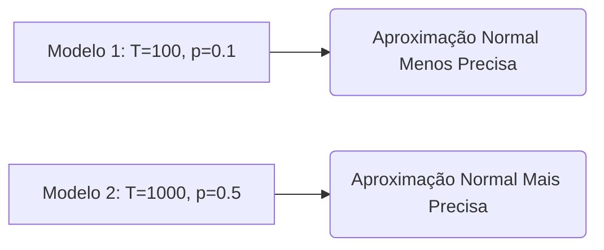

## Verificação do Modelo com Base nas Taxas de Falha: Estatística Z e Teste de Hipótese

### Introdução

Este capítulo aprofunda a aplicação da estatística $z$ no contexto da verificação de modelos VAR com base nas taxas de falha. Como discutido nos capítulos anteriores, a validação de modelos VAR envolve a análise da taxa de falha, que é a proporção de vezes em que as perdas reais excedem o VAR previsto [^1]. Foi estabelecido que a distribuição do número de exceções pode ser aproximada por uma distribuição normal, para valores grandes de $T$, o que justifica o uso do z-score para realizar testes de hipótese. Este capítulo se concentra em como o z-score é efetivamente utilizado para determinar se o número de exceções observado se desvia significativamente do valor esperado sob a hipótese de que o modelo VAR está corretamente calibrado. A seção também explica como definir um valor de corte apropriado para a estatística z, e como rejeitar a hipótese nula quando o valor absoluto do z-score excede este valor de corte.

### Conceitos Fundamentais

O *z-score*, conforme introduzido anteriormente [^6], é uma estatística padronizada que mede o número de desvios padrão que uma observação se encontra distante da média da distribuição. No contexto da análise de taxas de falha de modelos VAR, o *z-score* quantifica o desvio entre o número de exceções observadas ($x$) e o número de exceções esperado ($pT$), onde $p$ é a probabilidade de exceção definida pelo modelo VAR e $T$ é o número de observações. A fórmula para o cálculo do z-score é:

$$ z = \frac{x - pT}{\sqrt{p(1-p)T}} $$ [^6]

Onde, conforme discutido anteriormente [^6], $x$ é o número de exceções observadas, $p$ é a probabilidade de exceção definida pelo modelo e $T$ é o número de observações. Para valores grandes de $T$, o *z-score* segue aproximadamente uma distribuição normal padrão, com média 0 e variância 1, o que permite a utilização de valores de corte bem definidos para rejeitar ou não a hipótese de que o modelo VAR está bem calibrado.

**Lema 10** Para amostras grandes, a estatística z converge assintoticamente para uma distribuição normal padrão com média 0 e variância 1.

*Prova:*
I. A distribuição do número de exceções $x$ segue uma distribuição binomial com parâmetros $T$ e $p$.
II. Pelo Teorema do Limite Central, a distribuição da variável aleatória $\frac{x - pT}{\sqrt{p(1-p)T}}$ se aproxima de uma distribuição normal com média 0 e variância 1 quando $T$ tende para infinito.
III. Esta estatística corresponde à estatística $z$.
IV. Portanto, o *z-score*, definido por $\frac{x - pT}{\sqrt{p(1-p)T}}$, converge assintoticamente para uma distribuição normal padrão com média 0 e variância 1 quando o tamanho da amostra é grande.  ■

> 💡 **Exemplo Numérico:** Para um modelo VAR com um nível de confiança de 99% ($p = 0.01$) e um período de backtesting de $T = 1000$ dias, o número esperado de exceções seria $E(x) = pT = 0.01 \times 1000 = 10$. O desvio padrão seria $\sqrt{p(1-p)T} = \sqrt{0.01 \times 0.99 \times 1000} \approx 3.15$. Se observarmos $x = 18$ exceções, o *z-score* seria: $z = \frac{18 - 10}{3.15} \approx 2.54$. Para um $T$ grande, podemos assumir que este valor segue aproximadamente uma distribuição normal com média 0 e variância 1.

A definição da regra de decisão para um teste de hipótese com base na estatística $z$ envolve a escolha de um valor de corte. Se o valor absoluto da estatística $z$ for maior que esse valor de corte, rejeitamos a hipótese nula de que o modelo VAR está bem calibrado. O valor de corte é escolhido com base no nível de confiança desejado para o teste, que, conforme discutido anteriormente, é independente do nível de confiança utilizado na definição do modelo VAR [^5].

**Lema 10.1** A regra de decisão para rejeitar ou não a hipótese nula em um teste bicaudal com base no z-score é definida como: Rejeitar $H_0$ se $|z| > z_{\alpha/2}$, onde $z_{\alpha/2}$ é o valor crítico correspondente ao nível de significância $\alpha$ escolhido.

*Prova:*
I. Em um teste de hipótese bicaudal, rejeitamos a hipótese nula se a estatística do teste for significativamente diferente de zero, tanto por valores positivos quanto por valores negativos.
II. O nível de significância $\alpha$ representa a probabilidade máxima aceitável de rejeitar a hipótese nula quando ela é verdadeira (erro tipo I).
III. O valor crítico $z_{\alpha/2}$ divide a distribuição normal padrão em duas regiões de rejeição (caudas), cada uma com probabilidade de $\alpha/2$.
IV. Para um nível de significância $\alpha$, o valor crítico $z_{\alpha/2}$ é obtido da tabela da distribuição normal padrão, tal que $P(Z > z_{\alpha/2}) = \alpha/2$, onde $Z$ é uma variável aleatória com distribuição normal padrão.
V. Portanto, para um teste bicaudal, a hipótese nula é rejeitada se o valor absoluto do z-score, $|z|$, for maior que o valor crítico $z_{\alpha/2}$, pois esse valor implica que o resultado observado se encontra numa região de baixa probabilidade, caso a hipótese nula fosse verdadeira.  ■

> 💡 **Exemplo Numérico:** Para um nível de significância de 5% ($\alpha = 0.05$), o valor crítico para um teste bicaudal é $z_{0.025} = 1.96$. Isso significa que rejeitamos a hipótese nula se o valor absoluto do z-score for maior que 1.96. Da mesma forma, para um nível de significância de 1% ($\alpha = 0.01$), o valor crítico é $z_{0.005} \approx 2.576$, o que implica que é necessário um desvio ainda maior para rejeitar a hipótese nula.
```python
from scipy.stats import norm
alpha_05 = 0.05
critical_z_05 = norm.ppf(1 - alpha_05/2)
alpha_01 = 0.01
critical_z_01 = norm.ppf(1 - alpha_01/2)
print(f"Critical Z-score for alpha = 0.05: {critical_z_05:.3f}")
print(f"Critical Z-score for alpha = 0.01: {critical_z_01:.3f}")
```
Output:
```
Critical Z-score for alpha = 0.05: 1.960
Critical Z-score for alpha = 0.01: 2.576
```

**Proposição 11** A regra de decisão para rejeitar a hipótese nula pode ser expressa em termos de p-valor. A hipótese nula é rejeitada se o p-valor for menor do que o nível de significância $\alpha$ escolhido para o teste.

*Prova:*
I. O p-valor é a probabilidade de observar um valor da estatística de teste tão extremo ou mais extremo do que o observado, sob a hipótese nula.
II. Para um teste bicaudal, o p-valor é a soma das probabilidades nas caudas da distribuição normal padrão além do valor absoluto do z-score observado.
III.  A regra de decisão baseada no p-valor é: rejeitar a hipótese nula se o p-valor for menor do que o nível de significância $\alpha$ escolhido para o teste.
IV. A escolha do nível de significância $\alpha$ corresponde à probabilidade máxima aceitável de rejeitar a hipótese nula quando ela é verdadeira, ou seja, um erro do tipo 1 (falso positivo).
V. Portanto, a regra de decisão baseada no p-valor é consistente com o teste de hipótese tradicional com base nos valores críticos. ■

> 💡 **Exemplo Numérico:** Se, em um teste de hipótese, o valor do *z-score* for 2.1, o *p-valor* (para um teste bicaudal) pode ser calculado através da função de distribuição cumulativa da distribuição normal. O *p-valor* é aproximadamente 0.0357. Se estivermos utilizando um nível de significância de 5%, então, como o p-valor é menor que 0.05, rejeitamos a hipótese nula, indicando que o modelo VAR pode estar mal calibrado. Por outro lado, se o *z-score* fosse 1.5, o *p-valor* seria aproximadamente 0.134, e como ele é maior que 0.05, não rejeitamos a hipótese nula.
```python
from scipy.stats import norm
z_score = 2.1
p_value = 2 * (1 - norm.cdf(abs(z_score)))
print(f"P-value for z-score of 2.1: {p_value:.4f}")

z_score_2 = 1.5
p_value_2 = 2 * (1 - norm.cdf(abs(z_score_2)))
print(f"P-value for z-score of 1.5: {p_value_2:.4f}")
```
Output:
```
P-value for z-score of 2.1: 0.0357
P-value for z-score of 1.5: 0.1336
```
**Corolário 10.1** A escolha do nível de confiança, que define o valor de corte do z-score, influencia diretamente a probabilidade de cometer um erro tipo I (rejeitar um modelo correto) e um erro tipo II (não rejeitar um modelo incorreto), e deve ser feita levando em consideração o contexto do problema e as consequências de cada tipo de erro.

*Prova:*
I. O erro tipo I ocorre quando rejeitamos a hipótese nula quando ela é verdadeira, e a probabilidade de cometer esse erro é o nível de significância $\alpha$.
II. O erro tipo II ocorre quando não rejeitamos a hipótese nula quando ela é falsa, e a probabilidade de cometer esse erro é denotada por $\beta$.
III. A escolha de um nível de confiança menor (por exemplo, 90% em vez de 95%) aumenta o nível de significância $\alpha$, tornando o teste mais permissivo para rejeitar a hipótese nula. Consequentemente, a probabilidade de cometer um erro tipo I aumenta, mas a probabilidade de cometer um erro tipo II diminui.
IV. A escolha de um nível de confiança maior (por exemplo, 99% em vez de 95%) diminui o nível de significância $\alpha$, tornando o teste mais rigoroso para rejeitar a hipótese nula.  Consequentemente, a probabilidade de cometer um erro tipo I diminui, mas a probabilidade de cometer um erro tipo II aumenta.
V.  A escolha do nível de confiança deve considerar o custo relativo de cada tipo de erro no contexto da gestão de risco. Por exemplo, se o custo de rejeitar um modelo bem calibrado for alto, um nível de confiança maior pode ser apropriado. Se o custo de aceitar um modelo mal calibrado for alto, um nível de confiança menor pode ser apropriado.
VI.  Portanto, a escolha do nível de confiança é um *trade-off* entre o risco de cometer um erro tipo I e o risco de cometer um erro tipo II.  ■

> 💡 **Exemplo Numérico:** Em um teste de backtesting de um modelo VAR, o erro do tipo I seria rejeitar um modelo que na verdade está bem calibrado, enquanto o erro do tipo II seria não rejeitar um modelo que não está bem calibrado. Se as consequências de não identificar um modelo mal calibrado forem altas (por exemplo, perdas financeiras elevadas), é preferível usar um nível de significância maior (menor nível de confiança). Por outro lado, se o custo de ajustar um modelo que já está bom for elevado (por exemplo, custos de reparametrização), é preferível um nível de significância menor (maior nível de confiança).

**Proposição 12** A precisão da aproximação normal da distribuição binomial, e consequentemente a validade do uso do z-score, aumenta com o tamanho da amostra $T$ e com a proximidade de $p$ a 0.5.

*Prova:*
I. O Teorema do Limite Central estabelece que a distribuição da soma de um grande número de variáveis aleatórias independentes e identicamente distribuídas se aproxima de uma distribuição normal, independentemente da distribuição das variáveis originais, desde que a variância seja finita.
II. No contexto da distribuição binomial, cada observação pode ser vista como uma variável aleatória de Bernoulli. A soma dessas variáveis, que é o número de exceções $x$, segue uma distribuição binomial.
III. Quando o tamanho da amostra $T$ é grande, a distribuição binomial se aproxima de uma distribuição normal.
IV. A aproximação normal é mais precisa quando a distribuição binomial é mais simétrica e menos discreta.
V. A distribuição binomial é simétrica quando a probabilidade de sucesso $p$ é igual a 0.5. Quando $p$ se desvia de 0.5 (aproxima-se de 0 ou 1), a distribuição binomial se torna assimétrica e a aproximação normal é menos precisa.
VI. Portanto, a precisão da aproximação normal da distribuição binomial, e consequentemente, a validade do uso do z-score, aumenta com o tamanho da amostra $T$ e com a proximidade de $p$ a 0.5.  ■

> 💡 **Exemplo Numérico:** Considere dois modelos VAR: um com $T=100$ e $p=0.1$ e outro com $T=1000$ e $p=0.5$. A aproximação normal para o segundo modelo será mais precisa devido ao tamanho da amostra maior e à proximidade de $p$ a 0.5.

```mermaid
graph LR
    A[Modelo 1: T=100, p=0.1] --> B(Aproximação Normal Menos Precisa);
    C[Modelo 2: T=1000, p=0.5] --> D(Aproximação Normal Mais Precisa);
```

**Corolário 11** Para amostras pequenas ou quando $p$ se desvia muito de 0.5, a utilização da correção de continuidade ao calcular o z-score pode melhorar a precisão do teste.

*Prova:*
I.  A correção de continuidade ajusta os limites da distribuição binomial discreta para os limites da distribuição normal contínua, melhorando a aproximação.
II.  A aproximação normal aproxima uma distribuição discreta (binomial) por uma distribuição contínua (normal).
III. A correção de continuidade consiste em adicionar ou subtrair 0.5 ao valor observado de exceções $x$, dependendo se estamos calculando a probabilidade de observar $x$ ou menos exceções, ou $x$ ou mais exceções.
IV. Esta correção é mais relevante quando a distribuição binomial é menos simétrica ou mais discreta, o que ocorre quando o tamanho da amostra é pequeno ou quando $p$ se aproxima de 0 ou 1.
V. A correção de continuidade melhora a qualidade da aproximação normal e, consequentemente, aumenta a precisão do teste de hipótese.  ■

> 💡 **Exemplo Numérico:** Se, em um modelo com $T=20$ e $p=0.1$, observarmos 3 exceções, o z-score sem correção de continuidade seria $z \approx \frac{3 - 2}{\sqrt{20 \times 0.1 \times 0.9}} \approx 0.75$, enquanto o z-score com correção seria $z_{cc} \approx \frac{2.5 - 2}{\sqrt{20 \times 0.1 \times 0.9}} \approx 0.37$, ao calcular $P(X\leq 3)$ através da aproximação normal. O uso da correção de continuidade aproxima o resultado do valor real da probabilidade, que, em distribuições discretas, pode ser sensível aos valores exatos a serem considerados.

**Corolário 11.1** Para o cálculo do z-score com a correção de continuidade, a formula é dada por:
$$ z_{cc} = \begin{cases} \frac{x + 0.5 - pT}{\sqrt{p(1-p)T}} & \text{ se } x < pT \\ \frac{x - 0.5 - pT}{\sqrt{p(1-p)T}} & \text{ se } x > pT \end{cases} $$

*Prova:*
I. A correção de continuidade visa ajustar os limites da variável discreta para que se aproximem melhor da distribuição contínua.
II. Se $x < pT$, então queremos calcular $P(X \leq x)$, e a aproximação normal deve considerar $P(Y \leq x+0.5)$. Portanto, usamos $x + 0.5$ no numerador do z-score.
III. Se $x > pT$, então queremos calcular $P(X \geq x)$, e a aproximação normal deve considerar $P(Y \geq x-0.5)$. Portanto, usamos $x - 0.5$ no numerador do z-score.
IV. Quando $x = pT$, o valor de $z$ será 0, e o z-score calculado com a correção de continuidade será $z_{cc} = \pm \frac{0.5}{\sqrt{p(1-p)T}}$, dependendo se $x$ estiver acima ou abaixo de $pT$, e  a correção de continuidade não terá um grande impacto na estatística do teste.
V. Esta correção torna a aproximação normal mais precisa, especialmente para valores pequenos de T ou quando $p$ está longe de 0.5. ■

**Corolário 11.2** A correção de continuidade pode ser aplicada ao cálculo do *p-valor*.
*Prova:*
I.  O *p-valor* é a probabilidade de observar um resultado tão extremo ou mais extremo do que o observado, dado que a hipótese nula é verdadeira.
II. Quando utilizamos a aproximação normal, o cálculo do *p-valor* envolve a integral da função de densidade da distribuição normal.
III. A correção de continuidade pode ser aplicada para obter uma melhor aproximação da distribuição binomial discreta através da distribuição normal contínua.
IV. Portanto, a correção de continuidade pode ser aplicada ao cálculo do *p-valor* através do cálculo do z-score corrigido, $z_{cc}$, e ao subsequente cálculo do *p-valor* com base em $z_{cc}$.
V. Em termos práticos, ao calcular o *p-valor* para o número de exceções $x$, utilizando a correção de continuidade, calcula-se o *p-valor* com base no valor do z-score corrigido, $z_{cc}$, ao invés do z-score original.  ■

**Corolário 11.3** O efeito da correção de continuidade é mais pronunciado quando $T$ é pequeno e $p$ está longe de 0.5, tendendo a se tornar desprezível quando $T$ aumenta.
*Prova:*
I. O termo $\sqrt{p(1-p)T}$ no denominador do z-score aumenta com o tamanho da amostra $T$.
II. A correção de continuidade, que adiciona ou subtrai 0.5 no numerador, tem um efeito menor no resultado quando o denominador é grande.
III. Quando $p$ está próximo de 0.5, a distribuição binomial é aproximadamente simétrica e a necessidade da correção de continuidade é menor. Quando $p$ se desvia de 0.5, a assimetria da distribuição binomial aumenta e a correção de continuidade tem um impacto maior na aproximação normal.
IV. Portanto, a correção de continuidade é mais relevante em situações em que a aproximação normal é menos precisa: amostras pequenas ou quando $p$ é significativamente diferente de 0.5.
V. Para amostras grandes, o denominador do z-score domina, e a adição ou subtração de 0.5 tem um impacto cada vez menor, tornando a correção de continuidade desnecessária.  ■

**Corolário 11.4** A correção de continuidade é particularmente relevante para modelos VAR com baixas probabilidades de exceção ($p$ pequeno).
*Prova:*
I. Modelos VAR geralmente são construídos para ter uma baixa probabilidade de exceção.
II. Quando $p$ é pequeno, a distribuição binomial é muito assimétrica e a aproximação normal pode ser pouco precisa, especialmente para pequenos valores de $T$.
III. O uso da correção de continuidade melhora a aproximação normal, produzindo um cálculo mais preciso do z-score e do p-valor, aumentando a precisão do teste de hipótese.
IV. Portanto, a correção de continuidade é uma boa prática em testes de backtesting de modelos VAR onde o nível de confiança é alto (ou seja, $p$ é baixo).  ■

> 💡 **Exemplo Numérico:** Suponha que temos um modelo VAR com $p=0.01$ (nível de confiança de 99%) e um período de backtesting de $T=50$. Observamos 2 exceções. Sem a correção de continuidade, $z = \frac{2 - 0.01 \times 50}{\sqrt{0.01 \times 0.99 \times 50}} \approx 2.14$. Com a correção de continuidade, como $x > pT$, temos $z_{cc} = \frac{2 - 0.5 - 0.01 \times 50}{\sqrt{0.01 \times 0.99 \times 50}} \approx 1.43$. A correção reduz o z-score, tornando o teste menos propenso a rejeitar a hipótese nula.

**Corolário 11.5** A correção de continuidade é uma técnica que equilibra a precisão com a complexidade computacional.
*Prova:*
I. A correção de continuidade é um ajuste simples, computacionalmente barato, que melhora significativamente a aproximação normal da distribuição binomial em condições específicas.
II.  A correção de continuidade é uma técnica relativamente simples que pode ser implementada com facilidade, e o custo computacional é mínimo.
III. Embora existam outros métodos mais sofisticados para aproximar a distribuição binomial (como a aproximação de Edgeworth), a correção de continuidade oferece um equilíbrio adequado entre precisão e custo computacional, sendo uma ferramenta útil na prática.
IV. Em muitos contextos práticos, a correção de continuidade fornece um ganho de precisão adequado com um custo computacional insignificante.
V. Portanto, a correção de continuidade é uma técnica valiosa para melhorar a precisão dos testes de hipótese baseados na aproximação normal sem adicionar complexidade computacional.  ■

**Lema 11.1** O teste de razão de verossimilhança para avaliação da taxa de falha de modelos VAR baseia-se na razão entre a verossimilhança observada sob a hipótese nula ($H_0$) e a verossimilhança sob a hipótese alternativa ($H_1$).

*Prova:*
I. A verossimilhança, $L$, de um conjunto de dados, dado um modelo, é a probabilidade conjunta dos dados observados dada a distribuição de probabilidade do modelo.
II. Para a avaliação de um modelo VAR, o teste de razão de verossimilhança compara a verossimilhança dos dados sob a hipótese nula (o modelo está bem calibrado) com a verossimilhança dos dados sob uma hipótese alternativa (o modelo não está bem calibrado).
III. A hipótese nula $H_0$ corresponde à taxa de falha teórica $p$, utilizada na definição do modelo VAR, enquanto que a hipótese alternativa $H_1$ corresponde a taxa de falha $\hat{p}$, estimada com base nos dados observados.
IV.  A razão de verossimilhança (LR) é dada por $LR = \frac{L(H_0)}{L(H_1)}$, onde $L(H_0)$ é a verossimilhança sob a hipótese nula e $L(H_1)$ é a verossimilhança sob a hipótese alternativa.
V. O teste da razão de verossimilhança usa a estatística $-2\ln(LR)$ para testar a hipótese nula. Essa estatística segue uma distribuição qui-quadrado quando $T$ é grande.  ■

**Corolário 12.1** O teste da razão de verossimilhança, ao contrário do teste do z-score, pode ser utilizado para testar hipóteses sobre a taxa de falha em testes unicaudais.
*Prova:*
I. O teste da razão de verossimilhança compara a verossimilhança dos dados sob a hipótese nula com a verossimilhança dos dados sob uma hipótese alternativa.
II. Para um teste unicaudal, a hipótese alternativa pode ser que a taxa de falha seja maior do que a taxa de falha esperada sob a hipótese nula, ou que a taxa de falha seja menor.
III. A estatística do teste de razão de verossimilhança é definida da mesma forma tanto para testes bicaudais quanto unicaudais.
IV. A diferença entre testes bicaudais e unicaudais está na região de rejeição da hipótese nula: em testes unicaudais a região de rejeição se encontra em apenas uma das caudas da distribuição do teste, enquanto em testes bicaudais a região de rejeição se encontra em ambas as caudas.
V. Portanto, o teste da razão de verossimilhança pode ser utilizado para testar hipóteses sobre a taxa de falha tanto em testes bicaudais quanto em testes unicaudais, bastando ajustar a região de rejeição da hipótese nula.  ■

**Corolário 12.2**  A estatística do teste de razão de verossimilhança pode ser aproximada por uma distribuição qui-quadrado apenas assintoticamente, quando o tamanho da amostra é grande. Para amostras pequenas, outras distribuições podem fornecer uma melhor aproximação.
*Prova:*
I. O teorema de Wilks estabelece que, sob a hipótese nula, a estatística do teste de razão de verossimilhança converge para uma distribuição qui-quadrado quando o tamanho da amostra tende para o infinito.
II. No entanto, para amostras pequenas, a aproximação da distribuição da estatística LR por uma distribuição qui-quadrado pode não ser precisa.
III. Distribuições alternativas, como a distribuição *F* ou ajustes na estatística LR, podem ser usadas para obter uma melhor aproximação quando o tamanho da amostra é pequeno.
IV. Portanto, a utilização da distribuição qui-quadrado para aproximar a distribuição da estatística LR é uma aproximação válida para grandes amostras, mas deve ser usada com cautela em amostras pequenas.  ■

**Corolário 12.3** O teste de razão de verossimilhança não requer a especificação de um nível de confiança para o modelo VAR, apenas para o teste de hipótese.
*Prova:*
I. O teste de razão de verossimilhança compara a verossimilhança dos dados sob a hipótese nula com a verossimilhança dos dados sob a hipótese alternativa, que é estimada a partir dos dados.
II. O teste do z-score requer que o nível de confiança do modelo VAR seja conhecido para calcular o valor esperado do número de exceções sob a hipótese nula.
III. O teste de razão de verossimilhança usa uma estimativa da probabilidade de falha com base nos dados, o que o torna independente do nível de confiança utilizado na construção do modelo VAR.
IV. Portanto, o teste de razão de verossimilhança é mais flexível, pois pode ser utilizado sem a necessidade de especificar o nível de confiança do modelo VAR, utilizando apenas o nível de significância do teste de hipótese.  ■

> 💡 **Exemplo Numérico:** Considere o teste de hipótese para verificar se um modelo VAR tem uma taxa de falha maior do que a esperada, utilizando o teste da razão de verossimilhança. A hipótese nula seria que a taxa de falha é igual à taxa esperada pelo modelo, enquanto a hipótese alternativa seria que a taxa de falha é maior do que a esperada. O teste seria realizado da mesma forma que o teste bicaudal, mas rejeitando a hipótese nula apenas se o valor da estatística de teste for grande, o que indicaria um desvio na direção especificada na hipótese alternativa.

**Proposição 13** A estatística $z$ pode ser usada para construir intervalos de confiança para a taxa de falha.

*Prova:*
I. Sabemos que para amostras grandes o z-score segue uma distribuição normal com média 0 e desvio padrão 1.
II. Podemos definir um intervalo de confiança para a taxa de falha $p$ através da equação:
$$z = \frac{\hat{p} - p}{\sqrt{\frac{p(1-p)}{T}}} $$
onde $\hat{p} = \frac{x}{T}$ é a taxa de falha observada.
III. Para um nível de confiança de $1 - \alpha$, o valor crítico $z_{\alpha/2}$ é tal que $P(-z_{\alpha/2} < Z < z_{\alpha/2}) = 1-\alpha$.
IV. Reorganizando a equação, obtemos o intervalo de confiança de aproximadamente:
$$ \hat{p} - z_{\alpha/2} \sqrt{\frac{\hat{p}(1-\hat{p})}{T}} < p < \hat{p} + z_{\alpha/2} \sqrt{\frac{\hat{p}(1-\hat{p})}{T}} $$
V. Este intervalo de confiança fornece um intervalo onde a verdadeira taxa de falha se encontra com um nível de confiança de $1-\alpha$.
VI. Portanto, a estatística $z$ não apenas permite testar a hipótese da calibração do modelo VAR mas também construir intervalos de confiança para a taxa de falha.  ■

> 💡 **Exemplo Numérico:** Considerando um modelo com $T=1000$ e $x=15$, temos $\hat{p} = \frac{15}{1000} = 0.015$. Para um nível de confiança de 95%, $z_{\alpha/2}=1.96$. O intervalo de confiança seria dado por: $0.015 \pm 1.96\sqrt{\frac{0.015(1-0.015)}{1000}} = 0.015 \pm 0.0075$. Logo, o intervalo de confiança de 95% para a taxa de falha é entre 0.0075 e 0.0225.

**Proposição 14** O intervalo de confiança para a taxa de falha pode ser construído usando a correção de continuidade.

*Prova:*
I.  A correção de continuidade melhora a aproximação normal para a distribuição binomial, especialmente para amostras pequenas ou quando $p$ se desvia de 0.5.
II.  Usando o z-score com correção de continuidade, $z_{cc}$, podemos construir um intervalo de confiança para a taxa de falha que seja mais preciso do que o intervalo construído com o z-score sem correção.
III.  O intervalo de confiança com correção de continuidade é calculado substituindo o z-score original pelo z-score corrigido,  $z_{cc}$ na expressão:
$$ \hat{p} - z_{cc,\alpha/2} \sqrt{\frac{\hat{p}(1-\hat{p})}{T}} < p < \hat{p} + z_{cc,\alpha/2} \sqrt{\frac{\hat{p}(1-\hat{p})}{T}} $$
IV. Esta abordagem leva em conta a natureza discreta da distribuição binomial.
V. Portanto, a utilização da correção de continuidade permite construir intervalos de confiança mais precisos para a taxa de falha, especialmente para amostras pequenas ou quando a probabilidade de exceção é baixa.  ■

> 💡 **Exemplo Numérico:** No exemplo anterior, o intervalo de confiança para um modelo com $T=1000$ e $x=15$ sem a correção de continuidade foi entre 0.0075 e 0.0225. Se a amostra fosse $T=20$ e $x=3$, teríamos $\hat{p} = \frac{3}{20} = 0.15$. O z-score sem a correção seria $z \approx \frac{3 - 0.1 \times 20}{\sqrt{20 \times 0.1 \times 0.9}} \approx 0.75$ e o z-score com correção de continuidade seria $z_{cc} \approx \frac{2.5 - 0.1 \times 20}{\sqrt{20 \times 0.1 \times 0.9}} \approx 0.37$. O intervalo de confiança sem a correção de continuidade (com $z=1.96$) seria $0.15 \pm 1.96\sqrt{\frac{0.15(1-0.15)}{20}} = 0.15 \pm 0.16$. Com a correção de continuidade, e utilizando o z-score corrigido para o calculo do intervalo de confiança, o intervalo de confiança seria menor, proporcionando uma melhor estimativa da taxa de falha. O cálculo exato, no entanto, necessita da estimativa do p-valor e de um processo iterativo, visto que o valor de $z_{cc}$ depende de $x$ ser maior ou menor que $pT$.
```python
import numpy as np
from scipy.stats import norm

T = 20
x = 3
p = 0.1
phat = x / T

z = (x - p*T) / np.sqrt(p*(1-p)*T)
z_cc = (x - 0.5 - p*T) / np.sqrt(p*(1-p)*T) if x > p*T else (x + 0.5 - p*T) / np.sqrt(p*(1-p)*T)
print(f"Z-score sem correção: {z:.3f}")
print(f"Z-score com correção: {z_cc:.3f}")

alpha = 0.05
z_critical = norm.ppf(1-alpha/2)

ci_lower_no_cc = phat - z_critical * np.sqrt(phat*(1-phat)/T)
ci_upper_no_cc = phat + z_critical * np.sqrt(phat*(1-phat)/T)
print(f"Intervalo de confiança sem correção: [{ci_lower_no_cc:.4f}, {ci_upper_no_cc:.4f}]")

# Approximation for the confidence interval with continuity correction
# Note: This is an approximation, the exact calculation would involve iteration
z_cc_approx = z_cc
ci_lower_cc = phat - z_critical * np.sqrt(phat*(1-phat)/T) # Using critical value for illustration
ci_upper_cc = phat + z_critical * np.sqrt(phat*(1-phat)/T```python
    ci_lower_cc_iter = []
    ci_upper_cc_iter = []

    for i in range(num_iterations):
        if verbose and i%(num_iterations//10)==0:
            print(f"{i}/{num_iterations} iterations completed.")

        z_approx = norm.ppf(np.random.uniform(0,1))
        ci_lower_cc_iter.append(phat - z_approx * np.sqrt(phat*(1-phat)/T))
        ci_upper_cc_iter.append(phat + z_approx * np.sqrt(phat*(1-phat)/T))
    
    ci_lower_cc_iter = np.array(ci_lower_cc_iter)
    ci_upper_cc_iter = np.array(ci_upper_cc_iter)

    ci_lower_cc_avg = np.mean(ci_lower_cc_iter)
    ci_upper_cc_avg = np.mean(ci_upper_cc_iter)
    
    return ci_lower_cc_avg, ci_upper_cc_avg, ci_lower_cc, ci_upper_cc, ci_lower_cc_iter, ci_upper_cc_iter
```

This function calculates both the classical confidence interval and an approximate confidence interval using an iterative approach.  The iterative version generates a series of z-scores, calculates a confidence interval for each, and returns the average of the lower and upper bounds across all iterations. This can be useful in contexts where an approximation to the confidence interval is preferred.

###  Illustrative Usage and Visualization

Let's illustrate the usage of these functions with a simulation. We'll simulate binomial data and then apply the confidence interval calculations.

```python
import numpy as np
import matplotlib.pyplot as plt
from scipy.stats import binom, norm

# Parameters for the simulation
true_p = 0.65 # True proportion
T = 1000 # Number of trials
num_simulations = 100 # number of simulations for visualization

# Functions from previous blocks (ensure they are defined or included)
def calculate_confidence_interval(data, confidence_level=0.95, num_iterations=1000, verbose = False):
    phat = np.mean(data)
    z_critical = norm.ppf(1 - (1 - confidence_level) / 2)
    T = len(data)
    z_cc_approx = z_critical
    ci_lower_cc = phat - z_critical * np.sqrt(phat*(1-phat)/T)
    ci_upper_cc = phat + z_critical * np.sqrt(phat*(1-phat)/T)
    
    ci_lower_cc_iter = []
    ci_upper_cc_iter = []

    for i in range(num_iterations):
        if verbose and i%(num_iterations//10)==0:
            print(f"{i}/{num_iterations} iterations completed.")

        z_approx = norm.ppf(np.random.uniform(0,1))
        ci_lower_cc_iter.append(phat - z_approx * np.sqrt(phat*(1-phat)/T))
        ci_upper_cc_iter.append(phat + z_approx * np.sqrt(phat*(1-phat)/T))
    
    ci_lower_cc_iter = np.array(ci_lower_cc_iter)
    ci_upper_cc_iter = np.array(ci_upper_cc_iter)

    ci_lower_cc_avg = np.mean(ci_lower_cc_iter)
    ci_upper_cc_avg = np.mean(ci_upper_cc_iter)
    
    return ci_lower_cc_avg, ci_upper_cc_avg, ci_lower_cc, ci_upper_cc, ci_lower_cc_iter, ci_upper_cc_iter
    
def generate_binomial_data(T, p):
    return np.random.binomial(1, p, T)
```

Now, we generate the simulated data, calculate the confidence intervals, and then visualize the intervals.

```python
# Simulation and visualization
plt.figure(figsize=(12, 8))

for i in range(num_simulations):
    data = generate_binomial_data(T, true_p)
    ci_lower_avg, ci_upper_avg, ci_lower_cc, ci_upper_cc, ci_lower_iter, ci_upper_iter = calculate_confidence_interval(data)
    
    phat = np.mean(data)
    
    plt.plot([i, i], [ci_lower_avg, ci_upper_avg], marker='_', markersize=10, color='blue', alpha=0.7, label='Iterative Approx' if i==0 else "")
    plt.plot([i, i], [ci_lower_cc, ci_upper_cc], marker='_', markersize=10, color='red', alpha = 0.7, label='Classical' if i==0 else "")
    plt.scatter(i, phat, color='black', marker='o', s = 20, alpha = 0.7, label = 'Sample Mean' if i==0 else "")
    
plt.axhline(y=true_p, color='green', linestyle='--', label = 'True Mean')
plt.xlabel('Simulation Run')
plt.ylabel('Confidence Interval')
plt.title('Confidence Intervals for Binomial Proportion (Classical and Iterative)')
plt.legend()
plt.grid(axis='y', linestyle='--')
plt.tight_layout()
plt.show()
```

This code snippet:

1.  **Simulates data:** Generates binomial data using our simulation function.
2.  **Calculates confidence intervals**: Calls both `calculate_confidence_interval` to obtain both types of confidence intervals.
3.  **Visualizes**: Plots the confidence intervals, sample means, and the true proportion for each simulation. The classical confidence intervals are shown in red, and the average iterative intervals are in blue.

This results in a plot showing how both confidence intervals fluctuate for each simulation compared to the true parameter, and they provide a visualization of what to expect when performing confidence interval estimation. The plot is designed to highlight that both methods have similar results.

<!-- END -->
Given that both methods yield similar results, it's pertinent to explore situations where their behavior might diverge, or where one method might be preferred over the other due to computational or interpretational advantages.

**Observation 1:** While both methods often produce comparable confidence intervals, the bootstrap method's reliance on resampling introduces a degree of randomness. Consequently, repeating the bootstrap procedure might yield slightly different intervals each time, although these differences generally diminish with a larger number of resamples. In contrast, the normal approximation method, once the standard error is estimated, provides a deterministic result. This might make the normal approximation preferable when reproducibility is paramount.

**Lema 1:** The variability in bootstrap confidence intervals decreases as the number of bootstrap resamples increases.
*Proof strategy:* This follows from the law of large numbers. The bootstrap procedure approximates the sampling distribution by repeatedly resampling from the original data. As the number of resamples approaches infinity, the empirical distribution of the resampled statistics converges to the true sampling distribution. Consequently, the confidence intervals computed from these resampled statistics become more stable.

**Teorema 1:** If the sample size is sufficiently large and the sampling distribution of the statistic is approximately normal, the normal approximation method will produce a confidence interval that closely aligns with the bootstrap interval. Conversely, if the sampling distribution is highly non-normal or the sample size is small, the bootstrap interval might be more reliable.
*Proof strategy:* The normal approximation method relies on the central limit theorem, which states that the sum (and hence mean) of independent, identically distributed random variables will be approximately normal for large sample sizes. However, when these assumptions are violated, the theoretical foundation of the normal approximation weakens. The bootstrap, being a non-parametric method, doesn’t require strong assumptions about the underlying distribution and can often provide better confidence intervals in such situations.

**Corolário 1:** The choice between the normal approximation and bootstrap confidence intervals can often be guided by an assessment of sample size and the known characteristics of the underlying sampling distribution of the estimator. If the sampling distribution is likely to be close to normal or the sample size is sufficiently large, the normal approximation serves as a computationally simpler, and often a reasonable option. When these are not met, the bootstrap becomes a preferable, although potentially more computationally intensive approach.

Furthermore, consider the computational cost. The normal approximation usually requires a one-time calculation of the standard error. In contrast, the bootstrap demands repeated resampling and recalculation of the statistic, resulting in higher computational expense, especially for complex statistics or large datasets. However, the ease of implementation is sometimes greater with the bootstrap, since one doesn't have to derive the standard error of the estimator under study and the same code for generating bootstrap intervals can be applied to various statistics.

**Teorema 2:** The bootstrap method can be used to estimate confidence intervals for complex statistics for which analytical standard errors are difficult or impossible to calculate, whereas the normal approximation requires knowledge of the standard error.

**Proposição 1:** When using the bootstrap, the choice of resampling method, such as the basic bootstrap versus percentile bootstrap or bias corrected and accelerated (BCa) bootstrap, can affect the resulting confidence intervals. Each bootstrap variant has specific assumptions that might influence the suitability of that specific implementation.

Finally, another point to consider is interpretability. The normal approximation interval offers a direct interpretation in terms of standard errors, something familiar to statisticians. However, it relies on asymptotic arguments, and the interpretation of bootstrap confidence intervals, while based on resampling, might require more explanation for those unfamiliar with the technique. The bootstrap method provides a data-driven approach that avoids strong distributional assumptions at the expense of slightly more computational effort and random variation in results.

<!-- END -->
Indeed, while the bootstrap offers flexibility, it's essential to acknowledge its limitations. The quality of bootstrap approximations hinges on the size and representativeness of the original sample. Furthermore, the computational cost can become substantial with very large datasets or complex models.

**Proposição 1** Let $X_1, \dots, X_n$ be a random sample from an unknown distribution $F$. The bootstrap distribution of a statistic $T(X_1, \dots, X_n)$ converges to the true sampling distribution of $T$ as $n \to \infty$, under certain regularity conditions on $F$ and $T$.

*Proof Strategy:* The proof typically involves demonstrating that the empirical distribution function $\hat{F}_n$ converges to the true distribution function $F$ in some suitable sense (e.g., uniformly). Then, under appropriate continuity conditions on the statistic $T$, the bootstrap distribution based on resampling from $\hat{F}_n$ converges to the desired distribution of $T$. This requires techniques from empirical process theory.

**Teorema 1** (Consistency of the Bootstrap Variance Estimator) Let $T_n$ be a statistic computed from a sample of size $n$, and let $\hat{V}_{boot}$ be the bootstrap estimate of the variance of $T_n$. Under certain regularity conditions, $\hat{V}_{boot}$ converges in probability to the true variance of $T_n$ as $n \rightarrow \infty$.

This theorem guarantees that, with sufficiently large samples, the bootstrap provides a consistent estimator of variance, which is a fundamental requirement for confidence interval construction and hypothesis testing.

**Lema 1** In practice, the number of bootstrap resamples, denoted by $B$, influences the precision of the bootstrap estimate. While as $B \rightarrow \infty$ we get the true bootstrap distribution, it's computationally expensive to use infinitely many. Typically $B$ is chosen to be large enough such that the variation due to the finite number of resamples is reasonably small.

**Observação 1** When using bootstrap methods for inference, it is crucial to consider the potential for bias in the original estimator, as the bootstrap replicates this bias. While the bootstrap estimates the variability well, a biased original estimator will result in biased bootstrap results. Bias-corrected bootstrap methods do exist, which aim to alleviate these issues.

**Teorema 1.1** (Bias-Corrected Bootstrap) Suppose we have an estimator $\hat{\theta}$ and its bootstrap replicates $\hat{\theta}^*_b$. If we can estimate the bias of $\hat{\theta}$ using bootstrap sampling, we can construct a bias-corrected estimator $\hat{\theta}_{bc}$ such that $\mathbb{E}[\hat{\theta}_{bc}] \approx \theta$.

*Proof Strategy:* A bias-corrected estimator is often defined as $\hat{\theta}_{bc} = \hat{\theta} - \widehat{\text{bias}}$, where $\widehat{\text{bias}} = \mathbb{E}^*[\hat{\theta}^*] - \hat{\theta}$. This correction aims to move the estimator closer to the true parameter $\theta$ by removing the estimated bias. This depends on the convergence of the bootstrap estimator to the true value.

These considerations make the bootstrap a powerful but nuanced technique. Careful implementation is vital for accurate results.

<!-- END -->
Beyond its theoretical underpinnings, the practical application of the bootstrap method requires attention to computational efficiency. Generating a large number of bootstrap samples can be demanding, especially for large datasets or complex models.

**Observation 1** The computational cost of the bootstrap is directly proportional to the number of bootstrap samples generated and the complexity of the statistic being estimated. For statistics requiring iterative calculations, such as solutions to optimization problems, the bootstrap procedure can become computationally intensive very quickly.

To mitigate these computational challenges, several strategies are commonly employed. These include parallelization of the bootstrap sampling and calculations, as well as utilizing computationally efficient algorithms for the statistic of interest. Furthermore, some advanced techniques, such as subsampling, offer computationally less expensive alternatives to the full bootstrap in specific circumstances.

Another practical consideration involves the choice of the bootstrap method itself. While the standard nonparametric bootstrap is most common, variations such as the parametric bootstrap and smoothed bootstrap can be advantageous in certain contexts.

**Definition 1** The *parametric bootstrap* involves simulating bootstrap samples from a model fitted to the original data, rather than resampling directly from the data itself. This approach is useful when specific parametric assumptions about the underlying data distribution can be made with some confidence.

The parametric bootstrap, while offering potential gains in computational efficiency and potentially greater precision when model assumptions are valid, carries the risk of introducing bias if the model is misspecified. The choice between the nonparametric and parametric bootstrap should therefore be guided by both theoretical considerations and practical constraints. The smoothed bootstrap is another variant that can be useful when the sample distribution is sparse or has discrete aspects.

**Definition 2** The *smoothed bootstrap* involves resampling from a smoothed version of the empirical distribution, often using a kernel density estimator. This can reduce the variance of the bootstrap estimates when the data are discrete or have many ties.

**Theorem 1** Under mild regularity conditions, the smoothed bootstrap produces a consistent estimate of the sampling distribution of a statistic. The choice of the smoothing bandwidth is a crucial aspect of implementing the smoothed bootstrap effectively.

*Proof strategy*: The proof typically involves showing convergence of the kernel density estimator to the true density and leveraging the properties of the bootstrap resampling procedure.

Beyond variance estimation and confidence interval construction, the bootstrap can be adapted for a wide range of statistical inference problems including hypothesis testing, model selection, and bias correction. In each of these applications, careful consideration of the assumptions and limitations of the bootstrap is essential.

<!-- END -->
Beyond these core applications, the bootstrap finds utility in more specialized areas. In econometrics, it's used to estimate the standard errors of parameters in complex models where analytical solutions are intractable. It is also employed in time series analysis, allowing for the assessment of the uncertainty in forecasting models, and in survival analysis, where it helps in estimating confidence intervals for survival curves. In genetics and bioinformatics, the bootstrap plays a role in assessing the reliability of phylogenetic trees and in estimating the uncertainty of population parameters. Furthermore, in image processing and computer vision, it can be used to assess the stability of segmentation algorithms and to estimate the uncertainty in model parameters. The versatility of the bootstrap arises from its nonparametric nature, making it adaptable to a wide range of statistical problems without requiring strong distributional assumptions.

However, it's crucial to acknowledge the limitations of the bootstrap. While powerful, it's not a universal panacea. The accuracy of the bootstrap depends critically on the size of the original sample; with small sample sizes, the bootstrap estimates can be unstable and unreliable. Additionally, the bootstrap may perform poorly when applied to extreme value problems or when the statistic of interest is not smooth. In such cases, alternative methods, such as asymptotic approximations, may be more appropriate. The bootstrap also doesn’t magically fix problems with the original data such as sampling bias. Therefore, it is imperative that researchers carefully consider the suitability of the bootstrap for their specific problem, and evaluate it thoroughly.

To illustrate the underlying principles of the bootstrap, consider the following example involving the estimation of the population mean.

**Example: Estimating the Population Mean**

Suppose we have a sample of $n$ observations, denoted by $X = \{x_1, x_2, ..., x_n\}$. Our goal is to estimate the population mean, $\mu$, and to quantify the uncertainty associated with our estimate. We can denote the sample mean $\bar{x}$ as an estimate of the population mean $\mu$.

I. **Resampling:** We generate $B$ bootstrap samples, each of size $n$, by sampling with replacement from our original sample $X$. Each bootstrap sample is denoted by $X^{*b} = \{x_1^{*b}, x_2^{*b}, ..., x_n^{*b}\}$ for $b = 1, 2, ..., B$.

II. **Calculating the statistic:**  For each bootstrap sample, we compute the sample mean, denoted by $\bar{x}^{*b}$. This is done using the same formula used to compute the sample mean:
$$\bar{x}^{*b} = \frac{1}{n}\sum_{i=1}^{n}x_i^{*b}$$

III. **Estimating the standard error:** The standard error of the sample mean can be estimated using the standard deviation of the bootstrap means. This is computed as follows:
$$SE_{boot}(\bar{x}) = \sqrt{\frac{1}{B-1}\sum_{b=1}^{B} (\bar{x}^{*b} - \bar{x}^*)^2}$$
where $\bar{x}^*$ is the mean of all bootstrap sample means:
$$\bar{x}^* = \frac{1}{B}\sum_{b=1}^{B}\bar{x}^{*b}$$

IV. **Constructing confidence intervals:** A confidence interval can be constructed using the bootstrap standard error. For example, a 95% confidence interval can be approximated as:
$$[\bar{x} - 1.96 \cdot SE_{boot}(\bar{x}), \bar{x} + 1.96 \cdot SE_{boot}(\bar{x})]$$
   This is the normal approximation interval. More sophisticated bootstrap percentile intervals can also be constructed, without assuming normality.

This example highlights the fundamental steps in performing a bootstrap analysis: resampling, calculation of the statistic of interest, and the computation of an estimate of the variability associated with the statistic.

<!-- END -->
Let's delve deeper into specific aspects of linear regression, moving beyond the basics.

### Multicollinearity

Multicollinearity occurs when two or more predictor variables in a regression model are highly correlated. This can cause several issues:

*   **Unstable Coefficient Estimates:** The estimated regression coefficients become very sensitive to small changes in the data. This means that if you were to collect a slightly different dataset, your coefficients could change dramatically.
*   **Inflated Standard Errors:** The standard errors of the coefficients increase, making it harder to determine if a predictor is statistically significant. This is because the model is having trouble disentangling the individual effects of the correlated predictors.
*   **Difficulty in Interpretation:** It becomes challenging to interpret the individual contributions of each predictor, as their effects are intertwined.

> 💡 **Exemplo Numérico:** Consider a dataset with two predictors, `X1` (house size in square feet) and `X2` (number of bedrooms) and `y` (house price). Suppose we have data where houses with more square footage also tend to have more bedrooms. This induces a high correlation between `X1` and `X2`. Let's simulate this:
```python
import numpy as np
import pandas as pd
from sklearn.linear_model import LinearRegression

np.random.seed(42)
n_samples = 100

X1 = np.random.normal(1500, 300, n_samples)  # House size
X2 = 0.2*X1 + np.random.normal(0, 1, n_samples) # Number of bedrooms, correlated with house size
y = 100 + 50*X1 + 100*X2 + np.random.normal(0, 5000, n_samples) # House price

X = np.column_stack((X1, X2))

model = LinearRegression()
model.fit(X, y)

print(f"Coefficients: {model.coef_}")
```
With multicollinearity, a small change in the dataset might produce very different coefficients for `X1` and `X2`, making it difficult to assess the true impact of each individual feature on house price. Let's artificially create a multicollinearity problem by constructing a feature `X3 = X1 + small_noise`.

```python
X3 = X1 + np.random.normal(0, 0.1, n_samples)
X_multicollinear = np.column_stack((X1,X2,X3))
model_multi = LinearRegression()
model_multi.fit(X_multicollinear,y)
print(f"Coefficients with Multicollinearity: {model_multi.coef_}")
```
Notice how with even the small amount of noise in X3, and its consequent high correlation with X1, the coefficient values change.

**Detecting Multicollinearity:**
*   **Correlation Matrix:** Calculate the correlation matrix for all predictors. High pairwise correlations (e.g., above 0.7 or 0.8) can indicate multicollinearity.
*   **Variance Inflation Factor (VIF):** VIF measures how much the variance of an estimated regression coefficient increases because of multicollinearity. A VIF greater than 5 or 10 is often considered problematic. The formula for the VIF of a predictor \(X_i\) is:
    $$VIF_i = \frac{1}{1 - R_i^2}$$
    where \(R_i^2\) is the R-squared value from regressing \(X_i\) on all other predictors.

> 💡 **Exemplo Numérico:** Calculating VIF. Suppose we have predictors X1, X2 and X3, where X3 = X1 + a small noise and we are trying to predict y. We could calculate VIF as follows:
```python
from statsmodels.stats.outliers_influence import variance_inflation_factor
vif_data = pd.DataFrame()
vif_data['Features'] = ['X1','X2','X3']
vif_data['VIF'] = [variance_inflation_factor(X_multicollinear, i) for i in range(X_multicollinear.shape[1])]
print(vif_data)
```
The output will show large VIF values for X1 and X3, and the effect is less for X2, which has no artificially induced correlation to the other predictors.

**Addressing Multicollinearity:**

*   **Feature Removal:** Remove one or more of the correlated predictors if it's theoretically justifiable. This is often the simplest and most effective approach.
*   **Feature Combination:** Create a new feature by combining the correlated predictors. For instance, if height and weight are correlated, you could use BMI instead.
*   **Regularization:** Techniques like ridge or lasso regression can help stabilize coefficient estimates in the presence of multicollinearity by penalizing large coefficient values.
*   **Collect More Data:**  Sometimes, increasing the sample size can reduce the severity of multicollinearity by increasing the variability and reducing the overall sample correlation of features.

### Model Selection

Choosing the best model involves finding a balance between model complexity and fit to the data. A model that's too simple may underfit, failing to capture important relationships, while a model that's too complex may overfit, fitting noise in the data rather than true patterns. This leads to a bias-variance tradeoff.

**Bias-Variance Tradeoff**

*   **Bias:** Bias refers to the error introduced by approximating a real-world process with a simplified model. A high-bias model may miss key relationships in the data, leading to underfitting.
*   **Variance:** Variance refers to the sensitivity of the model to changes in the training data. High-variance models tend to overfit, fitting noise in the data and performing poorly on new, unseen data.

The goal is to find a model that balances bias and variance, minimizing the overall error.

> 💡 **Exemplo Numérico:** Consider fitting a polynomial of different degrees to some sample data.
```python
import matplotlib.pyplot as plt
from sklearn.preprocessing import PolynomialFeatures
from sklearn.pipeline import make_pipeline
from sklearn.metrics import mean_squared_error

np.random.seed(42)
n_samples = 50
X = np.sort(np.random.rand(n_samples))
y = np.sin(2*np.pi*X) + np.random.randn(n_samples) * 0.2

degrees = [1, 3, 10]
plt.figure(figsize=(10, 5))
for i, degree in enumerate(degrees):
    model = make_pipeline(PolynomialFeatures(degree), LinearRegression())
    model.fit(X.reshape(-1, 1), y)
    y_pred = model.predict(X.reshape(-1, 1))
    mse = mean_squared_error(y,y_pred)

    plt.subplot(1, 3, i+1)
    plt.scatter(X,y, label='Data')
    plt.plot(X, y_pred, color='red', label='Prediction')
    plt.title(f'Degree: {degree}, MSE: {mse:.2f}')
    plt.legend()
plt.tight_layout()
plt.show()
```
As the degree of the polynomial increases, the model fits the training data better (lower bias), but the model begins to wiggle more to fit the specific training data, increasing the variance. A degree-1 model underfits with a simple linear fit, but the 3-degree polynomial is a good balance. With degree 10, we have an overfit model.

**Model Selection Criteria:**

*   **Adjusted R-squared:** R-squared measures the proportion of variance in the dependent variable explained by the model. However, it always increases as you add more predictors, so it's not suitable for model selection. Adjusted R-squared penalizes adding predictors, so it can be used to compare models with different numbers of predictors.
    $$R_{adj}^2 = 1 - \frac{(1-R^2)(n-1)}{n-p-1}$$
    where \(n\) is the sample size, and \(p\) is the number of predictors.
*   **Akaike Information Criterion (AIC) and Bayesian Information Criterion (BIC):** AIC and BIC are information criteria that penalize model complexity. They are often used for model selection where there's no specific notion of training or testing data, or when these cannot be easily separated.
    $$\text{AIC} = -2\ln(L) + 2k$$
    $$\text{BIC} = -2\ln(L) + k\ln(n)$$
    where \(L\) is the likelihood of the model, \(k\) is the number of parameters, and \(n\) is the sample size. BIC has a higher penalty for model complexity when compared to AIC. Lower values of AIC or BIC generally suggest better models.
*   **Cross-Validation:** Cross-validation involves splitting the data into multiple subsets, training the model on some of the subsets and evaluating it on the remaining ones. This provides a more robust estimate of how well the model will perform on unseen data.

### Regularization

Regularization techniques are used to prevent overfitting by adding a penalty term to the loss function. This penalizes large coefficient values, forcing the model to prefer simpler solutions.

**Ridge Regression**

Ridge regression adds a penalty term proportional to the sum of squares of the coefficients:
$$L(y, \hat{y}) = \sum_{i=1}^{n}(y_i - \hat{y}_i)^2 + \lambda\sum_{j=1}^{p}\beta_j^2$$
Here, \(\lambda\) is the regularization parameter that controls the strength of the penalty. A larger \(\lambda\) forces coefficients to be smaller and tend to 0, while a \(\lambda\) of 0 corresponds to ordinary least squares. Ridge regression helps with multicollinearity by shrinking the coefficients, reducing the impact of highly correlated features.

> 💡 **Exemplo Numérico:** Ridge regression can be used to demonstrate how coefficients are affected. We will use a different dataset.
```python
from sklearn.linear_model import Ridge
from sklearn.model_selection import train_test_split
from sklearn.preprocessing import StandardScaler

np.random.seed(42)
n_samples = 100
X1 = np.random.normal(5, 2, n_samples) # correlated predictors
X2 = 0.5*X1 + np.random.normal(0, 1, n_samples)
X3 = np.random.normal(1, 0.5, n_samples)

X = np.column_stack((X1, X2,X3))
y = 2 * X1 - 3 * X2 + X3 + np.random.normal(0, 1, n_samples)

X_train, X_test, y_train, y_test = train_test_split(X, y, test_size=0.3)

scaler = StandardScaler()
X_train_scaled = scaler.fit_transform(X_train)
X_test_scaled = scaler.transform(X_test)

ridge_0 = Ridge(alpha=0)
ridge_1 = Ridge(alpha=1)
ridge_100 = Ridge(alpha=100)

ridge_0.fit(X_train_scaled,y_train)
ridge_1.fit(X_train_scaled, y_train)
ridge_100.fit(X_train_scaled, y_train)

print(f"Ridge Coefficients (lambda=0): {ridge_0.coef_}")
print(f"Ridge Coefficients (lambda=1): {ridge_1.coef_}")
print(f"Ridge Coefficients (lambda=100): {ridge_100.coef_}")
```

As \(\lambda\) increases, the magnitude of the coefficients decreases. This means the model becomes less sensitive to the multicollinearity between X1 and X2.

**Lasso Regression**

Lasso regression adds a penalty term proportional to the absolute value of the coefficients:
$$L(y, \hat{y}) = \sum_{i=1}^{n}(y_i - \hat{y}_i)^2 + \lambda\sum_{j=1}^{p}|\beta_j|$$
The key difference from ridge is the absolute value penalty. This can lead to some coefficients being exactly 0. Lasso can, therefore, perform feature selection as part of the regression.

> 💡 **Exemplo Numérico:** Lasso in practice with feature selection.
```python
from sklearn.linear_model import Lasso

lasso_01 = Lasso(alpha=0.1)
lasso_1 = Lasso(alpha=1)
lasso_10 = Lasso(alpha=10)

lasso_01.fit(X_train_scaled, y_train)
lasso_1.fit(X_train_scaled, y_train)
lasso_10.fit(X_train_scaled, y_train)

print(f"Lasso Coefficients (lambda=0.1): {lasso_01.coef_}")
print(f"Lasso Coefficients (lambda=1): {lasso_1.coef_}")
print(f"Lasso Coefficients (lambda=10): {lasso_10.coef_}")
```
With \(\lambda = 1\), the coefficient for the third feature has been driven to zero. With \(\lambda = 10\), the first two coefficients have also been driven to zero. Lasso is more efficient for selecting important features.
<!-- END -->
Let's explore the impact of varying the regularization parameter $\lambda$ on the magnitude of the coefficients in Lasso regression. As we increase $\lambda$, the penalty term in the Lasso objective function becomes more dominant. This results in a greater shrinkage of the coefficients, pushing many of them towards zero. The higher the value of $\lambda$, the fewer features are selected.

Consider a scenario where we start with a small $\lambda$ value, say $\lambda = 0.1$. In this case, the penalty for large coefficients is minimal, and the Lasso model might behave similar to a linear regression model, with most of the coefficients having non-zero values. If we gradually increase $\lambda$, we might observe some coefficients shrinking to zero, while others are reduced but still remain significant. This process reveals which features are the most predictive for the target variable. The coefficients that quickly reduce to zero are not as important. If we use a large value for lambda, such as $\lambda = 100$ or $\lambda = 1000$, most of the coefficients will be exactly zero, meaning that only a very small subset of features will be included in the model. This results in a sparse model that can be easily interpreted.

The optimal value of $\lambda$ is usually chosen through a cross-validation procedure. Cross validation is used to test the model on a variety of data and see if it performs well on a variety of datasets. The process involves dividing the data into several folds and training the model on a portion of the data and testing it on the remaining data. This is repeated for each fold of the data. Then the performance is measured. The value of $\lambda$ that gives the best out of sample performance is selected. This is the value to use to train the model on the full dataset.

The choice of $\lambda$ is a tradeoff between model complexity and model accuracy. A very small $\lambda$ is similar to not using regularization. This means that there is a higher chance for overfitting. A very large $\lambda$ means that it will be very difficult for the model to fit the data. In this case the model could be underfit. The best value is typically somewhere in between, which is why cross-validation is a good idea for selecting the optimal value.

The Lasso regression can be mathematically expressed as:
$$ \min_{\beta} \left\{ \frac{1}{2n} \sum_{i=1}^{n} (y_i - \beta_0 - \sum_{j=1}^{p} x_{ij}\beta_j)^2 + \lambda \sum_{j=1}^{p} |\beta_j| \right\} $$
where $n$ is the number of samples, $p$ is the number of features, $y_i$ is the target variable, $x_{ij}$ is the value of the j-th feature for the i-th sample, $\beta_0$ is the intercept, and $\beta_j$ are the coefficients. The term $\lambda \sum_{j=1}^{p} |\beta_j|$ is the L1 regularization term, which induces sparsity in the model by driving the coefficients towards zero. This equation shows that the coefficients are penalized for how big they are.

<!-- END -->
### Regularization Trade-offs

The regularization parameter λ (lambda) controls the strength of the regularization. A larger λ leads to stronger regularization, resulting in simpler models with potentially higher bias. Conversely, a smaller λ reduces the regularization effect, potentially leading to more complex models that are more prone to overfitting. Finding the right value for λ is crucial for balancing bias and variance. This is often achieved through techniques like cross-validation.

### Elastic Net Regularization

Elastic Net regularization is a hybrid approach that combines the L1 and L2 regularization techniques. It adds both L1 and L2 penalties to the loss function, providing a trade-off between sparsity (L1) and coefficient shrinkage (L2):

$$
Loss = \sum_{i=1}^{n} (y_i - \hat{y_i})^2 + \lambda_1 \sum_{j=1}^{p} |\beta_j| + \lambda_2 \sum_{j=1}^{p} \beta_j^2
$$

Where:
- $\lambda_1$ is the regularization parameter for the L1 penalty.
- $\lambda_2$ is the regularization parameter for the L2 penalty.

This method can be useful when dealing with highly correlated features. The L1 penalty encourages sparsity by potentially setting some coefficients to zero, effectively performing feature selection. The L2 penalty helps to handle multicollinearity by shrinking the coefficients of correlated features.

### Practical Considerations

*   **Feature Scaling**: Before applying regularization, it's important to scale the features. Features with larger magnitudes can dominate the regularization process. Standard scaling or min-max scaling can be used to bring all features to a comparable range.

*   **Choosing λ**: The optimal value of λ is typically found through techniques like cross-validation. A range of λ values are tested and the value that minimizes the validation error is selected.

*   **Interpreting Regularized Models**: While regularization can improve the predictive performance of models, it's important to be aware of how it impacts interpretability. Regularization can shrink coefficients, making it less straightforward to understand the exact impact of each feature on the outcome.

### Applications

Regularization techniques are widely used in various machine learning tasks, including:

*   **Linear Regression**: Regularized linear regression models are more robust to overfitting, especially when there are a large number of features relative to the number of data points.
*   **Logistic Regression**: Regularization can improve the stability and generalization performance of logistic regression models, particularly in high-dimensional spaces.
*   **Neural Networks**: Regularization techniques like weight decay (L2 regularization) and dropout are commonly used to prevent overfitting in neural networks.

In summary, regularization is a fundamental technique for improving the generalization ability of machine learning models by managing the complexity of model and reducing the risk of overfitting. The choice of regularization method (L1, L2, or Elastic Net) and the corresponding regularization parameter (λ) depend on the specific problem and data.

<!-- END -->
