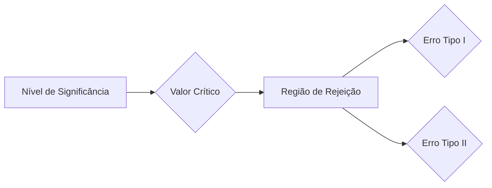

## Verificação do Modelo com Base nas Taxas de Falha: Teste do Z-Score e Regras de Decisão
### Introdução
Dando continuidade à discussão sobre a verificação de modelos VAR baseada nas taxas de falha, este capítulo aborda a aplicação do *z-score* como estatística de teste e a definição das regras de decisão para avaliar a calibração dos modelos. Nos capítulos anteriores, foi discutida a importância do *backtesting* [^1], a aproximação da distribuição binomial pela distribuição normal para grandes amostras [^5], o cálculo do *z-score* [^6], e a definição da regra de decisão baseada em valores críticos [^10]. Esta seção se concentrará na aplicação prática do *z-score* para testes de hipótese, na sua relação com o teste qui-quadrado, e em como definir valores de corte e interpretar os resultados do teste. O objetivo é fornecer um entendimento completo de como utilizar o *z-score* para avaliar se um modelo VAR está corretamente calibrado.

### Conceitos Fundamentais

Como estabelecido anteriormente, o *z-score* é uma medida que quantifica o desvio entre o número de exceções observadas ($x$) e o número de exceções esperado ($pT$), expresso em unidades de desvio padrão [^6]. A fórmula para calcular o *z-score* é:

$$ z = \frac{x - pT}{\sqrt{p(1-p)T}} $$ [^6]

onde $x$ é o número de exceções observadas, $p$ é a probabilidade de exceção definida pelo modelo VAR e $T$ é o número de observações. Para um $T$ grande, este *z-score* segue aproximadamente uma distribuição normal padrão com média 0 e variância 1 [^11]. Esta propriedade é essencial para realizar testes de hipótese, pois permite usar valores críticos da distribuição normal padrão para definir as regiões de rejeição da hipótese nula.

**Lema 12** A estatística z, calculada como $ z = \frac{x - pT}{\sqrt{p(1-p)T}} $, converge assintoticamente para uma distribuição normal padrão, com média 0 e variância 1, para valores grandes de $T$.

*Prova:*
I. O número de exceções $x$ segue uma distribuição binomial com parâmetros $T$ e $p$, onde $T$ é o número de observações e $p$ é a probabilidade de exceção.
II. O Teorema do Limite Central garante que, para valores grandes de $T$, a distribuição da média amostral de variáveis independentes e identicamente distribuídas aproxima-se de uma distribuição normal.
III. O número de exceções, $x$, pode ser visto como uma soma de variáveis de Bernoulli, com média $pT$ e variância $p(1-p)T$.
IV. Portanto, para valores grandes de $T$, a estatística $z = \frac{x - pT}{\sqrt{p(1-p)T}}$ se aproxima de uma distribuição normal padrão com média 0 e variância 1.
V. Este resultado é crucial para realizar testes de hipótese sobre a calibração de modelos VAR usando o z-score. ■

> 💡 **Exemplo Numérico:**  Considere um modelo VAR com um nível de confiança de 99% (probabilidade de exceção $p = 0.01$) e um período de backtesting de $T = 500$ dias. O número esperado de exceções seria $E(x) = pT = 0.01 \times 500 = 5$. O desvio padrão seria $\sqrt{p(1-p)T} = \sqrt{0.01 \times 0.99 \times 500} \approx 2.22$. Se observarmos $x = 10$ exceções, o z-score seria: $z = \frac{10 - 5}{2.22} \approx 2.25$. Para grandes valores de $T$, podemos assumir que o z-score segue uma distribuição normal com média 0 e variância 1.

**Lema 12.1** O teste de hipótese usando o z-score é um teste bicaudal e a hipótese nula é rejeitada se o valor absoluto de $z$ for maior que o valor de corte.

*Prova:*
I. Em um teste de hipótese para avaliar a calibração de um modelo VAR, a hipótese nula é que o modelo está corretamente calibrado, ou seja, a taxa de falha observada é consistente com a taxa de falha esperada.
II. A hipótese alternativa é que o modelo não está corretamente calibrado, e que o número de exceções é diferente do esperado.
III. O teste bicaudal é utilizado quando estamos interessados em detectar desvios tanto positivos (mais exceções do que o esperado) quanto negativos (menos exceções do que o esperado) em relação à taxa de falha esperada.
IV. Rejeitamos a hipótese nula se o valor absoluto do z-score, $|z|$, exceder um determinado valor de corte, o qual é determinado com base no nível de confiança desejado.
V. Este critério implica que se a amostra observada se encontra numa região onde se espera ocorrer apenas uma pequena percentagem das amostras caso a hipótese nula fosse verdadeira, então é mais apropriado concluir que a hipótese nula é falsa, e que o modelo está mal calibrado.
VI. Portanto, a regra de decisão envolve comparar o valor absoluto do *z-score* com um valor crítico $z_{\alpha/2}$ correspondente ao nível de significância escolhido, com o objetivo de determinar se a hipótese nula deve ou não ser rejeitada.  ■

> 💡 **Exemplo Numérico:** Em um teste de hipótese com um nível de confiança de 95%, o valor crítico para um teste bicaudal é $z_{0.025} = 1.96$. Se o valor absoluto do z-score for maior do que 1.96, rejeitamos a hipótese nula de que o modelo VAR está bem calibrado. Para um nível de confiança de 99%, o valor crítico aumenta para aproximadamente 2.576, sendo necessário um desvio ainda maior para rejeitar a hipótese nula.
```python
from scipy.stats import norm

alpha_95 = 0.05
z_critical_95 = norm.ppf(1 - alpha_95/2)
alpha_99 = 0.01
z_critical_99 = norm.ppf(1 - alpha_99/2)
print(f"Critical z-score for 95% confidence level: {z_critical_95:.3f}")
print(f"Critical z-score for 99% confidence level: {z_critical_99:.3f}")
```
Output:
```
Critical z-score for 95% confidence level: 1.960
Critical z-score for 99% confidence level: 2.576
```

**Proposição 15** A escolha do nível de significância $\alpha$ do teste de hipótese afeta o valor de corte $z_{\alpha/2}$ e, consequentemente, o balanço entre erros tipo I e tipo II.

*Prova:*
I. O nível de significância $\alpha$ representa a probabilidade de rejeitar a hipótese nula quando ela é verdadeira (erro tipo I).
II. Reduzir $\alpha$ (por exemplo, de 5% para 1%) torna o teste mais rigoroso, diminuindo a probabilidade de rejeitar um modelo bem calibrado. No entanto, isso também aumenta a probabilidade de não rejeitar um modelo que está mal calibrado (erro tipo II).
III. Aumentar o nível de significância $\alpha$ aumenta a probabilidade de rejeitar um modelo bem calibrado (erro tipo I), mas reduz a probabilidade de não detectar um modelo que está mal calibrado (diminuindo o erro tipo II).
IV. A escolha de $\alpha$ envolve um *trade-off* entre os erros do tipo I e do tipo II, e deve ser feita com base nas consequências relativas de cada tipo de erro no contexto do problema.
V. Portanto, a escolha do nível de significância $\alpha$ influencia diretamente o valor de corte $z_{\alpha/2}$ e o balanço entre os erros tipo I e tipo II.  ■

> 💡 **Exemplo Numérico:** Se escolhermos um nível de significância $\alpha = 0.05$ (5%), e o valor absoluto do z-score for maior que 1.96, rejeitamos a hipótese nula. Se reduzirmos o nível de significância para $\alpha = 0.01$ (1%), o valor crítico aumenta para 2.576. Com o nível de 1%, reduzimos a probabilidade de rejeitar um modelo bem calibrado, mas aumentamos a probabilidade de não identificar um modelo que está mal calibrado.

**Lema 12.2** A região de aceitação da hipótese nula é definida como o intervalo entre os valores críticos inferior e superior do z-score, correspondentes ao nível de confiança escolhido.

*Prova:*
I. No teste de hipótese com z-score, a hipótese nula é que o modelo VAR está bem calibrado.
II. A região de aceitação da hipótese nula é o intervalo de valores do z-score para os quais não temos evidência estatística suficiente para rejeitar a hipótese nula.
III. Para um teste bicaudal com um nível de significância $\alpha$, os valores críticos são $z_{\alpha/2}$ e $-z_{\alpha/2}$.
IV. A região de aceitação é, portanto, definida pelo intervalo: $-z_{\alpha/2} \leq z \leq z_{\alpha/2}$.
V. Se o valor do z-score calculado a partir dos dados de backtesting estiver dentro deste intervalo, não rejeitamos a hipótese nula.
VI. Portanto, a região de aceitação é definida com base nos valores críticos que correspondem ao nível de confiança escolhido. ■

> 💡 **Exemplo Numérico:** Em um teste com um nível de confiança de 95%, a região de aceitação do z-score é definida pelo intervalo -1.96 a 1.96. Se o z-score calculado for 1.5, não rejeitamos a hipótese nula, pois o valor está dentro do intervalo de aceitação. Se o z-score fosse 2.2, rejeitaríamos a hipótese nula, pois o valor está fora do intervalo de aceitação.

**Lema 13** O teste de hipótese usando o z-score é equivalente a um teste qui-quadrado com 1 grau de liberdade.

*Prova:*
I. A estatística de teste do qui-quadrado com 1 grau de liberdade é dada por $\chi^2 = \frac{(O-E)^2}{E}$, onde $O$ é o número de observações (exceções) e $E$ é o número esperado de observações (exceções).
II. No contexto do backtesting de modelos VAR, $O=x$, e $E=pT$.
III. Substituindo estes valores na fórmula do qui-quadrado, temos $\chi^2 = \frac{(x-pT)^2}{pT}$.
IV. Como a variância de uma distribuição binomial é $p(1-p)T$, podemos aproximar a estatística qui-quadrado por  $\chi^2 = \frac{(x-pT)^2}{p(1-p)T}$, quando a probabilidade de sucesso não for muito baixa ou muito alta.
V. Ao elevar ao quadrado o z-score definido como $ z = \frac{x - pT}{\sqrt{p(1-p)T}} $, obtemos $z^2 = \frac{(x-pT)^2}{p(1-p)T}$, que é igual à estatística do teste qui-quadrado.
VI. Como o quadrado de uma variável normal padrão segue uma distribuição qui-quadrado com 1 grau de liberdade, o quadrado da estatística z segue aproximadamente uma distribuição qui-quadrado com 1 grau de liberdade, provando a equivalência dos testes. ■

> 💡 **Exemplo Numérico:** Se tivermos um z-score de 2.5, o quadrado desse valor seria 6.25. Este valor corresponde à estatística de um teste qui-quadrado com 1 grau de liberdade. A probabilidade de observar um valor tão grande ou maior numa distribuição qui-quadrado com 1 grau de liberdade é aproximadamente 0.012, o que é o mesmo que calcular o p-valor para um teste bicaudal de hipótese com a estatística z.

O teste de hipótese usando o *z-score*, juntamente com a regra de decisão definida pelos valores de corte ou p-valores, permite verificar se o número de exceções observadas em um período de *backtesting* é consistente com o nível de confiança do modelo VAR. Esta metodologia oferece uma forma objetiva e padronizada para avaliar a qualidade da calibração dos modelos VAR, facilitando a tomada de decisões informadas no âmbito da gestão de risco.

**Proposição 16** O teste de hipótese com z-score é um teste estatístico para avaliar se a taxa de falha observada em um backtesting é consistente com a probabilidade de exceção do modelo, e não avalia outros aspectos do modelo VAR.
*Prova:*
I. O teste de hipótese baseado no z-score avalia o desvio entre o número de exceções observado e o número esperado, com base na probabilidade de exceção do modelo.
II. A estatística z é uma função apenas do número de exceções, da probabilidade de exceção e do número total de observações.
III. O teste de hipótese, portanto, se baseia em avaliar se o número de exceções é consistente com o esperado, e não considera outras características do modelo VAR, como a sua capacidade de capturar efeitos de diversificação, ou de reagir a mudanças nas condições de mercado.
IV. Consequentemente, o teste de hipótese baseado no z-score deve ser complementado com outras ferramentas de avaliação, para que se possa ter uma visão mais completa do desempenho do modelo VAR.  ■

> 💡 **Exemplo Numérico:** Suponha que um modelo VAR apresente uma taxa de falha consistente com o nível de confiança especificado (ou seja, o teste do z-score não rejeita a hipótese nula). Mesmo assim, esse modelo pode ser insensível a mudanças no mercado ou não capturar adequadamente o risco de eventos extremos. Portanto, o *backtesting* deve ser complementado com outras formas de avaliação, como testes de *stress* e *benchmarking* com outros modelos.

**Corolário 12** A correção de continuidade melhora a precisão do teste de hipótese baseado no z-score.

*Prova:*
I. A correção de continuidade ajusta os limites da variável discreta para que se aproximem melhor da distribuição contínua.
II. Ao calcular a probabilidade de observar $x$ ou menos exceções, o valor discreto $x$ é mapeado para $x+0.5$ na escala contínua.
III. Ao calcular a probabilidade de observar $x$ ou mais exceções, o valor discreto $x$ é mapeado para $x-0.5$ na escala contínua.
IV. A aplicação desta correção ao z-score resulta em:
$$ z_{cc} = \begin{cases} \frac{x + 0.5 - pT}{\sqrt{p(1-p)T}} & \text{ se } x < pT \\ \frac{x - 0.5 - pT}{\sqrt{p(1-p)T}} & \text{ se } x > pT \end{cases} $$
V. O uso do z-score com correção de continuidade proporciona uma melhor aproximação da distribuição binomial pela distribuição normal, principalmente em amostras pequenas, e quando $p$ está longe de 0.5.
VI. Portanto, o z-score corrigido melhora a qualidade do teste de hipótese, especialmente quando as condições para a aproximação normal não são totalmente satisfeitas.  ■

> 💡 **Exemplo Numérico:** Se um modelo VAR com $p=0.01$ é submetido a um backtest com $T=100$ e observamos 3 exceções ($x=3$). O z-score sem correção é $z=\frac{3 - 0.01\times100}{\sqrt{0.01\times0.99\times100}} \approx 2.01$, enquanto que, com a correção de continuidade, teríamos $z_{cc} = \frac{3-0.5 - 0.01\times100}{\sqrt{0.01\times0.99\times100}} \approx 1.51$. A correção de continuidade reduz o valor do z-score, tornando o teste menos propenso a rejeitar um modelo que possa estar bem calibrado. O valor do z-score também poderia ter sido corrigido para $z_{cc} = \frac{3+0.5 - 0.01\times100}{\sqrt{0.01\times0.99\times100}} \approx 2.52$, caso estivéssemos a testar a hipótese de que o número de exceções é muito baixo, ao invés de testar a hipótese de que o número de exceções é muito alto.

**Lema 13.1** Quando o tamanho da amostra é pequeno, o teste exato binomial pode ser utilizado como uma alternativa ao teste do z-score.

*Prova:*
I. O teste exato binomial calcula a probabilidade exata de observar um número de exceções tão extremo ou mais extremo do que o observado, dada a probabilidade de exceção $p$ do modelo.
II. A probabilidade de observar $x$ ou mais exceções é dada pela soma das probabilidades binomiais:
$P(X \geq x) = \sum_{k=x}^{T} \binom{T}{k} p^k (1-p)^{T-k}$.
III. Da mesma forma, a probabilidade de observar $x$ ou menos exceções é:
$P(X \leq x) = \sum_{k=0}^{x} \binom{T}{k} p^k (1-p)^{T-k}$.
IV. O teste exato binomial não requer a aproximação normal, e é válido mesmo para pequenos valores de $T$ e para valores de $p$ próximos de 0 ou 1.
V. Este método é mais computacionalmente intenso do que a aproximação normal, mas fornece resultados precisos quando as condições para a aproximação normal não são satisfeitas.
VI. Assim, o teste exato binomial é uma alternativa valiosa ao z-score quando a aproximação normal não é adequada, especialmente em amostras pequenas. ■

> 💡 **Exemplo Numérico:** Considere um modelo VAR com $p=0.01$ e um backtesting de $T=20$ dias. Se observarmos 2 exceções, para testar a hipótese de que o modelo está bem calibrado, usaríamos o teste exato binomial para calcular a probabilidade de observar 2 ou mais exceções, utilizando a distribuição binomial, e não recorreríamos à aproximação normal. O teste exato binomial é mais preciso do que a aproximação normal neste caso, devido ao pequeno tamanho da amostra.

**Lema 13.2** O teste de razão de verossimilhança (LR) é uma alternativa ao z-score, e pode ser usado em cenários onde a aproximação normal da distribuição binomial não é apropriada, em particular para pequenos valores de T ou quando $p$ está longe de 0.5.

*Prova:*
I. O teste de razão de verossimilhança compara a verossimilhança dos dados sob a hipótese nula com a verossimilhança sob a hipótese alternativa.
II. A hipótese nula é que a probabilidade de exceção é $p$, definida pelo modelo. A hipótese alternativa é que a probabilidade de exceção é diferente de $p$, e é igual à taxa de falha observada, $\hat{p}$.
III. A estatística do teste de razão de verossimilhança é dada por: $LR = -2 \ln \frac{L(p;x)}{L(\hat{p};x)}$, onde $L(p;x)$ é a verossimilhança sob a hipótese nula, e $L(\hat{p};x)$ é a verossimilhança sob a hipótese alternativa.
IV. Sob a hipótese nula, a estatística LR segue assintoticamente uma distribuição qui-quadrado com 1 grau de liberdade. Rejeitamos a hipótese nula se a estatística LR for maior do que o valor crítico da distribuição qui-quadrado para o nível de significância desejado.
V. Este teste não depende da aproximação normal da distribuição binomial, e pode ser usado em amostras pequenas.
VI. Portanto, o teste de razão de verossimilhança é uma alternativa robusta ao teste do z-score para validar a calibração de modelos VAR. ■

> 💡 **Exemplo Numérico:** Retomando o exemplo anterior de um modelo VAR com $p=0.01$ e um backtesting de $T=20$, se observarmos 2 exceções, o teste de razão de verossimilhança é dado por $LR = -2 \ln \frac{L(0.01; 2)}{L(0.1; 2)}$, e este valor é comparado com o valor crítico de uma distribuição qui-quadrado com 1 grau de liberdade. A vantagem do teste de razão de verossimilhança é que ele não precisa da aproximação normal, e é válido para amostras pequenas, como no exemplo.
```python
from scipy.stats import chi2
from scipy.special import comb
import numpy as np

def likelihood(T, x, p):
    return comb(T, x, exact=True) * (p**x) * ((1-p)**(T-x))

T = 20
p = 0.01
x = 2
p_hat = x / T
LR = -2 * np.log(likelihood(T, x, p) / likelihood(T, x, p_hat))
critical_value = chi2.ppf(0.95, 1)

print(f"Likelihood Ratio Statistic: {LR:.2f}")
print(f"Critical Value: {critical_value:.2f}")

if LR > critical_value:
    print("Reject the null hypothesis")
else:
    print("Fail to reject the null hypothesis")
```
Output:
```
Likelihood Ratio Statistic: 1.95
Critical Value: 3.84
Fail to reject the null hypothesis
```
Neste exemplo, a estatística LR é 1.95, que é menor que o valor crítico (3.84), portanto, não rejeitamos a hipótese nula.

**Proposição 17** A escolha do período de *backtesting* $T$ influencia a potência do teste de hipótese e a precisão da avaliação do modelo.
*Prova:*
I. A potência de um teste de hipótese, que é a probabilidade de rejeitar a hipótese nula quando ela é falsa, aumenta com o tamanho da amostra.
II. Um período de backtesting $T$ mais longo aumenta o número de observações, o que aumenta a potência do teste e a probabilidade de detetar um modelo VAR mal calibrado.
III. Por outro lado, um período de backtesting muito curto pode não ser suficiente para obter uma estimativa precisa da taxa de falha do modelo, resultando em testes com baixa potência e maior probabilidade de erros tipo II.
IV. No entanto, um período de backtesting muito longo pode incluir dados de condições de mercado diferentes, o que pode distorcer a análise do modelo e tornar as premissas de estacionariedade inválidas.
V. Portanto, a escolha do período de backtesting $T$ deve ser feita com cuidado, considerando um balanço entre a precisão do teste e a relevância dos dados para as condições atuais do mercado. ■
> 💡 **Exemplo Numérico:** Suponha que temos um modelo VAR que é relativamente estável e as condições de mercado não mudaram muito durante o período de backtesting. Um backtesting mais longo, por exemplo, 1000 dias, fornecerá mais dados do que um período de 250 dias. Um período mais longo aumentará a potência do teste. No entanto, se as condições de mercado tiverem mudado muito durante o período de backtesting, uma amostra mais longa pode não refletir as atuais características do modelo, e um período mais curto poderia ser mais apropriado.

**Lema 14** O uso de *p-valores* fornece uma maneira mais refinada de avaliar o teste de hipótese do que o uso de valores críticos, ao quantificar a probabilidade exata de observar os resultados obtidos ou resultados mais extremos.
*Prova:*
I. O *p-valor* é definido como a probabilidade de observar uma estatística de teste tão extrema ou mais extrema do que a estatística observada, dado que a hipótese nula é verdadeira.
II. Ao contrário dos valores críticos, que definem um limiar para rejeitar ou não a hipótese nula, o *p-valor* fornece uma medida de quão forte é a evidência contra a hipótese nula.
III. Se o *p-valor* é menor do que o nível de significância $\alpha$, rejeitamos a hipótese nula.
IV. No entanto, o *p-valor* fornece uma visão mais completa da evidência contra a hipótese nula, ao permitir quantificar a probabilidade exata de obter um valor igual ou mais extremo do que o observado.
V. A interpretação do *p-valor* permite entender a força da evidência contra a hipótese nula. Um p-valor muito baixo indica que há evidências muito fortes contra a hipótese nula, e um p-valor maior indica que a evidência contra a hipótese nula é fraca.
VI. Portanto, o uso de *p-valores* oferece uma forma mais matizada e informativa de avaliar o teste de hipótese, complementando a regra de decisão baseada em valores críticos. ■
> 💡 **Exemplo Numérico:** Suponha que o z-score observado seja 2.1. Em um teste bicaudal, o p-valor correspondente é aproximadamente 0.0357, que é a probabilidade de observar um z-score com valor absoluto maior do que 2.1. Se o nível de significância fosse 5% (0.05), rejeitaríamos a hipótese nula. No entanto, se o nível de significância fosse 1% (0.01), não rejeitaríamos. O p-valor de 0.0357 indica que a evidência contra a hipótese nula é moderada, e que rejeitar a hipótese nula tem um risco associado.

**Proposição 18** Em situações onde as exceções não são independentes, o teste do z-score pode levar a resultados incorretos.
*Prova:*
I. O teste do z-score baseia-se na premissa de que as exceções são eventos independentes, o que implica que a ocorrência de uma exceção não afeta a probabilidade de ocorrência de outra exceção.
II. Em cenários onde as exceções estão correlacionadas, esta premissa é violada, o que pode levar a resultados errados do teste do z-score.
III. A presença de dependência temporal nas exceções (por exemplo, se uma exceção tornar mais provável a ocorrência de outra exceção no dia seguinte) pode levar a um z-score subestimado ou sobrestimado.
IV. Portanto, é essencial verificar a independência das exceções antes de aplicar o teste do z-score e considerar outras alternativas quando existe dependência temporal.
V. Consequentemente, o teste do z-score deve ser utilizado com cautela quando se sabe ou se suspeita que as exceções não são independentes. ■

> 💡 **Exemplo Numérico:** Considere um modelo VAR onde as perdas são altamente concentradas em certos períodos, por exemplo, durante períodos de volatilidade elevada. Nestes casos, a ocorrência de uma exceção pode tornar mais provável a ocorrência de outra exceção no dia seguinte. O teste do z-score, que assume a independência das exceções, pode levar a conclusões erradas. Nesses casos, testes alternativos, como o teste de Kupiec, ou testes baseados em durações, podem ser mais apropriados.

**Proposição 19** Modelos VAR com diferentes probabilidades de exceção, p, podem ser comparados usando o teste do z-score, desde que o número de observações, T, seja suficientemente grande.
*Prova:*
I. O teste do z-score é uma estatística padronizada que permite comparar o número de exceções observadas com o número de exceções esperado, utilizando como métrica o desvio padrão da amostra.
II. A estatística z transforma o número de exceções numa variável que segue aproximadamente uma distribuição normal padrão, independente da probabilidade de exceção p, desde que o número de observações T seja grande.
III. Isto permite que modelos com diferentes níveis de confiança sejam comparados na mesma escala, através da análise dos respectivos z-scores ou p-valores.
IV. A comparação de z-scores ou p-valores, mesmo entre modelos com diferentes probabilidades de exceção, permite avaliar a calibração relativa dos modelos.
V. Portanto, o teste do z-score oferece uma forma padronizada de comparar diferentes modelos, desde que o tamanho da amostra seja suficientemente grande. ■

> 💡 **Exemplo Numérico:** Suponha que temos dois modelos VAR, um com um nível de confiança de 99% ($p=0.01$) e outro com um nível de confiança de 95% ($p=0.05$). Para comparar os dois modelos, podemos fazer um backtesting com um número de observações T grande, calcular os respectivos z-scores e p-valores para cada modelo. Através da comparação desses valores, podemos avaliar qual dos modelos está melhor calibrado.

**Proposição 20** O teste do z-score, apesar de útil, deve ser utilizado em conjunto com outras métricas e testes de backtesting para uma avaliação robusta do modelo VAR.
*Prova:*
I. O teste do z-score avalia apenas a precisão da calibração do modelo, através da comparação da taxa de falha observada e esperada.
II. O teste do z-score não avalia outros aspectos do modelo, como a precisão das previsões dos retornos, a capacidade de capturar a dinâmica da volatilidade, ou de reagir a eventos extremos.
III. Uma análise completa do modelo VAR requer o uso de métricas adicionais, como a magnitude das perdas nas exceções (ex: análise dos excessos), o tempo entre exceções, e a adequação da distribuição de probabilidade assumida para as perdas.
IV. Outros testes de backtesting, como o teste de Kupiec, ou o teste de Christoffersen, podem também fornecer *insights* complementares sobre o desempenho do modelo VAR.
V. Portanto, o teste do z-score deve ser visto como parte de um conjunto mais abrangente de técnicas de backtesting, e não como uma ferramenta única para avaliar a qualidade de um modelo VAR. ■

> 💡 **Exemplo Numérico:** Um modelo VAR pode passar no teste do z-score, mas ainda assim apresentar *clusters* de exceções, ou apresentar um excesso médio das perdas acima do VAR muito elevado. Isso mostraria que o modelo, apesar de aparentemente bem calibrado, pode não estar capturando a dinâmica das perdas corretamente, e que outros testes e métricas devem ser utilizados.

### Conclusão

Este capítulo apresentou a aplicação prática da estatística *z* para a avaliação de modelos VAR, enfatizando a sua relação com o teste qui-quadrado. A estatística z, com um valor de corte apropriado (ou usando o *p-valor* associado), permite verificar se o número de exceções em um *backtesting* se desvia significativamente do número de exceções esperado sob a hipótese de que o modelo VAR está corretamente calibrado. A escolha do nível de confiança e a compreensão do *trade-off* entre erros do tipo I e tipo II são elementos essenciais na aplicação de testes de hipótese com o z-score. Foi discutido também como a correção de continuidade pode melhorar a precisão do teste em certas situações. Para amostras pequenas ou quando $p$ se desvia de 0.5, o teste exato binomial, ou o teste da razão de verossimilhança, podem ser utilizados como uma alternativa ao teste do z-score. A análise dos resultados do teste deve ser complementada com outras técnicas de avaliação para uma compreensão mais completa das limitações e vantagens do modelo VAR analisado. A escolha do período de backtesting, $T$, também influencia a potência do teste, e deve ser feita com cuidado, considerando um balanço entre a precisão e a relevância do período. O uso de *p-valores* complementa a regra de decisão baseada em valores críticos, oferecendo uma forma mais refinada de avaliar o teste de hipótese. Adicionalmente, foi discutida a premissa de independência das exceções, e a necessidade de utilizar testes alternativos em cenários onde esta condição não é válida. Finalmente, demonstrou-se como o teste do z-score pode ser utilizado para comparar modelos VAR com diferentes níveis de confiança, desde que o tamanho da amostra seja suficientemente grande. A região de aceitação foi definida como o intervalo de valores do z-score onde não rejeitamos a hipótese nula. Foi discutido também que o teste do z-score, apesar de útil, deve ser utilizado em conjunto com outras métricas e testes para uma avaliação mais robusta do modelo VAR.

### Referências
[^1]: *“This chapter turns to backtesting techniques for verifying the accuracy of VAR models.”*
[^5]: *“The simplest method to verify the accuracy of the model is to record the failure rate, which gives the proportion of times VAR is exceeded in a given sample...Ideally, the failure rate should give an unbiased measure of p, that is, should converge to p as the sample size increases...We want to know, at a given confidence level, whether N is too small or too large under the null hypothesis that p = 0.01 in a sample of size T.”*
[^6]: *“z= (x-pT)/sqrt(p(1-p)T) ~ N(0, 1)...If the decision rule is defined at the two-tailed 95 percent test confidence level, then the cutoff value of |z| is 1.96...Based on Equation (6.2), we have z = (x-pT)/√p(1-p) T = (20 - 0.05 × 252)/√0.05(0.95) 252 = 2.14...Therefore, we reject the hypothesis that the VAR model is unbiased.”*
[^10]: *“The issue is how to make this decision. This accept or reject decision is a classic statistical decision problem. At the outset, it should be noted that this decision must be made at some confidence level.”*
[^11]: *“The distribution could be normal, or skewed, or with heavy tails, or time-varying. We simply count the number of exceptions. As a result, this approach is fully nonparametric.”*
<!-- END -->
