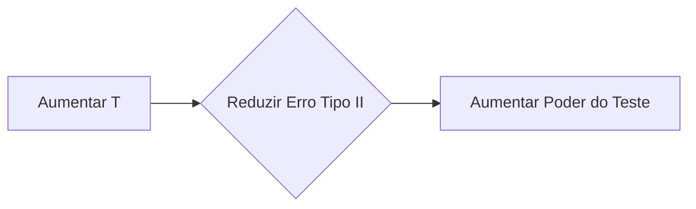

## Verificação do Modelo VAR: Erros Tipo I e Tipo II e Potência do Teste

### Introdução
Este capítulo aborda a crucial consideração dos erros tipo I e tipo II no contexto da verificação de modelos VAR, bem como a influência do número de observações ($T$) na potência do teste. Como discutido nos capítulos anteriores, a validação de modelos VAR envolve testes de hipóteses para avaliar se a taxa de falha observada é consistente com a probabilidade de exceção especificada pelo modelo [^1]. Este capítulo explora detalhadamente a natureza dos erros tipo I e tipo II, o *trade-off* inerente na escolha do nível de significância e o impacto do tamanho da amostra ($T$) na capacidade de um teste estatístico para detetar um modelo VAR mal calibrado, assim como o risco de rejeitar um modelo VAR bem calibrado. O foco será na interação entre estes conceitos, buscando o melhor entendimento sobre a avaliação de modelos VAR.

### Erros Tipo I e Tipo II em Backtesting de Modelos VAR

Na verificação de modelos VAR, como em qualquer teste de hipótese, enfrentamos a possibilidade de tomar decisões incorretas. Existem dois tipos de erros que podem ocorrer:

*   **Erro Tipo I (Falso Positivo):** Rejeitar a hipótese nula quando ela é verdadeira. No contexto de backtesting de modelos VAR, isso significa rejeitar a hipótese de que o modelo está corretamente calibrado, quando na verdade ele está.
*   **Erro Tipo II (Falso Negativo):** Não rejeitar a hipótese nula quando ela é falsa. Isso significa aceitar a hipótese de que o modelo VAR está corretamente calibrado, quando na verdade ele não está, ou seja, subestima ou sobrestima os riscos.

**Lema 15** A probabilidade de cometer um erro tipo I é igual ao nível de significância $\alpha$ do teste.
*Prova:*
I. O nível de significância $\alpha$ é definido como a probabilidade máxima de rejeitar a hipótese nula quando ela é verdadeira.
II. No contexto de um teste de hipótese, a probabilidade de cometer um erro tipo I é precisamente a probabilidade de rejeitar a hipótese nula, quando ela é verdadeira.
III. A probabilidade de cometer um erro tipo I corresponde à probabilidade de observar um valor da estatística de teste que se encontra na região de rejeição sob a hipótese nula, e, por definição, é igual ao nível de significância $\alpha$.
IV. Portanto, a probabilidade de cometer um erro tipo I é igual ao nível de significância $\alpha$ do teste. ■

> 💡 **Exemplo Numérico:** Se escolhermos um nível de significância $\alpha = 0.05$ (5%), então há uma probabilidade de 5% de rejeitar um modelo VAR que está realmente bem calibrado (cometer um erro tipo I). Se escolhermos um nível de significância $\alpha=0.01$ (1%), o risco de cometer um erro tipo I diminui para 1%, mas o risco de cometer um erro tipo II aumenta.
```mermaid
graph LR
    A[Nível de Significância (α)] --> B{Probabilidade de Erro Tipo I};
    B --> C[Rejeitar Modelo Correto];
```

**Lema 16** A probabilidade de cometer um erro tipo II é denotada por $\beta$, e o poder do teste é igual a $1 - \beta$.
*Prova:*
I. O erro tipo II ocorre quando não rejeitamos a hipótese nula quando ela é falsa.
II. A probabilidade de cometer um erro tipo II é denotada por $\beta$.
III. O poder de um teste de hipótese é definido como a probabilidade de rejeitar corretamente a hipótese nula quando ela é falsa.
IV.  Logo, o poder do teste é igual a $1 - \beta$.
V.  Um teste com maior poder significa que ele tem uma maior probabilidade de detectar corretamente um modelo VAR mal calibrado.
VI.  Portanto, a probabilidade de cometer um erro tipo II é dada por $\beta$, e o poder do teste é dado por $1-\beta$. ■

> 💡 **Exemplo Numérico:** Se a probabilidade de cometer um erro tipo II (não rejeitar um modelo mal calibrado) é $\beta = 0.2$ (20%), então o poder do teste, que é a probabilidade de detetar um modelo mal calibrado, é $1 - 0.2 = 0.8$ (80%). Em geral, pretende-se um teste com maior poder, e que minimize a probabilidade de cometer um erro tipo II.
```mermaid
graph LR
    A{Probabilidade de Erro Tipo II (β)} --> B{1-β};
    B --> C[Poder do Teste];
    A --> D[Aceitar Modelo Incorreto];
```
**Lema 16.1**  A probabilidade $\beta$ de cometer um erro tipo II é influenciada por vários fatores, incluindo o tamanho da amostra ($T$), o nível de significância ($\alpha$), e a magnitude do desvio da hipótese nula.
*Prova:*
I.  Conforme estabelecido, o tamanho da amostra $T$ afeta a variabilidade da estatística de teste, influenciando o poder do teste.
II. O nível de significância $\alpha$ determina a região de rejeição da hipótese nula, e um valor menor de $\alpha$ aumenta $\beta$.
III.  A magnitude do desvio da hipótese nula, ou seja, quão mal calibrado está o modelo, também afeta $\beta$. Desvios maiores tornam mais fácil a deteção de uma má calibração, reduzindo $\beta$.
IV. Portanto, $\beta$ é influenciada pelo tamanho da amostra, o nível de significância e a magnitude do desvio da hipótese nula. ■

**Proposição 21** O nível de significância $\alpha$ e o poder do teste ($1-\beta$) estão inversamente relacionados. Reduzir a probabilidade de cometer um erro tipo I aumenta a probabilidade de cometer um erro tipo II, e vice-versa.

*Prova:*
I. O nível de significância $\alpha$ define a região de rejeição do teste de hipótese.
II.  Se reduzirmos $\alpha$, o valor de corte que delimita a região de rejeição se torna mais extremo, tornando o teste mais difícil de rejeitar a hipótese nula. Isto diminui a probabilidade de cometer um erro tipo I (rejeitar um modelo verdadeiro).
III.  Contudo, a redução da região de rejeição também aumenta a probabilidade de não detetar um modelo mal calibrado (erro tipo II).
IV. Inversamente, aumentar $\alpha$ torna o teste mais fácil de rejeitar a hipótese nula, aumentando a probabilidade de rejeitar um modelo verdadeiro (erro tipo I) e reduzindo a probabilidade de não detectar um modelo mal calibrado (erro tipo II).
V. Portanto, o nível de significância $\alpha$ e o poder do teste ($1-\beta$) estão inversamente relacionados, criando um *trade-off* na seleção do nível de significância. ■

> 💡 **Exemplo Numérico:** Se utilizarmos um nível de significância $\alpha = 0.01$ (1%), então o risco de rejeitar um modelo VAR que está bem calibrado é baixo (1%). Contudo, a probabilidade de não detetar um modelo que está mal calibrado é maior. Se aumentarmos o nível de significância para $\alpha = 0.10$ (10%), aumenta a probabilidade de rejeitar um modelo que está bem calibrado, mas diminui a probabilidade de não detetar um modelo que está mal calibrado. Este balanço entre erros do tipo I e do tipo II depende das consequências de cada tipo de erro, e deve ser considerado na escolha do valor de $\alpha$.

A escolha do nível de significância $\alpha$ e, consequentemente, o valor de corte para o z-score, depende do contexto do problema e do custo relativo dos erros tipo I e tipo II.

> 💡 **Exemplo Numérico:** Se a consequência de rejeitar um modelo bem calibrado (erro tipo I) for muito pequena (por exemplo, o custo de recalibrar o modelo é baixo), podemos usar um nível de significância maior (por exemplo, 10%), para aumentar o poder do teste e diminuir o risco de aceitar um modelo mal calibrado (erro tipo II). No entanto, se as consequências de não detetar um modelo mal calibrado forem elevadas (por exemplo, grandes perdas financeiras), o nível de significância deve ser mais baixo (por exemplo, 1%), para reduzir a probabilidade de aceitar um modelo que possa subestimar o risco.

**Proposição 21.1** A escolha do nível de significância $\alpha$ pode ser baseada em um *framework* de tomada de decisão Bayesiana, onde as probabilidades *a priori* de o modelo ser bem ou mal calibrado e os custos associados aos erros tipo I e II são considerados.
*Prova:*
I. Em uma abordagem Bayesiana, atribuímos probabilidades *a priori* à hipótese nula (o modelo está bem calibrado) e à hipótese alternativa (o modelo está mal calibrado).
II. Também definimos as funções de custo para os erros tipo I ($C_{I}$) e tipo II ($C_{II}$).
III. O objetivo é minimizar o risco esperado, que é dado por: $R = \alpha C_{I} P(H_0) + \beta C_{II} P(H_1)$, onde $P(H_0)$ é a probabilidade *a priori* de a hipótese nula ser verdadeira e $P(H_1)$ é a probabilidade *a priori* de a hipótese alternativa ser verdadeira ($P(H_1)=1-P(H_0)$).
IV.  O nível de significância $\alpha$ pode ser escolhido de forma a minimizar este risco esperado, considerando as probabilidades *a priori* e os custos associados a cada tipo de erro.
V.  Portanto, um *framework* Bayesiano permite uma escolha mais informada do nível de significância, com base nas probabilidades e nos custos dos erros. ■

> 💡 **Exemplo Numérico:** Suponha que temos um modelo VAR e, com base em dados históricos e informações de mercado, acreditamos que existe uma probabilidade de 80% do modelo estar bem calibrado ($P(H_0) = 0.8$) e uma probabilidade de 20% de estar mal calibrado ($P(H_1) = 0.2$). Adicionalmente, o custo de um erro tipo I (rejeitar um modelo bom) é de 100 unidades ($C_I = 100$) (custo de recalibrar o modelo) e o custo de um erro tipo II (aceitar um modelo mau) é de 1000 unidades ($C_{II} = 1000$) (custo de perdas devido ao risco subestimado). Vamos comparar dois níveis de significância, $\alpha = 0.05$ e $\alpha = 0.01$. Para $\alpha = 0.05$,  temos uma probabilidade de 5% de erro tipo I e, supondo um poder do teste de 90% (ou seja, $\beta = 0.1$), o risco esperado é: $R = 0.05 \times 100 \times 0.8 + 0.1 \times 1000 \times 0.2 = 4 + 20 = 24$ unidades. Para $\alpha = 0.01$, temos 1% de chance de erro tipo I. Supondo que o poder do teste seja 70% (ou seja, $\beta = 0.3$), o risco esperado é $R = 0.01 \times 100 \times 0.8 + 0.3 \times 1000 \times 0.2 = 0.8 + 60 = 60.8$ unidades. Nesta análise simples, um nível de significância $\alpha = 0.05$ parece mais apropriado. Contudo, estes cálculos são simplificações, e na prática a escolha do valor de alfa requer uma análise mais profunda, com modelos e dados mais adequados.

### Impacto do Número de Observações (T) na Potência do Teste

O número de observações $T$ desempenha um papel crucial na capacidade de um teste estatístico para detetar desvios do comportamento esperado. Em backtesting de modelos VAR, aumentar o período de tempo de teste aumenta a quantidade de dados disponíveis para a avaliação do modelo. Isso afeta diretamente a potência do teste.

**Lema 17** A potência de um teste de hipótese, definida como a probabilidade de rejeitar corretamente a hipótese nula quando ela é falsa, aumenta com o número de observações $T$.
*Prova:*
I. A potência do teste é igual a $1 - \beta$, onde $\beta$ é a probabilidade de cometer um erro tipo II.
II.  À medida que o número de observações $T$ aumenta, a variabilidade da estimativa do parâmetro diminui.
III. Com menor variabilidade, a distribuição amostral do estimador torna-se mais concentrada em torno do seu valor verdadeiro, o que aumenta a probabilidade de detetar uma diferença entre o valor observado e o valor esperado, dado que esta diferença exista.
IV.  Portanto, um teste com maior número de observações possui maior poder estatístico.
V.  Consequentemente, aumentar o número de observações $T$ aumenta a potência do teste, tornando-o mais eficiente para detetar desvios da calibração correta do modelo VAR. ■

> 💡 **Exemplo Numérico:** Um backtesting de um modelo VAR com 250 dias pode não ser suficiente para detectar um modelo mal calibrado com certeza, devido à falta de dados. Um backtesting mais longo, com 1000 dias, teria maior poder para rejeitar corretamente a hipótese nula, caso o modelo fosse mal calibrado.
```mermaid
graph LR
    A[Aumentar T (Número de Observações)] --> B{Reduzir Variabilidade};
    B --> C[Maior Poder do Teste];
```

**Lema 17.1** Para um valor de $p$ fixo, a região de não rejeição da hipótese nula diminui à medida que $T$ aumenta.
*Prova:*
I.  A região de não rejeição da hipótese nula é definida pelos valores da estatística de teste que não levam à rejeição da hipótese nula.
II.  Esta região é centrada no valor esperado da estatística de teste sob a hipótese nula, e sua largura depende da variabilidade da estatística de teste.
III. Ao aumentar $T$, o número de observações, a variância da estatística de teste, por exemplo o z-score, diminui, e a distribuição da estatística torna-se mais concentrada em torno do valor esperado.
IV.  A diminuição na variância leva a uma redução da largura da região de não rejeição, tornando o teste mais preciso na sua capacidade de detetar desvios da hipótese nula.
V. Portanto, para um valor de $p$ fixo, a região de não rejeição da hipótese nula diminui à medida que $T$ aumenta. ■

> 💡 **Exemplo Numérico:** Considere dois testes de modelos VAR com diferentes períodos de backtesting: $T_1=250$ e $T_2=1000$. O modelo VAR tem um nível de confiança de 99% ($p=0.01$). Num teste com 250 observações, o número esperado de exceções é $np = 250 \times 0.01 = 2.5$. A região de não rejeição da hipótese nula será maior, o que significa que são necessários desvios maiores do valor esperado para que a hipótese nula seja rejeitada. Usando a distribuição binomial, a região de não rejeição, com $\alpha=0.05$, é aproximadamente $0 \leq N \leq 7$, onde $N$ é o número de exceções. No caso de um teste com 1000 observações, o número esperado de exceções é $np = 1000 \times 0.01 = 10$. A região de não rejeição será menor, e o teste poderá rejeitar a hipótese nula mesmo com desvios mais pequenos do valor esperado. Neste caso, usando a distribuição binomial, a região de não rejeição, com $\alpha=0.05$, é aproximadamente $4 \leq N \leq 16$. Veja que com o aumento de $T$, o número de exceções esperado, aumenta de 2.5 para 10, mas o intervalo de não rejeição torna-se proporcionalmente menor.

**Proposição 22** Aumentar o número de observações $T$ reduz a probabilidade de cometer um erro tipo II (não rejeitar um modelo mal calibrado) e o poder do teste aumenta.
*Prova:*
I. A probabilidade de cometer um erro tipo II, $\beta$, é a probabilidade de não rejeitar a hipótese nula quando ela é falsa.
II. O poder do teste é definido como a probabilidade de rejeitar corretamente a hipótese nula quando ela é falsa, sendo igual a $1-\beta$.
III. Conforme estabelecido, um aumento do número de observações $T$ leva a uma diminuição da variabilidade da estatística de teste.
IV. Como resultado, a distribuição da estatística de teste torna-se mais concentrada em torno do valor esperado, o que aumenta a probabilidade de o valor da estatística de teste se encontrar na região de rejeição, dado que a hipótese nula é falsa.
V.  Portanto, aumentar o número de observações $T$ reduz a probabilidade de cometer um erro tipo II, aumentando o poder do teste. ■

> 💡 **Exemplo Numérico:** Se um modelo VAR apresentar uma pequena diferença entre a taxa de falha observada e a esperada, com um tamanho de amostra pequeno, essa diferença pode não ser estatisticamente significativa, e a hipótese nula será aceita, cometendo-se um erro do tipo II. Se o tamanho da amostra for aumentado, o mesmo desvio entre a taxa de falha observada e a esperada poderá ser estatisticamente significativo, e a hipótese nula será rejeitada, corretamente, e o poder do teste aumenta. Por exemplo, suponha que um modelo VAR com $p=0.01$ é backtested com $T=250$ observações, e apresenta 4 exceções. O número esperado de exceções é $250 \times 0.01 = 2.5$. Usando a distribuição binomial, o p-value deste resultado é $0.19$, não sendo estatisticamente significativo para um nível de significância de 5%. Contudo, se o mesmo modelo for backtested com $T=1000$ observações e apresentar 15 exceções. O número esperado de exceções é $1000 \times 0.01 = 10$. O p-value deste resultado é $0.02$, sendo estatisticamente significativo para um nível de significância de 5%.

A tabela 6-2 no contexto mostra que as regiões de não rejeição são dadas em termos do número de exceções $N$ para diferentes valores de $T$ e de $p$. Os intervalos das regiões de não rejeição são expressos como um número de exceções. Por exemplo, para $p=0.01$ e $T=252$, a região de não rejeição é $N < 7$. Para o mesmo $p$, e $T=1000$, a região de não rejeição é $4 < N < 17$. Se considerarmos a taxa de falha $N/T$ (e não o número de exceções), vemos que a região de não rejeição em termos da taxa de falha diminui com o aumento de $T$.

**Proposição 23** Embora aumentar o número de observações $T$ aumente a potência do teste, também aumenta o risco de rejeitar um modelo VAR bem calibrado, devido à maior sensibilidade a pequenos desvios da taxa de falha esperada.
*Prova:*
I. Aumento do tamanho da amostra $T$ aumenta a probabilidade de detectar um desvio, seja ele grande ou pequeno.
II. Um modelo que poderia ter sido aceito para um pequeno $T$, pode ser rejeitado para um grande $T$, mesmo que o modelo seja correto, pois ele nunca será perfeito e pequenas flutuações serão sempre observadas.
III. Desta forma, com um grande $T$ aumenta a probabilidade de rejeitar uma hipótese nula, mesmo quando ela é verdadeira, o que significa rejeitar um modelo que é razoavelmente bem calibrado.
IV. Isto é uma consequência de que, para um nível de significância $\alpha$ fixo, a região de aceitação diminui à medida que o tamanho da amostra aumenta, o que aumenta o risco de cometer um erro tipo I.
V. Portanto, é importante notar que, embora aumentar o número de observações $T$ aumente a potência do teste, também aumenta a sensibilidade a pequenas variações na taxa de falha, o que pode levar a rejeitar modelos que, de outra forma, seriam considerados bem calibrados. ■

> 💡 **Exemplo Numérico:** Um modelo VAR com um nível de confiança de 99% (p=0.01), poderá ter um desempenho considerado bom com 250 dias de backtesting, e uma taxa de exceção de 2/250 = 0.8%, e passar o teste de hipótese. Ao aumentar o período de backtesting para 1000 dias, a taxa de exceção observada poderia ser, por exemplo, 15/1000 = 1.5%, e o mesmo modelo seria rejeitado, devido ao maior número de observações e à consequente diminuição da variabilidade da estimativa. Apesar do modelo ter um comportamento aceitável, para um teste com 250 observações, a maior variabilidade na estimativa da taxa de exceção (a proporção entre o número de exceções e o número total de observações) faz com que o resultado obtido não seja estatisticamente diferente do esperado. Contudo, ao aumentar o número de observações para 1000, a variabilidade da estimativa diminui, e o desvio da taxa de exceção observada relativamente à taxa de exceção definida pelo modelo torna-se estatisticamente significativo.

**Proposição 24** Em cenários de baixa probabilidade de exceção (baixo valor de $p$), torna-se cada vez mais difícil detectar modelos mal calibrados, já que o número de exceções é reduzido e os testes perdem poder.
*Prova:*
I. Modelos VAR com altas taxas de confiança, tem taxas de exceção $p$ baixas, de acordo com a definição de Value at Risk.
II. O número esperado de exceções é dado por $pT$, e quando $p$ é baixo e/ou $T$ é pequeno, o número esperado de exceções também é baixo.
III.  Com poucas exceções, a variância do número de exceções diminui, reduzindo a potência do teste e aumentando a probabilidade de aceitar modelos VAR mal calibrados, incorrendo em erros tipo II.
IV.  Portanto, em cenários de baixas probabilidades de exceção, a deteção de modelos VAR mal calibrados torna-se cada vez mais difícil.
V.  Para valores de $p$ muito baixos, amostras muito grandes são necessárias para se conseguir uma potência adequada do teste. ■

> 💡 **Exemplo Numérico:** Para um modelo VAR com $p=0.001$ (nível de confiança de 99.9%), e um período de backtesting de $T=250$, o número esperado de exceções seria $0.25$, o que significa que em média se espera menos de uma exceção a cada ano. Para detetar uma pequena diferença entre a probabilidade de exceção real e a definida pelo modelo, seria necessário um tamanho de amostra $T$ muito grande. Por exemplo, um teste com 10000 observações teria em média 10 exceções, e seria mais capaz de detetar desvios da hipótese nula.

**Proposição 25** O poder do teste pode ser afetado pela autocorrelação das exceções.
*Prova:*
I. A autocorrelação nas exceções implica que uma exceção é mais provável de ser seguida por outra exceção do que o esperado sob a hipótese de independência.
II. Isso viola a suposição de que as exceções são eventos independentes, uma premissa comum nos testes de backtesting baseados em estatísticas como o z-score.
III. A autocorrelação positiva pode levar a um agrupamento de exceções, que não é capturado adequadamente por testes que assumem a independência das exceções, levando a uma subestimação do risco, e reduzindo o poder do teste.
IV. Se a autocorrelação não for considerada, podemos aceitar um modelo VAR que apresente um comportamento inadequado, o que significa que existe um aumento na probabilidade de cometer erros tipo II.
V. Portanto, a autocorrelação das exceções pode afetar negativamente a potência do teste, e o não reconhecimento da autocorrelação pode reduzir o poder do teste de forma significativa. ■

> 💡 **Exemplo Numérico:** Se um modelo VAR apresentar autocorrelação positiva nas exceções, é possível que uma exceção seja seguida por mais exceções, criando "clusters" de perdas. Por exemplo, suponha que um modelo VAR com $p=0.01$ e $T=1000$ apresenta 20 exceções. Se estas exceções estivessem distribuídas de forma independente, um resultado de 20 exceções não seria estatisticamente significativo (p-value=0.12), para um nível de significância de 5%, e o modelo não seria rejeitado. Contudo, se as 20 exceções ocorressem em 5 dias consecutivos, este resultado seria extremamente improvável (p-value muito baixo) e indicaria que o modelo está subestimar o risco, pois o modelo não está a prever a possibilidade de agrupamento de perdas. Um backtest que não considera a autocorrelação pode classificar este modelo como adequado, quando este está a subestimar o risco. É necessário usar testes de hipótese mais adequados, como testes que avaliem a independência das exceções, nomeadamente através da análise do seu autocorrelograma.

**Lema 17.2**  O aumento do período de backtesting $T$  pode levar a mudanças nas condições de mercado, o que pode afetar a validade do modelo VAR.
*Prova:*
I. Os modelos VAR são geralmente calibrados com base em dados históricos.
II.  Ao aumentar o período de backtesting, pode-se incluir dados que reflitam diferentes condições de mercado, que podem já não ser as condições atuais.
III. Se as condições de mercado mudarem significativamente durante o período de backtesting, a suposição de que o modelo VAR, treinado com dados de uma determinada condição, ainda é válido, pode não ser verdadeira.
IV. Esta mudança de condições pode invalidar o modelo VAR, e diminuir o poder do teste ao introduzir um fator de viés nos resultados do backtest.
V. Portanto, o aumento do período de backtesting $T$ deve ser acompanhado da análise e adaptação do modelo VAR às mudanças nas condições de mercado. ■

> 💡 **Exemplo Numérico:** Se um modelo VAR foi calibrado durante um período de baixa volatilidade, e o backtesting é feito incluindo um período de alta volatilidade, o modelo pode apresentar um número excessivo de exceções, não devido a um problema de calibração, mas devido a mudanças nas condições de mercado. Este cenário dificulta a avaliação correta do modelo, e pode levar a uma má avaliação do poder do teste. Por exemplo, um modelo VAR calibrado com dados de baixa volatilidade, e um nível de confiança de 99% (p=0.01), num período de backtesting com alta volatilidade poderá apresentar uma taxa de exceção de 2%, quando o esperado era 1%. O backtest poderá rejeitar o modelo, quando na realidade o modelo apenas não se adapta às novas condições de mercado, que deveriam ser consideradas na calibração do modelo.

**Proposição 26** O poder do teste pode ser influenciado pela metodologia de cálculo do VaR e pela forma como as perdas são agregadas.
*Prova:*
I. O cálculo do VaR pode envolver diferentes metodologias, como simulação histórica, métodos paramétricos ou simulações Monte Carlo.
II. Cada metodologia tem diferentes pressupostos e pode gerar estimativas de VaR diferentes para o mesmo conjunto de dados, afetando o número de exceções observadas.
III. A forma como as perdas são agregadas, por exemplo, diariamente, semanalmente, ou por outros intervalos de tempo, também afeta o número de exceções e, consequentemente, a potência do teste.
IV.  Uma escolha inadequada da metodologia ou do período de agregação pode levar a erros tipo I ou tipo II, mesmo que o modelo VAR esteja corretamente calibrado.
V. Portanto, o poder do teste pode ser influenciado pela metodologia de cálculo do VaR e pela forma como as perdas são agregadas, o que deve ser considerado durante o backtesting. ■

> 💡 **Exemplo Numérico:** Se usarmos uma simulação histórica com uma janela temporal muito curta, e as perdas não incluírem as piores perdas observadas no passado, então o backtesting não terá poder para detetar modelos que subestimam o risco. Por exemplo, se a janela de dados usada na simulação histórica não incluir períodos de crise, o modelo VAR será incapaz de captar o verdadeiro risco do ativo.

**Proposição 26.1** O *p-value* do teste também pode ser afetado pela escolha do tamanho da amostra $T$.
*Prova:*
I. O *p-value* é a probabilidade de observar um resultado da estatística de teste tão ou mais extremo que o observado, assumindo que a hipótese nula é verdadeira.
II.  O cálculo do *p-value* depende da distribuição da estatística de teste sob a hipótese nula.
III. O tamanho da amostra $T$ afeta a distribuição da estatística de teste, uma vez que com um tamanho de amostra maior, a variância da estatística de teste diminui.
IV. A diminuição na variância leva a uma distribuição mais concentrada em torno do valor esperado sob a hipótese nula, o que pode levar a um *p-value* menor, para o mesmo valor observado da estatística de teste.
V.  Portanto, o *p-value* do teste pode ser afetado pela escolha do tamanho da amostra $T$. ■

> 💡 **Exemplo Numérico:** Suponha que um modelo VAR com $p=0.01$ apresenta 5 exceções em 250 dias de backtesting. Usando a distribuição binomial, o p-value deste resultado é 0.10, e o teste falha em rejeitar a hipótese nula para um nível de significância de 5%. Contudo, se o mesmo modelo apresentar 20 exceções em 1000 dias de backtesting, o p-value deste resultado é 0.02, sendo estatisticamente significativo e levando à rejeição do modelo, para o mesmo nível de significância de 5%. Isto mostra que o p-value diminui com o aumento do tamanho da amostra, tornando o teste mais sensível ao desvio entre o número de exceções observado e o esperado.

### Conclusão

Este capítulo detalhou a importância de considerar os erros tipo I e tipo II no contexto da verificação de modelos VAR, e como o número de observações $T$ afeta o poder do teste e a probabilidade de se cometer tais erros.  A escolha do nível de significância $\alpha$, que controla a probabilidade de rejeitar um modelo correto, implica um balanço com a probabilidade de não detectar um modelo mal calibrado. Aumentar o número de observações $T$ aumenta o poder do teste e permite uma avaliação mais precisa da calibração do modelo, mas aumenta também o risco de rejeitar um modelo bom. Para modelos com uma baixa probabilidade de exceção $p$, o número de observações necessário para se atingir um bom nível de poder pode ser muito elevado. Portanto, a verificação de modelos VAR requer um equilíbrio entre o risco de rejeitar modelos bons e o risco de aceitar modelos ruins, e a escolha do nível de confiança, do número de observações e de outras características do modelo devem ser consideradas com atenção. A consideração destes aspetos é crucial para garantir que os modelos VAR forneçam medidas de risco fiáveis e precisas. Além disso, é fundamental considerar a possibilidade de autocorrelação das exceções e as mudanças nas condições de mercado durante o backtesting, para se obter uma avaliação precisa e confiável do modelo VAR.

### Referências

[^1]: *“This chapter turns to backtesting techniques for verifying the accuracy of VAR models.”*
[^10]: *“The issue is how to make this decision. This accept or reject decision is a classic statistical decision problem. At the outset, it should be noted that this decision must be made at some confidence level.”*
[^11]: *“The distribution could be normal, or skewed, or with heavy tails, or time-varying. We simply count the number of exceptions. As a result, this approach is fully nonparametric.”*
<!-- END -->
