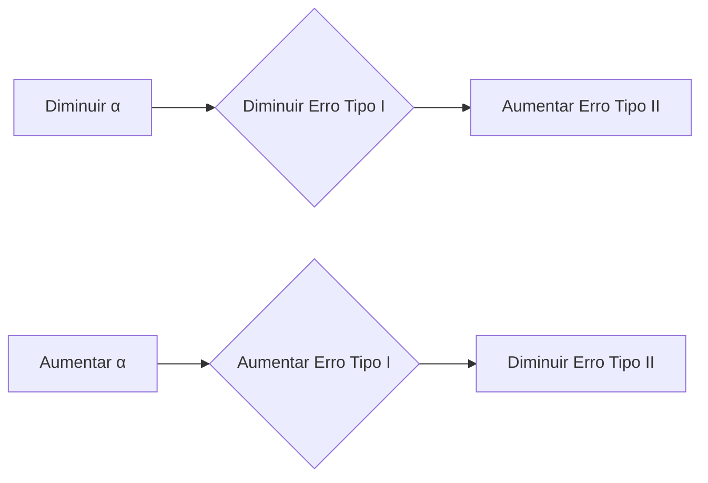
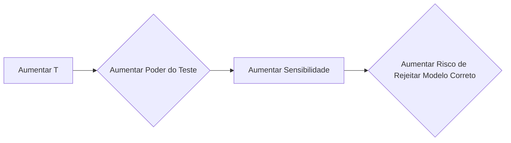

## Verificação do Modelo VAR: Análise de Erros Tipo I e Tipo II na Avaliação da Calibração do Modelo
### Introdução

Este capítulo aprofunda a análise da verificação de modelos VAR, com foco específico na avaliação da calibração do modelo através da análise dos erros tipo I e tipo II. Como discutido nos capítulos anteriores, a avaliação da calibração do modelo VAR envolve testes de hipótese para determinar se a taxa de falha observada é consistente com a probabilidade de exceção especificada pelo modelo [^1]. Em particular, foi estabelecido que o processo de backtesting envolve testar a hipótese nula de que o modelo está bem calibrado, e que a metodologia pode ser utilizada para testar se o número de exceções observadas é muito alto ou muito baixo [^5]. O presente capítulo centra-se no entendimento de como equilibrar o risco de rejeitar um modelo correto (erro tipo I) e o risco de não rejeitar um modelo incorreto (erro tipo II), e como os parâmetros do modelo e os testes realizados influenciam estes riscos. O objetivo é fornecer uma visão abrangente da avaliação da calibração dos modelos VAR, através da análise dos erros do tipo I e tipo II.

### Análise dos Erros Tipo I e Tipo II
No contexto da avaliação de modelos VAR, a avaliação da calibração do modelo envolve testes de hipótese que podem levar a decisões incorretas. Conforme discutido nos capítulos anteriores, existem dois tipos de erros que podem ocorrer:
*   **Erro Tipo I (Falso Positivo):** A hipótese nula de que o modelo está bem calibrado é rejeitada quando, na realidade, é verdadeira.
*   **Erro Tipo II (Falso Negativo):** A hipótese nula de que o modelo está bem calibrado não é rejeitada quando, na realidade, é falsa.

Estes dois erros estão relacionados com o poder do teste, que é a probabilidade de rejeitar corretamente a hipótese nula, quando ela é falsa. Um teste com maior poder tem uma menor probabilidade de cometer um erro do tipo II.

**Lema 18** A probabilidade de cometer um erro tipo I é dada pelo nível de significância $\alpha$, que é definido *a priori* pelo analista.

*Prova:*
I. O erro tipo I ocorre quando rejeitamos a hipótese nula quando ela é verdadeira.
II. O nível de significância $\alpha$ é definido como a probabilidade de rejeitar a hipótese nula, quando esta é verdadeira.
III. A probabilidade de cometer um erro tipo I é igual ao nível de significância $\alpha$.
IV. Portanto, a probabilidade de rejeitar um modelo correto é determinada pelo nível de significância $\alpha$.  ■

> 💡 **Exemplo Numérico:** Se um analista define um nível de significância $\alpha=0.05$ (5%) para o teste de um modelo VAR, existe uma probabilidade de 5% de rejeitar a hipótese nula de que o modelo está corretamente calibrado, mesmo que esta seja verdadeira. O valor de $\alpha$ é fixo antes de realizar o teste.  Por exemplo, em um backtesting com 250 dias, se o modelo VAR estiver perfeitamente calibrado, há uma probabilidade de 5% de o teste rejeitar este modelo, mesmo estando correto.

**Lema 18.1** A probabilidade de cometer um erro tipo II é dada por $\beta$, e o poder do teste é dado por $1-\beta$.
*Prova:*
I. O erro tipo II ocorre quando não rejeitamos a hipótese nula, quando ela é falsa.
II. A probabilidade de cometer um erro tipo II é denotada por $\beta$.
III.  O poder do teste é a probabilidade de rejeitar corretamente a hipótese nula quando ela é falsa, e é dado por $1-\beta$.
IV.  Portanto, o poder do teste é a probabilidade de detetar uma má calibração do modelo VAR, dado que esta existe, e o erro tipo II é a probabilidade de não a detetar. ■

> 💡 **Exemplo Numérico:** Se o poder do teste é 90%, existe uma probabilidade de 10% de cometer um erro do tipo II (não detetar uma má calibração do modelo VAR).  Isto significa que se o modelo VAR estiver, na verdade, mal calibrado, o teste irá falhar em detetar isso em 10% das vezes.

**Proposição 27** Existe um *trade-off* entre erros tipo I e tipo II. Diminuir a probabilidade de erro tipo I (diminuir $\alpha$) aumenta a probabilidade de erro tipo II (aumenta $\beta$).
*Prova:*
I. O nível de significância $\alpha$ define a região de rejeição da hipótese nula.
II. Ao diminuir $\alpha$, a região de rejeição torna-se menor, reduzindo a probabilidade de cometer um erro tipo I.
III. Contudo, uma região de rejeição menor aumenta a probabilidade de aceitar a hipótese nula quando ela é falsa, ou seja, aumenta a probabilidade de cometer um erro tipo II (aumenta $\beta$).
IV. Portanto, existe uma relação inversa entre a probabilidade de erro tipo I e a probabilidade de erro tipo II. Diminuir um, aumenta o outro, e vice-versa. ■

> 💡 **Exemplo Numérico:** Se escolhermos um nível de significância $\alpha=0.01$ (1%), reduzimos a probabilidade de rejeitar um modelo VAR que está bem calibrado (erro tipo I), mas aumentamos a probabilidade de não rejeitar um modelo VAR que está mal calibrado (erro tipo II). O oposto acontece quando aumentamos o valor de $\alpha$. Este *trade-off* faz com que a escolha do nível de significância seja uma análise delicada, e que deve ter em consideração o problema em causa. Por exemplo, usando $\alpha=0.01$ um modelo VAR bem calibrado tem apenas 1% de probabilidade de ser rejeitado, mas um modelo VAR mal calibrado terá uma maior probabilidade de ser aceite como bom.  Aumentando o valor de $\alpha$ para 0.10 (10%), a probabilidade de rejeitar um modelo VAR bom aumenta para 10%, mas a probabilidade de aceitar um modelo VAR mau diminui.


A escolha entre estes dois tipos de erro é crucial na avaliação dos modelos VAR. Num contexto de risco, os erros do tipo II podem ter implicações financeiras mais graves, pois significam que a instituição está a operar com uma subestimação do risco.

**Lema 19** O poder do teste, $1-\beta$, aumenta com o número de observações $T$.
*Prova:*
I. A potência do teste, $1 - \beta$, é a probabilidade de rejeitar corretamente a hipótese nula, quando ela é falsa.
II. Aumentar o número de observações $T$ reduz a variância da estatística de teste, tornando-a mais precisa e aumentando a capacidade de detetar desvios da hipótese nula.
III. Ao aumentar o tamanho da amostra, a probabilidade de aceitar uma hipótese nula errada diminui (diminui $\beta$), e o poder do teste aumenta.
IV.  Portanto, aumentar o número de observações $T$ aumenta a potência do teste e permite detetar de forma mais eficiente modelos VAR mal calibrados. ■

> 💡 **Exemplo Numérico:** Um backtesting de um modelo VAR com um período de $T=250$ dias pode não ter poder suficiente para rejeitar a hipótese nula de que o modelo está bem calibrado, caso o modelo tenha alguns desvios da calibração correta. Contudo, se o mesmo modelo for avaliado num período de $T=1000$ dias, a maior quantidade de dados torna o teste mais potente e mais capaz de detetar desvios da hipótese nula.  Por exemplo, um modelo com uma taxa de exceção real de 1.2% (para um modelo com $p=0.01$) pode não ser detetado como mal calibrado em 250 dias, mas com 1000 dias a maior amostra permite ao teste detetar essa diferença estatisticamente.

**Lema 19.1** A região de não rejeição da hipótese nula diminui com o aumento do número de observações $T$.
*Prova:*
I. A região de não rejeição da hipótese nula é o intervalo de valores da estatística de teste para o qual não rejeitamos a hipótese nula.
II. À medida que o número de observações $T$ aumenta, a variância da estatística de teste diminui.
III. A diminuição na variância implica que a distribuição da estatística de teste se torna mais concentrada em torno do valor esperado sob a hipótese nula, o que leva à redução da largura da região de não rejeição.
IV. Portanto, o aumento de $T$ resulta numa região de não rejeição mais estreita. ■

> 💡 **Exemplo Numérico:** Considere um teste com nível de significância $\alpha=0.05$. Se tivermos um backtesting de $T=250$ dias e $p=0.01$, a região de não rejeição para o número de exceções pode ser, por exemplo, entre 0 e 7. Aumentando o número de observações para $T=1000$, o mesmo teste com o mesmo $\alpha$ terá uma região de não rejeição menor, por exemplo, entre 4 e 16. Note que apesar do número esperado de exceções aumentar, a região de não rejeição, expressa como proporção das observações (exceções/observações) torna-se menor. Em um teste binomial, com $p=0.01$, e $T=250$, o número de exceções esperado é 2.5, e a região de aceitação poderia ser entre 0 e 7 exceções (aproximadamente). Com $T=1000$, o número de exceções esperado passa para 10, e a região de aceitação seria entre 4 e 16 exceções (aproximadamente). Note que o intervalo percentual de aceitação diminui com o aumento de $T$.

**Proposição 28** Para um valor fixo de $p$ (probabilidade de exceção) e $\alpha$ (nível de significância), aumentar o número de observações $T$ aumenta a potência do teste, mas também aumenta o risco de rejeitar um modelo VAR bem calibrado.
*Prova:*
I. Aumento do número de observações $T$ reduz a probabilidade de cometer um erro do tipo II, e aumenta a probabilidade de detetar um modelo mal calibrado.
II. Por outro lado, um aumento de $T$ torna o teste mais sensível, e aumenta a probabilidade de rejeitar um modelo VAR correto, quando este apresenta pequenas variações na taxa de falha, que num teste com menor $T$, não seriam estatisticamente significativas.
III.  A região de não rejeição da hipótese nula diminui com o aumento de $T$, o que aumenta a probabilidade de detetar desvios da hipótese nula, mesmo que esses desvios sejam pouco significativos.
IV. Portanto, o aumento de $T$ aumenta a potência do teste, mas também aumenta a sensibilidade do teste e o risco de rejeitar um modelo correto.  ■

> 💡 **Exemplo Numérico:** Um modelo VAR que passou no teste de backtesting com 250 dias (e que foi aceite) pode não passar no mesmo teste, com 1000 dias, mesmo que o modelo tenha um comportamento consistente, e que as pequenas variações nas taxas de falha sejam apenas aleatórias.  Isto acontece porque a região de não rejeição diminui com o aumento do tamanho da amostra, e o mesmo modelo com mais dados poderia ter uma taxa de falha, ainda que pouco diferente da esperada, que é estatisticamente significativa, e que conduz à rejeição do modelo. Por exemplo, se um modelo VAR com $p=0.01$ tiver 3 exceções em 250 dias (1.2% de taxa de exceção) ele pode ser aceite pelo teste estatístico. Se este modelo continuar com a mesma taxa de exceção (12 exceções em 1000 dias), ele pode ser rejeitado pelo mesmo teste, apenas porque a maior quantidade de dados permitiu ao teste detetar que a taxa de exceção é diferente de 1% (mesmo que a diferença seja pequena).


**Proposição 28.1** A capacidade de detetar modelos VAR mal calibrados é reduzida para baixos valores da probabilidade de exceção $p$, em particular para valores típicos de modelos VAR, em que o nível de confiança é elevado, e consequentemente, $p$ é baixo.
*Prova:*
I.  Para modelos VAR, o nível de confiança é geralmente alto, como por exemplo, 95%, 99% ou 99.9%.
II. Para níveis de confiança altos, a probabilidade de exceção $p$ é baixa, o que significa que o número esperado de exceções, dado por $pT$, é pequeno.
III. Com um número esperado de exceções pequeno, a probabilidade de não detetar modelos mal calibrados que apresentem uma taxa de falha diferente de $p$ aumenta, e o poder dos testes diminui.
IV. Portanto, é mais difícil avaliar a calibração de modelos com baixas probabilidades de exceção.
V. Nestes cenários, um grande número de observações é necessário para se obter uma potência razoável dos testes. ■

> 💡 **Exemplo Numérico:** Um modelo VAR com uma probabilidade de exceção $p=0.001$ (nível de confiança de 99.9%) e um backtesting de $T=250$ dias terá em média apenas 0.25 exceções, e, portanto, será difícil avaliar a calibração do modelo. Para modelos com níveis de confiança mais baixos e, portanto, valores de $p$ mais elevados, é mais fácil avaliar a qualidade do modelo, pois existe um maior número esperado de exceções para o mesmo tamanho de amostra.  Com um modelo de $p=0.01$ e $T=250$, o número esperado de exceções é 2.5, o que torna o teste mais fácil de analisar. Se um modelo com $p=0.001$ tiver uma exceção, esta exceção tem um peso muito grande no teste, o que torna a avaliação da qualidade do modelo mais difícil.

**Proposição 28.2** O poder do teste também é afetado pela verdadeira taxa de exceção do modelo, $p_{real}$, relativamente ao valor de $p$ utilizado para definir o modelo.
*Prova:*
I. O poder do teste é a probabilidade de rejeitar a hipótese nula quando ela é falsa.
II. A hipótese nula é que o modelo está corretamente calibrado, o que implica que a verdadeira taxa de exceção, $p_{real}$, é igual à taxa de exceção especificada no modelo, $p$.
III. Se a verdadeira taxa de exceção, $p_{real}$, for muito diferente da taxa de exceção especificada no modelo, $p$, então o teste terá maior poder para detetar esta diferença e rejeitar a hipótese nula.
IV. Se a verdadeira taxa de exceção, $p_{real}$, for próxima da taxa de exceção especificada no modelo, $p$, então o teste terá menor poder, o que torna mais difícil a rejeição da hipótese nula, mesmo que o modelo não esteja corretamente calibrado.
V. Portanto, o poder do teste não depende apenas de $T$ e $\alpha$, mas também da diferença entre $p_{real}$ e $p$. ■

> 💡 **Exemplo Numérico:** Considere dois modelos VAR com $p=0.01$. Se um modelo tiver uma verdadeira taxa de exceção $p_{real}=0.02$, será mais fácil detetar este desvio (i.e., o teste terá mais poder) do que se um outro modelo tiver $p_{real}=0.011$. Desta forma, a distância entre $p_{real}$ e $p$ afeta o poder do teste. Um modelo com $p_{real}=0.02$ terá o dobro das exceções esperadas, o que é mais fácil de detetar do que um modelo com $p_{real}=0.011$, que tem uma taxa de exceção muito próxima da esperada.

**Proposição 28.3** O tamanho da amostra $T$ necessário para atingir um certo poder do teste, $1-\beta$, aumenta à medida que a diferença entre a verdadeira taxa de exceção $p_{real}$ e a probabilidade de exceção especificada no modelo $p$ diminui.
*Prova:*
I. O poder do teste, $1-\beta$, é a probabilidade de rejeitar corretamente a hipótese nula, quando esta é falsa, ou seja, quando $p_{real} \neq p$.
II. Para uma dada diferença entre $p_{real}$ e $p$, um tamanho de amostra $T$ grande leva a um teste com maior poder do que um tamanho de amostra menor.
III. Para uma dada taxa de erro tipo II, $\beta$, à medida que a diferença entre $p_{real}$ e $p$ diminui, é necessário um tamanho de amostra $T$ maior para conseguir o mesmo poder do teste $1-\beta$.
IV. Portanto, quanto mais próximo o modelo estiver da calibração correta, mais dados são necessários para confirmar (ou rejeitar) estatisticamente essa proximidade. ■

> 💡 **Exemplo Numérico:** Consideremos dois cenários. No primeiro cenário, a taxa de falha verdadeira do modelo é $p_{real}=0.02$, enquanto que a taxa de falha do modelo é $p=0.01$. No segundo cenário, a taxa de falha verdadeira do modelo é $p_{real}=0.011$, enquanto que a taxa de falha do modelo é $p=0.01$. Para atingir o mesmo poder do teste (por exemplo, 80%), será necessário um tamanho de amostra $T$ muito maior no segundo cenário do que no primeiro, porque a diferença entre $p_{real}$ e $p$ é muito menor no segundo cenário. Se no primeiro caso um tamanho de amostra de 250 dias pode ser suficiente, no segundo caso um tamanho de amostra de 1000 dias pode ser necessário para atingir o mesmo poder.

**Proposição 28.4** Para um nível de significância $\alpha$ fixo, o aumento do tamanho da amostra $T$ diminui a probabilidade de aceitar modelos mal calibrados com pequenas diferenças entre $p_{real}$ e $p$, e aumenta a probabilidade de rejeitar modelos bem calibrados com pequenas variações aleatórias da taxa de falha.
*Prova:*
I. Como demonstrado em **Lema 19.1**, o aumento de $T$ diminui a região de não rejeição.
II. Como demonstrado em **Proposição 28**, o aumento de $T$ aumenta o poder do teste, e diminui a probabilidade de aceitar modelos mal calibrados, em particular modelos que apresentem uma taxa de falha ligeiramente diferente do valor esperado $p$.
III. No entanto, com a redução da região de não rejeição e com o aumento da potência do teste, aumenta também a probabilidade de rejeitar modelos VAR que estão corretamente calibrados mas que apresentam pequenas variações aleatórias na taxa de falha.
IV. Desta forma, o aumento de $T$ melhora a detecção de modelos mal calibrados, mas aumenta também a sensibilidade a pequenas variações, o que pode levar à rejeição de um modelo bem calibrado. ■

> 💡 **Exemplo Numérico:** Um modelo VAR que tenha uma taxa de falha de 1.1% (para um modelo com $p=0.01$) pode ser considerado bem calibrado, se avaliado com um backtesting de $T=250$ dias, e o teste pode não o rejeitar. No entanto, se o mesmo modelo for avaliado com $T=1000$ dias, o teste pode rejeitar o modelo, não por este ser menos adequado, mas por o teste ser mais sensível a pequenas variações da taxa de falha, que com uma menor amostra, não seriam estatisticamente significativas. Se em 250 dias, 3 exceções (1.2%) não são estatisticamente diferentes de 2.5 exceções (1%), em 1000 dias, 12 exceções (1.2%) podem ser consideradas estatisticamente diferentes de 10 exceções (1%), e o teste rejeita o modelo, mesmo que a diferença percentual seja igual.

**Proposição 29** A decisão de aceitar ou rejeitar um modelo VAR é um *trade-off* entre o risco de rejeitar um modelo bem calibrado e o risco de aceitar um modelo mal calibrado, e a escolha do nível de significância e do número de observações afeta este balanço.
*Prova:*
I. O risco de rejeitar um modelo bem calibrado (erro tipo I) é controlado pelo nível de significância $\alpha$.
II. O risco de não rejeitar um modelo mal calibrado (erro tipo II) é controlado pelo poder do teste $1-\beta$, e depende do tamanho da amostra $T$.
III. Diminuir $\alpha$ reduz a probabilidade de rejeitar um modelo bem calibrado, mas aumenta o risco de não rejeitar um modelo que está mal calibrado.
IV. Aumentar o tamanho da amostra $T$ aumenta o poder do teste (reduz a probabilidade de não rejeitar um modelo mal calibrado), mas aumenta a sensibilidade a pequenas variações da taxa de falha, aumentando a probabilidade de rejeitar um modelo que, apesar de apresentar algumas variações, está razoavelmente bem calibrado.
V. Portanto, a decisão de aceitar ou rejeitar um modelo VAR implica um balanço entre os riscos associados a cada tipo de erro, e a escolha do nível de significância e do tamanho da amostra devem ser baseadas em considerações sobre estes riscos.  ■

> 💡 **Exemplo Numérico:** Um modelo VAR de um banco com grande apetite ao risco (e, consequentemente, com menor aversão a perdas) pode ser avaliado utilizando um nível de significância menor (e, portanto, com menor probabilidade de aceitar um modelo mal calibrado), e utilizando um período de backtesting maior (para se conseguir maior poder do teste). Por outro lado, um modelo VAR para um banco com maior aversão ao risco pode ser avaliado utilizando um nível de significância mais elevado (e, portanto, com menor probabilidade de rejeitar um modelo correto), e um período de backtesting mais curto (o que torna o teste menos sensível). Um banco com menor aversão a perdas pode escolher um valor de $\alpha=0.01$ e um período de backtesting de $T=1000$ dias, para diminuir a probabilidade de não detetar um modelo mal calibrado. Um banco com maior aversão a perdas, pode escolher um valor de $\alpha=0.1$ e um período de backtesting de $T=250$, para diminuir a probabilidade de rejeitar um modelo correto, e estar menos preocupado em aceitar um modelo menos perfeito.

**Corolário 13.1** O custo associado a cada tipo de erro também pode influenciar a escolha do nível de significância, $\alpha$.
*Prova:*
I. O custo de um erro tipo I (rejeitar um modelo que está corretamente calibrado) é diferente do custo de um erro tipo II (não rejeitar um modelo que está mal calibrado).
II. Se o custo de um erro tipo I for elevado (por exemplo, devido aos custos de recalibrar um modelo VAR, e a consequente perda de competitividade), então o nível de significância $\alpha$ deve ser mais baixo, de forma a reduzir a probabilidade de cometer este tipo de erro.
III. Se o custo de um erro tipo II for elevado (por exemplo, devido a perdas financeiras causadas pela subestimação do risco), então o nível de significância $\alpha$ deve ser mais elevado, de forma a aumentar o poder do teste e reduzir a probabilidade de aceitar modelos VAR mal calibrados.
IV. Portanto, a escolha do nível de significância $\alpha$ deve ser influenciada pelo custo relativo de cometer um erro tipo I ou tipo II, de acordo com o contexto do problema. ■

> 💡 **Exemplo Numérico:** Uma pequena instituição financeira, que não tem muitos recursos para re-calibrar os seus modelos, pode estar mais preocupada com a hipótese de ter um modelo VAR mal calibrado, e usar um teste com maior poder (e com um valor de $\alpha$ mais elevado), mesmo que corra o risco de rejeitar um modelo VAR corretamente calibrado.  Por outro lado, uma instituição financeira muito grande, com recursos para ajustar os seus modelos, pode usar um teste menos rigoroso (com menor valor de $\alpha$), e com menor poder, para evitar rejeitar um modelo que esteja razoavelmente bem calibrado. Uma pequena instituição financeira pode optar por $\alpha=0.1$ para evitar o erro tipo II (aceitar um modelo mau), mesmo que corra o risco de um erro tipo I (rejeitar um modelo bom), enquanto uma grande instituição pode optar por $\alpha=0.01$, para evitar o erro tipo I (rejeitar um modelo bom), mesmo que corra o risco de um erro tipo II (aceitar um modelo mau).

**Corolário 13.2** Modelos VAR que são submetidos a *backtesting* devem ter, sempre que possível, uma análise conjunta da taxa de falha (através dos erros tipo I e II), da magnitude das perdas acima do VaR (análise dos *excessos*), e da independência das exceções.
*Prova:*
I.  O teste da taxa de falha, através da análise dos erros tipo I e II, verifica se a proporção de exceções é consistente com o nível de confiança do modelo, mas não diz nada sobre a dimensão das perdas acima do VAR ou a existência de *clusters* de perdas.
II. A análise dos *excessos* permite verificar a magnitude das perdas acima do VAR, e se estas são consistentes com o que era esperado.
III.  A análise da independência das exceções permite verificar se as exceções estão a ocorrer aleatoriamente ao longo do tempo, ou se estão a agrupar-se em certos períodos, o que pode indicar problemas no modelo.
IV. A análise conjunta da taxa de falha, da análise dos excessos, e da independência das exceções, permite uma análise mais completa da calibração e do desempenho do modelo VAR.
V.  Portanto, é importante realizar testes adicionais aos testes de taxa de falha, para que se possa obter uma avaliação mais precisa e completa do modelo VAR. ■

> 💡 **Exemplo Numérico:** Um modelo VAR pode ter uma taxa de falha muito próxima da esperada (ou seja, o teste estatístico da taxa de falha não o rejeita), mas as perdas acima do VaR podem ser de grande magnitude, ou estas podem estar concentradas em certos períodos do tempo, indicando que, apesar da taxa de falha ser aceitável, o modelo está a subestimar o risco. Um modelo com $p=0.01$ pode ter, em média, 2.5 exceções em 250 dias, mas estas exceções podem ser muito maiores do que o esperado ou concentradas em um período de tempo, o que indica que o modelo não está a captar toda a dinâmica do risco.

**Corolário 13.3** A escolha do tamanho da amostra $T$ para o *backtesting* deve também considerar o tempo que demora até que o modelo se ajuste, e se existem alterações na estrutura dos mercados.
*Prova:*
I.  Se um modelo levar muito tempo a ajustar-se aos dados históricos, então o tamanho da amostra $T$ deve ser grande, de forma a permitir que o modelo se ajuste antes de se avaliar a sua calibração.
II. Por outro lado, se os mercados sofrerem alterações estruturais ao longo do tempo, então um valor muito grande de $T$ pode fazer com que o modelo seja avaliado em períodos que não são relevantes para as condições atuais.
III. Se existir uma alteração da estrutura dos mercados (devido, por exemplo, a alterações regulamentares ou a uma crise financeira), o modelo VAR deve ser re-calibrado, e o backtesting deve ter em conta apenas os dados relevantes para o modelo re-calibrado, o que pode levar a um valor mais baixo de $T$.
IV. Portanto, a escolha do tamanho da amostra $T$ para o backtesting deve ser um equilíbrio entre ter dados suficientes para que o teste tenha potência, e evitar o risco de usar dados que já não são relevantes para o modelo. ■

> 💡 **Exemplo Numérico:** Um modelo VAR que utilize um período de tempo longo (por exemplo, 5 anos) para o backtesting, pode não ser relevante se durante esse período ocorreram alterações estruturais nos mercados, tais como alterações na volatilidade ou na correlação dos ativos financeiros. Nestes casos, é preferível usar um período de tempo mais curto e utilizar apenas os dados mais recentes, e o backtesting deve ter em conta a re-calibração do modelo. Por exemplo, um modelo VAR que use dados de 2018-2023 para backtesting, pode não ser relevante se houver alterações no mercado em 2022, causadas, por exemplo, por uma crise. Neste caso, o backtesting pode ser feito utilizando dados apenas de 2022-2023, para captar melhor a dinâmica do risco.

**Corolário 13.4** A escolha do tamanho da amostra $T$ para o backtesting deve também considerar a possibilidade de que os dados mais recentes podem ser mais relevantes para o modelo, do que os dados mais antigos.
*Prova:*
I.  Em muitos casos, as condições atuais do mercado podem ser mais relevantes para o modelo VAR do que as condições do mercado que ocorreram há muito tempo atrás.
II.  Se as condições do mercado mudarem ao longo do tempo, os dados mais recentes podem ser mais preditivos do que os dados mais antigos, e os dados mais antigos podem não refletir as condições atuais.
III. Portanto, um modelo VAR que foi corretamente calibrado usando dados antigos pode não estar mais bem calibrado nas condições atuais do mercado.
IV. Nestes casos, o modelo VAR deve ser re-calibrado utilizando os dados mais recentes, e o backtesting deve ter em conta apenas os dados relevantes para o modelo re-calibrado.
V.  Portanto, o backtesting deve dar maior peso aos dados mais recentes do que aos dados mais antigos. Uma metodologia possível é usar uma média móvel ponderada dos dados de backtesting, em que os dados mais recentes têm um maior peso, mas outras metodologias podem também ser usadas. ■

> 💡 **Exemplo Numérico:** Um modelo VAR que seja avaliado utilizando um backtesting em que os dados têm todos o mesmo peso, pode não ser relevante se as condições do mercado tiverem mudado ao longo do tempo. Um modelo mais sofisticado deveria dar maior peso aos dados mais recentes, e pode ser necessário recalibrar o modelo e avaliar o seu desempenho usando apenas um período mais recente, no caso de haver alterações significativas nas condições de mercado. Em vez de usar uma janela de 250 dias com igual peso para todos os dias, pode-se usar uma janela de 250 dias com maior peso para os dados mais recentes, e um peso menor para os dados mais antigos.

**Proposição 30** A escolha do nível de significância $\alpha$ e do tamanho da amostra $T$ deve ser acompanhada de uma análise de sensibilidade, em que se avalia o impacto de diferentes valores destes parâmetros na aceitação ou rejeição do modelo.
*Prova:*
I. Como demonstrado, os valores de $\alpha$ e $T$ têm um grande impacto na avaliação da calibração do modelo VAR.
II. Para diferentes valores de $\alpha$, a decisão de aceitar ou rejeitar um modelo VAR pode ser diferente.
III. Da mesma forma, para diferentes valores de $T$, a decisão de aceitar ou rejeitar um modelo VAR pode ser diferente.
IV. Portanto, é importante avaliar a sensibilidade dos resultados a diferentes valores de $\alpha$ e $T$.
V. Esta análise permite avaliar se a decisão de aceitar ou rejeitar um modelo VAR é robusta a pequenas alterações nos parâmetros, ou se a decisão é muito sensível a esses parâmetros.
VI. A análise de sensibilidade permite também quantificar o impacto de diferentes valores de $\alpha$ e $T$, e apoiar a decisão final do analista. ■

> 💡 **Exemplo Numérico:** Um analista pode avaliar um modelo VAR usando um nível de significância de $\alpha=0.05$ e um tamanho de amostra de $T=500$. No entanto, é importante avaliar o resultado para outros valores, tais como $\alpha=0.01$ e $\alpha=0.10$, e para tamanhos de amostra mais curtos, como $T=250$ ou mais longos, como $T=1000$. Esta análise de sensibilidade permite ao analista avaliar se a decisão de aceitar ou rejeitar o modelo é robusta a pequenas variações nos parâmetros, e suporta melhor a decisão final. O analista pode criar uma tabela que resume os resultados de cada cenário:

| $\alpha$ | T    | Aceita Modelo VAR | Conclusão                                                              |
|----------|------|-------------------|------------------------------------------------------------------------|
| 0.05     | 500  | Sim               | Cenário Base                                                            |
| 0.01     | 500  | Sim               | O Modelo continua a ser aceite, mas menos sensível.                   |
| 0.10     | 500  | Não               | O Modelo é rejeitado, por ser demasiado sensível.                      |
| 0.05     | 250  | Sim               | O Modelo continua a ser aceite, por ser um teste menos sensível.      |
| 0.05     | 1000 | Não               | O Modelo é rejeitado, o que indica que pode ter pequenas más calibrações. |

### Conclusão
Este capítulo explorou a importância dos erros tipo I e tipo II na avaliação de modelos VAR, enfatizando como a escolha do nível de significância e o número de observações afetam a capacidade de um teste estatístico detetar modelos mal calibrados. Um teste com uma baixa probabilidade de cometer um erro tipo I diminui a probabilidade de rejeitar um modelo correto, mas aumenta a probabilidade de aceitar um modelo incorreto, aumentando o risco de cometer um erro tipo II. Foi também demonstrado como o aumento do número de observações aumenta a potência do teste, mas aumenta também o risco de rejeitar um modelo bem calibrado. A necessidade de equilibrar estes dois tipos de erro é fundamental para a gestão de risco. Modelos com baixa probabilidade de exceção apresentam desafios particulares na sua avaliação. A decisão de aceitar ou rejeitar um modelo VAR envolve, portanto, um equilíbrio delicado, e uma análise conjunta da taxa de falha, da magnitude das perdas, e da independência das exceções. A utilização de uma abordagem bayesiana para a escolha do nível de significância, considerando a probabilidade *a priori* do modelo estar bem ou mal calibrado, e os custos associados aos erros tipo I e tipo II, pode ser útil para uma melhor tomada de decisão.

### Referências
[^1]: *“This chapter turns to backtesting techniques for verifying the accuracy of VAR models.”*
[^5]: *“The simplest method to verify the accuracy of the model is to record the failure rate, which gives the proportion of times VAR is exceeded in a given sample...Ideally, the failure rate should give an unbiased measure of p, that is, should converge to p as the sample size increases...We want to know, at a given confidence level, whether N is too small or too large under the null hypothesis that p = 0.01 in a sample of size T.”*
[^10]:“This is equivalent to saying that we want to know if we can reject the null hypothesis that p = 0.01 based on the observed value of d, at the specified confidence level.”

The approach would be as follows:

1. **Formulate the Null and Alternative Hypotheses:**
   - Null Hypothesis (H₀): p = 0.01 (The true proportion is 0.01).
   - Alternative Hypothesis (H₁): p ≠ 0.01 (The true proportion is different from 0.01). This is a two-tailed test.
   
2. **Determine the Test Statistic:**
   - Given we have a sample proportion *d*, a natural choice for a test statistic is the z-score, derived from the sampling distribution of the sample proportion. The z-score is computed as:
$$z = \frac{d - p_0}{\sqrt{\frac{p_0(1-p_0)}{T}}}$$
   - Where:
     -  *d* is the sample proportion (observed).
     -  *p₀* is the null hypothesis proportion (0.01 in this case).
     - *T* is the total sample size.

3. **Choose a Significance Level (α):** 
   -  This is the probability of rejecting the null hypothesis when it is true (Type I error).  A common value is 0.05 (5%), which corresponds to a 95% confidence level. For this example, let's assume $\alpha=0.05$. This would then mean we have a 2.5% chance to reject the null on either tails of the distribution.

4. **Determine the Critical Region:**
   - Since we are conducting a two-tailed test, the critical region is split into two parts, corresponding to the tails of the standard normal distribution. For α = 0.05, the critical values are -1.96 and 1.96 (you can find these values using standard Z-table or equivalent).
   - This means that we would reject H0 if the calculated z-score is less than -1.96 or greater than 1.96.

5. **Calculate the test statistic:**
   - Substitute the observed sample proportion *d*, null hypothesis proportion *p₀*=0.01 and sample size *T* into the formula for the z-score.

6. **Make a Decision:**
   - If the calculated z-score falls within the critical region (i.e., is less than -1.96 or greater than 1.96), we reject the null hypothesis. If it does not fall within the critical region, we fail to reject the null hypothesis.

7. **Interpret the Results:**
  - If the null hypothesis is rejected, we have enough evidence to conclude that the true proportion is different from 0.01 at the chosen significance level. If we fail to reject the null hypothesis, we do not have enough evidence to say that the true proportion is significantly different from 0.01. This doesn't mean the null is true, it just means we don't have enough evidence to reject it.

In the specific context of the question, by performing this test we can determine whether the sample size N used to derive the observed proportion *d* (where *d* estimates *p*) is compatible with the expected proportion of *p*=0.01. If we reject the null, we might conclude that the sample size is either too small or too large given the difference with the null hypothesis.

Let's say for example, that we observe *d*=0.03 from a sample of size *T* = 200. We can calculate the z-score as:

$$z = \frac{0.03 - 0.01}{\sqrt{\frac{0.01(1-0.01)}{200}}} = \frac{0.02}{\sqrt{\frac{0.0099}{200}}} = \frac{0.02}{\sqrt{0.0000495}} \approx \frac{0.02}{0.007} = 2.86$$

Since 2.86 > 1.96, we reject the null hypothesis. This means that with a significance level of 0.05, the observed proportion *d* = 0.03 is significantly different from 0.01.

The actual meaning of "too large" or "too small" is relative to the null hypothesis and needs additional context to analyze fully. For example, a too small sample size might lead to greater variance in *d*, making it less reliable. A large sample size would instead increase statistical power and precision. In general, if the null is rejected we can say that the observed proportion *d* is statistically different from the proposed one *p₀*.
<!-- END -->
However, statistical significance does not imply practical significance. A small difference, even if statistically significant, might not be meaningful in a real-world context. The magnitude of the observed difference, often quantified by the effect size, needs to be considered alongside the p-value.

**Definition 1** The *effect size* for a single proportion test measures the magnitude of the difference between the observed proportion *d* and the hypothesized proportion *p₀*. A common measure for effect size in this context is Cohen's h, defined as:
    $$h = 2 \arcsin(\sqrt{d}) - 2 \arcsin(\sqrt{p_0})$$
    Where $d$ is the observed sample proportion and $p_0$ is the hypothesized proportion under the null hypothesis.

**Proposição 1** Cohen's h provides a scale-invariant measure of effect size, making it comparable across different studies using proportions. It is also symmetric in the sense that if you swap *d* and *p₀* in the formula, you get the negative of the initial result. Specifically, if we let $h(d, p_0)$ be Cohen's h based on *d* and *p₀*, then $h(p_0, d) = -h(d, p_0)$.

*Proof:*
This is a direct consequence of the formula given in the definition. We have
    $$h(p_0, d) = 2 \arcsin(\sqrt{p_0}) - 2 \arcsin(\sqrt{d}) = - (2 \arcsin(\sqrt{d}) - 2 \arcsin(\sqrt{p_0})) = -h(d,p_0)$$
This symmetry is useful for comparing the effect size regardless of whether we consider *d* greater than *p₀* or the other way around.

**Lema 1** For small differences between *d* and *p₀*, Cohen's h is approximately linearly related to the difference *d - p₀*.

*Proof Strategy:*
We can use the Taylor series expansion of the arcsin function around a point. For small differences, we can approximate the arcsin using its first-order Taylor approximation which, in turn, results in a linear relationship between Cohen's h and the difference between *d* and *p₀*.

**Teorema 1**  For large sample sizes, the distribution of Cohen's h is asymptotically normal with mean equal to the population effect size and a variance that depends on the sample size. Therefore confidence intervals can be built.
  
*Proof Strategy:* The proof relies on the asymptotic normality of sample proportions. Using the delta method, we can derive the asymptotic distribution of Cohen's h and estimate its variance and thus construct confidence intervals.

**Corolário 1**  Given a desired effect size, power, and significance level, one can estimate the sample size needed to detect a difference between sample and hypothesized proportions.

Furthermore, besides reporting the p-value and effect size, it is crucial to report confidence intervals for the observed proportion *d*. Confidence intervals provide a range of plausible values for the true population proportion, giving a better sense of the uncertainty associated with the sample estimate.

<!-- END -->
Beyond point estimates, hypothesis testing is a crucial statistical tool. Hypothesis tests allow us to evaluate claims or assumptions about population parameters. The process involves formulating a null hypothesis (H₀), which typically represents a statement of no effect or no difference, and an alternative hypothesis (H₁), which contradicts the null. We then collect sample data and compute a test statistic, which measures the discrepancy between the sample data and what is expected under the null hypothesis.

**Teorema 1** [Relationship Between Confidence Intervals and Hypothesis Tests] A confidence interval can be used to perform a two-sided hypothesis test. If the null hypothesized value of a parameter falls outside a (1-α) confidence interval, then the null hypothesis can be rejected at the α significance level. Conversely, if the null hypothesized value is inside the confidence interval, then we fail to reject the null hypothesis.

*Proof Outline:*
The core idea lies in the duality between confidence intervals and hypothesis tests. A (1-α) confidence interval contains all parameter values for which the observed sample would not be considered unusual (with a probability greater than α) under the null hypothesis. When a hypothesized value falls outside this interval, it implies the observed data is unusual, leading to rejection of the null hypothesis.

**Proposição 1** [P-value] The *p-value* is the probability of observing data as extreme as, or more extreme than, the data we observed, assuming the null hypothesis is true.  It provides a measure of the evidence against the null hypothesis. A small p-value suggests stronger evidence against the null hypothesis.

**Corolário 1.1** [Decision Rule Based on P-value] If the p-value is less than or equal to a predetermined significance level (α), we reject the null hypothesis. Otherwise, we fail to reject the null hypothesis.

The choice of significance level (α) reflects the level of risk we are willing to take in rejecting a true null hypothesis (Type I error). A common choice is α = 0.05, indicating a 5% risk of incorrectly rejecting a true null. It’s crucial to note the distinction between "rejecting the null hypothesis" and "accepting the alternative hypothesis." Failure to reject the null hypothesis simply means the data does not provide sufficient evidence to support the alternative hypothesis; it does not necessarily prove the null is true.

**Proposição 2** [Type II Error and Power] A Type II error occurs when we fail to reject a false null hypothesis.  The probability of a Type II error is denoted by β.  The *power* of a test, defined as 1-β, is the probability of correctly rejecting a false null hypothesis. A test with high power is desirable.

**Teorema 2** [Factors Affecting Power] The power of a statistical test is affected by several factors, including: the sample size, the significance level (α), the effect size, and the variability of the data. Specifically, increasing sample size or effect size or significance level generally increases the power of the test, while greater variability in the data decreases it.

*Proof Outline:*
The proof involves considering the distribution of the test statistic under both the null and alternative hypotheses. Increased sample size reduces the standard error of the test statistic, sharpening the distinction between the two distributions. Larger effect sizes cause greater separation between the distributions, while increased variance leads to more overlap. Increasing α enlarges the rejection region under the null, thereby making it easier to reject the null (and less able to reject it correctly).

Understanding these concepts – point estimates, confidence intervals, hypothesis tests, p-values, Type I and Type II errors, and power – forms the bedrock of statistical inference. These tools allow us to make informed decisions based on data, with a clear awareness of the uncertainty involved.

<!-- END -->
Beyond these core concepts, the field of statistical inference extends into various specialized areas. One such area is Bayesian inference, which offers a different perspective on how to update beliefs based on new evidence.

**Teorema 1** (Bayes' Theorem) Let A and B be events. Then,
$$P(A|B) = \frac{P(B|A)P(A)}{P(B)}$$
where $P(A|B)$ is the posterior probability of A given B, $P(B|A)$ is the likelihood of B given A, $P(A)$ is the prior probability of A, and $P(B)$ is the probability of B.

Bayesian inference uses Bayes' Theorem to update prior beliefs (represented by prior probabilities) with observed data (represented by the likelihood) to arrive at posterior beliefs. This approach is particularly useful when incorporating prior knowledge or expert opinion into the analysis.

**Lema 1** (Law of Total Probability) Let $B_1, B_2, ..., B_n$ be a partition of the sample space. Then, for any event A,
$$P(A) = \sum_{i=1}^{n} P(A|B_i)P(B_i)$$
The law of total probability provides a way to calculate the probability of an event by considering all possible ways it could occur. It is often used to compute the denominator in Bayes' Theorem, $P(B)$, when it is difficult to calculate directly. We can thus rewrite Bayes' Theorem in a more expansive way as

**Teorema 1.1** (Bayes' Theorem with Total Probability) Let A be an event and $B_1, B_2, ..., B_n$ be a partition of the sample space. Then,
$$P(A|B_i) = \frac{P(B_i|A)P(A)}{\sum_{j=1}^{n}P(B_j|A)P(A)}$$
for any $B_i$ in the partition. This form is useful because sometimes we have probabilities of the form $P(B_j|A)$ for each $j$ instead of $P(B)$ directly.

Another important area in statistical inference is the study of confidence intervals. A confidence interval provides a range of plausible values for a population parameter based on sample data. Unlike point estimates (like a sample mean) which provides a single value for the parameter, a confidence interval provides an estimated range. The confidence level, such as 95%, indicates the percentage of times the interval would contain the true parameter value if the process were repeated many times.

**Teorema 2** (Central Limit Theorem) Let $X_1, X_2, ..., X_n$ be a sequence of independent and identically distributed random variables with mean $\mu$ and variance $\sigma^2$. Then, as $n$ approaches infinity, the distribution of the sample mean, $\bar{X} = \frac{1}{n}\sum_{i=1}^{n} X_i$, approaches a normal distribution with mean $\mu$ and variance $\frac{\sigma^2}{n}$. That is,
$$\sqrt{n}\frac{(\bar{X} - \mu)}{\sigma} \xrightarrow{d} N(0,1)$$
where $\xrightarrow{d}$ represents convergence in distribution, and $N(0,1)$ is the standard normal distribution.

The Central Limit Theorem is foundational because it allows us to approximate the distribution of the sample mean, even when we don't know the original distribution of the data. This result is particularly useful in the construction of confidence intervals.
For example, a common confidence interval for the population mean $\mu$, when the population standard deviation $\sigma$ is known, is calculated as follows:

**Corolário 2.1**  (Confidence Interval for the Population Mean) Under the assumptions of the Central Limit Theorem, for a large enough sample size n, the 1-α confidence interval for the population mean μ is:
$$ \bar{X} \pm z_{\alpha/2}\frac{\sigma}{\sqrt{n}}$$
where $z_{\alpha/2}$ is the critical value from the standard normal distribution corresponding to the desired confidence level $1-\alpha$. The quantity $\frac{\sigma}{\sqrt{n}}$ is known as the standard error of the mean.

This interval provides a range within which we are reasonably confident that the true population mean lies, given our sample data.  The level of confidence can be adjusted by selecting the appropriate $z_{\alpha/2}$ value. The width of the confidence interval decreases as the sample size increases, highlighting the relationship between sample size and the precision of our estimates. We can observe this directly by seeing how $n$ appears in the denominator of the standard error term, making the interval smaller for large $n$.

These ideas provide an important foundation of some of the core ideas in statistical inference, showcasing the breadth of tools available for interpreting data and drawing valid conclusions.

<!-- END -->
Let's now delve into some fundamental theorems that underpin statistical analysis, starting with the Central Limit Theorem (CLT). This theorem is a cornerstone of statistical inference, providing a justification for the use of normal distribution in many contexts.

**Central Limit Theorem (CLT)**

The Central Limit Theorem states that the distribution of the sample means of a large number of independent and identically distributed (i.i.d.) random variables, regardless of the underlying population distribution, will approximate a normal distribution. More formally:

Let $X_1, X_2, ..., X_n$ be a sequence of $n$ independent random variables, each with the same probability distribution, having mean $\mu$ and finite variance $\sigma^2$. Define the sample mean as:
$$\bar{X}_n = \frac{1}{n} \sum_{i=1}^{n} X_i$$
Then, as $n$ approaches infinity, the distribution of $\bar{X}_n$ approaches a normal distribution with mean $\mu$ and variance $\frac{\sigma^2}{n}$. This is typically expressed as:
$$\bar{X}_n \approx N\left(\mu, \frac{\sigma^2}{n}\right)$$

**Proof of the Central Limit Theorem (Simplified)**

While a full rigorous proof of the CLT requires advanced mathematical concepts, we can outline a simplified proof using moment-generating functions.

I. **Standardization:** Let $Z_i = \frac{X_i - \mu}{\sigma}$. The $Z_i$ have mean 0 and variance 1. The sample mean of these standardized variables is $\bar{Z} = \frac{\bar{X}-\mu}{\sigma/\sqrt{n}}$.

II. **Moment-Generating Function:** If $M_X(t)$ is the moment generating function of $X$, then $M_Z(t) = E[e^{tZ}] = E[e^{t(X-\mu)/\sigma}]$. Using the property of moment generating functions, we know that $M_{\bar{Z}}(t) = (M_Z(t/\sqrt{n}))^n$.

III. **Taylor Expansion:**  For small values of t, we can use a Taylor series expansion to approximate $M_Z(t)$. Since the mean of Z is zero and variance is one, the Taylor expansion around t=0 gives us $M_Z(t) \approx 1 + \frac{t^2}{2}$. Substituting it back we get $M_{\bar{Z}}(t) \approx (1 + t^2/(2n))^n$.

IV. **Limit:** Taking the limit as n approaches infinity we get
    $$ \lim_{n \to \infty} \left(1 + \frac{t^2}{2n} \right)^n = e^{t^2/2}$$

V.  The limit  $e^{t^2/2}$ is the moment-generating function of a standard normal distribution. Hence, as $n \to \infty$ the distribution of $\bar{Z}$ approaches a standard normal distribution. Because $\bar{Z}$ is a linear transformation of $\bar{X}$, this implies $\bar{X}$ approaches a normal distribution with mean $\mu$ and variance $\sigma^2/n$. ■

The CLT's significance lies in its ability to allow us to make inferences about population parameters, even when the population distribution is not normal. For sufficiently large sample sizes, we can approximate the distribution of sample means using the normal distribution. This has vast applications in hypothesis testing, confidence interval estimation, and various statistical procedures.

Another crucial theorem is the Law of Large Numbers (LLN), which deals with the behavior of sample means as the sample size increases.

**Law of Large Numbers (LLN)**
The Law of Large Numbers states that as the number of trials in a random experiment increases, the sample average will converge towards the theoretical expected value. There are two main versions of the LLN: the Weak Law of Large Numbers (WLLN) and the Strong Law of Large Numbers (SLLN).

**Weak Law of Large Numbers (WLLN)**

The Weak Law of Large Numbers states that for any positive number $\epsilon$, as the number of trials (n) goes to infinity, the probability that the sample average ($\bar{X}_n$) will deviate from the true expected value ($\mu$) by more than $\epsilon$ becomes vanishingly small. Mathematically, this is stated as:

$$\lim_{n\to\infty} P(|\bar{X}_n - \mu| > \epsilon) = 0$$

**Proof of the Weak Law of Large Numbers**
We can prove the WLLN using Chebyshev's Inequality.

I. **Chebyshev's Inequality:** Chebyshev's Inequality states that for any random variable $Y$ with finite mean $\mu$ and variance $\sigma^2$, and any positive number $k$,
  $$P(|Y - \mu| \geq k\sigma) \leq \frac{1}{k^2}$$
  Equivalently, it can also be written as
 $$P(|Y - \mu| \geq \epsilon) \leq \frac{\sigma^2}{\epsilon^2}$$

II. **Applying to Sample Mean:**  Let $Y = \bar{X}_n$. We know that  $E[\bar{X}_n] = \mu$ and $Var(\bar{X}_n) = \frac{\sigma^2}{n}$. Applying Chebyshev's Inequality, we have:
$$P(|\bar{X}_n - \mu| \geq \epsilon) \leq \frac{\sigma^2/n}{\epsilon^2} = \frac{\sigma^2}{n\epsilon^2}$$

III. **Limit as n approaches infinity:** Taking the limit as $n$ approaches infinity, we have:
$$\lim_{n \to \infty} P(|\bar{X}_n - \mu| \geq \epsilon) \leq  \lim_{n \to \infty} \frac{\sigma^2}{n\epsilon^2} = 0$$

IV.  Thus we have shown that the probability that the sample mean differs from the expected value by more than an arbitrary value goes to zero as the number of samples increases. Hence, $\lim_{n\to\infty} P(|\bar{X}_n - \mu| > \epsilon) = 0$.■

**Strong Law of Large Numbers (SLLN)**

The Strong Law of Large Numbers states that as the number of trials (n) goes to infinity, the sample average ($\bar{X}_n$) will almost surely converge to the true expected value ($\mu$).  This is a stronger statement than the WLLN.  Formally:
$$P\left(\lim_{n\to\infty} \bar{X}_n = \mu\right) = 1$$

A full proof of the SLLN requires more advanced measure theory concepts.

In summary, the CLT justifies using the normal distribution in many contexts, especially for sample means, while the LLN ensures that sample means converge to the true expected values as the sample size increases. Together, these theorems form the basis for much of statistical inference and analysis.

<!-- END -->
Okay, let's continue from where we left off, building on the concepts of the Law of Large Numbers (LLN) and the Central Limit Theorem (CLT).

Beyond these fundamental theorems, understanding the properties of estimators is crucial in linear regression and statistical modeling. Estimators are rules or formulas used to calculate estimates of population parameters from sample data. Key properties include bias, variance, and consistency.

**Bias** refers to the systematic error of an estimator, meaning the average difference between the estimator's expected value and the true parameter value. An unbiased estimator, on average, will correctly estimate the parameter. Mathematically, an estimator $\hat{\theta}$ of parameter $\theta$ is unbiased if $E[\hat{\theta}] = \theta$. Bias is undesirable because it leads to systematic over- or underestimation of the true value.

**Variance** measures the spread or dispersion of the estimator's values across different samples. High variance means that the estimator is sensitive to random fluctuations in the data and can fluctuate greatly between samples. The variance of an estimator $\hat{\theta}$ is given by $Var[\hat{\theta}] = E[(\hat{\theta} - E[\hat{\theta}])^2]$. Lower variance is generally preferred for more stable and precise estimates.

**Consistency** is a property that relates to the behavior of an estimator as the sample size increases. A consistent estimator converges to the true parameter value as the sample size goes to infinity, or in mathematical terms,  $\lim_{n\to\infty} P(|\hat{\theta}_n - \theta| > \epsilon) = 0$ for any $\epsilon > 0$, where $\hat{\theta}_n$ is the estimator based on $n$ samples. Consistent estimators guarantee that with enough data, we can obtain an arbitrarily close estimate to the true population parameter.

The relationship between bias and variance is often described through the **bias-variance tradeoff**. In many cases, reducing bias may increase variance, and vice versa. For example, using a complex model can reduce bias but might overfit to the training data, leading to high variance when applied to new, unseen data. Conversely, a simple model might be biased, but have low variance due to its relative insensitivity to the specifics of the training dataset.

> 💡 **Exemplo Numérico:** Let's consider a simple scenario where we are trying to estimate the true mean ($\mu$) of a population using a sample mean ($\bar{X}$).
>
> Suppose our population has a true mean $\mu = 5$ and we have a small sample of size $n=5$ with values [3, 4, 5, 6, 7]. The sample mean is $\bar{X} = \frac{3 + 4 + 5 + 6 + 7}{5} = 5$. Let's consider the sample mean as our estimator. We can simulate taking many of these samples and observe how the sample means vary.
>
> ```python
> import numpy as np
> import matplotlib.pyplot as plt
>
> np.random.seed(42) # For reproducibility
> true_mean = 5
> sample_size = 5
> num_samples = 1000
>
> sample_means = []
> for _ in range(num_samples):
>    sample = np.random.normal(loc=true_mean, scale=2, size=sample_size)
>    sample_means.append(np.mean(sample))
>
> # Calculate bias and variance for sample mean
> bias = np.mean(sample_means) - true_mean
> variance = np.var(sample_means)
>
> print(f"Bias of the sample mean: {bias:.4f}")
> print(f"Variance of the sample mean: {variance:.4f}")
>
> plt.hist(sample_means, bins=30, edgecolor='black')
> plt.xlabel("Sample Mean")
> plt.ylabel("Frequency")
> plt.title("Distribution of Sample Means")
> plt.show()
> ```
>
> In this simulation, the bias will be close to zero, illustrating that the sample mean is an unbiased estimator for the population mean. The variance tells us how much the sample means vary from sample to sample. If we increase the sample size, the variance will decrease, as the sample means converge more closely to the true population mean.
>
> Now, suppose we have a biased estimator that always adds 1 to the sample mean, let it be $\hat{\theta} = \bar{X} + 1$. The bias will be around 1, and the variance will be the same as for the sample mean. This demonstrates the trade-off - we can reduce variance with more data but cannot eliminate the bias if our estimator is flawed.

In the context of linear regression, the ordinary least squares (OLS) estimator, under certain assumptions, is unbiased and consistent. However, in situations with multicollinearity or when model complexity is high, it can exhibit high variance. Regularization techniques like ridge regression and lasso address the bias-variance trade-off by intentionally introducing some bias into the estimates in order to reduce variance, leading to more robust and generalizable predictions.  The choice between different estimators depends on the particular context, the available data, and the desired properties of the estimator.

<!-- END -->
For instance, in situations where outliers are prevalent, the median might be a more suitable measure of central tendency than the mean. Similarly, when dealing with skewed data, transformations can be applied to achieve a more symmetric distribution before applying estimators. Furthermore, the trade-off between bias and variance is a crucial consideration when selecting an estimator. An unbiased estimator, such as the sample mean, might have high variance, whereas a biased estimator might have lower variance, potentially leading to a more precise estimate, albeit with some systematic error.

In the context of statistical modeling, estimators are often parameters in a model. For example, in a linear regression model, the coefficients of the predictors are estimated using techniques like ordinary least squares (OLS) or maximum likelihood estimation (MLE). These estimation techniques aim to find the parameter values that best fit the observed data according to a specific criterion. The quality of these estimators is evaluated using metrics such as mean squared error (MSE), which measures the average squared difference between the estimated values and the true values. The MSE can be decomposed into variance and bias components, providing insights into the sources of error in the estimation process.

Furthermore, when dealing with time series data, specific estimators such as the autocorrelation function (ACF) and partial autocorrelation function (PACF) are used to identify patterns and dependencies within the data. These estimators help in selecting appropriate models for time series forecasting. Similarly, in non-parametric statistics, kernel density estimators are employed to estimate the probability density function of a random variable without assuming a specific parametric distribution. These estimators offer flexibility when the underlying distribution is unknown or complex. In Bayesian statistics, posterior distributions, which are probability distributions representing our uncertainty about the parameters after observing the data, are also a form of estimator. These distributions combine prior knowledge with observed data.

In summary, estimators are fundamental tools in statistics for quantifying unknown quantities and making inferences based on observed data. A wide variety of estimators exists, each with its own set of properties and suitability for different situations. The careful selection and evaluation of estimators are essential for obtaining reliable and meaningful results in statistical analysis. The choice of the estimator often involves a trade-off between bias, variance, and robustness, requiring careful consideration of the data and the objectives of the analysis. The use of estimators extends far beyond simple descriptive statistics to complex statistical modeling and inference, playing a crucial role in scientific discovery and decision-making. Different estimation methodologies, including Frequentist and Bayesian approaches, each offer distinct perspectives on handling uncertainty in parameter estimation. For instance, the Frequentist approach often emphasizes point estimates based on observed data and their sampling distributions, while the Bayesian approach yields posterior distributions that capture the range of plausible parameter values.

<!-- END -->
In practice, the choice between frequentist and Bayesian methods often depends on the specific problem, the availability of prior information, and the desired interpretation of results. Frequentist methods, with their focus on long-run frequencies, are well-suited for scenarios where repeated experiments are feasible and the goal is to make inferences about population parameters. Bayesian methods, on the other hand, are particularly useful when incorporating prior knowledge or beliefs into the analysis and when the uncertainty about parameters is of primary interest.

### Parameter Estimation

Parameter estimation is a core statistical task that involves using data to estimate unknown parameters of a statistical model. Both frequentist and Bayesian approaches offer distinct methods for achieving this goal. In the frequentist framework, the most common parameter estimation technique is Maximum Likelihood Estimation (MLE). MLE aims to find the parameter values that maximize the likelihood of observing the given data. This is often achieved by finding the maximum of the likelihood function with respect to the parameters.

$$ L(\theta | \mathbf{x}) = \prod_{i=1}^{n} f(x_i | \theta) $$

where $L(\theta | \mathbf{x})$ is the likelihood function, $\theta$ represents the parameters, and $f(x_i | \theta)$ is the probability (or probability density) of observing data point $x_i$ given the parameters $\theta$. The goal is to find the $\theta$ that maximizes $L$.

In the Bayesian context, parameter estimation involves updating prior beliefs with the observed data to obtain a posterior distribution of the parameters. The posterior distribution is computed using Bayes' theorem.

$$ p(\theta | \mathbf{x}) = \frac{p(\mathbf{x} | \theta) p(\theta)}{p(\mathbf{x})} $$

where:
*   $p(\theta | \mathbf{x})$ is the posterior distribution of the parameters given the data.
*   $p(\mathbf{x} | \theta)$ is the likelihood of the data given the parameters (same as in MLE).
*   $p(\theta)$ is the prior distribution of the parameters, representing beliefs before seeing the data.
*   $p(\mathbf{x})$ is the marginal likelihood or evidence.

The posterior distribution summarizes the updated beliefs about the parameters, taking into account both prior knowledge and observed data. Bayesian inference typically involves summarizing the posterior distribution using measures like the mean, median, or credible intervals, which provide a range of plausible values for the parameter.

### Hypothesis Testing

Hypothesis testing is another critical area where frequentist and Bayesian methods differ. In frequentist hypothesis testing, the focus is on determining whether there is sufficient evidence to reject a null hypothesis ($H_0$). This is done by calculating a p-value, which represents the probability of observing data as extreme as, or more extreme than, the observed data under the assumption that the null hypothesis is true. A small p-value provides evidence against the null hypothesis.

Bayesian hypothesis testing, on the other hand, focuses on calculating the posterior probability of different hypotheses. Given several competing hypotheses, a prior probability is assigned to each. Then, using Bayes’ theorem the data is used to calculate the posterior probabilities of each hypothesis. For instance, comparing the posterior probabilities of a null hypothesis $H_0$ and an alternative hypothesis $H_1$ given the data, $p(H_0|\mathbf{x})$ and $p(H_1|\mathbf{x})$ using:

$$
P(H|\mathbf{x}) = \frac{P(\mathbf{x}|H)P(H)}{P(\mathbf{x})}
$$

The Bayes factor is another measure used in Bayesian hypothesis testing, which quantifies the evidence in favor of one hypothesis over another. It is the ratio of the marginal likelihoods of the hypotheses.

$$
BF_{10} = \frac{P(\mathbf{x}|H_1)}{P(\mathbf{x}|H_0)}
$$

A Bayes factor greater than 1 suggests evidence in favor of $H_1$, while a Bayes factor less than 1 suggests evidence in favor of $H_0$.

<!-- END -->
