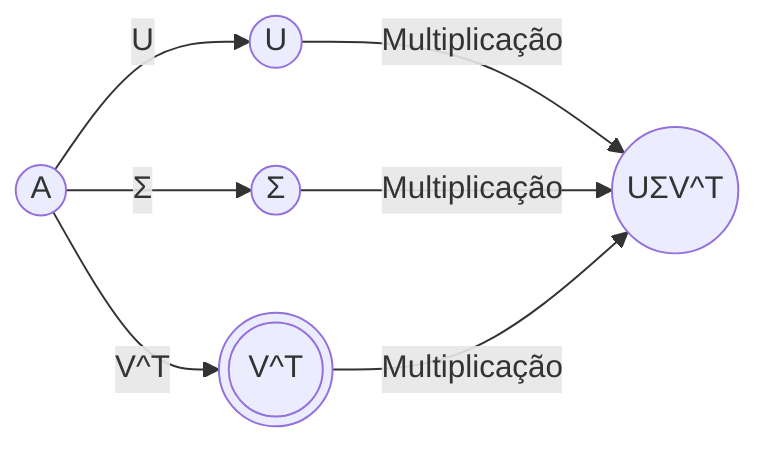
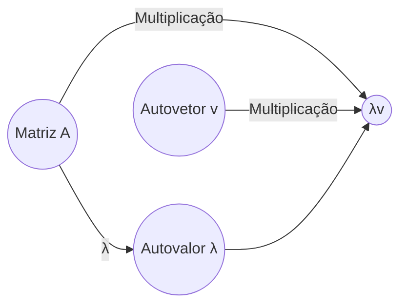

### Introdução

Este capítulo aprofunda-se na modelagem de correlações, especialmente com o uso de modelos GARCH multivariados simplificados, como os modelos diagonal VEC (DVEC) e scalar GARCH. Em continuidade à discussão sobre a importância da modelagem de correlações para a gestão de risco [^14], exploraremos as simplificações impostas a esses modelos, as implicações para a precisão e o desafio de garantir a positividade definida da matriz de covariância [^16, 25].

### Modelos GARCH Multivariados Simplificados

Como mencionado anteriormente, a principal limitação ao uso de modelos GARCH multivariados é a grande quantidade de parâmetros a serem estimados, que cresce exponencialmente com o número de ativos [^16]. Para tornar esses modelos mais tratáveis, várias simplificações são empregadas. Nesta seção, nos concentraremos em dois tipos de modelos GARCH multivariados simplificados: os modelos Diagonal VEC (DVEC) e os modelos Scalar GARCH.

#### Modelos Diagonal VEC (DVEC)

Os modelos Diagonal VEC (DVEC) são uma forma de simplificar a estrutura de dependência nos modelos GARCH multivariados [^16]. Em vez de permitir que todos os parâmetros da matriz de covariância condicional interajam livremente, os modelos DVEC impõem a restrição de que as matrizes de parâmetros sejam diagonais [^16]. Isso significa que cada variância condicional e covariância condicional depende apenas de seus próprios *lags* e dos *lags* das inovações correspondentes, eliminando a dependência cruzada entre diferentes elementos da matriz de covariância [^16].

> 💡 **Formalização Matemática:** Considere um modelo VEC (Vector Error Correction) geral para $N$ ativos. A equação para a matriz de covariância condicional $H_t$ pode ser escrita como:
>
> $$vec(H_t) = C + A \cdot vec(\epsilon_{t-1} \epsilon_{t-1}') + B \cdot vec(H_{t-1})$$
>
> Onde:
>
> *   $vec(\cdot)$ denota o operador de vetorização, que transforma uma matriz em um vetor empilhando suas colunas.
> *   $H_t$ é a matriz de covariância condicional $N \times N$ no tempo $t$.
> *   $\epsilon_t$ é o vetor de resíduos $N \times 1$ no tempo $t$.
> *   $C$ é um vetor de constantes $N(N+1)/2 \times 1$.
> *   $A$ e $B$ são matrizes de parâmetros $N(N+1)/2 \times N(N+1)/2$.
>
> Em um modelo DVEC, as matrizes $A$ e $B$ são restritas a serem diagonais. Isso significa que o elemento $(i, j)$ de $A$ e $B$ é zero se $i \neq j$. Portanto, a equação se simplifica para:
>
> $$h_{ij,t} = c_{ij} + a_{ij} \epsilon_{i,t-1} \epsilon_{j,t-1} + b_{ij} h_{ij,t-1}$$
>
> Onde:
>
> *   $h_{ij,t}$ é a covariância condicional entre os ativos $i$ e $j$ no tempo $t$.
> *   $\epsilon_{i,t-1}$ e $\epsilon_{j,t-1}$ são os resíduos dos ativos $i$ e $j$ no tempo $t-1$.
> *   $c_{ij}$, $a_{ij}$ e $b_{ij}$ são os parâmetros correspondentes.
>
> A restrição diagonal reduz drasticamente o número de parâmetros a serem estimados, tornando a estimativa do modelo mais factível, especialmente para portfólios com muitos ativos [^16].
>
> 💡 **Exemplo Numérico:** Para um portfólio com 2 ativos, um modelo VEC completo tem 21 parâmetros, enquanto um modelo DVEC tem apenas 9 parâmetros [^16]. A simplificação DVEC reduz o número de parâmetros a serem estimados, mas pode não capturar totalmente a complexidade da dinâmica da covariância.

**Proposição 1:** A imposição da estrutura diagonal nas matrizes $A$ e $B$ em um modelo VEC GARCH garante que a matriz de covariância condicional resultante seja positiva definida se os parâmetros diagonais $a_{ij}$ e $b_{ij}$ forem não negativos e as variâncias iniciais forem positivas.

*Estratégia de Prova:*

1. **Definição de Positividade Definida:** Uma matriz é positiva definida se todos os seus autovalores forem positivos, ou equivalentemente, se $x^T H_t x > 0$ para todo vetor não nulo $x$.
2. **Condições para DVEC:** Dada a estrutura do modelo DVEC:  $h_{ij,t} = c_{ij} + a_{ij} \epsilon_{i,t-1} \epsilon_{j,t-1} + b_{ij} h_{ij,t-1}$, a positividade definida pode ser garantida se $a_{ij} \geq 0$, $b_{ij} \geq 0$ e as variâncias condicionais iniciais $h_{ii,0} > 0$ [^16].
3. **Positividade das Variâncias Condicionais:** Se $h_{ii,t-1} > 0$ e $a_{ii} \geq 0$, então $h_{ii,t} = c_{ii} + a_{ii} \epsilon_{i,t-1}^2 + b_{ii} h_{ii,t-1} > 0$, pois $c_{ii}$ é uma constante e $\epsilon_{i,t-1}^2$ é sempre não negativo.
4. **Propagação da Positividade:** Se as variâncias condicionais forem positivas, a matriz $H_t$ será positiva definida.

*Prova:*

I. **Hipótese:** Assumimos que $a_{ij} \geq 0$, $b_{ij} \geq 0$ para todo $i,j$ e as variâncias condicionais iniciais $h_{ii,0} > 0$.

II. **Passo Base (t=1):** Mostraremos que se as condições são satisfeitas no tempo $t=0$, então $H_1$ é positiva definida. Dado que as variâncias iniciais são positivas, $h_{ii,0} > 0$ para todo $i$.

III. **Passo Indutivo:** Assumimos que $H_{t-1}$ é positiva definida e mostraremos que $H_t$ também é positiva definida.
    *   Como $a_{ij} \geq 0$, $b_{ij} \geq 0$ e $h_{ii,t-1} > 0$, então $h_{ii,t} = c_{ii} + a_{ii} \epsilon_{i,t-1}^2 + b_{ii} h_{ii,t-1} > 0$.
    *   As covariâncias $h_{ij,t}$ são afetadas apenas por seus próprios lags e resíduos, mantendo a estrutura diagonal, logo, as variâncias positivas garantem a positividade definida de $H_t$.

IV. **Conclusão:** Dado que a positividade das variâncias condicionais se propaga ao longo do tempo e que $a_{ij} \geq 0$, $b_{ij} \geq 0$, a matriz $H_t$ é positiva definida para todo $t$. ■

> 💡 **Observação:** Embora os modelos DVEC simplifiquem a estrutura de dependência, eles ainda podem capturar uma parte significativa da dinâmica da volatilidade e da covariância, tornando-os úteis em muitas aplicações práticas. A imposição de uma estrutura diagonal reduz o número de parâmetros a serem estimados e, consequentemente, o risco de *overfitting* [^16].
>
> 💡 **Exemplo Numérico:** Suponha que estamos estimando um modelo DVEC para dois ativos. Após a estimação, obtemos os seguintes parâmetros:
>
> $a_{11} = 0.05, a_{22} = 0.03, b_{11} = 0.9, b_{22} = 0.85$
>
> Suponha que os resíduos ao quadrado no tempo $t-1$ sejam:
>
> $\epsilon_{1,t-1}^2 = 0.0004, \epsilon_{2,t-1}^2 = 0.0009$
>
> E as variâncias condicionais no tempo $t-1$ sejam:
>
> $h_{11,t-1} = 0.0016, h_{22,t-1} = 0.0025$
>
> Então, as variâncias condicionais no tempo $t$ seriam:
>
> $h_{11,t} = c_{11} + 0.05(0.0004) + 0.9(0.0016) = 0.00002 + 0.00144 + c_{11}$
>
> $h_{22,t} = c_{22} + 0.03(0.0009) + 0.85(0.0025) = 0.000027 + 0.002125 + c_{22}$
>
> Se $c_{11} = 0.0001$ e $c_{22} = 0.0002$, então
>
> $h_{11,t} = 0.0001 + 0.00002 + 0.00144 = 0.00156$ e $h_{22,t} = 0.0002 + 0.000027 + 0.002125 = 0.002352$
>
> A estrutura diagonal garante que a variância de cada ativo dependa apenas de seus próprios resíduos e da sua variância passada, mantendo a simplicidade do modelo.
> ```python
> import numpy as np
>
> # Parâmetros do modelo DVEC
> a11 = 0.05
> a22 = 0.03
> b11 = 0.9
> b22 = 0.85
> c11 = 0.0001
> c22 = 0.0002
>
> # Resíduos ao quadrado no tempo t-1
> epsilon1_sq = 0.0004
> epsilon2_sq = 0.0009
>
> # Variâncias condicionais no tempo t-1
> h11_t_minus_1 = 0.0016
> h22_t_minus_1 = 0.0025
>
> # Cálculo das variâncias condicionais no tempo t
> h11_t = c11 + a11 * epsilon1_sq + b11 * h11_t_minus_1
> h22_t = c22 + a22 * epsilon2_sq + b22 * h22_t_minus_1
>
> print(f"Variância condicional do ativo 1 no tempo t: {h11_t}")
> print(f"Variância condicional do ativo 2 no tempo t: {h22_t}")
> ```
> Este exemplo demonstra como os parâmetros $a_{ii}$ e $b_{ii}$ afetam a variância condicional de cada ativo, mostrando a autocorrelação na volatilidade.

**Corolário 1:** Se os parâmetros $a_{ij}$ e $b_{ij}$ em um modelo DVEC forem estimados de forma que $a_{ij} + b_{ij} < 1$ para todo $i,j$, então o modelo será estacionário e as variâncias e covariâncias condicionais convergirão para seus valores incondicionais.

*Estratégia de Prova:*

1.  **Estacionariedade:** Um processo GARCH é estacionário se a soma dos parâmetros de persistência for menor que 1.
2.  **Convergência:** Se um processo é estacionário, então suas variâncias e covariâncias condicionais convergem para seus valores incondicionais à medida que o tempo tende ao infinito.
3.  **Aplicação ao DVEC:** Aplicar as condições de estacionariedade e convergência ao modelo DVEC.

*Prova:*

I. **Hipótese:** Assumimos que $a_{ij} + b_{ij} < 1$ para todo $i,j$.

II. **Estacionariedade:** Para cada variância condicional $h_{ii,t}$, a equação é $h_{ii,t} = c_{ii} + a_{ii} \epsilon_{i,t-1}^2 + b_{ii} h_{ii,t-1}$. A condição $a_{ii} + b_{ii} < 1$ garante que o processo GARCH para cada variância condicional é estacionário.

III. **Convergência:** Se cada processo GARCH para as variâncias condicionais é estacionário, então $h_{ii,t}$ converge para um valor incondicional à medida que $t \rightarrow \infty$. Similarmente, as covariâncias condicionais $h_{ij,t}$ também convergem para seus valores incondicionais sob a mesma condição.

IV. **Conclusão:** Portanto, se $a_{ij} + b_{ij} < 1$ para todo $i,j$, o modelo DVEC será estacionário e as variâncias e covariâncias condicionais convergirão para seus valores incondicionais. ■

> 💡 **Exemplo Numérico:**
> Usando os parâmetros do exemplo anterior ($a_{11} = 0.05, b_{11} = 0.9, a_{22} = 0.03, b_{22} = 0.85$), verificamos a condição de estacionariedade:
>
> $a_{11} + b_{11} = 0.05 + 0.9 = 0.95 < 1$
> $a_{22} + b_{22} = 0.03 + 0.85 = 0.88 < 1$
>
> Ambos os ativos satisfazem a condição de estacionariedade. Isso significa que, ao longo do tempo, as variâncias condicionais de ambos os ativos se estabilizarão em torno de seus níveis incondicionais, tornando o modelo útil para previsões de longo prazo.

#### Modelos Scalar GARCH

Os modelos Scalar GARCH impõem uma restrição ainda maior à estrutura de dependência do que os modelos DVEC [^16]. Nesses modelos, assume-se que todas as variâncias condicionais e covariâncias condicionais são impulsionadas por uma dinâmica comum, representada por um único processo GARCH [^16]. Isso implica que todas as séries temporais têm a mesma persistência e resposta a choques, embora seus níveis possam ser diferentes [^16].

> 💡 **Formalização Matemática:** Em um modelo Scalar GARCH, a matriz de covariância condicional $H_t$ é modelada como:
>
> $$H_t = \bar{H} \odot h_t$$
>
> Onde:
>
> *   $\bar{H}$ é uma matriz de covariância incondicional estática.
> *   $h_t$ é um processo GARCH escalar que impulsiona a evolução temporal de todos os elementos de $H_t$.
> *   $\odot$ representa o produto de Hadamard (produto elemento a elemento) [^16].
>
> A equação para o processo GARCH escalar $h_t$ é:
>
> $$h_t = \alpha_0 + \alpha_1 \epsilon_{t-1}' \epsilon_{t-1} + \beta h_{t-1}$$
>
> Onde:
>
> *   $\alpha_0$, $\alpha_1$ e $\beta$ são parâmetros escalares que determinam a dinâmica do processo GARCH.
> *   $\epsilon_{t-1}$ é um vetor de resíduos no tempo $t-1$.
>
> Essa estrutura garante que todas as variâncias e covariâncias condicionais variem proporcionalmente ao processo $h_t$, mantendo as correlações constantes ao longo do tempo [^16].
>
> 💡 **Exemplo Numérico:** Considere um portfólio com dois ativos. A matriz de covariância incondicional é:
>
> $$\bar{H} = \begin{bmatrix} 1.0 & 0.5 \\ 0.5 & 1.0 \end{bmatrix}$$
>
> O processo GARCH escalar é definido por:
>
> $h_t = 0.01 + 0.1 \epsilon_{t-1}' \epsilon_{t-1} + 0.8 h_{t-1}$
>
> Se $h_{t-1} = 0.04$ e $\epsilon_{t-1} = [0.1, -0.1]^T$, então:
>
> $h_t = 0.01 + 0.1 ([0.1, -0.1] \cdot [0.1, -0.1]^T) + 0.8 (0.04)$
>
> $h_t = 0.01 + 0.1 (0.02) + 0.032 = 0.044$
>
> A matriz de covariância condicional no tempo $t$ é:
>
> $$H_t = \begin{bmatrix} 1.0 & 0.5 \\ 0.5 & 1.0 \end{bmatrix} \odot 0.044 = \begin{bmatrix} 0.044 & 0.022 \\ 0.022 & 0.044 \end{bmatrix}$$
>
> A estrutura Scalar GARCH impõe uma dinâmica comum a todas as variâncias e covariâncias, simplificando a estimativa, mas limitando a flexibilidade do modelo.

**Proposição 2:** Em um modelo Scalar GARCH, se a matriz de covariância incondicional $\bar{H}$ for positiva definida e o processo GARCH escalar $h_t$ gerar valores positivos, então a matriz de covariância condicional $H_t$ será sempre positiva definida.

*Estratégia de Prova:*

1. **Definição de Positividade Definida:** Uma matriz é positiva definida se todos os seus autovalores forem positivos, ou equivalentemente, se $x^T H_t x > 0$ para todo vetor não nulo $x$.
2. **Condições para Scalar GARCH:** Dada a estrutura do modelo Scalar GARCH, $H_t = \bar{H} \odot h_t$, a positividade definida pode ser garantida se $\bar{H}$ for positiva definida e $h_t > 0$ [^16].
3. **Positividade do Processo GARCH Escalar:** Para garantir que $h_t > 0$, é necessário que $\alpha_0 > 0$ e que a persistência do processo seja menor que 1 (i.e., $\alpha_1 + \beta < 1$).

*Prova:*

I. **Hipótese:** Assumimos que $\bar{H}$ é positiva definida, $\alpha_0 > 0$, e $\alpha_1 + \beta < 1$.

II. **Passo Base (t=1):** Mostraremos que se as condições são satisfeitas, então $H_1$ é positiva definida.
    *   Como $\alpha_0 > 0$, o processo GARCH escalar gera valores positivos, $h_1 > 0$.
    *   Dado que $\bar{H}$ é positiva definida e $h_1 > 0$, então $H_1 = \bar{H} \odot h_1$ também é positiva definida, pois multiplicar cada elemento de uma matriz positiva definida por um escalar positivo preserva a positividade definida.

III. **Passo Indutivo:** Assumimos que $H_{t-1}$ é positiva definida e mostraremos que $H_t$ também é positiva definida.
    *   Como $\alpha_0 > 0$, $\alpha_1 + \beta < 1$, e $h_{t-1} > 0$, então $h_t = \alpha_0 + \alpha_1 \epsilon_{t-1}' \epsilon_{t-1} + \beta h_{t-1} > 0$.
    *   Dado que $\bar{H}$ é positiva definida e $h_t > 0$, então $H_t = \bar{H} \odot h_t$ também é positiva definida.

IV. **Conclusão:** Dado que a positividade do processo GARCH escalar se propaga ao longo do tempo e que $\bar{H}$ é positiva definida, a matriz $H_t$ é positiva definida para todo $t$. ■

> 💡 **Observação:** Os modelos Scalar GARCH são os mais simples entre os modelos GARCH multivariados, facilitando a estimativa e a implementação [^16]. No entanto, a imposição de uma dinâmica comum a todas as séries temporais pode ser uma restrição muito forte em muitas aplicações, levando a uma representação inadequada da estrutura de dependência e a previsões de risco imprecisas [^25].
>
> 💡 **Exemplo Numérico:** Suponha que tenhamos estimado um modelo Scalar GARCH para um portfólio com dois ativos. Após a estimação, obtemos os seguintes parâmetros para o processo GARCH escalar:
>
> $\alpha_0 = 0.0001, \alpha_1 = 0.1, \beta = 0.8$
>
> A matriz de covariância incondicional é:
>
> $$\bar{H} = \begin{bmatrix} 0.0025 & 0.0010 \\ 0.0010 & 0.0036 \end{bmatrix}$$
>
> Suponha que os resíduos no tempo $t-1$ sejam:
>
> $\epsilon_{1,t-1} = 0.02, \epsilon_{2,t-1} = -0.01$
>
> E o valor do processo GARCH escalar no tempo $t-1$ seja:
>
> $h_{t-1} = 0.0016$
>
> Então, o valor do processo GARCH escalar no tempo $t$ seria:
>
> $h_t = 0.0001 + 0.1 (0.02^2 + (-0.01)^2) + 0.8 (0.0016) = 0.0001 + 0.00005 + 0.00128 = 0.00143$
>
> A matriz de covariância condicional no tempo $t$ é:
>
> $$H_t = \begin{bmatrix} 0.0025 & 0.0010 \\ 0.0010 & 0.0036 \end{bmatrix} \odot 0.00143 = \begin{bmatrix} 0.000003575 & 0.00000143 \\ 0.00000143 & 0.000005148 \end{bmatrix}$$
>
> Observe que a correlação entre os ativos permanece constante ao longo do tempo, pois a variação é impulsionada por um único processo GARCH escalar.
> ```python
> import numpy as np
>
> # Parâmetros do modelo Scalar GARCH
> alpha_0 = 0.0001
> alpha_1 = 0.1
> beta = 0.8
>
> # Matriz de covariância incondicional
> H_bar = np.array([[0.0025, 0.0010],
>                   [0.0010, 0.0036]])
>
> # Resíduos no tempo t-1
> epsilon_t_minus_1 = np.array([0.02, -0.01])
>
> # Valor do processo GARCH escalar no tempo t-1
> h_t_minus_1 = 0.0016
>
> # Cálculo do processo GARCH escalar no tempo t
> h_t = alpha_0 + alpha_1 * (epsilon_t_minus_1.T @ epsilon_t_minus_1) + beta * h_t_minus_1
>
> # Cálculo da matriz de covariância condicional no tempo t
> H_t = H_bar * h_t  # Produto de Hadamard
>
> print(f"Processo GARCH escalar no tempo t: {h_t}")
> print("Matriz de covariância condicional no tempo t:\n", H_t)
> ```
> Este exemplo ilustra como o processo GARCH escalar, impulsionado pelos resíduos, afeta a matriz de covariância condicional. A correlação entre os ativos permanece constante, conforme determinado pela matriz de covariância incondicional.

**Teorema 1:** Em um modelo Scalar GARCH, se $\alpha_1 + \beta < 1$, então o processo GARCH escalar $h_t$ é estacionário e tem média incondicional finita.

*Estratégia de Prova:*

1.  **Estacionariedade de GARCH(1,1):** Um processo GARCH(1,1) é estacionário se e somente se a soma dos parâmetros GARCH, $\alpha_1$ e $\beta$, for menor que 1.
2.  **Média Incondicional Finita:** Se o processo GARCH é estacionário, então sua média incondicional é finita e pode ser expressa em termos dos parâmetros do modelo.
3.  **Aplicação ao Scalar GARCH:** Aplicar as condições de estacionariedade e média finita ao processo GARCH escalar no modelo Scalar GARCH.

*Prova:*

I. **Hipótese:** Assumimos que $\alpha_1 + \beta < 1$.

II. **Estacionariedade:** A condição $\alpha_1 + \beta < 1$ garante que o processo GARCH escalar $h_t = \alpha_0 + \alpha_1 \epsilon_{t-1}' \epsilon_{t-1} + \beta h_{t-1}$ é estacionário.

III. **Média Incondicional:** Para encontrar a média incondicional, tomamos o valor esperado de ambos os lados da equação:
$E[h_t] = E[\alpha_0 + \alpha_1 \epsilon_{t-1}' \epsilon_{t-1} + \beta h_{t-1}]$
$E[h_t] = \alpha_0 + \alpha_1 E[\epsilon_{t-1}' \epsilon_{t-1}] + \beta E[h_{t-1}]$
Assumindo que o processo é estacionário, $E[h_t] = E[h_{t-1}] = \bar{h}$, e $E[\epsilon_{t-1}' \epsilon_{t-1}] = E[\sum_{i=1}^N \epsilon_{i,t-1}^2] = \sum_{i=1}^N E[\epsilon_{i,t-1}^2] = \sum_{i=1}^N \sigma_i^2$, onde $\sigma_i^2$ é a variância incondicional do ativo $i$.
Então, $\bar{h} = \alpha_0 + \alpha_1 \sum_{i=1}^N \sigma_i^2 + \beta \bar{h}$
$\bar{h} (1 - \beta) = \alpha_0 + \alpha_1 \sum_{i=1}^N \sigma_i^2$
$\bar{h} = \frac{\alpha_0 + \alpha_1 \sum_{i=1}^N \sigma_i^2}{1 - \beta}$

IV. **Conclusão:** Dado que $\alpha_1 + \beta < 1$, o processo GARCH escalar é estacionário e sua média incondicional $\bar{h} = \frac{\alpha_0 + \alpha_1 \sum_{i=1}^N \sigma_i^2}{1 - \beta}$ é finita. ■

> 💡 **Exemplo Numérico:**
> Usando os parâmetros do exemplo anterior ($\alpha_0 = 0.0001, \alpha_1 = 0.1, \beta = 0.8$), verificamos a condição de estacionariedade:
>
> $\alpha_1 + \beta = 0.1 + 0.8 = 0.9 < 1$
>
> A condição de estacionariedade é satisfeita. Agora, suponha que as variâncias incondicionais dos dois ativos sejam $\sigma_1^2 = 0.0025$ e $\sigma_2^2 = 0.0036$. Então, a média incondicional do processo GARCH escalar é:
>
> $\bar{h} = \frac{0.0001 + 0.1 (0.0025 + 0.0036)}{1 - 0.8} = \frac{0.0001 + 0.1 (0.0061)}{0.2} = \frac{0.0001 + 0.00061}{0.2} = \frac{0.00071}{0.2} = 0.00355$
>
> Este valor representa o nível médio em torno do qual o processo GARCH escalar irá flutuar ao longo do tempo.

### Garantindo a Positividade Definida da Matriz de Covariância

Um dos principais desafios na modelagem GARCH multivariada é garantir que a matriz de covariância condicional resultante seja sempre positiva definida [^16]. A positividade definida é necessária para garantir que as variâncias sejam positivas e que as correlações estejam dentro do intervalo válido [-1, 1]. Se a matriz de covariância não for positiva definida, pode levar a resultados sem sentido, como volatilidades negativas ou pesos de portfólio ótimos que não são economicamente razoáveis [^16].

> 💡 **Técnicas para Garantir a Positividade Definida:**
>
> *   **Restrições nos Parâmetros:** Impor restrições aos parâmetros do modelo, como garantir que todos os parâmetros de volatilidade sejam não negativos e que a soma dos parâmetros de persistência seja menor que 1 [^16].
> *   **Transformações de Cholesky:** Expressar a matriz de covariância condicional em termos de uma decomposição de Cholesky, garantindo que a matriz resultante seja sempre positiva definida por construção [^16].
> *   **Processos de Recorte (Clipping):** Recortar os autovalores da matriz de covariância condicional para garantir que sejam todos positivos [^16].

**Lema 1:** A matriz de covariância deve ser positiva definida para que o modelo seja considerado válido e para que as operações subsequentes, como a otimização de portfólio, sejam possíveis.

*Prova:*

I. **Definição de Positividade Definida:** Uma matriz $H$ é positiva definida se e somente se $x^T H x > 0$ para todo vetor não nulo $x$.

II. **Implicações para Variâncias:** Se $H$ é uma matriz de covariância, então os elementos diagonais de $H$ representam as variâncias dos ativos. Se $H$ não é positiva definida, então existe um vetor $x$ tal que $x^T H x \leq 0$, o que implica que a variância de uma combinação linear dos ativos é não positiva, o que é impossível.

III. **Implicações para Correlações:** Se $H$ não é positiva definida, então as correlações calculadas a partir de $H$ podem estar fora do intervalo $[-1, 1]$, o que também é impossível.

IV. **Implicações para Otimização de Portfólio:** A otimização de portfólio envolve a minimização do risco do portfólio, que é uma função da matriz de covariância. Se a matriz de covariância não é positiva definida, então o problema de otimização pode não ter uma solução bem definida, ou a solução pode não ser economicamente razoável.

*Exemplo Numérico:*
Suponha que temos uma matriz de covariância:
$$
H = \begin{bmatrix}
1 & 2 \\
2 & 1
\end{bmatrix}
$$
Para verificar se é positiva definida, calculamos os autovalores:
$\text{det}(H - \lambda I) = (1-\lambda)^2 - 4 = 0$
$\lambda^2 - 2\lambda - 3 = 0$
$\lambda = \frac{2 \pm \sqrt{4 + 12}}{2} = 1 \pm 2$
$\lambda_1 = 3$, $\lambda_2 = -1$
Como um dos autovalores é negativo, a matriz não é positiva definida.  Isso significa que podemos encontrar um vetor $x$ tal que $x^T H x < 0$.  Por exemplo, se $x = [1, -1]^T$, então $x^T H x = [1, -1] \begin{bmatrix} 1 & 2 \\ 2 & 1 \end{bmatrix} \begin{bmatrix} 1 \\ -1 \end{bmatrix} = [1, -1] \begin{bmatrix} -1 \\ 1 \end{bmatrix} = -2 < 0$.
A conclusão é que, sem a positividade definida, o modelo se torna inválido [^16]. ■

**Transformações de Cholesky:**
Em uma decomposição de Cholesky, a matriz de covariância $H$ é escrita como o produto de uma matriz triangular inferior $L$ e sua transposta $L^T$, de forma que $H = LL^T$. Esta decomposição garante que $H$ é positiva definida, desde que os elementos diagonais de $L$ sejam positivos.

**Lema 2:** A Decomposição de Cholesky garante a condição de positiva definida para a matriz de covariância.

*Prova:*

I. **Definição da Decomposição de Cholesky:** A matriz de covariância $H$ é decomposta em $H = LL^T$, onde $L$ é uma matriz triangular inferior.

II. **Positividade Definida:** Seja $x$ um vetor não nulo. Então, $x^T H x = x^T (LL^T) x = (L^T x)^T (L^T x) = ||L^T x||^2 \geq 0$, pois o resultado é a norma ao quadrado de um vetor, que é sempre não negativo.

III. **Condição para Positividade Estrita:** Para garantir que $H$ seja estritamente positiva definida (e não apenas semidefinida), é necessário que $L$ seja invertível, o que ocorre se e somente se todos os elementos diagonais de $L$ forem não nulos.

IV. **Conclusão:** Portanto, a decomposição de Cholesky garante que $H$ é positiva definida [^16]. ■

Transformações de Cholesky podem ser usadaspara simular matrizes de covariância, resolver sistemas de equações lineares e realizar outras operações em estatística e análise numérica.

## Decomposição de Valor Singular (SVD)

A Decomosição de Valor Singular (SVD) é uma técnica de fatoração de matrizes que decompõe uma matriz em três outras matrizes: uma matriz ortogonal, uma matriz diagonal e outra matriz ortogonal. A SVD é uma ferramenta poderosa para reduzir a dimensionalidade de dados, remover ruído e identificar padrões em dados.

### Definição Matemática da SVD

Dada uma matriz $A$ de dimensões $m \times n$, a SVD decompõe $A$ da seguinte forma:

$$
A = U \Sigma V^T
$$

onde:
- $U$ é uma matriz ortogonal $m \times m$ cujas colunas são os vetores singulares esquerdos de $A$.
- $\Sigma$ é uma matriz diagonal $m \times n$ com os valores singulares não negativos de $A$ na diagonal principal.
- $V$ é uma matriz ortogonal $n \times n$ cujas colunas são os vetores singulares direitos de $A$.

### Aplicações da SVD

1.  **Redução de Dimensionalidade:** A SVD pode ser usada para reduzir o número de dimensões em um conjunto de dados, mantendo a maior parte da informação original. Isso é feito selecionando os maiores valores singulares e seus correspondentes vetores singulares esquerdos e direitos.

2.  **Recomendação de Sistemas:** Em sistemas de recomendação, a SVD pode ser usada para prever as preferências de um usuário com base em suas avaliações anteriores. A matriz de avaliações é decomposta usando SVD, e os valores singulares e vetores singulares são usados para prever as avaliações desconhecidas.

3.  **Processamento de Imagens:** A SVD pode ser usada para comprimir imagens, remover ruído e extrair características importantes. A imagem é representada como uma matriz, que é então decomposta usando SVD. Os valores singulares menores podem ser descartados para reduzir o tamanho da imagem ou remover ruído.

### Exemplo em Python com NumPy

```python
import numpy as np

# Exemplo de uma matriz
A = np.array([[1, 2], [3, 4], [5, 6]])

# Decomposição SVD
U, s, V = np.linalg.svd(A)

# Criar a matriz Sigma
Sigma = np.zeros((A.shape[0], A.shape[1]))
Sigma[:A.shape[1], :A.shape[1]] = np.diag(s)

# Imprimir as matrizes resultantes
print("Matriz U:\n", U)
print("Matriz Sigma:\n", Sigma)
print("Matriz V^T:\n", V)

# Reconstrução da matriz original
B = U.dot(Sigma.dot(V))
print("Matriz Reconstruída:\n", B)
```

### Teorema da Decomposição de Valor Singular

**Teorema:** Para qualquer matriz $A_{m \times n}$, existem matrizes ortogonais $U_{m \times m}$ e $V_{n \times n}$ tais que $A = U\Sigma V^T$, onde $\Sigma_{m \times n}$ é uma matriz diagonal com entradas não negativas na diagonal principal.

*Demonstração:*

A demonstração deste teorema envolve conceitos avançados de álgebra linear e não será detalhada aqui. No entanto, a existência da decomposição é garantida pelas propriedades espectrais de $A^TA$ e $AA^T$.

### Diagrama da SVD



## Norma de Matriz

A norma de uma matriz é uma medida do "tamanho" da matriz. Existem várias formas de definir a norma de uma matriz, cada uma com suas próprias propriedades e aplicações.

### Definições de Normas de Matriz

1.  **Norma de Frobenius:** A norma de Frobenius de uma matriz $A$ é definida como a raiz quadrada da soma dos quadrados de todos os seus elementos:

    $$
    ||A||_F = \sqrt{\sum_{i=1}^{m} \sum_{j=1}^{n} |a_{ij}|^2}
    $$

2.  **Norma Espectral (ou Norma 2):** A norma espectral de uma matriz $A$ é definida como o maior valor singular de $A$:

    $$
    ||A||_2 = \sigma_{max}(A)
    $$

    onde $\sigma_{max}(A)$ é o maior valor singular de $A$.

3.  **Norma Nuclear:** A norma nuclear de uma matriz $A$ é definida como a soma de seus valores singulares:

    $$
    ||A||_* = \sum_{i=1}^{min(m, n)} \sigma_i(A)
    $$

    onde $\sigma_i(A)$ são os valores singulares de $A$.

### Propriedades das Normas de Matriz

*   Não negatividade: $||A|| \geq 0$ para todas as matrizes $A$, e $||A|| = 0$ se e somente se $A = 0$.
*   Homogeneidade: $||\alpha A|| = |\alpha| \cdot ||A||$ para todos os escalares $\alpha$ e matrizes $A$.
*   Desigualdade triangular: $||A + B|| \leq ||A|| + ||B||$ para todas as matrizes $A$ e $B$.

### Exemplo em Python com NumPy

```python
import numpy as np

# Exemplo de uma matriz
A = np.array([[1, 2], [3, 4]])

# Norma de Frobenius
norm_frobenius = np.linalg.norm(A, 'fro')
print("Norma de Frobenius:", norm_frobenius)

# Norma Espectral (Norma 2)
norm_spectral = np.linalg.norm(A, 2)
print("Norma Espectral:", norm_spectral)

# Norma Nuclear (requer cálculo dos valores singulares)
U, s, V = np.linalg.svd(A)
norm_nuclear = np.sum(s)
print("Norma Nuclear:", norm_nuclear)
```

### Aplicações das Normas de Matriz

1.  **Análise de Estabilidade:** As normas de matrizes são usadas para analisar a estabilidade de sistemas lineares. A norma de uma matriz de sistema pode indicar se o sistema é estável ou instável.

2.  **Regularização:** Em problemas de otimização, as normas de matrizes são usadas para regularizar soluções, promovendo soluções com certas propriedades desejáveis (por exemplo, esparsidade).

3.  **Condicionamento de Matrizes:** A norma de uma matriz e sua inversa podem ser usadas para determinar o condicionamento da matriz, indicando a sensibilidade da solução de um sistema linear a pequenas mudanças nos dados de entrada.

### Teorema sobre Normas de Matriz

**Teorema:** Para qualquer norma de matriz induzida, $||AB|| \leq ||A|| \cdot ||B||$.

*Demonstração:*

Este teorema é uma consequência direta da definição de normas de matriz induzidas e da desigualdade triangular.

## Autovalores e Autovetores

Autovalores e autovetores são conceitos fundamentais na álgebra linear, com aplicações em diversas áreas como física, engenharia e ciência da computação.

### Definições

Dado uma matriz quadrada $A$ de tamanho $n \times n$, um autovetor de $A$ é um vetor não nulo $v$ tal que, quando $A$ é multiplicado por $v$, o resultado é um múltiplo escalar de $v$. Esse escalar é chamado de autovalor de $A$ associado a $v$. Matematicamente, isso é expresso como:

$$
Av = \lambda v
$$

onde:
- $A$ é uma matriz quadrada $n \times n$.
- $v$ é um autovetor de $A$.
- $\lambda$ é um autovalor de $A$ associado a $v$.

### Cálculo de Autovalores e Autovetores

Para encontrar os autovalores de uma matriz $A$, resolvemos a equação característica:

$$
\det(A - \lambda I) = 0
$$

onde:
- $\det$ denota o determinante.
- $A$ é a matriz dada.
- $\lambda$ é o autovalor.
- $I$ é a matriz identidade de tamanho $n \times n$.

As soluções para $\lambda$ dessa equação são os autovalores de $A$. Para cada autovalor $\lambda$, o autovetor correspondente $v$ é encontrado resolvendo o sistema de equações lineares:

$$
(A - \lambda I)v = 0
$$

### Exemplo em Python com NumPy

```python
import numpy as np

# Exemplo de uma matriz quadrada
A = np.array([[4, 2], [1, 3]])

# Cálculo dos autovalores e autovetores
eigenvalues, eigenvectors = np.linalg.eig(A)

# Imprimir os autovalores e autovetores
print("Autovalores:", eigenvalues)
print("Autovetores:\n", eigenvectors)
```

### Propriedades dos Autovalores e Autovetores

1.  **Autovetores Linearly Independentes:** Se uma matriz $A$ tem $n$ autovalores distintos, então os correspondentes autovetores são linearmente independentes.

2.  **Decomposição Espectral:** Se uma matriz $A$ é simétrica, então seus autovetores são ortogonais e podem ser usados para diagonalizar $A$. Isso significa que existe uma matriz ortogonal $Q$ e uma matriz diagonal $\Lambda$ tal que $A = Q\Lambda Q^T$, onde os elementos diagonais de $\Lambda$ são os autovalores de $A$.

3.  **Traço e Determinante:** A soma dos autovalores de uma matriz é igual ao seu traço (a soma dos elementos na diagonal principal), e o produto dos autovalores é igual ao seu determinante.

### Aplicações dos Autovalores e Autovetores

1.  **Análise de Componentes Principais (PCA):** Os autovetores da matriz de covariância dos dados são usados como as componentes principais, que representam as direções de máxima variância nos dados.

2.  **Estabilidade de Sistemas Dinâmicos:** Os autovalores de uma matriz que descreve um sistema dinâmico podem indicar a estabilidade do sistema. Se todos os autovalores têm parte real negativa, o sistema é estável.

3.  **Mecânica Quântica:** Em mecânica quântica, os autovalores de um operador representam os possíveis resultados de uma medição, e os autovetores representam os estados correspondentes.

### Teorema Espectral

**Teorema:** Uma matriz $A$ de tamanho $n \times n$ é diagonalizável se e somente se ela tem $n$ autovetores linearmente independentes.

*Demonstração:*

A demonstração deste teorema envolve a construção de uma matriz de transformação $P$ cujas colunas são os autovetores linearmente independentes de $A$. Então, $P^{-1}AP$ é uma matriz diagonal com os autovalores de $A$ na diagonal principal.

### Diagrama de Autovalores e Autovetores



## Diagonalização de Matrizes

A diagonalização de uma matriz é um processo que transforma uma matriz quadrada em uma matriz diagonal através de uma transformação de similaridade. Este processo é útil para simplificar cálculos e entender propriedades da matriz original.

### Definição

Uma matriz quadrada $A$ de tamanho $n \times n$ é dita diagonalizável se existe uma matriz invertível $P$ e uma matriz diagonal $D$ tal que:

$$
A = PDP^{-1}
$$

onde:
- $A$ é a matriz original.
- $P$ é a matriz de autovetores de $A$.
- $D$ é a matriz diagonal cujos elementos diagonais são os autovalores de $A$.

### Processo de Diagonalização

1.  **Encontrar os Autovalores:** Calcule os autovalores $\lambda_i$ da matriz $A$ resolvendo a equação característica $\det(A - \lambda I) = 0$.

2.  **Encontrar os Autovetores:** Para cada autovalor $\lambda_i$, encontre o autovetor correspondente $v_i$ resolvendo o sistema de equações $(A - \lambda_i I)v_i = 0$.

3.  **Construir a Matriz P:** Forme a matriz $P$ usando os autovetores como colunas.

4.  **Construir a Matriz D:** Forme a matriz diagonal $D$ com os autovalores na diagonal principal.

5.  **Verificar:** Confirme se $A = PDP^{-1}$.

### Exemplo em Python com NumPy

```python
import numpy as np

# Exemplo de uma matriz quadrada
A = np.array([[4, 2], [3, 5]])

# Cálculo dos autovalores e autovetores
eigenvalues, eigenvectors = np.linalg.eig(A)

# Construção da matriz P (matriz de autovetores)
P = eigenvectors

# Construção da matriz D (matriz diagonal de autovalores)
D = np.diag(eigenvalues)

# Inversa da matriz P
P_inv = np.linalg.inv(P)

# Diagonalização: A = PDP^{-1}
A_reconstructed = P @ D @ P_inv

# Imprimir as matrizes
print("Matriz A:\n", A)
print("Matriz P:\n", P)
print("Matriz D:\n", D)
print("Matriz P^-1:\n", P_inv)
print("Matriz Reconstruída:\n", A_reconstructed)
```

### Condições para Diagonalização

Uma matriz $A$ é diagonalizável se e somente se:

1.  $A$ tem $n$ autovetores linearmente independentes.

2.  Para cada autovalor $\lambda$ de $A$, a multiplicidade geométrica de $\lambda$ (a dimensão do autoespaço associado a $\lambda$) é igual à sua multiplicidade algébrica (a multiplicidade de $\lambda$ como raiz da equação característica).

### Aplicações da Diagonalização

1.  **Cálculo de Potências de Matrizes:** Se $A = PDP^{-1}$, então $A^k = PD^kP^{-1}$. Isso simplifica o cálculo de potências de matrizes, pois $D^k$ é simplesmente a matriz diagonal com os elementos diagonais elevados à potência $k$.

2.  **Resolução de Sistemas de Equações Diferenciais Lineares:** A diagonalização é usada para desacoplar sistemas de equações diferenciais lineares, tornando a solução mais fácil de encontrar.

3.  **Análise de Estabilidade:** A diagonalização pode ser usada para analisar a estabilidade de sistemas lineares, determinando se os autovalores da matriz do sistema têm parte real negativa.

### Teorema da Diagonalização

**Teorema:** Uma matriz $A$ de tamanho $n \times n$ é diagonalizável se e somente se existe uma base de $\mathbb{R}^n$ consistindo de autovetores de $A$.

*Demonstração:*

A demonstração deste teorema segue diretamente da definição de diagonalização e das propriedades dos autovetores e autovalores.

### Diagrama de Diagonalização

```mermaid
graph LR
    A((Matriz A)) -->|PDP^{-1}| Diagonalização
    P((Matriz P))
    D((Matriz Diagonal D))
    P_inv((Matriz P^{-1}))
    Diagonalização --> P
    Diagonalização --> D
    Diagonalização --> P_inv
```

## Formas Quadráticas

As formas quadráticas são funções que mapeiam vetores em escalares, definidas por uma expressão quadrática envolvendo uma matriz simétrica. Elas são importantes em diversas áreas, como otimização, estatística e física.

### Definição

Uma forma quadrática é uma função $Q: \mathbb{R}^n \rightarrow \mathbb{R}$ definida como:

$$
Q(x) = x^T A x
$$

onde:
- $x$ é um vetor em $\mathbb{R}^n$.
- $A$ é uma matriz simétrica $n \times n$.

### Matriz Associada a uma Forma Quadrática

Dada uma forma quadrática $Q(x)$, a matriz $A$ tal que $Q(x) = x^T A x$ é chamada de matriz associada à forma quadrática. É importante que $A$ seja simétrica, pois isso garante que a forma quadrática seja unicamente determinada por $A$.

### Exemplo

Seja $x = \begin{bmatrix} x_1 \\ x_2 \end{bmatrix}$ e $A = \begin{bmatrix} a & b \\ b & c \end{bmatrix}$. Então a forma quadrática associada a $A$ é:

$$
Q(x) = x^T A x = \begin{bmatrix} x_1 & x_2 \end{bmatrix} \begin{bmatrix} a & b \\ b & c \end{bmatrix} \begin{bmatrix} x_1 \\ x_2 \end{bmatrix} = ax_1^2 + 2bx_1x_2 + cx_2^2
$$

### Classificação das Formas Quadráticas

As formas quadráticas são classificadas com base nos autovalores da matriz associada $A$:

1.  **Definida Positiva:** $Q(x) > 0$ para todo $x \neq 0$. Todos os autovalores de $A$ são positivos.

2.  **Definida Negativa:** $Q(x) < 0$ para todo $x \neq 0$. Todos os autovalores de $A$ são negativos.

3.  **Semidefinida Positiva:** $Q(x) \geq 0$ para todo $x$. Todos os autovalores de $A$ são não negativos.

4.  **Semidefinida Negativa:** $Q(x) \leq 0$ para todo $x$. Todos os autovalores de $A$ são não positivos.

5.  **Indefinida:** $Q(x)$ pode ser positiva ou negativa para diferentes valores de $x$. A tem autovalores positivos e negativos.

### Exemplo em Python com NumPy

```python
import numpy as np

# Matriz simétrica
A = np.array([[2, 1], [1, 3]])

# Função para calcular a forma quadrática
def quadratic_form(x, A):
    return x.T @ A @ x

# Vetor x
x = np.array([1, 2])

# Calcular a forma quadrática
result = quadratic_form(x, A)
print("Forma Quadrática:", result)

# Calcular os autovalores de A
eigenvalues = np.linalg.eigvalsh(A)
print("Autovalores de A:", eigenvalues)

# Classificação da forma quadrática
if np.all(eigenvalues > 0):
    print("A forma quadrática é definida positiva.")
elif np.all(eigenvalues < 0):
    print("A forma quadrática é definida negativa.")
elif np.all(eigenvalues >= 0):
    print("A forma quadrática é semidefinida positiva.")
elif np.all(eigenvalues <= 0):
    print("A forma quadrática é semidefinida negativa.")
else:
    print("A forma quadrática é indefinida.")
```

### Teorema Espectral para Formas Quadráticas

**Teorema:** Seja $A$ uma matriz simétrica $n \times n$. Então existe uma matriz ortogonal $P$ tal que $A = PDP^T$, onde $D$ é uma matriz diagonal com os autovalores de $A$ na diagonal principal. A forma quadrática $Q(x) = x^T A x$ pode ser transformada em uma forma quadrática diagonal $Q(y) = y^T D y$ por meio da mudança de variáveis $x = Py$.

*Demonstração:*

A demonstração deste teorema utiliza o teorema espectral e a ortogonalidade dos autovetores de uma matriz simétrica.

### Aplicações das Formas Quadráticas

1.  **Otimização:** As formas quadráticas são usadas para modelar funções objetivo em problemas de otimização, como programação quadrática.

2.  **Estatística:** As formas quadráticas aparecem na análise de variância e na estimação de parâmetros em modelos estatísticos.

3.  **Geometria:** As formas quadráticas são usadas para descrever superfícies quadráticas, como elipsóides, hiperbolóides e parabolóides.

4.  **Física:** As formas quadráticas são usadas para descrever a energia potencial em sistemas físicos, como osciladores harmônicos.

### Diagrama de Forma Quadrática

```mermaid
graph LR
    x((Vetor x)) -->|x^T| xT((x^T))
    A((Matriz A))
    xT -->|A| Ax((x^T A))
    Ax -->|x| Q((Q(x) = x^T A x))
```
<!-- END -->