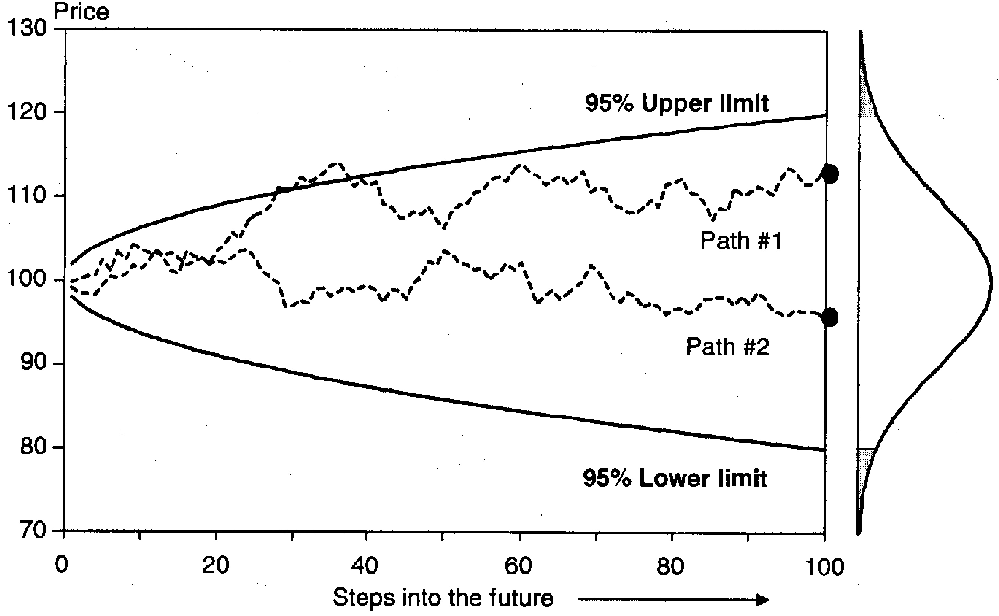

### Introdução

Os métodos de Monte Carlo oferecem uma abordagem flexível e poderosa para a análise de risco financeiro, especialmente para a avaliação de derivativos complexos e para o cálculo do Value at Risk (VAR) [^1]. Ao simular repetidamente um processo aleatório para a variável financeira de interesse, abrangendo uma ampla gama de situações possíveis, essas técnicas permitem recriar toda a distribuição dos valores do portfólio, a partir da qual o VAR pode ser derivado [^2]. Este capítulo explora em profundidade esses métodos, abordando desde os fundamentos da simulação de trajetórias de preços até técnicas avançadas para melhorar a eficiência computacional e lidar com múltiplas variáveis de risco.

### Conceitos Fundamentais

**Simulação de Trajetórias de Preços**

A essência dos métodos de Monte Carlo reside na simulação de trajetórias de preços. O primeiro passo, e o mais crucial, é a escolha de um modelo estocástico particular para o comportamento dos preços [^3]. Um modelo comumente usado é o **movimento browniano geométrico (GBM)**, que fundamenta grande parte da teoria de precificação de opções [^3]. O modelo assume que as inovações no preço do ativo são não correlacionadas ao longo do tempo e que pequenos movimentos nos preços podem ser descritos por:

$$ dS_t = \mu S_t dt + \sigma S_t dz \quad (12.1) $$

onde $dz$ é uma variável aleatória distribuída normalmente com média zero e variância $dt$ [^3]. Essa variável impulsiona os *shocks* aleatórios no preço e não depende de informações passadas. É *browniano* no sentido de que sua variância diminui continuamente com o intervalo de tempo, $V(dz) = dt$ [^3]. Isso exclui processos com saltos repentinos, por exemplo. O processo também é geométrico porque todos os parâmetros são escalados pelo preço atual $S_t$ [^3].

Os parâmetros $\mu$ e $\sigma$ representam o *drift* instantâneo e a volatilidade no tempo $t$, que podem evoluir ao longo do tempo [^3]. Para simplificar, assume-se que esses parâmetros são constantes ao longo do tempo. No entanto, como $\mu$ e $\sigma$ podem ser funções de variáveis passadas, seria fácil simular a variação do tempo nas variâncias como em um processo GARCH, por exemplo [^4].

Na prática, o processo com incrementos infinitesimalmente pequenos $dt$ pode ser aproximado por movimentos discretos de tamanho $\Delta t$ [^4]. Define-se $t$ como o tempo presente, $T$ como o tempo alvo e $\tau = T - t$ como o horizonte (VAR). Para gerar uma série de variáveis aleatórias $S_{t+i}$ ao longo do intervalo $\tau$, primeiro divide-se $\tau$ em $n$ incrementos, com $\Delta t = \tau/n$ [^4].

Integrando $dS/S$ ao longo de um intervalo finito, tem-se aproximadamente:

$$ \Delta S_t = S_{t-1} (\mu \Delta t + \sigma \epsilon \sqrt{\Delta t}) \quad (12.2) $$

onde $\epsilon$ é agora uma variável aleatória normal padrão, ou seja, com média zero e variância unitária [^4]. Pode-se verificar que esse processo gera uma média $E(\Delta S/S) = \mu \Delta t$, que cresce com o tempo, assim como a variância $V(\Delta S/S) = \sigma^2 \Delta t$ [^4].

> 💡 **Exemplo Numérico:**
>
> Suponha que o preço atual de uma ação seja $S_t = 100$, o *drift* anualizado seja $\mu = 0.1$ (10%) e a volatilidade anualizada seja $\sigma = 0.2$ (20%). Queremos simular o preço da ação daqui a um dia ($\Delta t = 1/252$, assumindo 252 dias úteis em um ano). Gere um número aleatório de uma distribuição normal padrão, por exemplo, $\epsilon = 0.5$.
>
> Usando a equação (12.2):
>
> $$ \Delta S_t = 100 \times (0.1 \times \frac{1}{252} + 0.2 \times 0.5 \times \sqrt{\frac{1}{252}}) $$
> $$ \Delta S_t = 100 \times (0.0003968 + 0.2 \times 0.5 \times 0.063) $$
> $$ \Delta S_t = 100 \times (0.0003968 + 0.0063) $$
> $$ \Delta S_t = 100 \times 0.0066968 = 0.66968 $$
>
> Portanto, a variação no preço da ação é aproximadamente $0.67$. O preço da ação no próximo dia simulado seria:
>
> $$ S_{t+1} = S_t + \Delta S_t = 100 + 0.66968 = 100.66968 $$
>
> Podemos repetir este processo muitas vezes com diferentes valores de $\epsilon$ para simular várias trajetórias de preços.
>
> ```python
> import numpy as np
>
> # Parâmetros
> S_t = 100       # Preço atual da ação
> mu = 0.1        # Drift anualizado
> sigma = 0.2     # Volatilidade anualizada
> delta_t = 1/252 # Intervalo de tempo (1 dia)
>
> # Gerar um número aleatório de uma distribuição normal padrão
> epsilon = np.random.normal(0, 1)
>
> # Calcular a variação no preço da ação
> delta_S_t = S_t * (mu * delta_t + sigma * epsilon * np.sqrt(delta_t))
>
> # Calcular o preço da ação no próximo dia
> S_t_plus_1 = S_t + delta_S_t
>
> print(f"Variação no preço da ação: {delta_S_t:.4f}")
> print(f"Preço da ação no próximo dia: {S_t_plus_1:.4f}")
> ```

*Proof:* Demonstraremos que $E[\Delta S_t / S_{t-1}] = \mu \Delta t$ e $Var[\Delta S_t / S_{t-1}] = \sigma^2 \Delta t$.

I. Tomando a esperança da Equação (12.2):
$$E[\Delta S_t / S_{t-1}] = E[\mu \Delta t + \sigma \epsilon \sqrt{\Delta t}]$$

II. Como $\mu$, $\Delta t$ e $\sigma$ são constantes e $E[\epsilon] = 0$, temos:
$$E[\Delta S_t / S_{t-1}] = \mu \Delta t + \sigma \sqrt{\Delta t} E[\epsilon] = \mu \Delta t + \sigma \sqrt{\Delta t} \cdot 0 = \mu \Delta t$$

III. Tomando a variância da Equação (12.2):
$$Var[\Delta S_t / S_{t-1}] = Var[\mu \Delta t + \sigma \epsilon \sqrt{\Delta t}]$$

IV. Como $\mu \Delta t$ é constante, sua variância é zero:
$$Var[\Delta S_t / S_{t-1}] = Var[\sigma \epsilon \sqrt{\Delta t}] = \sigma^2 \Delta t Var[\epsilon]$$

V. Como $\epsilon$ é uma variável normal padrão, $Var[\epsilon] = 1$:
$$Var[\Delta S_t / S_{t-1}] = \sigma^2 \Delta t \cdot 1 = \sigma^2 \Delta t$$

Portanto, demonstramos que $E[\Delta S_t / S_{t-1}] = \mu \Delta t$ e $Var[\Delta S_t / S_{t-1}] = \sigma^2 \Delta t$ ■

Para simular a trajetória de preços para $S$, começa-se de $S_t$ e gera-se uma sequência de *epsilons* ($\epsilon$'s) para $i = 1, 2, ..., n$ [^4]. Então, $S_{t+1}$ é definido como $S_{t+1} = S_t + S_t (\mu \Delta t + \sigma \epsilon_1 \sqrt{\Delta t})$, $S_{t+2}$ é calculado de forma semelhante a partir de $S_{t+1} + S_{t+1} (\mu \Delta t + \sigma \epsilon_2 \sqrt{\Delta t})$, e assim por diante para valores futuros, até que o horizonte alvo seja atingido, ponto no qual o preço é $S_{t+n} = S_T$ [^4].



**Teorema 1** (Convergência da Simulação de Monte Carlo).
A precisão da simulação de Monte Carlo aumenta com o número de simulações. Formalmente, se $\hat{\theta}_N$ é a estimativa de um parâmetro $\theta$ obtida a partir de $N$ simulações independentes, então, sob certas condições de regularidade (como a existência de momentos de segunda ordem), $\hat{\theta}_N$ converge para $\theta$ quando $N$ tende ao infinito. Além disso, o erro da estimativa diminui tipicamente na ordem de $1/\sqrt{N}$.

> 💡 **Exemplo Numérico:**
>
> Suponha que estejamos estimando o preço de uma opção de compra europeia usando simulação de Monte Carlo. O preço verdadeiro da opção (calculado analiticamente usando o modelo de Black-Scholes) é $\theta = 5.50$. Após $N = 1000$ simulações, obtemos uma estimativa de $\hat{\theta}_{1000} = 5.65$ com um desvio padrão amostral de $\sigma = 1.5$.
>
> O erro padrão da estimativa é $\frac{\sigma}{\sqrt{N}} = \frac{1.5}{\sqrt{1000}} \approx 0.0474$.
>
> Um intervalo de confiança de 95% para o preço da opção é dado por:
>
> $$ \hat{\theta}_{1000} \pm 1.96 \times \frac{\sigma}{\sqrt{N}} = 5.65 \pm 1.96 \times 0.0474 = [5.557, 5.743] $$
>
> Observe que o preço verdadeiro da opção, $\theta = 5.50$, está ligeiramente fora deste intervalo. Para melhorar a precisão, aumentamos o número de simulações para $N = 10000$. Suponha que agora obtemos uma estimativa de $\hat{\theta}_{10000} = 5.52$ com um desvio padrão amostral de $\sigma = 1.4$.
>
> O novo erro padrão é $\frac{\sigma}{\sqrt{N}} = \frac{1.4}{\sqrt{10000}} = 0.014$.
>
> O novo intervalo de confiança de 95% é:
>
> $$ \hat{\theta}_{10000} \pm 1.96 \times \frac{\sigma}{\sqrt{N}} = 5.52 \pm 1.96 \times 0.014 = [5.492, 5.548] $$
>
> Desta vez, o preço verdadeiro da opção, $\theta = 5.50$, está dentro do intervalo de confiança. Este exemplo ilustra como aumentar o número de simulações pode melhorar a precisão da estimativa e reduzir o erro.
>
> ```python
> import numpy as np
> from scipy.stats import norm
>
> # Parâmetros
> true_price = 5.50
>
> # Simulação 1: N = 1000
> num_simulations_1 = 1000
> estimated_price_1 = 5.65
> std_dev_1 = 1.5
>
> # Erro padrão
> standard_error_1 = std_dev_1 / np.sqrt(num_simulations_1)
>
> # Intervalo de confiança de 95%
> confidence_interval_1 = norm.interval(0.95, loc=estimated_price_1, scale=standard_error_1)
>
> print(f"Simulação 1 (N=1000):")
> print(f"  Preço estimado: {estimated_price_1:.3f}")
> print(f"  Erro padrão: {standard_error_1:.3f}")
> print(f"  Intervalo de confiança de 95%: {confidence_interval_1}")
> print(f"  Preço verdadeiro está dentro do intervalo? {true_price >= confidence_interval_1[0] and true_price <= confidence_interval_1[1]}")
>
> # Simulação 2: N = 10000
> num_simulations_2 = 10000
> estimated_price_2 = 5.52
> std_dev_2 = 1.4
>
> # Erro padrão
> standard_error_2 = std_dev_2 / np.sqrt(num_simulations_2)
>
> # Intervalo de confiança de 95%
> confidence_interval_2 = norm.interval(0.95, loc=estimated_price_2, scale=standard_error_2)
>
> print(f"\nSimulação 2 (N=10000):")
> print(f"  Preço estimado: {estimated_price_2:.3f}")
> print(f"  Erro padrão: {standard_error_2:.3f}")
> print(f"  Intervalo de confiança de 95%: {confidence_interval_2}")
> print(f"  Preço verdadeiro está dentro do intervalo? {true_price >= confidence_interval_2[0] and true_price <= confidence_interval_2[1]}")
> ```

*Proof:*
I. Seja $\hat{\theta}_N = \frac{1}{N} \sum_{i=1}^{N} X_i$ uma estimativa de $\theta$, onde $X_i$ são variáveis aleatórias independentes e identicamente distribuídas (i.i.d.) com $E[X_i] = \theta$ e $Var[X_i] = \sigma^2 < \infty$.

II. Pela Lei Forte dos Grandes Números (LSGL), temos que:
$$P\left(\lim_{N \to \infty} \hat{\theta}_N = \theta\right) = 1$$
Isso significa que $\hat{\theta}_N$ converge quase certamente para $\theta$ quando $N \to \infty$.

III. O Teorema do Limite Central (TLC) nos diz que a distribuição de $\hat{\theta}_N$ se aproxima de uma distribuição normal quando $N$ é grande:
$$\sqrt{N}(\hat{\theta}_N - \theta) \xrightarrow{d} N(0, \sigma^2)$$
onde $\xrightarrow{d}$ denota convergência em distribuição.

IV. Isso implica que o erro da estimativa, $|\hat{\theta}_N - \theta|$, é tipicamente da ordem de $\frac{\sigma}{\sqrt{N}}$. Portanto, o erro diminui na ordem de $1/\sqrt{N}$.

Assim, demonstramos a convergência de $\hat{\theta}_N$ para $\theta$ e a taxa de convergência do erro ■

**Proposição 1** (Discretização de Euler-Maruyama).
A equação (12.2) representa uma discretização de Euler-Maruyama do processo de Ito definido em (12.1).

*Proof:* A discretização de Euler-Maruyama é um método para aproximar soluções de equações diferenciais estocásticas. A equação (12.1) é uma equação diferencial estocástica. A equação (12.2) aproxima a solução dessa equação.

Para melhorar a precisão da simulação de trajetórias, pode-se refinar a discretização temporal, ou seja, aumentar o número de passos $n$ para um dado horizonte $\tau$. No entanto, isso aumenta o custo computacional. Métodos de variância reduzida, como variáveis de controle e amostragem estratificada, podem ser empregados para aumentar a eficiência da simulação.

**Criação de Números Aleatórios**

As simulações de Monte Carlo são baseadas em sorteios aleatórios $\epsilon$ de uma variável com a distribuição de probabilidade desejada [^6]. A análise numérica geralmente prossegue em duas etapas:

1. O primeiro bloco de construção para um gerador de números aleatórios é uma distribuição uniforme sobre o intervalo [0,1] que produz uma variável aleatória $x$ [^6]. Mais propriamente falando, esses números são "pseudo" aleatórios porque são gerados a partir de um algoritmo usando uma regra predefinida. Começando a partir do mesmo número "semente", a sequência pode ser repetida à vontade [^6].
2. A próxima etapa é transformar o número aleatório uniforme $x$ na distribuição desejada através da função de distribuição cumulativa inversa (pdf) [^6]. Tome a distribuição normal. Por definição, a pdf cumulativa $N(y)$ está sempre entre 0 e 1. Portanto, para gerar uma variável aleatória normalmente distribuída, calcula-se $y$ tal que $x = N(y)$ ou $y = N^{-1}(x)$ [^6]. De forma mais geral, qualquer função de distribuição pode ser gerada, desde que a função $N(y)$ possa ser invertida [^6]. Este procedimento é chamado de *método de transformação inversa* [^6].

> 💡 **Exemplo Numérico:**
>
> Suponha que geramos um número aleatório uniforme $x = 0.75$ no intervalo [0, 1]. Queremos transformar este número em uma variável aleatória normalmente distribuída usando o método de transformação inversa. Precisamos encontrar o valor $y$ tal que $N(y) = 0.75$, onde $N(y)$ é a função de distribuição cumulativa normal padrão.
>
> Usando uma tabela de distribuição normal padrão ou uma função estatística em um software, encontramos que o valor de $y$ correspondente a $N(y) = 0.75$ é aproximadamente $y = 0.674$.
>
> Portanto, o número aleatório normalmente distribuído gerado a partir do número uniforme $x = 0.75$ é $y = 0.674$.
>
> ```python
> from scipy.stats import norm
>
> # Número aleatório uniforme
> x = 0.75
>
> # Encontrar o valor correspondente na distribuição normal padrão
> y = norm.ppf(x)
>
> print(f"Número aleatório uniforme: {x}")
> print(f"Número aleatório normalmente distribuído: {y:.3f}")
> ```

**Teorema 2** (Box-Muller).
O método de Box-Muller é um algoritmo para gerar pares de números aleatórios independentes e normalmente distribuídos, dados um ou mais números aleatórios uniformemente distribuídos. Se $U_1$ e $U_2$ são variáveis aleatórias independentes uniformemente distribuídas no intervalo (0, 1), então as variáveis:

$$Z_1 = \sqrt{-2 \ln(U_1)} \cos(2 \pi U_2)$$
$$Z_2 = \sqrt{-2 \ln(U_1)} \sin(2 \pi U_2)$$

são variáveis aleatórias independentes com distribuição normal padrão.

> 💡 **Exemplo Numérico:**
>
> Suponha que geramos dois números aleatórios uniformemente distribuídos: $U_1 = 0.25$ e $U_2 = 0.75$. Usando o método de Box-Muller, podemos gerar dois números aleatórios normalmente distribuídos $Z_1$ e $Z_2$.
>
> $$ Z_1 = \sqrt{-2 \ln(0.25)} \cos(2 \pi \times 0.75) = \sqrt{-2 \times (-1.386)} \cos(4.712) = \sqrt{2.772} \times (-0.000796) \approx 1.665 \times (-0.000796) \approx -0.001325 $$
> $$ Z_2 = \sqrt{-2 \ln(0.25)} \sin(2 \pi \times 0.75) = \sqrt{-2 \times (-1.386)} \sin(4.712) = \sqrt{2.772} \times (-1.000) \approx 1.665 \times (-1.000) \approx -1.665 $$
>
> Portanto, $Z_1 \approx -0.001325$ e $Z_2 \approx -1.665$ são dois números aleatórios independentes com distribuição normal padrão.
>
> ```python
> import numpy as np
>
> # Números aleatórios uniformemente distribuídos
> U1 = 0.25
> U2 = 0.75
>
> # Método de Box-Muller
> Z1 = np.sqrt(-2 * np.log(U1)) * np.cos(2 * np.pi * U2)
> Z2 = np.sqrt(-2 * np.log(U1)) * np.sin(2 * np.pi * U2)
>
> print(f"U1: {U1}")
> print(f"U2: {U2}")
> print(f"Z1: {Z1:.3f}")
> print(f"Z2: {Z2:.3f}")
> ```

*Proof:*
Para provar que $Z_1$ e $Z_2$ são variáveis aleatórias normais padrão independentes, precisamos mostrar que sua função densidade de probabilidade conjunta é o produto de duas funções densidade de probabilidade normais padrão.

I. Encontre a função de densidade de probabilidade conjunta de $Z_1$ e $Z_2$ usando a transformação de variáveis. A transformação é dada por:
$Z_1 = \sqrt{-2 \ln(U_1)} \cos(2 \pi U_2)$
$Z_2 = \sqrt{-2 \ln(U_1)} \sin(2 \pi U_2)$

II. Calcule o Jacobiano da transformação:
Primeiro, expresse $U_1$ e $U_2$ em termos de $Z_1$ e $Z_2$:
$U_1 = e^{-\frac{Z_1^2 + Z_2^2}{2}}$
$U_2 = \frac{1}{2\pi} \arctan(\frac{Z_2}{Z_1})$
O Jacobiano $J$ é dado por:
$$J = \begin{vmatrix} \frac{\partial U_1}{\partial Z_1} & \frac{\partial U_1}{\partial Z_2} \\ \frac{\partial U_2}{\partial Z_1} & \frac{\partial U_2}{\partial Z_2} \end{vmatrix} = \begin{vmatrix} -Z_1 e^{-\frac{Z_1^2 + Z_2^2}{2}} & -Z_2 e^{-\frac{Z_1^2 + Z_2^2}{2}} \\ \frac{-Z_2}{2\pi (Z_1^2 + Z_2^2)} & \frac{Z_1}{2\pi (Z_1^2 + Z_2^2)} \end{vmatrix}$$
$$J = -Z_1 e^{-\frac{Z_1^2 + Z_2^2}{2}} \frac{Z_1}{2\pi (Z_1^2 + Z_2^2)} - \left(-Z_2 e^{-\frac{Z_1^2 + Z_2^2}{2}} \frac{-Z_2}{2\pi (Z_1^2 + Z_2^2)}\right)$$
$$J = -\frac{e^{-\frac{Z_1^2 + Z_2^2}{2}}}{2\pi} \frac{Z_1^2 + Z_2^2}{Z_1^2 + Z_2^2} = -\frac{e^{-\frac{Z_1^2 + Z_2^2}{2}}}{2\pi}$$
Tome o valor absoluto do Jacobiano: $|J| = \frac{e^{-\frac{Z_1^2 + Z_2^2}{2}}}{2\pi}$

III. A função densidade de probabilidade conjunta de $U_1$ e $U_2$ é $f_{U_1, U_2}(u_1, u_2) = 1$ para $0 < u_1 < 1$ e $0 < u_2 < 1$, pois são uniformemente distribuídas e independentes.

IV. A função densidade de probabilidade conjunta de $Z_1$ e $Z_2$ é:
$$f_{Z_1, Z_2}(z_1, z_2) = f_{U_1, U_2}(u_1, u_2) |J| = 1 \cdot \frac{e^{-\frac{z_1^2 + z_2^2}{2}}}{2\pi} = \frac{1}{2\pi} e^{-\frac{z_1^2 + z_2^2}{2}}$$

V. Observe que a função densidade de probabilidade conjunta pode ser fatorada como:
$$f_{Z_1, Z_2}(z_1, z_2) = \frac{1}{\sqrt{2\pi}} e^{-\frac{z_1^2}{2}} \cdot \frac{1}{\sqrt{2\pi}} e^{-\frac{z_2^2}{2}}$$

Isto mostra que $Z_1$ e $Z_2$ são variáveis aleatórias normais padrão independentes. ■

**Lema 2.1** (Propriedades da Distribuição Normal Padrão).
Seja $Z$ uma variável aleatória com distribuição normal padrão. Então, $E[Z] = 0$ e $Var[Z] = 1$.

**Bootstrap**

Uma alternativa à geração de números aleatórios a partir de uma distribuição hipotética é amostrar a partir de dados históricos [^7]. Assim, é possível ser agnóstico sobre a distribuição. Por exemplo, suponha que observamos uma série de $M$ retornos $R = \Delta S/S, \{R\} = (R_1,...,R_M)$, que podem ser considerados como variáveis aleatórias i.i.d. retiradas de uma distribuição desconhecida [^7]. O método de simulação histórica consiste em usar esta série uma vez para gerar pseudoretornos [^7]. Mas isso pode ser estendido muito mais.

O bootstrap estima esta distribuição pela distribuição empírica de $R$, atribuindo igual probabilidade a cada realização [^7]. O método foi proposto inicialmente por Efron (1979) como uma técnica de randomização não paramétrica que extrai da distribuição observada dos dados para modelar a distribuição de uma estatística de interesse [^7].

O procedimento é realizado amostrando de $\{R\}$, com reposição, tantas observações quantas forem necessárias [^7]. Por exemplo, suponha que se queira gerar 100 retornos para o futuro, mas não se queira impor qualquer suposição sobre a distribuição dos retornos diários. Poder-se-ia projetar retornos escolhendo aleatoriamente um retorno de cada vez da amostra ao longo dos últimos $M = 500$ dias, com reposição [^8]. Define-se a escolha do índice como $m(1)$, um número entre 1 e 500. O retorno selecionado então é $R_{m(1)}$, e o retorno simulado do dia seguinte é $S_{t+1} = S_t(1 + R_{m(1)})$ [^8]. Repetindo a operação para um total de 100 sorteios resulta em um total de 100 pseudovalores $S_{t+1}, ..., S_{t+n}$ [^8].

> 💡 **Exemplo Numérico:**
>
> Suponha que temos uma série histórica de retornos diários de uma ação nos últimos $M = 10$ dias: $\{R\} = (0.01, -0.005, 0.02, 0.015, -0.01, 0.008, -0.002, 0.012, 0.005, -0.003)$. O preço atual da ação é $S_t = 100$. Queremos simular o preço da ação para os próximos 3 dias usando o método de bootstrap.
>
> 1. **Dia 1:** Geramos um número aleatório entre 1 e 10 (com reposição). Suponha que o número gerado seja 3. O retorno correspondente é $R_3 = 0.02$. Portanto, o preço da ação no dia 1 é $S_{t+1} = 100 \times (1 + 0.02) = 102$.
> 2. **Dia 2:** Geramos outro número aleatório entre 1 e 10. Suponha que o número gerado seja 7. O retorno correspondente é $R_7 = -0.002$. Portanto, o preço da ação no dia 2 é $S_{t+2} = 102 \times (1 - 0.002) = 101.796$.
> 3. **Dia 3:** Geramos outro número aleatório entre 1 e 10. Suponha que o número gerado seja 1. O retorno correspondente é $R_1 = 0.01$. Portanto, o preço da ação no dia 3 é $S_{t+3} = 101.796 \times (1 + 0.01) = 102.814$.
>
> Assim, simulamos uma possível trajetória de preços para os próximos 3 dias usando o método de bootstrap.
>
> ```python
> import numpy as np
>
> # Retornos históricos
> R = np.array([0.01, -0.005, 0.02, 0.015, -0.01, 0.008, -0.002, 0.012, 0.005, -0.003])
>
> # Preço atual da ação
> S_t = 100
>
> # Número de dias para simular
> num_days = 3
>
> # Simulação de bootstrap
> S = [S_t]
> for i in range(num_days):
>     # Gerar um índice aleatório
>     m = np.random.randint(0, len(R))
>     # Calcular o preço da ação no próximo dia
>     S_next = S[-1] * (1 + R[m])
>     S.append(S_next)
>
> print(f"Preço atual da ação: {S_t}")
> for i in range(1, len(S)):
>     print(f"Preço da ação no dia {i}: {S[i]:.3f}")
> ```

Uma vantagem essencial do bootstrap é que ele pode incluir caudas gordas, saltos ou qualquer desvio da distribuição normal [^8]. Por exemplo, pode-se incluir o retorno da quebra de 19 de outubro de 1987, que nunca (ou quase nunca) ocorreria sob uma distribuição normal [^8]. O método também contabiliza as correlações entre as séries porque um sorteio consiste nos retornos simultâneos para $N$ séries, tais como ações, títulos e preços de moedas [^8].

**Teorema 3** (Aproximação de Monte Carlo para Integrais).
Seja $g(x)$ uma função integrável e $x_1, x_2, ..., x_N$ amostras independentes de uma distribuição de probabilidade $f(x)$. Então, a integral de $g(x)$ em relação a $f(x)$ pode ser aproximada por:

$$\int g(x) f(x) dx \approx \frac{1}{N} \sum_{i=1}^{N} g(x_i)$$

Além disso, essa aproximação converge para o valor verdadeiro da integral quando $N$ tende ao infinito, de acordo com a lei dos grandes números.

> 💡 **Exemplo Numérico:**
>
> Queremos calcular a integral $\int_{0}^{1} x^2 dx$ usando a aproximação de Monte Carlo. A solução analítica é $\frac{1}{3}$.
>
> Seja $g(x) = x^2$ e $f(x) = 1$ (distribuição uniforme no intervalo [0, 1]). Geramos $N = 1000$ números aleatórios uniformemente distribuídos no intervalo [0, 1].
>
> $$x_i \sim U(0, 1), \quad i = 1, 2, ..., 1000$$
>
> Calculamos a média dos valores de $g(x_i)$:
>
> $$\frac{1}{N} \sum_{i=1}^{N} g(x_i) = \frac{1}{1000} \sum_{i=1}^{1000} x_i^2$$
>
> Suponha que após calcular a soma, obtemos:
>
> $$\sum_{i=1}^{1000} x_i^2 = 328.5$$
>
> Então, a aproximação de Monte Carlo é:
>
> $$\int_{0}^{1} x^2 dx \approx \frac{1}{1000} \times 328.5 = 0.3285$$
>
> Este valor é próximo da solução analítica de $\frac{1}{3} \approx 0.333$. Aumentando o número de amostras $N$ melhoraria a precisão da aproximação.
>
> ```python
> import numpy as np
>
> # Número de amostras
> num_samples = 1000
>
> # Gerar números aleatórios uniformemente distribuídos
> x = np.random.uniform(0, 1, num_samples)
>
> # Calcular g(x_i) = x_i^2
> g_x = x**2
>
> # Aproximação de Monte Carlo
> integral_approximation = np.mean(g_x)
>
> print(f"Aproximação de Monte Carlo da integral: {integral_approximation:.4f}")
> print(f"Solução analítica: {1/3:.4f}")
> ```

*Proof:*
I. Considere a integral $\int g(x) f(x) dx = E[g(X)]$, onde$f(x)$ é a função de densidade de probabilidade de $X$.

II. Podemos aproximar essa esperança usando a média amostral de $g(X_i)$ para $N$ amostras $X_i$ retiradas de $f(x)$:

$$
E[g(X)] \approx \frac{1}{N} \sum_{i=1}^{N} g(X_i)
$$

III. No nosso caso, $g(x) = x^2$ e $f(x) = 1$ para $x \in [0, 1]$ (distribuição uniforme).

IV. Portanto, a aproximação de Monte Carlo da integral é a média dos valores de $x_i^2$ para $x_i$ amostrados de uma distribuição uniforme em $[0, 1]$.

V. A solução analítica é $\int_0^1 x^2 dx = \frac{1}{3}$.

VI. A convergência do método de Monte Carlo para o valor real da integral é garantida pela Lei Forte dos Grandes Números, que afirma que, à medida que $N \rightarrow \infty$, a média amostral converge para a esperança verdadeira. $\blacksquare$

### Integrais Multidimensionais

O método de Monte Carlo é particularmente útil para calcular integrais multidimensionais, onde outros métodos numéricos podem se tornar computacionalmente proibitivos.

**Exemplo:** Calcular o volume de uma hiperesfera unitária em $n$ dimensões.

```python
import numpy as np

def monte_carlo_hyperesphere_volume(n, N):
    """
    Calcula o volume de uma hiperesfera unitária em n dimensões
    usando o método de Monte Carlo.
    """
    points = np.random.uniform(-1, 1, size=(N, n))
    inside = np.linalg.norm(points, axis=1) <= 1
    volume_approximation = (2**n) * np.sum(inside) / N
    return volume_approximation

# Parâmetros
n_dimensions = 10  # Número de dimensões
n_samples = 100000   # Número de amostras

# Calcula o volume
volume_approximation = monte_carlo_hyperesphere_volume(n_dimensions, n_samples)

print(f"Aproximação de Monte Carlo do volume da hiperesfera em {n_dimensions} dimensões: {volume_approximation:.4f}")
```

### Redução de Variância

A precisão dos métodos de Monte Carlo depende do número de amostras utilizadas. Técnicas de redução de variância podem ser empregadas para obter estimativas mais precisas com o mesmo número de amostras. Algumas técnicas comuns incluem:

*   **Amostragem Estratificada:** Dividir o espaço amostral em subregiões (estratos) e amostrar cada estrato de forma independente.

*   **Variáveis de Controle:** Usar uma função conhecida com uma integral conhecida para reduzir a variância da estimativa.

*   **Amostragem por Importância:** Amostrar a partir de uma distribuição que se assemelha à função integranda para reduzir a variância nas regiões importantes.

### Amostragem por Importância

A amostragem por importância é uma técnica de redução de variância que envolve amostrar a partir de uma distribuição de probabilidade diferente da distribuição original.  O objetivo é concentrar as amostras em regiões do espaço amostral que contribuem mais para a integral.

Seja $I = \int_a^b f(x) dx$ a integral que queremos calcular. Introduzimos uma função de densidade de probabilidade $g(x)$ tal que $g(x) > 0$ sempre que $f(x) \neq 0$. Então podemos reescrever a integral como:

$$
I = \int_a^b \frac{f(x)}{g(x)} g(x) dx = E_g \left[ \frac{f(X)}{g(X)} \right]
$$

Onde $E_g$ denota a esperança em relação à distribuição $g(x)$.  Aproximamos essa esperança por:

$$
I \approx \frac{1}{N} \sum_{i=1}^N \frac{f(X_i)}{g(X_i)}
$$

Onde $X_i$ são amostras retiradas da distribuição $g(x)$. A escolha de $g(x)$ é crucial. Idealmente, $g(x)$ deve se assemelhar a $f(x)$ para que a variância da estimativa seja reduzida.

**Exemplo:**

Calcular $\int_0^1 e^{-x^2} dx$ usando amostragem por importância.

```python
import numpy as np
import math

def f(x):
    return math.exp(-x**2)

def g(x):
    return 2 * (1 - x) # Densidade de probabilidade triangular

def sample_g():
    return 1 - np.sqrt(np.random.uniform(0, 1))

N = 10000
samples = [sample_g() for _ in range(N)]
weights = [f(x) / g(x) for x in samples]
integral_approximation = np.mean(weights)

print(f"Aproximação de Monte Carlo com amostragem por importância: {integral_approximation:.4f}")

# Comparação com Monte Carlo simples e solução numérica (quadratura de Gauss)
def monte_carlo_simple(N):
    samples = np.random.uniform(0, 1, N)
    return np.mean([f(x) for x in samples])

from scipy.integrate import quad
result, _ = quad(f, 0, 1)

print(f"Aproximação de Monte Carlo simples: {monte_carlo_simple(N):.4f}")
print(f"Solução numérica (quadratura de Gauss): {result:.4f}")
```

*Proof:*

I.  A integral pode ser reescrita como a esperança de uma função em relação a uma distribuição $g(x)$ diferente da distribuição uniforme original.

II.  A escolha de $g(x)$ influencia a variância da estimativa. Uma boa escolha minimiza a variância.

III. Amostrar diretamente de $g(x)$ permite concentrar as amostras em regiões onde a função $f(x)$ tem maior impacto na integral.

IV.  A ponderação de cada amostra por $f(x)/g(x)$ corrige o viés introduzido pela amostragem a partir de $g(x)$.

V.  A convergência para o valor real da integral é garantida se $g(x) > 0$ sempre que $f(x) \neq 0$ e pela Lei Forte dos Grandes Números. $\blacksquare$
<!-- END -->