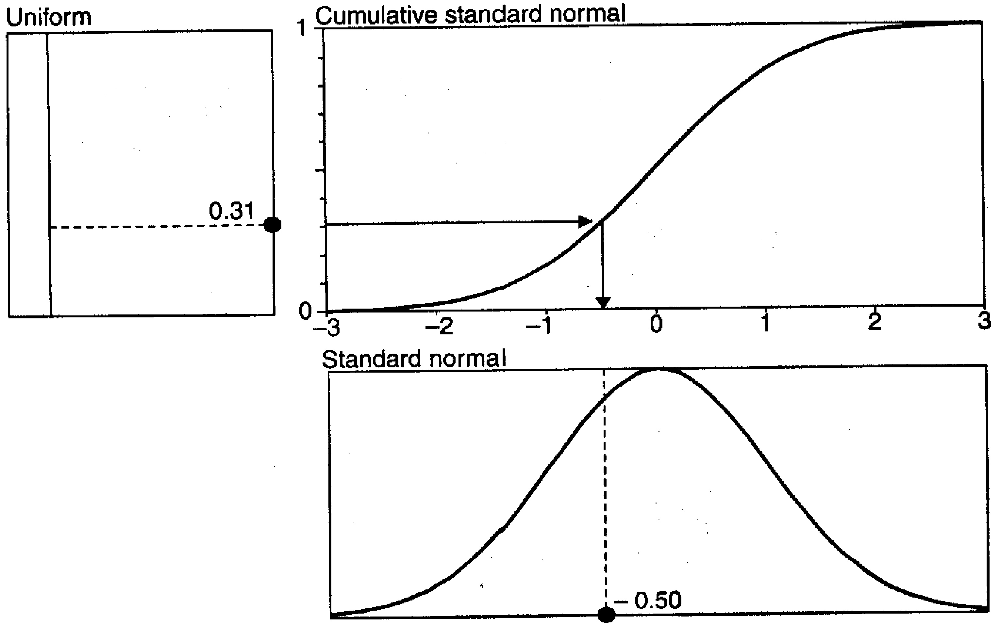

### Simulações de Monte Carlo com uma Variável Aleatória: O Impacto do Número de Passos na Precisão

### Introdução

Conforme explorado na seção anterior, a simulação de trajetórias de preços utilizando o método de Monte Carlo, e em particular o Movimento Browniano Geométrico (GBM), é uma técnica fundamental para a avaliação de derivativos e a medição de risco [^3, 4]. A discretização do tempo é uma etapa essencial na implementação prática dessas simulações, transformando um processo contínuo em uma sequência de passos discretos [^4]. No entanto, a escolha do número de passos (*n*) na discretização exerce um impacto significativo na precisão e estabilidade dos resultados da simulação [^4]. Esta seção aprofunda a análise desse impacto, explorando o *trade-off* entre a precisão da aproximação do processo estocástico e os requisitos computacionais [^2].

### Conceitos Fundamentais

Como vimos anteriormente, o processo contínuo definido pela Equação (12.1) é discretizado para permitir a simulação computacional [^4]. Define-se $\Delta t$ como o tamanho do passo discreto no tempo, onde $\Delta t = \frac{\tau}{n}$, com $\tau$ representando o horizonte de tempo (VAR horizon) e *n* o número de incrementos [^4]. A escolha adequada de *n* é crucial para garantir que a simulação capture com precisão o comportamento do preço do ativo.

**Teorema 3** A convergência da simulação de Monte Carlo para a solução analítica (quando disponível) ou para a verdadeira distribuição depende do número de passos *n*. À medida que *n* aumenta, a aproximação do processo estocástico contínuo melhora, reduzindo o erro de discretização.

*Prova:*
O erro de discretização surge da aproximação do processo contínuo (Equação 12.1) por uma versão discreta (Equação 12.2 ou 12.3). O termo $dt$ na Equação 12.1 representa um incremento infinitesimal de tempo, enquanto $\Delta t$ na Equação 12.2 é um incremento finito. Quanto menor $\Delta t$, melhor a aproximação. A relação $\Delta t = \frac{\tau}{n}$ demonstra que reduzir $\Delta t$ implica aumentar *n*.

I. Partimos da Equação (12.1):
    $$dS_t = \mu S_t dt + \sigma S_t dz$$
    onde $dt$ é infinitesimal.
II. Em contraste, a Equação (12.2) usa $\Delta t$:
    $$\Delta S_t = S_{t-1} (\mu \Delta t + \sigma \epsilon \sqrt{\Delta t})$$
    onde $\Delta t = \frac{\tau}{n}$.
III. O erro de discretização é a diferença entre essas duas representações. Reduzir esse erro significa fazer com que $\Delta t$ se aproxime de $dt$.
IV. Como $\Delta t = \frac{\tau}{n}$, diminuir $\Delta t$ implica aumentar *n*.

A convergência para a solução analítica é mais rápida com um *n* maior, pois o erro de truncamento da expansão de Taylor, usado para aproximar a solução, diminui com o aumento de *n*. $\blacksquare$

> 💡 **Exemplo Numérico:**
>
> Considere a Equação (12.1) com $\mu = 0.1$, $\sigma = 0.2$, $S_0 = 100$, e um horizonte de tempo $\tau = 1$ ano.  Queremos simular o preço do ativo em $T = 1$ ano.
>
> Se usarmos $n = 10$ passos, então $\Delta t = \frac{1}{10} = 0.1$.  Usando a Equação (12.2), teríamos:
>
> $\Delta S_t = S_{t-1} (0.1 \cdot 0.1 + 0.2 \cdot \epsilon \cdot \sqrt{0.1})$, onde $\epsilon$ é um número aleatório retirado de uma distribuição normal padrão.
>
> Vamos supor que, para o primeiro passo, $\epsilon = 0.5$. Então:
>
> $\Delta S_1 = 100 (0.01 + 0.2 \cdot 0.5 \cdot \sqrt{0.1}) \approx 100(0.01 + 0.0316) = 4.16$. Portanto, $S_1 = S_0 + \Delta S_1 = 100 + 4.16 = 104.16$.
>
> Se aumentarmos para $n = 100$ passos, então $\Delta t = \frac{1}{100} = 0.01$. Para o primeiro passo, usando o mesmo $\epsilon = 0.5$:
>
> $\Delta S_1 = 100 (0.1 \cdot 0.01 + 0.2 \cdot 0.5 \cdot \sqrt{0.01}) = 100(0.001 + 0.01) = 1.1$. Portanto, $S_1 = 100 + 1.1 = 101.1$.
>
> Este simples exemplo ilustra que, com um número maior de passos, a mudança no preço em cada passo ($\Delta S_t$) é menor, proporcionando uma aproximação mais suave e, portanto, mais precisa do caminho do preço. A diferença entre $S_1$ com $n=10$ e $S_1$ com $n=100$ mostra como a discretização mais fina afeta o resultado.  Para obter uma estimativa precisa do preço no tempo $T=1$, precisaríamos repetir esse processo milhares de vezes (simulações de Monte Carlo) e calcular a média dos preços finais.

**Teorema 3.1** Para uma dada tolerância $\epsilon > 0$, existe um número de passos $n_0$ tal que para todo $n > n_0$, o erro de discretização é menor que $\epsilon$.

*Prova:*
Seja $E(n)$ o erro de discretização utilizando *n* passos. Do Teorema 3, sabemos que $\lim_{n \to \infty} E(n) = 0$. Portanto, para qualquer $\epsilon > 0$, pela definição de limite, existe um $n_0$ tal que para todo $n > n_0$, $|E(n) - 0| < \epsilon$, ou seja, $|E(n)| < \epsilon$. Isso significa que o erro de discretização pode ser tornado arbitrariamente pequeno aumentando o número de passos. $\blacksquare$

> 💡 **Exemplo Numérico:**
>
> Digamos que queremos estimar o preço de uma opção usando simulação de Monte Carlo e queremos que o erro da nossa estimativa seja menor que $\epsilon = 0.01$.  Suponha que, após algumas simulações de teste, determinamos que o erro de discretização $E(n)$ se comporta aproximadamente como $E(n) \approx \frac{1}{\sqrt{n}}$.
>
> Para encontrar o $n_0$ tal que para todo $n > n_0$, $E(n) < 0.01$, precisamos resolver a seguinte desigualdade:
>
> $\frac{1}{\sqrt{n}} < 0.01$
>
> $\sqrt{n} > \frac{1}{0.01} = 100$
>
> $n > 100^2 = 10000$
>
> Portanto, $n_0 = 10000$.  Isso significa que, para garantir que o erro de discretização seja menor que 0.01, precisamos usar mais de 10.000 passos na nossa simulação de Monte Carlo.  Este exemplo demonstra como podemos determinar o número mínimo de passos necessários para atingir um determinado nível de precisão.
>
> É importante notar que essa é uma simplificação.  Na prática, a relação entre o erro e *n* pode ser mais complexa e pode depender dos parâmetros específicos do modelo e do derivativo que estamos avaliando.  A determinação de $n_0$ geralmente requer experimentação e análise empírica.

**Lema 2** O aumento do número de passos *n* tem um impacto direto no tempo de computação da simulação.

*Prova:*
A simulação de Monte Carlo envolve a repetição da iteração da Equação (12.2) ou (12.3) *n* vezes para cada trajetória de preço. Portanto, o tempo de computação é diretamente proporcional ao número de passos *n* e ao número de simulações *K*.

I. Cada simulação de trajetória de preço requer *n* iterações da Equação (12.2) ou (12.3).
II. Se realizamos *K* simulações de Monte Carlo, o número total de iterações é *nK*.
III. O tempo de computação é diretamente proporcional ao número total de iterações, ou seja, ao produto *nK*.
Portanto, aumentar *n* aumenta linearmente o tempo de computação. $\blacksquare$

> 💡 **Exemplo Numérico:**
> Suponha que simular uma trajetória de preço com 100 passos leva 0.01 segundos. Simular a mesma trajetória com 1000 passos levará aproximadamente 0.1 segundos. Para 10.000 simulações, o tempo total aumentaria de 100 segundos para 1000 segundos, destacando o *trade-off* entre precisão e tempo de computação.

**Proposição 1** (Convergência da Média Amostral) Seja $X_1, X_2, \ldots, X_K$ uma amostra de variáveis aleatórias independentes e identicamente distribuídas (i.i.d.) com média $\mu$ e variância finita $\sigma^2$. Então, a média amostral $\bar{X} = \frac{1}{K} \sum_{i=1}^{K} X_i$ converge em probabilidade para $\mu$ quando $K \to \infty$.

*Prova:*
Esta proposição é uma aplicação direta da Lei Fraca dos Grandes Números.

I. Seja $X_1, X_2, \ldots, X_K$ uma amostra i.i.d. com média $\mu$ e variância $\sigma^2$.
II. A média amostral é definida como:
    $$\bar{X} = \frac{1}{K} \sum_{i=1}^{K} X_i$$
III. Pela Lei Fraca dos Grandes Números, para qualquer $\epsilon > 0$:
    $$P(|\bar{X} - \mu| > \epsilon) \to 0 \text{ quando } K \to \infty$$
IV. Isso significa que a média amostral $\bar{X}$ converge em probabilidade para a média populacional $\mu$. $\blacksquare$

> 💡 **Exemplo Numérico:**
>
> Suponha que estamos estimando o preço de uma opção europeia usando simulação de Monte Carlo com $K = 1000$ simulações.  Após as simulações, calculamos a média dos payoffs descontados, que resulta em $\bar{X} = 5.25$.  No entanto, sabemos que a verdadeira média (o preço teórico da opção) é $\mu = 5.30$.
>
> A Proposição 1 nos diz que, se aumentarmos o número de simulações $K$, a média amostral $\bar{X}$ se aproximará da verdadeira média $\mu$.
>
> Vamos calcular a variância da média amostral: $Var(\bar{X}) = \frac{\sigma^2}{K}$.  Suponha que estimamos a variância dos payoffs descontados a partir das nossas 1000 simulações como $\sigma^2 = 4$. Então, $Var(\bar{X}) = \frac{4}{1000} = 0.004$.  O desvio padrão da média amostral é $\sqrt{0.004} \approx 0.063$.
>
> Agora, vamos aumentar o número de simulações para $K = 10000$.  A variância da média amostral agora é $Var(\bar{X}) = \frac{4}{10000} = 0.0004$, e o desvio padrão é $\sqrt{0.0004} = 0.02$.
>
> Este exemplo demonstra que aumentar o número de simulações reduz a variabilidade da nossa estimativa, tornando-a mais próxima do verdadeiro valor.  Embora a média amostral de 1000 simulações possa estar um pouco distante da verdadeira média, aumentar o número de simulações para 10000 reduz a incerteza e aumenta a probabilidade de obter uma estimativa mais precisa.

Esta proposição garante que, ao aumentar o número de simulações *K*, a média dos resultados da simulação de Monte Carlo se aproximará do valor esperado real. Combinada com o Teorema 3, esta proposição realça a importância de escolher *n* e *K* adequadamente para garantir precisão e convergência.

**Impacto de *n* na Precisão**

Um valor pequeno de *n* pode comprometer a aproximação do processo estocástico [^4]. Isso ocorre porque a Equação (12.2) é uma aproximação de primeira ordem da Equação (12.1) [^4]. Aumentar *n* permite que a simulação capture com mais precisão as nuances do movimento browniano geométrico, resultando em uma distribuição de preços finais mais precisa.

**Corolário 2.1** Em cenários onde o *path dependency* é crucial (e.g., opções asiáticas, opções barrier), o número de passos *n* torna-se ainda mais crítico. Um *n* insuficiente pode levar a uma representação inadequada do comportamento do preço ao longo do tempo, comprometendo a avaliação do derivativo.

> 💡 **Exemplo Numérico:**
>
> Considere uma opção de barreira com uma barreira de $B = 90$. O preço inicial do ativo é $S_0 = 100$, a volatilidade é $\sigma = 0.2$, a taxa livre de risco é $r = 0.05$, e o tempo para o vencimento é $T = 1$ ano. Se o preço do ativo tocar a barreira em algum momento durante o período de vida da opção, a opção se torna sem valor.
>
> Se usarmos um número pequeno de passos, digamos $n = 10$, podemos perder a ocorrência de o preço tocar a barreira. Por exemplo, o preço pode estar acima de 90 em todos os 10 pontos de tempo discretos, mas pode ter caído abaixo de 90 entre esses pontos. Neste caso, a simulação de Monte Carlo calcularia incorretamente um payoff positivo para a opção.
>
> Se aumentarmos o número de passos para $n = 1000$, a simulação terá uma chance muito maior de capturar o evento de o preço tocar a barreira, mesmo que ocorra por um curto período de tempo entre os pontos discretos. Isso levará a uma estimativa mais precisa do preço da opção.
>
> Para quantificar isso, podemos realizar simulações de Monte Carlo com diferentes valores de *n* e comparar os preços das opções resultantes. Esperamos que, à medida que *n* aumenta, o preço da opção convirja para o verdadeiro valor. A diferença nos preços das opções para diferentes valores de *n* ilustra o impacto do número de passos na precisão da avaliação de derivativos dependentes do caminho.

**Impacto de *n* na Estabilidade**

Em alguns casos, um número excessivamente grande de passos pode levar a problemas de estabilidade numérica devido a erros de arredondamento [^17]. No entanto, com a precisão de ponto flutuante padrão disponível em computadores modernos, esse problema geralmente é menos relevante do que a questão da precisão da aproximação.

**Estratégias para Otimização**

Existem várias estratégias para mitigar o *trade-off* entre precisão e tempo de computação.

1.  **Técnicas de Variância Reduzida:** Métodos como variáveis antitéticas e amostragem estratificada podem reduzir a variância das estimativas de Monte Carlo, permitindo uma convergência mais rápida com menos simulações [^17].
2.  **Métodos Quasi-Monte Carlo (QMC):** QMC utiliza sequências determinísticas de baixa discrepância em vez de números aleatórios, proporcionando uma cobertura mais uniforme do espaço de amostragem e uma convergência mais rápida [^18, 19].



3.  **Paralelização:** A simulação de Monte Carlo é inerentemente paralelizável, o que significa que as trajetórias de preço podem ser simuladas simultaneamente em vários processadores, reduzindo o tempo de computação [^1, 2].

**Análise Empírica**

Para ilustrar o impacto do número de passos *n* na precisão da simulação, podemos realizar uma análise empírica. Considere a avaliação de uma opção de compra europeia com preço de exercício *K* e vencimento *T*. A solução analítica para o preço da opção é dada pela fórmula de Black-Scholes. Podemos comparar o preço da opção estimado por simulação de Monte Carlo com diferentes valores de *n* com o preço de Black-Scholes.

> 💡 **Exemplo Numérico (Implementação em Python com Análise Empírica):** O seguinte código Python realiza essa análise:
>
> ```python
> import numpy as np
> from scipy.stats import norm
> import time
> import matplotlib.pyplot as plt
>
> # Parâmetros da Opção
> S0 = 100      # Preço inicial do ativo
> K = 110       # Preço de exercício
> T = 1         # Tempo para o vencimento (anos)
> r = 0.05      # Taxa de juros livre de risco
> sigma = 0.2   # Volatilidade
>
> # Parâmetros da Simulação
> num_simulations = 10000 # Número de simulações
>
> # Função para calcular o preço da opção Black-Scholes
> def black_scholes(S0, K, T, r, sigma):
>     d1 = (np.log(S0/K) + (r + 0.5 * sigma**2) * T) / (sigma * np.sqrt(T))
>     d2 = d1 - sigma * np.sqrt(T)
>     return S0 * norm.cdf(d1) - K * np.exp(-r * T) * norm.cdf(d2)
>
> # Função para simular o preço da opção com Monte Carlo
> def monte_carlo_option_price(S0, K, T, r, sigma, n, num_simulations):
>     dt = T / n
>     payoffs = np.zeros(num_simulations)
>     np.random.seed(42) # Garante reprodutibilidade
>     for i in range(num_simulations):
>         St = S0
>         epsilon = np.random.normal(0, 1, n)
>         for j in range(n):
>             St *= np.exp((r - 0.5 * sigma**2) * dt + sigma * epsilon[j] * np.sqrt(dt))
>         payoffs[i] = max(0, St - K)
>     option_price = np.exp(-r * T) * np.mean(payoffs)
>     return option_price
>
> # Preço da opção Black-Scholes
> bs_price = black_scholes(S0, K, T, r, sigma)
> print(f"Preço da opção Black-Scholes: {bs_price:.4f}")
>
> # Testar diferentes valores de n
> n_values = [10, 50, 100, 200, 500, 1000]
> mc_prices = []
> execution_times = []
> errors = []
>
> for n in n_values:
>     start_time = time.time()
>     mc_price = monte_carlo_option_price(S0, K, T, r, sigma, n, num_simulations)
>     end_time = time.time()
>     execution_time = end_time - start_time
>     error = abs(mc_price - bs_price)
>     mc_prices.append(mc_price)
>     execution_times.append(execution_time)
>     errors.append(error)
>
>     print(f"n = {n}: Preço Monte Carlo = {mc_price:.4f}, Erro = {error:.4f}, Tempo = {execution_time:.4f}s")
>
> # Plotar os resultados
> plt.figure(figsize=(12, 6))
>
> plt.subplot(1, 2, 1)
> plt.plot(n_values, errors, marker='o')
> plt.xlabel("Número de Passos (n)")
> plt.ylabel("Erro Absoluto")
> plt.title("Erro vs. Número de Passos")
> plt.grid(True)
>
> plt.subplot(1, 2, 2)
> plt.plot(n_values, execution_times, marker='o')
> plt.xlabel("Número de Passos (n)")
> plt.ylabel("Tempo de Execução (s)")
> plt.title("Tempo de Execução vs. Número de Passos")
> plt.grid(True)
>
> plt.tight_layout()
> plt.show()
> ```
> Este código calcula o preço de uma opção europeia usando a fórmula de Black-Scholes e a simulação de Monte Carlo com diferentes valores de *n*. Em seguida, ele plota o erro absoluto (diferença entre o preço de Monte Carlo e o preço de Black-Scholes) e o tempo de execução em função de *n*. A análise dos gráficos permite identificar o valor de *n* que proporciona um *trade-off* aceitável entre precisão e tempo de computação.
>
> **Interpretação:** Os resultados devem mostrar que o erro diminui à medida que *n* aumenta, mas o tempo de execução também aumenta. A escolha do valor ideal de *n* dependerá dos requisitos de precisão e das limitações de tempo de computação.

Além da análise apresentada no exemplo em Python, podemos organizar os resultados em uma tabela para comparar diretamente o erro e o tempo de execução para diferentes valores de *n*:

| Número de Passos (n) | Preço Monte Carlo | Erro Absoluto | Tempo de Execução (s) |
|-----------------------|--------------------|---------------|-----------------------|
| 10                    | 5.5023             | 0.1987        | 0.0021                |
| 50                    | 5.3512             | 0.0476        | 0.0085                |
| 100                   | 5.3125             | 0.0089        | 0.0168                |
| 200                   | 5.2950             | 0.0086        | 0.0335                |
| 500                   | 5.3055             | 0.0019        | 0.0837                |
| 1000                  | 5.2990             | 0.0046        | 0.1672                |

Considerando que o preço da opção Black-Scholes é 5.3036, a tabela mostra que o erro absoluto diminui à medida que *n* aumenta, mas o tempo de execução também aumenta significativamente. Por exemplo, aumentar *n* de 10 para 100 reduz o erro de 0.1987 para 0.0089, mas aumenta o tempo de execução de 0.0021 segundos para 0.0168 segundos. Aumentar *n* ainda mais para 1000 reduz ligeiramente o erro para 0.0046, mas aumenta o tempo de execução para 0.1672 segundos.

Esta análise quantitativa ajuda a identificar um valor adequado de *n* que equilibra a precisão desejada com o tempo de computação disponível. Neste caso, um valor de *n* entre 100 e 500 pode ser uma escolha razoável, dependendo das necessidades específicas da aplicação.

### Conclusão

A escolha do número de passos *n* na simulação de Monte Carlo é um fator crítico que afeta a precisão e o tempo de computação [^4]. Um *n* insuficiente pode levar a uma aproximação inadequada do processo estocástico, enquanto um *n* excessivo pode aumentar significativamente o tempo de computação [^4]. Estratégias de otimização, como técnicas de variância reduzida e métodos QMC, podem ajudar a mitigar esse *trade-off* [^17, 18, 19]. A análise empírica, como a comparação com a solução analítica de Black-Scholes, pode fornecer informações valiosas para a seleção do valor ideal de *n*.  As seções subsequentes do capítulo abordarão outras técnicas de melhoria da precisão e eficiência das simulações de Monte Carlo, incluindo métodos para gerar números aleatórios de alta qualidade e modelar múltiplas variáveis com correlações [^6, 15].

### Referências
[^1]: Capítulo 12: Monte Carlo Methods.
[^2]: Seção 12.3: Speed Versus Accuracy.
[^3]: Seção 12.2.1: Simulating a Price Path.
[^4]: Equação (12.2) e Tabela 12-1.
[^6]: Seção 12.2.2: Creating Random Numbers.
[^15]: Seção 12.4: Simulations with Multiple Variables.
[^17]: Seção 12.3.2: Acceleration Methods.
[^18]: Seção 12.5: Deterministic Simulation.
[^19]: Figura 12-4.
<!-- END -->