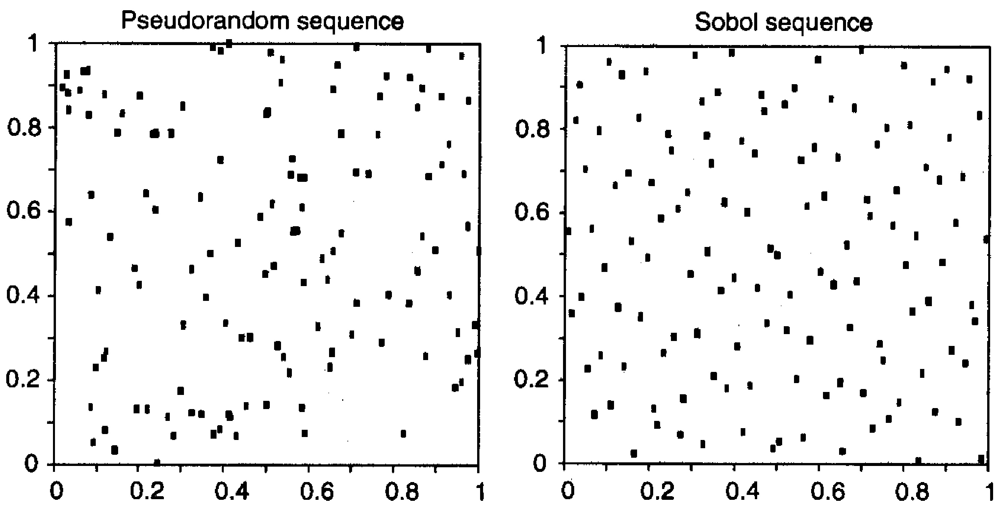

### Introdução
Como discutido anteriormente [^1], os métodos de Monte Carlo são amplamente utilizados em finanças para a avaliação de derivativos complexos e medição de risco, particularmente no cálculo do Value-at-Risk (VAR). Estes métodos envolvem a simulação repetida de um processo aleatório para a variável financeira de interesse [^2], cobrindo uma ampla gama de possíveis situações. A precisão dessas simulações depende crucialmente da qualidade dos números aleatórios gerados e da forma como são transformados para refletir o comportamento esperado das variáveis financeiras subjacentes. Esta seção foca na criação de números aleatórios para simulações de Monte Carlo, explorando o uso de geradores de números pseudoaleatórios e a técnica de transformação inversa da função de distribuição cumulativa (CDF).

### Conceitos Fundamentais

A essência das simulações de Monte Carlo reside na capacidade de gerar amostras aleatórias de uma distribuição de probabilidade especificada [^3]. Este processo geralmente começa com a geração de números aleatórios uniformemente distribuídos no intervalo [0, 1] [^3].

**Geradores de Números Pseudoaleatórios (PRNGs)**

Os números utilizados em simulações de Monte Carlo não são verdadeiramente aleatórios, mas sim *pseudoaleatórios* [^3]. Isso significa que são gerados por algoritmos determinísticos que produzem sequências que se assemelham a sequências aleatórias. Esses algoritmos são projetados para exibir propriedades estatísticas desejáveis, como uniformidade e falta de correlação serial [^7]. A escolha de um bom PRNG é crucial, pois as características da sequência gerada podem impactar significativamente os resultados da simulação [^7].

> 💡 **Exemplo Numérico:** Imagine usar um PRNG simples que gera a sequência 0, 1, 0, 1, 0, 1... Claramente, essa sequência não é aleatória e tem um ciclo curto (comprimento 2). Se usarmos isso para simular o preço de um ativo, o preço só poderá assumir dois valores, o que levará a uma subestimação drástica da variabilidade do ativo e, consequentemente, um cálculo incorreto do VAR.

**Caixa de Destaque:**

> É fundamental usar algoritmos de alta qualidade, como aqueles encontrados em bibliotecas numéricas, para evitar a introdução de dependências indesejadas no processo de simulação [^7]. PRNGs de baixa qualidade podem apresentar ciclos curtos, levando a estimativas incorretas de VAR [^7].

Além dos ciclos curtos, outra característica importante a ser considerada em PRNGs é a sua capacidade de passar em testes estatísticos rigorosos.

**Teorema 1** (Universalidade dos Testes Estatísticos): Um PRNG ideal deve ser capaz de passar em todos os testes estatísticos relevantes para garantir que suas sequências se comportem de forma semelhante a números verdadeiramente aleatórios. Uma falha em um teste estatístico indica um padrão não aleatório que pode comprometer a precisão da simulação.

**Transformação Inversa da CDF**

A partir de uma sequência de números aleatórios uniformemente distribuídos, é necessário transformar esses números em amostras de uma distribuição de probabilidade desejada. Uma técnica comum para realizar essa transformação é o método da *transformação inversa da CDF* [^3].

Dado um número aleatório $x$ uniformemente distribuído entre 0 e 1, e uma função de distribuição cumulativa (CDF) $N(y)$ da distribuição desejada, o método da transformação inversa encontra o valor $y$ tal que $x = N(y)$. Em outras palavras, $y = N^{-1}(x)$ [^3].

**Prova da validade da Transformação Inversa da CDF:**
Aqui, demonstraremos que se $X$ é uma variável aleatória uniformemente distribuída em $[0, 1]$, então $Y = F^{-1}(X)$ tem a função de distribuição cumulativa (CDF) $F$.

I. Seja $X \sim U(0,1)$ e $Y = F^{-1}(X)$, onde $F$ é uma CDF.

II. Queremos encontrar a CDF de $Y$, ou seja, $P(Y \leq y)$.

III. Substituindo $Y$ por $F^{-1}(X)$, temos $P(F^{-1}(X) \leq y)$.

IV. Aplicando a função $F$ a ambos os lados da desigualdade (e como $F$ é não decrescente, a desigualdade é preservada), temos $P(X \leq F(y))$.

V. Como $X$ é uniformemente distribuída em $[0, 1]$, $P(X \leq a) = a$ para $0 \leq a \leq 1$. Portanto, $P(X \leq F(y)) = F(y)$.

VI. Assim, $P(Y \leq y) = F(y)$, o que significa que $Y$ tem a CDF $F$. ■

**Exemplo: Geração de Números Normais**

Para gerar uma variável aleatória normalmente distribuída, utilizamos a CDF normal padrão, denotada por $N(y)$. A CDF normal padrão fornece a probabilidade de uma variável aleatória normal padrão ser menor ou igual a um dado valor $y$. Para gerar uma amostra de uma distribuição normal padrão, seguimos os seguintes passos [^3]:

1. Gere um número aleatório $x$ a partir de uma distribuição uniforme no intervalo [0, 1].
2. Calcule $y = N^{-1}(x)$, onde $N^{-1}$ é a função inversa da CDF normal padrão.

O valor resultante $y$ é uma amostra da distribuição normal padrão.

> 💡 **Exemplo Numérico:** Suponha que geramos um número aleatório $x = 0.8413$. Para encontrar o valor correspondente $y$ da distribuição normal padrão, precisamos calcular $N^{-1}(0.8413)$. Usando uma tabela de CDF normal padrão inversa ou uma função computacional (como `scipy.stats.norm.ppf` em Python), encontramos que $y \approx 1$. Isso significa que o valor 1 corresponde ao 84.13º percentil da distribuição normal padrão.

**Algoritmicamente, temos:**

Dado $x \sim U(0,1)$, encontramos $y$ tal que:

$$ x = N(y) = \int_{-\infty}^{y} \frac{1}{\sqrt{2\pi}} e^{-\frac{t^2}{2}} dt $$

Resolvendo para $y$, obtemos:

$$ y = N^{-1}(x) $$

Onde $N^{-1}(x)$ é a função quantil (inversa da CDF) da distribuição normal padrão.

> 💡 **Exemplo Numérico:**
>
> Suponha que queremos gerar 5 números aleatórios de uma distribuição normal padrão usando a transformação inversa da CDF. Primeiro, geramos 5 números aleatórios uniformemente distribuídos entre 0 e 1:
> ```python
> import numpy as np
> from scipy.stats import norm
>
> np.random.seed(42)  # Para reproducibilidade
> uniform_numbers = np.random.rand(5)
> print("Números uniformes:", uniform_numbers)
> ```
> ```
> Números uniformes: [0.37454012 0.95071431 0.73199394 0.59865848 0.15601864]
> ```
> Agora, aplicamos a transformação inversa da CDF para obter os correspondentes números normalmente distribuídos:
> ```python
> normal_numbers = norm.ppf(uniform_numbers)
> print("Números normais:", normal_numbers)
> ```
> ```
> Números normais: [-0.3203  1.6515  0.6184  0.2507 -1.0103]
> ```
> Cada um desses valores é uma amostra da distribuição normal padrão. Por exemplo, -0.3203 corresponde ao 37.45º percentil da distribuição normal padrão.

A figura 12-2 [^6] ilustra graficamente este processo de transformação, mostrando como um valor uniforme é mapeado para um valor normal correspondente através da CDF inversa.



**Considerações Computacionais**

A avaliação da função inversa da CDF pode ser computacionalmente intensiva, especialmente para distribuições complexas [^6]. Em algumas situações, aproximações ou métodos numéricos podem ser usados para acelerar o processo [^6]. Uma referência relevante é Moro (1995) [^6], que discute o uso de aproximações para a função $N^{-1}$ para acelerar os cálculos.

Para distribuições onde a CDF inversa não possui uma forma analítica fechada, métodos numéricos como a busca binária ou o método de Newton podem ser empregados para encontrar uma aproximação para $N^{-1}(x)$.

> 💡 **Exemplo Numérico:**  Considere uma distribuição cuja CDF não tem forma analítica fechada. Para encontrar $N^{-1}(0.6)$ usando o método de Newton, podemos iniciar com uma estimativa inicial, digamos $y_0 = 0$. Então iteramos usando a fórmula:
>
> $y_{n+1} = y_n - \frac{N(y_n) - 0.6}{n(y_n)}$
>
> Onde $N(y)$ é a CDF e $n(y)$ é a PDF da distribuição. Depois de algumas iterações, $y_n$ convergiria para uma aproximação de $N^{-1}(0.6)$.

**Proposição 1.1** (Convergência do Método de Newton para CDFs Inversas): O método de Newton pode ser usado para aproximar $N^{-1}(x)$ iterativamente, com a condição de que a CDF $N(y)$ seja diferenciável e sua derivada (a função densidade de probabilidade) seja conhecida e diferente de zero na vizinhança da solução.

*Estratégia da Prova:* A prova segue da aplicação padrão do método de Newton para encontrar raízes de funções. Dado $x = N(y)$, procuramos a raiz da função $f(y) = N(y) - x$. A iteração do método de Newton é dada por $y_{n+1} = y_n - \frac{f(y_n)}{f'(y_n)} = y_n - \frac{N(y_n) - x}{n(y_n)}$, onde $n(y)$ é a função densidade de probabilidade correspondente a $N(y)$. A convergência depende da escolha de um valor inicial adequado $y_0$ e das propriedades de $N(y)$.

**Prova da Proposição 1.1 (Convergência do Método de Newton para CDFs Inversas):**

I. Definimos a função $f(y) = N(y) - x$, onde $x$ é um valor conhecido entre 0 e 1 e $N(y)$ é a CDF cuja inversa queremos aproximar. Nosso objetivo é encontrar $y$ tal que $f(y) = 0$, o que equivale a encontrar $N^{-1}(x)$.

II. O método de Newton é um método iterativo dado por:
$$y_{n+1} = y_n - \frac{f(y_n)}{f'(y_n)}$$
Onde $y_n$ é a aproximação na $n$-ésima iteração e $y_{n+1}$ é a próxima aproximação.

III. Para a nossa função $f(y)$, a derivada $f'(y)$ é a derivada de $N(y)$ em relação a $y$, que é a função densidade de probabilidade (PDF) correspondente, denotada por $n(y)$. Portanto, $f'(y) = n(y)$.

IV. Substituindo $f(y)$ e $f'(y)$ na fórmula iterativa do método de Newton, obtemos:
$$y_{n+1} = y_n - \frac{N(y_n) - x}{n(y_n)}$$

V. Para garantir a convergência, $n(y)$ deve ser diferente de zero na vizinhança da raiz. Isso significa que a CDF deve ser estritamente crescente perto da solução $y = N^{-1}(x)$. Além disso, uma escolha adequada do valor inicial $y_0$ é crucial para a convergência.

VI. Sob estas condições (CDF diferenciável, PDF conhecida e diferente de zero na vizinhança da solução, e escolha adequada de $y_0$), a sequência $y_n$ converge para $N^{-1}(x)$ quando $n$ tende para o infinito. ■

Além disso, a eficiência da transformação inversa da CDF pode ser aumentada através do uso de tabelas pré-computadas de valores da CDF inversa.

**Lema 1.2** (Tabelamento da CDF Inversa): Para melhorar a eficiência computacional, a função $N^{-1}(x)$ pode ser tabelada para um conjunto discreto de valores de $x$ no intervalo [0, 1]. Durante a simulação, os valores de $N^{-1}(x)$ podem ser interpolados a partir da tabela, em vez de serem calculados diretamente.

*Estratégia da Prova:* A prova baseia-se na aproximação da função contínua $N^{-1}(x)$ por uma função linear por partes definida pelos pontos da tabela. A precisão da aproximação depende da densidade dos pontos na tabela e do método de interpolação utilizado. Métodos de interpolação mais sofisticados, como a interpolação spline, podem fornecer maior precisão com menos pontos na tabela.

**Prova do Lema 1.2 (Tabelamento da CDF Inversa):**

I. Divida o intervalo [0, 1] em $n$ subintervalos iguais, definidos pelos pontos $x_i = \frac{i}{n}$, onde $i = 0, 1, 2, \ldots, n$.

II. Calcule e armazene os valores correspondentes da CDF inversa, $y_i = N^{-1}(x_i)$, para cada $x_i$. Estes são os pontos da tabela.

III. Dado um valor $x$ no intervalo [0, 1], encontre o subintervalo $[x_k, x_{k+1}]$ tal que $x_k \leq x < x_{k+1}$.

IV. Aproxime $N^{-1}(x)$ usando interpolação linear entre os pontos $(x_k, y_k)$ e $(x_{k+1}, y_{k+1})$. A fórmula para interpolação linear é:
$$N^{-1}(x) \approx y_k + \frac{y_{k+1} - y_k}{x_{k+1} - x_k} (x - x_k)$$

V. A precisão da aproximação depende do tamanho dos subintervalos (ou seja, do valor de $n$). Quanto menor o tamanho dos subintervalos, mais precisa é a aproximação, mas maior é a necessidade de armazenamento e o tempo de pré-computação.

VI. Métodos de interpolação mais sofisticados (como interpolação spline) podem fornecer maior precisão com menos pontos na tabela, melhorando a eficiência geral. ■

> 💡 **Exemplo Numérico:** Imagine construir uma tabela para aproximar a CDF inversa da distribuição normal padrão. Dividimos o intervalo [0, 1] em 10 subintervalos iguais, obtendo os pontos $x_i = [0, 0.1, 0.2, ..., 0.9, 1.0]$. Calculamos os correspondentes valores da CDF inversa (quantis): $y_i = N^{-1}(x_i)$. Aqui estão alguns valores de exemplo (usando `scipy.stats.norm.ppf`):
>
> | $x_i$ | $N^{-1}(x_i)$ |
> |-------|-----------------|
> | 0.1   | -1.2816         |
> | 0.5   | 0.0             |
> | 0.9   | 1.2816          |
>
> Agora, se quisermos aproximar $N^{-1}(0.55)$, que não está na tabela, usamos interpolação linear entre os pontos $x_4 = 0.5$ e $x_5 = 0.6$:
>
> $N^{-1}(0.55) \approx N^{-1}(0.5) + \frac{N^{-1}(0.6) - N^{-1}(0.5)}{0.6 - 0.5} (0.55 - 0.5)$
>
> Supondo que $N^{-1}(0.6) \approx 0.2533$, então:
>
> $N^{-1}(0.55) \approx 0.0 + \frac{0.2533 - 0.0}{0.1} (0.05) = 0.12665$
>
> O valor real de $N^{-1}(0.55)$ é aproximadamente 0.12566, mostrando que a interpolação linear fornece uma aproximação razoável. A precisão pode ser aumentada usando mais pontos na tabela ou usando métodos de interpolação mais sofisticados.

### Conclusão
A geração de números aleatórios com as propriedades estatísticas desejadas é um passo crítico nas simulações de Monte Carlo. A combinação de geradores de números pseudoaleatórios de alta qualidade e a técnica da transformação inversa da CDF permite simular amostras de uma ampla variedade de distribuições de probabilidade [^3], tornando possível modelar o comportamento estocástico de variáveis financeiras complexas. A precisão e a eficiência dessas simulações têm um impacto direto na confiabilidade das medidas de risco, como o VAR [^2].

### Referências
[^1]: Capítulo introdutório sobre Métodos de Monte Carlo [^2].
[^2]: Seção sobre a utilização de métodos de Monte Carlo para simular o comportamento de preços financeiros.
[^3]: Descrição geral do processo de criação de números aleatórios para simulações de Monte Carlo [^6].
[^6]: Figura 12-2 e sua descrição, ilustrando a transformação de uma distribuição uniforme para uma distribuição normal.
[^7]: Discussão sobre a importância da qualidade dos geradores de números aleatórios e seus potenciais impactos nas simulações [^7].
<!-- END -->