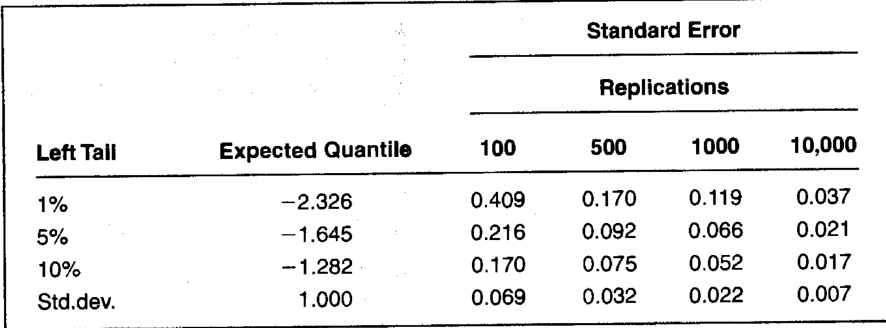

## O Método Bootstrap Adaptado para Modelos GARCH

### Introdução
Em continuidade ao tópico anterior, que introduziu o método *bootstrap* como uma alternativa não paramétrica para simulação em análise de risco [^7], esta seção aprofunda-se na adaptação do *bootstrap* para modelos com parâmetros variantes no tempo, especificamente modelos Generalized Autoregressive Conditional Heteroskedasticity (GARCH) [^8]. Esta adaptação visa mitigar a limitação da independência dos retornos, inerente ao *bootstrap* tradicional, e capturar a dinâmica de volatilidade comum em séries temporais financeiras.

### Conceitos Fundamentais
Modelos GARCH são amplamente utilizados para modelar a volatilidade condicional de séries temporais financeiras [^8]. A ideia central é que a volatilidade em um dado período depende da volatilidade e dos retornos dos períodos anteriores. Ao aplicar o *bootstrap* aos resíduos normalizados de um modelo GARCH, é possível simular cenários futuros que incorporam a dinâmica de volatilidade estimada pelo modelo [^8].

**Adaptação do Bootstrap para Modelos GARCH:**

1.  **Ajuste do Modelo GARCH:** Estima-se um modelo GARCH para a série histórica de retornos, obtendo os parâmetros do modelo e as volatilidades condicionais estimadas $\sigma_t$ para cada período $t$ [^8].

2.  **Cálculo dos Resíduos Normalizados:** Calcula-se os resíduos normalizados $\epsilon_t$ dividindo o retorno $r_t$ pela volatilidade condicional estimada $\sigma_t$:
    $$ \epsilon_t = \frac{r_t}{\sigma_t} $$
    Os resíduos normalizados representam os choques imprevisíveis nos retornos, após remover a dinâmica de volatilidade capturada pelo modelo GARCH [^8].

    > 💡 **Exemplo Numérico:** Suponha que o retorno $r_t$ em um dia seja 0.01 (1%) e a volatilidade condicional estimada $\sigma_t$ pelo modelo GARCH seja 0.02 (2%). Então, o resíduo normalizado seria:
    > $$\epsilon_t = \frac{0.01}{0.02} = 0.5$$
    > Este valor de 0.5 representa o choque normalizado no retorno, indicando que o retorno foi metade do desvio padrão esperado com base na volatilidade condicional.

3.  **Reamostragem dos Resíduos Normalizados:** Aplica-se o método *bootstrap* aos resíduos normalizados $\epsilon_t$, reamostrando-os com reposição para criar uma nova série de resíduos normalizados $\epsilon_t^*$ [^8].

    > 💡 **Exemplo Numérico:** Se temos os seguintes resíduos normalizados: [-0.5, 0.2, 1.0, -0.8, 0.3]. Ao reamostrar com reposição, podemos obter uma nova série como: [0.2, -0.5, 0.3, 1.0, -0.5]. Note que alguns valores podem se repetir, e outros podem não aparecer na amostra reamostrada.

4.  **Reconstrução dos Pseudoretornos:** Utiliza-se a série de resíduos normalizados reamostrados $\epsilon_t^*$ e as volatilidades condicionais estimadas $\sigma_t$ para reconstruir uma nova série de retornos simulados $r_t^*$:

    $$ r_t^* = \epsilon_t^* \cdot \sigma_t $$
    Esta etapa garante que os pseudoretornos simulados incorporem a dinâmica de volatilidade modelada pelo GARCH [^8].

    > 💡 **Exemplo Numérico:** Usando o resíduo normalizado reamostrado $\epsilon_t^* = 0.2$ e a volatilidade condicional estimada $\sigma_t = 0.02$, o pseudoretorno simulado seria:
    > $$r_t^* = 0.2 \cdot 0.02 = 0.004$$
    > Isso significa que o retorno simulado é 0.4%, incorporando a volatilidade estimada pelo modelo GARCH.

5.  **Simulação da Volatilidade Futura:** Para simular a volatilidade futura, utiliza-se o modelo GARCH com os parâmetros estimados e os pseudoretornos simulados $r_t^*$ para projetar as volatilidades condicionais futuras $\sigma_{t+1}, \sigma_{t+2}, \ldots$. Isso requer uma inicialização adequada da volatilidade, geralmente utilizando a última volatilidade condicional estimada na série histórica [^8].

    > 💡 **Exemplo Numérico:** Suponha um modelo GARCH(1,1) da forma:
    > $$\sigma_{t+1}^2 = \alpha_0 + \alpha_1 r_t^{*2} + \beta_1 \sigma_t^2$$
    > Com parâmetros estimados $\alpha_0 = 0.00001$, $\alpha_1 = 0.05$, $\beta_1 = 0.9$, o último retorno simulado $r_t^* = 0.004$, e a última volatilidade condicional estimada $\sigma_t^2 = 0.0004$, a volatilidade condicional para o próximo período seria:
    > $$\sigma_{t+1}^2 = 0.00001 + 0.05 \cdot (0.004)^2 + 0.9 \cdot 0.0004 = 0.0003708$$
    > $$\sigma_{t+1} = \sqrt{0.0003708} \approx 0.01926$$
    > A volatilidade condicional projetada para o próximo período é de aproximadamente 1.93%.

6.  **Repetição:** Repete-se os passos 3 a 5 um grande número de vezes (K vezes) para gerar uma distribuição de possíveis trajetórias futuras dos retornos e das volatilidades [^8].

    > 💡 **Exemplo Numérico:** Se repetirmos os passos 3 a 5 K = 1000 vezes, teremos 1000 trajetórias possíveis de retornos e volatilidades. Podemos usar essas trajetórias para calcular diversas estatísticas de risco, como o VAR.

7.  **Cálculo do VAR:** Utiliza-se as trajetórias simuladas dos retornos para calcular o valor do portfólio em cada cenário. O VAR é então estimado a partir dos quantis da distribuição dos valores simulados do portfólio [^8].

    > 💡 **Exemplo Numérico:** Suponha que simulamos 1000 trajetórias e calculamos o valor do portfólio para cada uma delas. Para estimar o VAR a 95%, ordenamos os valores do portfólio e pegamos o 50º menor valor. Este valor representa a perda que não deve ser excedida em 95% dos cenários simulados.

**Teorema 1** [Convergência Assintótica do Bootstrap para Estatísticas Suaves]: Seja $G(F)$ uma estatística suave da função de distribuição empírica $F$. Sob certas condições de regularidade, a distribuição *bootstrap* de $G(F^*)$ converge fracamente para a distribuição de $G(F)$ quando o tamanho da amostra tende ao infinito.

*Estratégia da Demonstração:* A demonstração envolve o uso do Teorema da Função Delta e argumentos de convergência fraca. É necessário mostrar que a estatística $G$ é suficientemente suave e que a função de distribuição empírica converge para a verdadeira função de distribuição.

**Observação:** O Teorema 1 estabelece a base teórica para a validade do método *bootstrap* em uma ampla classe de problemas estatísticos. No contexto do *bootstrap*-GARCH, a estatística $G(F)$ pode representar o VAR ou outras medidas de risco calculadas a partir das trajetórias simuladas dos retornos.

**Proposição 2.1** [Consistência do Estimador Bootstrap-GARCH]: Sob certas condições de regularidade do modelo GARCH e da série histórica, o estimador *bootstrap* do VAR baseado nos resíduos normalizados de um modelo GARCH converge em probabilidade para o verdadeiro VAR à medida que o tamanho da amostra histórica aumenta e o número de simulações *bootstrap* tende ao infinito.

*Estratégia da Demonstração:* A demonstração envolve combinar a teoria da convergência dos estimadores de modelos GARCH com a teoria da convergência do *bootstrap*. É necessário garantir que os resíduos normalizados converjam para uma distribuição bem comportada e que o modelo GARCH capture adequadamente a dinâmica de volatilidade.

*Prova da Proposição 2.1:*

I. Seja $VaR_{\alpha}$ o verdadeiro Valor em Risco ao nível $\alpha$. Seja $\widehat{VaR}_{\alpha, K}^{GARCH}$ o estimador Bootstrap-GARCH do VaR, baseado em $K$ simulações Bootstrap dos resíduos normalizados de um modelo GARCH.

II. Queremos mostrar que para qualquer $\epsilon > 0$,
   $$P(|\widehat{VaR}_{\alpha, K}^{GARCH} - VaR_{\alpha}| > \epsilon) \rightarrow 0 \quad \text{quando } M \rightarrow \infty \text{ e } K \rightarrow \infty$$
   onde $M$ é o tamanho da amostra histórica.

III. Sob condições de regularidade do modelo GARCH (por exemplo, existência de momentos finitos, condições de estacionariedade) e da série histórica, os estimadores dos parâmetros do modelo GARCH são consistentes. Isso significa que os parâmetros estimados $\widehat{\theta}$ convergem para os verdadeiros parâmetros $\theta$ quando $M \rightarrow \infty$.

IV. Além disso, sob condições de regularidade, os resíduos normalizados $\epsilon_t = r_t / \sigma_t$ convergem para uma distribuição com média zero e variância unitária.

V. Pela Proposição 1, a distribuição empírica dos resíduos normalizados reamostrados converge para a verdadeira distribuição dos resíduos normalizados quando $K \rightarrow \infty$.

VI. Combinando esses resultados, temos que as trajetórias simuladas dos retornos $r_t^* = \epsilon_t^* \cdot \sigma_t$ convergem para a verdadeira distribuição dos retornos, dado o modelo GARCH. Portanto, o estimador Bootstrap-GARCH do VAR converge em probabilidade para o verdadeiro VAR quando $M \rightarrow \infty$ e $K \rightarrow \infty$. ■

**Lema 2.1** [Efeito da Estimação dos Parâmetros GARCH]: A precisão da estimativa dos parâmetros do modelo GARCH tem um impacto direto na precisão do VAR estimado via Bootstrap-GARCH.

*Estratégia da Demonstração:* A demonstração pode ser feita através de simulações de Monte Carlo, onde se varia a precisão da estimativa dos parâmetros GARCH (e.g., usando diferentes tamanhos de amostra para a estimação inicial) e observa-se o impacto na distribuição do VAR estimado.

**Lema 2.2** [Impacto do Tamanho da Amostra no Bootstrap-GARCH]: Tamanhos de amostra históricos pequenos podem levar a estimativas imprecisas dos parâmetros do modelo GARCH e a uma representação pobre da distribuição dos resíduos normalizados, afetando a precisão do estimador *bootstrap* do VAR.

*Estratégia da Demonstração:* A demonstração envolve simulações de Monte Carlo para avaliar o desempenho do estimador *bootstrap* do VAR com diferentes tamanhos de amostra histórica. Métricas como viés, erro quadrático médio e cobertura dos intervalos de confiança podem ser usadas para quantificar o impacto do tamanho da amostra.

*Prova do Lema 2.2:*

I. Seja $M$ o tamanho da amostra histórica. O desempenho do Bootstrap-GARCH depende da precisão das estimativas dos parâmetros do modelo GARCH.

II. A precisão das estimativas dos parâmetros do modelo GARCH aumenta com o tamanho da amostra. Para um modelo GARCH(1,1), a variância dos estimadores dos parâmetros diminui com $M$.

III. Se $M$ é pequeno, as estimativas dos parâmetros do modelo GARCH podem ser imprecisas e instáveis. Isso leva a estimativas imprecisas das volatilidades condicionais $\sigma_t$ e, consequentemente, a resíduos normalizados $\epsilon_t$ que não representam adequadamente os choques imprevisíveis nos retornos.

IV. A reamostragem desses resíduos imprecisos leva a simulações de trajetórias de retornos que não refletem a verdadeira dinâmica da série temporal. Isso afeta a precisão do estimador Bootstrap-GARCH do VAR.

V. Simulações de Monte Carlo podem ser usadas para quantificar esse impacto. Ao simular dados de um modelo GARCH conhecido e aplicar o Bootstrap-GARCH com diferentes tamanhos de amostra, podemos avaliar o viés e o erro quadrático médio do estimador do VAR. ■

**Vantagens da Adaptação GARCH:**

*   **Captura da Volatilidade Condicional:** Incorpora a dinâmica de volatilidade, que é uma característica fundamental de séries temporais financeiras [^8].
*   **Melhoria na Precisão:** Pode levar a estimativas de risco mais precisas, especialmente em períodos de alta volatilidade [^8].

**Limitações da Adaptação GARCH:**

*   **Complexidade:** A implementação é mais complexa do que o *bootstrap* tradicional, exigindo o ajuste e a validação do modelo GARCH [^8].
*   **Sensibilidade ao Modelo:** A precisão das estimativas depende da qualidade do modelo GARCH ajustado. Um modelo mal especificado pode levar a resultados enganosos [^8].
*   **Assunção de Estacionariedade:** Modelos GARCH geralmente assumem estacionariedade dos retornos, o que pode não ser válido em todos os cenários [^8].

**Corolário 2.1** [Intervalos de Confiança para o VAR Bootstrap-GARCH]: Intervalos de confiança para o VAR podem ser construídos a partir da distribuição *bootstrap* das simulações. A amplitude desses intervalos reflete a incerteza na estimativa do VAR.

*Estratégia da Demonstração:* Os intervalos de confiança podem ser construídos usando métodos percentis ou métodos baseados no erro padrão *bootstrap*. A escolha do método depende das propriedades da distribuição *bootstrap*.

*Prova do Corolário 2.1:*
I. Seja $\widehat{VaR}_{\alpha, K}^{GARCH, (i)}$ o $i$-ésimo estimador Bootstrap-GARCH do VaR, onde $i = 1, \dots, K$. Esses estimadores são obtidos a partir de $K$ simulações independentes do Bootstrap-GARCH.

II. Ordenamos os estimadores Bootstrap-GARCH do VaR: $\widehat{VaR}_{\alpha, K}^{GARCH, (1)} \leq \widehat{VaR}_{\alpha, K}^{GARCH, (2)} \leq \dots \leq \widehat{VaR}_{\alpha, K}^{GARCH, (K)}$.

III. Para um nível de confiança $1 - \gamma$, onde $\gamma \in (0, 1)$, o intervalo de confiança percentil Bootstrap-GARCH é dado por:
$$IC = [\widehat{VaR}_{\alpha, K}^{GARCH, (K \cdot \gamma/2)}, \widehat{VaR}_{\alpha, K}^{GARCH, (K \cdot (1 - \gamma/2))}]$$
onde $K \cdot \gamma/2$ e $K \cdot (1 - \gamma/2)$ são arredondados para o inteiro mais próximo.

IV. A amplitude deste intervalo de confiança reflete a incerteza na estimativa do VaR. Intervalos mais amplos indicam maior incerteza. A convergência deste intervalo para um intervalo centrado no verdadeiro $VaR_{\alpha}$ depende da consistência do estimador Bootstrap-GARCH (Proposição 2.1). ■

    > 💡 **Exemplo Numérico:** Se temos K=1000 simulações Bootstrap-GARCH do VaR, e queremos construir um intervalo de confiança de 95% (γ = 0.05), então:
    >  *  $K \cdot \gamma/2 = 1000 \cdot 0.05/2 = 25$
    >  *  $K \cdot (1 - \gamma/2) = 1000 \cdot (1 - 0.05/2) = 975$
    > O intervalo de confiança de 95% seria dado pelos estimadores Bootstrap-GARCH do VaR nas posições 25 e 975 da lista ordenada. Se $\widehat{VaR}_{\alpha, K}^{GARCH, (25)} = -0.05$ e $\widehat{VaR}_{\alpha, K}^{GARCH, (975)} = -0.02$, então o intervalo de confiança de 95% para o VaR seria [-0.05, -0.02].

### Conclusão
A adaptação do método *bootstrap* para modelos GARCH representa uma abordagem sofisticada para a análise de risco, permitindo a incorporação da dinâmica de volatilidade em simulações baseadas em dados históricos [^8]. Embora apresente maior complexidade e dependência da qualidade do modelo GARCH, essa técnica pode levar a estimativas de risco mais precisas e robustas, especialmente em mercados voláteis [^8]. A escolha entre o *bootstrap* tradicional e a adaptação GARCH depende das características dos dados e dos objetivos da análise de risco.

## 12.3 Speed Versus Accuracy

### Acurácia e Variabilidade
As simulações inerentemente geram **variabilidade de amostragem**, ou variações nos valores dos estimadores, devido ao número limitado de replicações [^316]. Mais replicações levam a estimativas mais precisas, mas demoram mais para serem estimadas [^316]. Defina $K$ como o número de replicações, ou tentativas pseudoaleatórias. Para escolher $K$, é útil avaliar o *trade-off* entre precisão e o número de replicações [^316].

A Figura 12-3 [^317] ilustra a **convergência da distribuição empírica** na Figura 12-1 para a verdadeira. Com $K = 100$, o histograma que representa a distribuição do preço final é bastante irregular [^317]. O histograma torna-se mais suave com 1000 replicações, ainda mais com 10.000 replicações, e eventualmente deve convergir para a distribuição contínua no painel direito [^317]. Uma vantagem do método de Monte Carlo é que o usuário pode avaliar o aumento na precisão diretamente à medida que o número de replicações aumenta [^317].

Se o processo subjacente for normal, a distribuição empírica deve convergir para uma distribuição normal [^317]. Nesta situação, a análise de Monte Carlo deve produzir exatamente o mesmo resultado que o método delta-normal: o VAR estimado do quantil da amostra deve convergir para o valor de $\alpha\sigma$ [^317]. Qualquer desvio deve-se à variação da amostragem [^317]. Assumindo nenhuma outra fonte de erro, este efeito pode ser medido pelo erro padrão assintótico para o quantil da amostra relatado no Capítulo 5, usando $K$ como o tamanho da amostra [^317]. Um método simples para avaliar a precisão é repetir as simulações múltiplas vezes, digamos, $M = 1000$, e calcular o erro padrão dos quantis estimados nos experimentos $M$ [^317]. Isso é ilustrado na Tabela 12-2 [^318].

A Tabela 12-2 [^318] descreve os resultados de 1000 execuções de simulação em uma distribuição normal padrão com um número crescente de replicações. A tabela mostra que, para um VAR de 99% com 100 replicações, o erro padrão da estimativa em torno de -2,326 é 0,409, bastante alto [^318]. Em nossa amostra de 1000 execuções, a estimativa de VAR variou de -4,17 a -1,53 [^318]. Essa dispersão é bastante perturbadora [^318]. Para aumentar a precisão do VAR por um fator de 10, precisamos aumentar o número de replicações por um fator de 100, para um total de 10.000 [^318]. De fato, a primeira linha mostra que isso diminui o erro padrão para 0,037, que é aproximadamente 0,409 dividido por 10 [^318]. Note que, em contraste, o desvio padrão é estimado de forma muito mais precisa porque usa dados de toda a distribuição [^318].

Também poderíamos relatar o erro padrão em termos relativos, definido como a razão entre o erro padrão e o valor esperado da medida de risco [^318]. Por exemplo, os bancos normalmente relatam seu VAR de 99% usando cerca de 500 dias [^318]. Da Tabela 12-2 [^318], isso leva a um erro relativo no VAR de cerca de 0,170/2,326 = 7,3% [^318].

> 💡 **Exemplo Numérico:** Vamos supor que um banco estima seu VAR de 99% usando 500 replicações e obtém um VAR de \$ 1 milhão. Usando a Tabela 12-2, o erro padrão é aproximadamente 0.170 * desvio padrão. Se o desvio padrão do portfólio for \$ 10 milhões, o erro padrão do VAR seria 0.170 * 10 = \$ 1.7 milhões. O erro relativo seria \$ 1.7/\$ 1 = 170%. Isso demonstra como o erro relativo pode ser significativo com um número limitado de simulações.

O erro relativo depende do número de replicações, bem como da forma da distribuição, como mostrado na Tabela 12-3 [^319]. A tabela mostra que o erro é maior para distribuições com assimetria à esquerda e, inversamente, menor para distribuições com assimetria à direita [^319]. Isso ocorre porque quanto mais longa a cauda esquerda, menos precisa é a estimativa de VAR [^319].

Alternativamente, poderíamos procurar o número de replicações necessárias para medir o VAR com um erro relativo de 1% [^319]. Para a distribuição normal, precisamos de mais de 20.000 replicações para garantir que o erro relativo na primeira linha esteja abaixo de 1% [^319].

### Métodos de Aceleração

Isso levou a uma busca por **métodos para acelerar os cálculos** [^319]. Um dos mais antigos e fáceis é a **técnica da variável antitética**, que consiste em mudar o sinal de todas as amostras aleatórias $\epsilon$ [^319]. Este método, que é apropriado quando a distribuição original é simétrica, cria o dobro do número de replicações para os fatores de risco a um custo adicional pequeno [^319]. Ainda precisamos, no entanto, do dobro do número original de avaliações completas na data de destino [^319].

> 💡 **Exemplo Numérico:** Imagine que estamos simulando retornos usando uma distribuição normal padrão. Geramos um número aleatório $\epsilon = 0.7$. Com a técnica da variável antitética, também usaríamos $-\epsilon = -0.7$. Se o retorno simulado for calculado como $r = \mu + \sigma\epsilon$, onde $\mu = 0$ e $\sigma = 0.1$, teríamos dois retornos simulados: $r_1 = 0 + 0.1 * 0.7 = 0.07$ e $r_2 = 0 + 0.1 * (-0.7) = -0.07$. Isso dobra o número de simulações efetivas sem gerar números aleatórios adicionais.

Essa abordagem pode ser aplicada ao método de simulação histórica, onde podemos adicionar um vetor de mudanças históricas de preços com o sinal invertido [^319]. Isso também é útil para eliminar o efeito de tendências nos dados históricos recentes [^319].

Outra ferramenta útil é a **técnica das variáveis de controle** [^319]. Estamos tentando estimar o VAR, uma função da amostra de dados [^319]. Chame isso de $V(X)$ [^319]. Assuma agora que a função pode ser aproximada por outra função, como uma aproximação quadrática $V^0(X)$, para a qual temos uma solução de forma fechada $v^0$ [^319].

Para qualquer amostra, o erro então é conhecido como sendo $V^0(X) - v^0$ para a aproximação quadrática [^320]. Se este erro for altamente correlacionado com o erro de amostragem em $V(X)$, o estimador de variável de controle pode ser tomado como

$$V_{CV} = V(X) - [V^0(X) - v^0] \qquad (12.5)$$

Este estimador tem uma variância muito menor do que o original quando a função quadrática fornece uma boa aproximação da verdadeira função [^320].

*Prova da redução da variância do estimador de variável de controle:*

I. Sejam $V(X)$ o estimador original e $V_{CV}$ o estimador de variável de controle, dado por $V_{CV} = V(X) - [V^0(X) - v^0]$, onde $V^0(X)$ é uma aproximação de $V(X)$ com valor esperado conhecido $v^0 = E[V^0(X)]$.

II. A variância do estimador de variável de controle é:
$$Var(V_{CV}) = Var(V(X) - [V^0(X) - v^0]) = Var(V(X) - V^0(X))$$
pois $v^0$ é uma constante e não contribui para a variância.

III. Expandindo a variância, temos:
$$Var(V_{CV}) = Var(V(X)) + Var(V^0(X)) - 2Cov(V(X), V^0(X))$$

IV. Queremos mostrar que $Var(V_{CV}) < Var(V(X))$. Isso é equivalente a mostrar que:
$$Var(V^0(X)) < 2Cov(V(X), V^0(X))$$

V. Usando a definição de correlação, $\rho = \frac{Cov(V(X), V^0(X))}{\sqrt{Var(V(X))Var(V^0(X))}}$, podemos reescrever a covariância como:
$$Cov(V(X), V^0(X)) = \rho \sqrt{Var(V(X))Var(V^0(X))}$$

VI. Substituindo na desigualdade, obtemos:
$$Var(V^0(X)) < 2\rho \sqrt{Var(V(X))Var(V^0(X))}$$
Dividindo ambos os lados por $\sqrt{Var(V^0(X))}$, temos:
$$\sqrt{Var(V^0(X))} < 2\rho \sqrt{Var(V(X))}$$
Elevando ao quadrado ambos os lados:
$$Var(V^0(X)) < 4\rho^2 Var(V(X))$$

VII. Para que $Var(V_{CV}) < Var(V(X))$, é suficiente que a correlação $\rho$ entre $V(X)$ e $V^0(X)$ seja alta o suficiente. Especificamente, se $\rho > \frac{1}{2} \sqrt{\frac{Var(V^0(X))}{Var(V(X))}}$, então a variância do estimador de variável de controle será menor do que a variância do estimador original. Em casos práticos, uma correlação alta entre $V(X)$ e $V^0(X)$ garante a redução da variância. ■

> 💡 **Exemplo Numérico:** Suponha que queremos estimar o VAR de uma carteira de opções usando simulação de Monte Carlo ($V(X)$). Podemos aproximar o VAR usando o método delta-normal ($V^0(X)$), que tem uma solução analítica ($v^0$). Se o VAR estimado por simulação for $V(X) = \$ 1.2 milhão e o VAR estimado pelo método delta-normal for $V^0(X) = \$ 1 milhão (com $v^0 = \$ 1 milhão), então o estimador de variável de controle seria:
>
> $$V_{CV} = V(X) - [V^0(X) - v^0] = 1.2 - [1 - 1] = 1.2 \text{ (milhões)}$$
>
> Neste caso particular, a aproximação delta-normal não adiciona informação, mas em geral, se a aproximação delta-normal fosse uma estimativa melhor, reduziria a variância do estimador.

O método de aceleração mais eficaz é a **técnica de amostragem por importância**, que tenta amostrar ao longo dos caminhos que são mais importantes para o problema em questão [^320]. A ideia é que, se nosso objetivo é medir com precisão um quantil de cauda, não há sentido em fazer simulações que gerem observações no centro da distribuição [^320]. O método envolve mudanças na distribuição de variáveis aleatórias [^320]. Glasserman et al. (2000) [^320] mostram que, em relação ao método de Monte Carlo usual, a variância dos estimadores de VAR pode ser reduzida por um fator de pelo menos 10 [^320].

Uma aplicação relacionada é a **técnica de amostragem estratificada**, que pode ser explicada intuitivamente da seguinte forma: assuma que precisamos de VAR para uma posição longa em uma opção de compra [^320]. Estamos tentando manter o número de replicações em $K = 1000$ [^320]. Para aumentar a precisão do estimador de VAR, poderíamos particionar a região de simulação em duas zonas [^320]. Como antes, começamos com uma distribuição uniforme, que então é transformada em uma distribuição normal para o preço do ativo subjacente usando o *método de transformação inversa* [^320].

Defina essas duas zonas, ou estratos, para a distribuição uniforme como [0,0, 0,1] e [0,1, 1,0] [^320]. Assim, *estratificação* é o processo de agrupar os dados em regiões mutuamente exclusivas e coletivamente exaustivas [^320]. Normalmente, as probabilidades do número aleatório cair em ambas as zonas são selecionadas como $p_1 = 10\%$ e $p_2 = 90\%$, respectivamente [^320]. Agora mudamos essas probabilidades para 50% para ambas as regiões [^320]. O número de observações agora é $K_1 = 500$ para a primeira região e $K_2 = 500$ para a segunda [^320]. Isso aumenta o número de amostras para o fator de risco na primeira região da cauda esquerda [^320].

Os estimadores para a média precisam ser ajustados para a estratificação [^320]. Ponderamos o estimador para cada região por sua probabilidade, isto é,

$$E(F_T) = p_1 \frac{\sum_{i=1}^{K_1} F_i}{K_1} + p_2 \frac{\sum_{i=1}^{K_2} F_i}{K_2} \qquad (12.6)$$

> 💡 **Exemplo Numérico:** Imagine que estamos simulando o preço de uma opção de compra no vencimento ($F_T$). Dividimos a distribuição uniforme em duas zonas: [0, 0.1] e [0.1, 1.0]. Inicialmente, a probabilidade de um número aleatório cair na primeira zona (cauda esquerda) é $p_1 = 0.1$ e na segunda zona é $p_2 = 0.9$. Com amostragem estratificada, mudamos as probabilidades para $p_1 = 0.5$ e $p_2 = 0.5$, e realizamos $K_1 = 500$ simulações na primeira zona e $K_2 = 500$ simulações na segunda zona. Se a média dos preços simulados na primeira zona for $\frac{\sum_{i=1}^{500} F_i}{500} = \$ 10 e a média na segunda zona for $\frac{\sum_{i=1}^{500} F_i}{500} = \$ 50, então o preço esperado da opção seria:
>
> $$E(F_T) = p_1 \cdot \frac{\sum_{i=1}^{K_1} F_i}{K_1} + p_2 \cdot \frac{\sum_{i=1}^{K_2} F_i}{K_2} = 0.1 \cdot 10 + 0.9 \cdot 50 = 46 \text{ (sem amostragem estratificada)}$$
> $$E(F_T) = p_1 \cdot \frac{\sum_{i=1}^{K_1} F_i}{K_1} + p_2 \cdot \frac{\sum_{i=1}^{K_2} F_i}{K_2} = 0.5 \cdot 10 + 0.5 \cdot 50 = 30 \text{ (com amostragem estratificada)}$$
>
> Ajustando as probabilidades e amostrando igualmente em ambas as zonas, damos mais peso à cauda esquerda, o que melhora a precisão da estimativa do VAR.
<!-- END -->