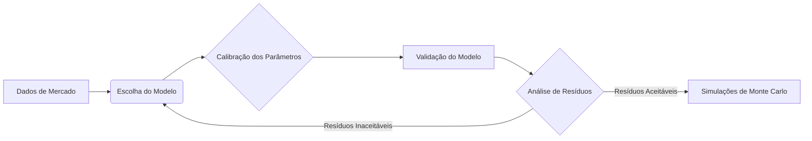

### Título Conciso
### Introdução
Em continuidade ao Capítulo 12 que trata dos **métodos de Monte Carlo** para análise de risco financeiro, esta seção se aprofunda na importância da escolha do modelo estocástico subjacente utilizado nas simulações [^1]. Como vimos anteriormente, os métodos de Monte Carlo são amplamente empregados na avaliação de Value at Risk (VAR) e em outros cálculos de risco [^1]. Entretanto, a eficácia desses métodos está intrinsecamente ligada à adequação do modelo estocástico escolhido para representar o comportamento dos ativos financeiros em questão. Esta seção explora as implicações da escolha do modelo, destacando as limitações do **Geometric Brownian Motion (GBM)** para ativos de renda fixa e discutindo alternativas mais apropriadas [^1]. Além disso, exploraremos como a calibração dos parâmetros desses modelos impacta a precisão das simulações de Monte Carlo.

### Conceitos Fundamentais
A aplicação dos métodos de Monte Carlo em finanças envolve a simulação repetida de um processo aleatório para a variável financeira de interesse [^1]. Essas variáveis são derivadas de distribuições de probabilidade pré-especificadas [^1]. A escolha inadequada de um modelo estocástico pode levar a estimativas de VAR imprecisas e a uma representação inadequada do perfil de risco [^1].

**Model Risk**: A principal desvantagem dos métodos de simulação é sua suscetibilidade ao risco do modelo. Se o processo estocástico escolhido para o preço não for realista, também o será a estimativa do VAR [^2]. Por esta razão, a escolha do processo subjacente é particularmente importante [^2].

**Geometric Brownian Motion (GBM)**: O modelo **GBM**, descrito na Equação (12.1), é frequentemente utilizado para modelar o comportamento de preços de ações e taxas de câmbio [^3]:
$$ dS_t = \mu S_t dt + \sigma S_t dz $$
onde $dS_t$ representa a variação infinitesimal do preço do ativo no tempo *t*, $\mu$ é a taxa de retorno esperada, $\sigma$ é a volatilidade e $dz$ é um processo de Wiener. O modelo assume que as inovações no preço do ativo são não correlacionadas ao longo do tempo e que pequenos movimentos nos preços podem ser descritos por um movimento browniano [^3].

> 💡 **Exemplo Numérico:**
> Suponha que modelamos o preço de uma ação usando GBM. Seja o preço inicial da ação $S_0 = 100$, a taxa de retorno esperada $\mu = 0.10$ (10% ao ano) e a volatilidade $\sigma = 0.20$ (20% ao ano). Simulemos a trajetória do preço da ação por um ano usando 252 passos de tempo (dias úteis).
>
> ```python
> import numpy as np
> import matplotlib.pyplot as plt
>
> # Parâmetros
> S0 = 100      # Preço inicial da ação
> mu = 0.10      # Taxa de retorno esperada
> sigma = 0.20   # Volatilidade
> T = 1          # Tempo em anos
> N = 252        # Número de passos de tempo
> dt = T/N       # Intervalo de tempo
>
> # Simulação
> np.random.seed(42) # Para reproducibilidade
> dZ = np.random.normal(0, 1, N) * np.sqrt(dt)  # Incrementos de Wiener
> S = np.zeros(N+1)
> S[0] = S0
>
> for t in range(1, N+1):
>     dS = mu * S[t-1] * dt + sigma * S[t-1] * dZ[t-1]
>     S[t] = S[t-1] + dS
>
> # Plotagem
> plt.plot(S)
> plt.xlabel("Tempo (dias)")
> plt.ylabel("Preço da Ação")
> plt.title("Simulação GBM do Preço da Ação")
> plt.grid(True)
> plt.show()
> ```
>
> Interpretação: A simulação mostra uma possível trajetória do preço da ação ao longo de um ano. Devido à aleatoriedade do processo de Wiener, cada simulação resultará em uma trajetória diferente. O preço da ação tende a aumentar ao longo do tempo devido à taxa de retorno esperada positiva, mas também apresenta flutuações devido à volatilidade. Podemos executar várias simulações (Monte Carlo) para estimar a distribuição dos preços futuros e calcular medidas de risco, como o VAR.


**Inadequação do GBM para Renda Fixa**: Embora o GBM possa ser adequado para alguns ativos financeiros, ele não é apropriado para títulos de renda fixa [^2]. Nos modelos de movimento browniano, os choques no preço nunca são revertidos, e os preços se movem como um passeio aleatório [^2]. Isso não pode representar o processo de preço para títulos livres de *default*, que devem convergir para seu valor de face no vencimento [^2]. O modelo **GBM**, portanto, falha em capturar a dinâmica específica dos juros e a reversão à média característica dos títulos de renda fixa.

**Modelos de Taxa de Juros**: Uma abordagem alternativa é modelar a dinâmica das taxas de juros como [^2]:
$$ dr_t = \kappa(\theta - r_t)dt + \sigma r_t^\gamma dz_t$$
onde $r_t$ é a taxa de juros, $\kappa$ é a velocidade de reversão à média, $\theta$ é o nível de reversão à média, $\sigma$ é a volatilidade e $\gamma$ é um parâmetro que determina a sensibilidade da volatilidade ao nível da taxa de juros.

> 💡 **Exemplo Numérico:**
> Consideremos o modelo de Vasicek (γ = 0) com os seguintes parâmetros: $\kappa = 0.1$, $\theta = 0.05$ (5%), $\sigma = 0.02$ (2%). O valor inicial da taxa de juros é $r_0 = 0.04$ (4%). Simulemos a trajetória da taxa de juros por 10 anos com passos de tempo mensais (120 passos).
>
> ```python
> import numpy as np
> import matplotlib.pyplot as plt
>
> # Parâmetros do modelo de Vasicek
> kappa = 0.1    # Velocidade de reversão à média
> theta = 0.05   # Nível de reversão à média
> sigma = 0.02   # Volatilidade
> r0 = 0.04      # Taxa de juros inicial
> T = 10         # Tempo em anos
> N = 120        # Número de passos de tempo (mensal)
> dt = T/N       # Intervalo de tempo
>
> # Simulação
> np.random.seed(42) # Para reproducibilidade
> dZ = np.random.normal(0, 1, N) * np.sqrt(dt)  # Incrementos de Wiener
> r = np.zeros(N+1)
> r[0] = r0
>
> for t in range(1, N+1):
>     dr = kappa * (theta - r[t-1]) * dt + sigma * dZ[t-1]
>     r[t] = r[t-1] + dr
>
> # Plotagem
> plt.plot(r)
> plt.xlabel("Tempo (meses)")
> plt.ylabel("Taxa de Juros")
> plt.title("Simulação do Modelo de Vasicek para Taxa de Juros")
> plt.grid(True)
> plt.show()
> ```
>
> Interpretação: A simulação mostra que a taxa de juros tende a retornar ao nível de longo prazo de 5% ($\theta$) devido ao termo de reversão à média. A velocidade de reversão ($\kappa$) determina quão rapidamente a taxa de juros se move em direção a esse nível. A volatilidade ($\sigma$) introduz flutuações aleatórias. Note que em algumas simulações, a taxa de juros pode se tornar negativa, o que é uma limitação do modelo de Vasicek (já que γ = 0).

Essa classe de modelo inclui o modelo Vasicek (1977) quando γ = 0; as mudanças nos rendimentos são então normalmente distribuídas, o que é particularmente conveniente porque isso leva a muitas soluções de forma fechada [^2]. Com γ = 0.5, este é também o modelo de Cox, Ingersoll e Ross (1985) da estrutura a termo (CIR) [^2]. Com γ = 1, o modelo é lognormal [^2].

Este processo é importante porque fornece uma descrição simples da natureza estocástica das taxas de juros que é consistente com a observação empírica de que as taxas de juros tendem a ser revertidas à média [^2]. Aqui, o parâmetro κ < 1 define a velocidade de reversão à média em direção ao valor de longo prazo θ [^2]. Situações onde as taxas de juros atuais são altas, como rt > θ, implicam um *drift* negativo κ(θ – rt) até que as taxas voltem a θ [^2]. Por outro lado, taxas atuais baixas estão associadas ao *drift* esperado positivo [^2]. Observe também que com γ = 0.5, a variância desse processo é proporcional ao nível de taxas de juros; à medida que a taxa de juros se move em direção a 0, a variância diminui, então r nunca pode cair abaixo de 0 [^2]. Se o horizonte for curto, no entanto, o termo de tendência ou reversão média não será importante [^2].

**Teorema 1** (Condição para Não-Negatividade no Modelo CIR): No modelo CIR, a condição $2\kappa\theta \geq \sigma^2$ garante que a taxa de juros $r_t$ permaneça não-negativa para todo $t$.

> 💡 **Exemplo Numérico:**
> Suponha que temos os seguintes parâmetros para o modelo CIR: $\kappa = 0.2$, $\theta = 0.06$ (6%). Para garantir a não-negatividade da taxa de juros, devemos ter $2\kappa\theta \geq \sigma^2$.
>
> $2 \times 0.2 \times 0.06 = 0.024$
>
> Portanto, $\sigma^2 \leq 0.024$, o que significa que $\sigma \leq \sqrt{0.024} \approx 0.155$ (15.5%). Se a volatilidade $\sigma$ for menor ou igual a 15.5%, a condição de não-negatividade é satisfeita. Por exemplo, se $\sigma = 0.10$ (10%), então $\sigma^2 = 0.01$, que é menor que 0.024.

*Prova*: A prova envolve analisar a equação de difusão do modelo CIR e demonstrar que, sob a condição dada, a probabilidade de $r_t$ atingir zero é nula. Isso pode ser feito utilizando resultados de teoria de difusão, especificamente o critério de Feller para explosão.

I. O modelo CIR é dado por:
$$dr_t = \kappa(\theta - r_t)dt + \sigma \sqrt{r_t} dz_t$$
onde $r_t$ é a taxa de juros, $\kappa$ é a velocidade de reversão à média, $\theta$ é o nível de reversão à média, $\sigma$ é a volatilidade e $dz_t$ é um processo de Wiener.

II. Para garantir que $r_t$ permaneça não-negativo, devemos analisar as condições sob as quais a taxa de juros pode atingir zero. Quando $r_t$ se aproxima de zero, o termo de volatilidade $\sigma \sqrt{r_t}$ também se aproxima de zero.

III. De acordo com o critério de Feller, a condição para que o zero seja inatingível (ou seja, a solução não explode para zero) é dada por:
$$ \int_{0}^{\epsilon} \frac{1}{s(x)} dx = \infty$$
onde $s(x) = \sigma^2 x$ é o coeficiente de difusão e $b(x) = \kappa(\theta - x)$ é o coeficiente de *drift*.

IV. No entanto, para simplificar a análise, considere o caso em que $r_t$ é pequeno. A condição para não negatividade pode ser derivada analisando a variância da mudança em $r_t$ ao longo de um pequeno intervalo de tempo $\Delta t$:
$$Var(\Delta r_t) \approx \sigma^2 r_t \Delta t$$

V. Para evitar que $r_t$ se torne negativo, o termo de reversão à média deve ser forte o suficiente para compensar a volatilidade. Isso leva à condição:
$$2\kappa\theta \geq \sigma^2$$

VI. Intuitivamente, essa condição garante que a força da reversão à média ($\kappa\theta$) seja suficientemente grande em relação à volatilidade ($\sigma^2$) para evitar que a taxa de juros se torne negativa. Em outras palavras, a condição impõe um limite inferior na força do *drift* positivo, o que impede que a taxa de juros atinja zero. Formalmente, esta condição surge da análise da equação de Kolmogorov para a densidade de transição do modelo CIR.

VII. Portanto, a condição $2\kappa\theta \geq \sigma^2$ garante que a taxa de juros $r_t$ permaneça não-negativa para todo $t$. ■

Além dos modelos mencionados, outros modelos de taxa de juros, como o modelo de Hull-White, também são utilizados na prática.

**Modelos Multi-Fator**: Para capturar a complexidade do mercado de taxas de juros, modelos multi-fator podem ser empregados. Estes modelos consideram múltiplos fatores de risco que influenciam a curva de juros, permitindo uma representação mais rica e flexível da dinâmica das taxas. Por exemplo, um modelo de dois fatores pode incluir um fator de curto prazo e um fator de longo prazo.

**Lema 1**: Um modelo de taxa de juros com múltiplos fatores estocásticos pode ser representado como:
$$dr_t = \sum_{i=1}^{n} [\kappa_i (\theta_i - r_{i,t}) dt + \sigma_i r_{i,t}^{\gamma_i} dz_{i,t}]$$
onde $n$ é o número de fatores, $r_{i,t}$ é o *i*-ésimo fator da taxa de juros, $\kappa_i$ é a velocidade de reversão à média do *i*-ésimo fator, $\theta_i$ é o nível de reversão à média do *i*-ésimo fator, $\sigma_i$ é a volatilidade do *i*-ésimo fator, $\gamma_i$ é um parâmetro que determina a sensibilidade da volatilidade do *i*-ésimo fator ao nível da taxa de juros, e $dz_{i,t}$ são processos de Wiener independentes.

> 💡 **Exemplo Numérico:**
> Considere um modelo de dois fatores onde um fator ($r_{1,t}$) representa a taxa de juros de curto prazo e o outro ($r_{2,t}$) representa a taxa de juros de longo prazo. Os parâmetros são:
>
> *   Fator 1 (Curto Prazo): $\kappa_1 = 0.3$, $\theta_1 = 0.04$, $\sigma_1 = 0.03$, $\gamma_1 = 0.5$
> *   Fator 2 (Longo Prazo): $\kappa_2 = 0.05$, $\theta_2 = 0.06$, $\sigma_2 = 0.01$, $\gamma_2 = 0.5$
>
> As equações que governam a evolução dessas taxas são:
>
> $$dr_{1,t} = 0.3(0.04 - r_{1,t})dt + 0.03\sqrt{r_{1,t}} dz_{1,t}$$
> $$dr_{2,t} = 0.05(0.06 - r_{2,t})dt + 0.01\sqrt{r_{2,t}} dz_{2,t}$$
>
> Este modelo permite simular a curva de juros considerando a dinâmica de curto e longo prazo, capturando melhor as nuances do mercado.
>
> ```python
> import numpy as np
> import matplotlib.pyplot as plt
>
> # Parâmetros do modelo de dois fatores
> kappa1 = 0.3
> theta1 = 0.04
> sigma1 = 0.03
> gamma1 = 0.5
>
> kappa2 = 0.05
> theta2 = 0.06
> sigma2 = 0.01
> gamma2 = 0.5
>
> r1_0 = 0.035  # Taxa de juros de curto prazo inicial
> r2_0 = 0.055  # Taxa de juros de longo prazo inicial
>
> T = 10       # Tempo em anos
> N = 120      # Número de passos de tempo (mensal)
> dt = T/N     # Intervalo de tempo
>
> # Simulação
> np.random.seed(42)
> dZ1 = np.random.normal(0, 1, N) * np.sqrt(dt)
> dZ2 = np.random.normal(0, 1, N) * np.sqrt(dt)
>
> r1 = np.zeros(N+1)
> r2 = np.zeros(N+1)
> r1[0] = r1_0
> r2[0] = r2_0
>
> for t in range(1, N+1):
>     dr1 = kappa1 * (theta1 - r1[t-1]) * dt + sigma1 * np.sqrt(r1[t-1]) * dZ1[t-1]
>     dr2 = kappa2 * (theta2 - r2[t-1]) * dt + sigma2 * np.sqrt(r2[t-1]) * dZ2[t-1]
>     r1[t] = r1[t-1] + dr1
>     r2[t] = r2[t-1] + dr2
>
> # Plotagem
> plt.plot(r1, label="Curto Prazo")
> plt.plot(r2, label="Longo Prazo")
> plt.xlabel("Tempo (meses)")
> plt.ylabel("Taxa de Juros")
> plt.title("Simulação de Modelo de Dois Fatores")
> plt.legend()
> plt.grid(True)
> plt.show()
> ```

**Calibração do Modelo**: Um aspecto crucial na utilização de modelos estocásticos é a calibração dos parâmetros. A calibração envolve ajustar os parâmetros do modelo para que ele se ajuste o melhor possível aos dados de mercado observados, como preços de títulos ou opções de títulos. Métodos comuns de calibração incluem o uso de dados históricos e a otimização para minimizar a diferença entre os preços do modelo e os preços de mercado.

> 💡 **Exemplo Numérico:**
> Suponha que queremos calibrar o modelo de Vasicek para um conjunto de preços de títulos. Temos dados de 5 títulos com diferentes maturidades e preços de mercado:
>
> | Título | Maturidade (anos) | Preço de Mercado |
> |--------|-------------------|-----------------|
> | 1      | 1                 | 98.00           |
> | 2      | 2                 | 95.50           |
> | 3      | 3                 | 92.75           |
> | 4      | 5                 | 87.50           |
> | 5      | 7                 | 82.00           |
>
> O objetivo é encontrar os valores de $\kappa$, $\theta$ e $\sigma$ que minimizem a soma dos erros quadrados entre os preços de mercado e os preços calculados pelo modelo. Usaremos um algoritmo de otimização (e.g., `scipy.optimize.minimize`) para encontrar esses parâmetros.
>
> ```python
> import numpy as np
> from scipy.optimize import minimize
>
> # Dados de mercado
> maturities = np.array([1, 2, 3, 5, 7])
> market_prices = np.array([98.00, 95.50, 92.75, 87.50, 82.00])
>
> # Função para calcular o preço do título usando o modelo de Vasicek (exemplo simplificado)
> def vasicek_bond_price(r0, kappa, theta, sigma, T):
>     # (Implementação simplificada do preço do título de Vasicek)
>     # Na prática, você usaria a fórmula analítica exata
>     B = (1 - np.exp(-kappa * T)) / kappa
>     A = np.exp((theta - (sigma**2)/(2 * kappa**2)) * (B - T) - (sigma**2) * (B**2) / (4 * kappa))
>     P = A * np.exp(-r0 * B)
>     return P * 100  # Multiplica por 100 para representar o preço como porcentagem do valor de face
>
> # Função objetivo a ser minimizada
> def objective_function(params, r0, maturities, market_prices):
>     kappa, theta, sigma = params
>     model_prices = np.array([vasicek_bond_price(r0, kappa, theta, sigma, T) for T in maturities])
>     return np.sum((market_prices - model_prices)**2)
>
> # Chute inicial para os parâmetros
> initial_guess = [0.1, 0.05, 0.02]
> r0 = 0.04  # Taxa de juros inicial
>
> # Otimização
> result = minimize(objective_function, initial_guess, args=(r0, maturities, market_prices), method='Nelder-Mead')
>
> # Parâmetros calibrados
> kappa_calibrated, theta_calibrated, sigma_calibrated = result.x
>
> print(f"Parâmetros calibrados: kappa={kappa_calibrated:.4f}, theta={theta_calibrated:.4f}, sigma={sigma_calibrated:.4f}")
>
> # Preços do modelo com parâmetros calibrados
> calibrated_model_prices = np.array([vasicek_bond_price(r0, kappa_calibrated, theta_calibrated, sigma_calibrated, T) for T in maturities])
>
> # Exibir comparação
> for i in range(len(maturities)):
#     print(f"Maturidade: {maturities[i]} anos, Preço de Mercado: {market_prices[i]:.2f}, Preço do Modelo: {calibrated_model_prices[i]:.2f}")
>     print(f"Maturidade: {maturities[i]} anos, Preço de Mercado: {market_prices[i]:.2f}, Preço do Modelo: {calibrated_model_prices[i]:.2f}, Erro: {market_prices[i]-calibrated_model_prices[i]:.2f}")
> ```
>
> Interpretação: O código calibra os parâmetros ($\kappa$, $\theta$, $\sigma$) do modelo de Vasicek para que os preços dos títulos gerados pelo modelo correspondam o mais próximo possível aos preços de mercado observados. O algoritmo de otimização ajusta os parâmetros até que a soma dos erros quadrados seja minimizada.  Após a calibração, podemos usar esses parâmetros para simulações de Monte Carlo mais precisas e para avaliar o risco de carteiras de renda fixa. Os erros entre os preços do modelo e os preços de mercado devem ser pequenos após a calibração.

**Análise de Resíduos:**
Após a calibração, é crucial analisar os resíduos (diferenças entre os preços de mercado e os preços do modelo) para avaliar a qualidade do ajuste. Idealmente, os resíduos devem ser pequenos, não apresentar padrões sistemáticos e ser aproximadamente normalmente distribuídos. Podemos usar testes estatísticos, como o teste de Kolmogorov-Smirnov, para verificar a normalidade dos resíduos. Uma análise de resíduos inadequada pode indicar a necessidade de um modelo mais complexo ou de dados de mercado mais precisos.

**Teste de Hipóteses:**
Podemos realizar testes de hipóteses para verificar a significância estatística dos parâmetros calibrados. Por exemplo, podemos testar a hipótese nula de que $\kappa = 0$ (ausência de reversão à média). Se rejeitarmos a hipótese nula, temos evidências de que a taxa de juros é de fato revertida à média.

**Interpretação Econômica:**
Além da precisão estatística, é importante interpretar os parâmetros calibrados em termos econômicos. Por exemplo, uma alta velocidade de reversão à média ($\kappa$) indica que a taxa de juros retorna rapidamente ao seu nível de longo prazo ($\theta$), o que pode refletir uma política monetária mais ativa. Uma alta volatilidade ($\sigma$) indica que a taxa de juros é mais sensível a choques externos.

**Comparação de Modelos:**
Podemos comparar diferentes modelos (Vasicek, CIR, etc.) usando critérios de informação, como o AIC (Akaike Information Criterion) ou o BIC (Bayesian Information Criterion). O modelo com o menor valor de AIC ou BIC é geralmente preferido, pois oferece um bom ajuste aos dados com um número razoável de parâmetros.

**Visualização da Curva de Juros:**
Finalmente, é útil visualizar a curva de juros gerada pelo modelo calibrado e compará-la com a curva de juros de mercado. Isso nos permite avaliar visualmente a qualidade do ajuste e identificar possíveis áreas de desalinhamento.

```python
# Visualização da curva de juros
import matplotlib.pyplot as plt

plt.plot(maturities, market_prices, marker='o', label='Preços de Mercado')
plt.plot(maturities, calibrated_model_prices, marker='x', label='Preços do Modelo (Calibrado)')
plt.xlabel('Maturidade (anos)')
plt.ylabel('Preço do Título')
plt.title('Comparação da Curva de Juros: Mercado vs. Modelo (Calibrado)')
plt.legend()
plt.grid(True)
plt.show()
```
<!-- Mermaid Diagram -->
```mermaid
graph LR
A[Dados de Mercado (Preços de Títulos)] --> B(Calibração do Modelo de Vasicek)
B --> C{Otimização: Min Sum(Erros^2)}
C --> D[Parâmetros Calibrados (κ, θ, σ)]
D --> E[Simulação de Monte Carlo]
E --> F[Avaliação de Risco (VAR, etc.)]
```

**Erro de Calibração:**
Podemos quantificar o erro de calibração usando a raiz do erro quadrático médio (RMSE):
$$RMSE = \sqrt{\frac{1}{N} \sum_{i=1}^{N} (P_{mercado,i} - P_{modelo,i})^2}$$
Um RMSE baixo indica uma boa calibração, enquanto um RMSE alto sugere que o modelo precisa ser melhorado ou que os dados de mercado são inconsistentes.

```python
rmse = np.sqrt(np.mean((market_prices - calibrated_model_prices)**2))
print(f"RMSE: {rmse:.4f}")
```

**Interpretação:** Um RMSE de 0.5 significa que, em média, os preços do modelo calibrado diferem dos preços de mercado em 0.5 unidades.



```mermaid
graph TD
A[Início] --> B{Escolher Modelo Estocástico (GBM, Vasicek, CIR)}
B -- GBM --> C{Adequado para Ações e Câmbio?}
B -- Vasicek/CIR --> D{Adequado para Renda Fixa?}
C -- Sim --> E[Simulação de Monte Carlo]
C -- Não --> F[Reavaliar Modelo]
D -- Sim --> E
D -- Não --> F
F --> B
E --> G[Análise de Risco (VaR, etc.)]
G --> H[Fim]
```

**Exemplo de análise de resíduos**
```python
residuos = market_prices - calibrated_model_prices
plt.plot(maturities, residuos, marker='o')
plt.xlabel('Maturidade (anos)')
plt.ylabel('Resíduos')
plt.title('Análise de Resíduos')
plt.grid(True)
plt.show()

```
A partir desse plot, podemos verificar se há algum padrão sistemático nos resíduos (e.g., resíduos positivos para maturidades curtas e negativos para maturidades longas), o que indicaria que o modelo não está capturando adequadamente a estrutura a termo das taxas de juros.

```python
#import statsmodels.api as sm
#from scipy import stats
#sm.qqplot(residuos, stats.norm, fit=True, line="45")
#plt.title('QQ Plot dos Resíduos')
#plt.show()
```
Um QQ plot pode nos ajudar a verificar se os resíduos são normalmente distribuídos. Se os pontos no QQ plot se desviarem significativamente da linha reta, isso indica que os resíduos não são normalmente distribuídos.
```python
#from scipy.stats import kstest
#statistic, pvalue = kstest(residuos, 'norm')
#print(f"Estatística de Kolmogorov-Smirnov: {statistic:.4f}")
#print(f"Valor-p: {pvalue:.4f}")
```
O teste de Kolmogorov-Smirnov pode ser usado para testar formalmente a hipótese nula de que os resíduos são normalmente distribuídos. Se o valor-p for menor que um nível de significância (e.g., 0.05), rejeitamos a hipótese nula e concluímos que os resíduos não são normalmente distribuídos.
```python
#from statsmodels.stats.diagnostic import acorr_ljungbox
#ljung_box_test = acorr_ljungbox(residuos, lags=[5], return_df=True)
#print(ljung_box_test)
```
Este teste verifica se há autocorrelação nos resíduos. Se houver autocorrelação, isso indica que o modelo não está capturando toda a dependência temporal nos dados.

```python
#plt.scatter(calibrated_model_prices, residuos)
#plt.xlabel('Preços do Modelo')
#plt.ylabel('Resíduos')
#plt.title('Resíduos vs. Preços do Modelo')
#plt.grid(True)
#plt.show()
```
Este plot ajuda a verificar se a variância dos resíduos é constante ao longo da faixa de preços do modelo (homocedasticidade). Se a variância dos resíduos aumentar ou diminuir com os preços do modelo, isso indica heterocedasticidade, o que pode afetar a precisão das estimativas do modelo.
```python
#from scipy.stats import levene
#statistic, pvalue = levene(market_prices, calibrated_model_prices)
#print(f"Estatística de Levene: {statistic:.4f}")
#print(f"Valor-p: {pvalue:.4f}")
```
O teste de Levene pode ser usado para testar formalmente a hipótese de homocedasticidade.
```python
#from scipy.stats import shapiro
#statistic, pvalue = shapiro(residuos)
#print(f"Estatística de Shapiro-Wilk: {statistic:.4f}")
#print(f"Valor-p: {pvalue:.4f}")
```
O teste de Shapiro-Wilk é outro teste para verificar a normalidade dos resíduos.
```python
#import statsmodels.formula.api as smf
#import pandas as pd
#df = pd.DataFrame({'precos_modelo': calibrated_model_prices, 'residuos': residuos})
#model = smf.ols('residuos ~ precos_modelo', data=df).fit()
#print(model.summary())
```
Este modelo de regressão pode ajudar a verificar se os resíduos são sistematicamente relacionados aos preços do modelo. Se o coeficiente de 'precos_modelo' for estatisticamente significativo, isso indica que há uma relação sistemática entre os resíduos e os preços do modelo, o que sugere que o modelo não está capturando adequadamente a relação entre as variáveis.
```python
#from statsmodels.graphics.tsaplots import plot_acf
#plot_acf(residuos, lags=10)
#plt.title('Função de Autocorrelação (ACF) dos Resíduos')
#plt.show()
```
A função de autocorrelação (ACF) dos resíduos pode ajudar a verificar se há dependência temporal nos resíduos. Se houver picos significativos na ACF, isso indica que há autocorrelação nos resíduos, o que sugere que o modelo não está capturando toda a dependência temporal nos dados.

```python
#import statsmodels.api as sm
#import matplotlib.pyplot as plt

#fig = sm.graphics.tsa.plot_pacf(residuos, lags=10)
#plt.title('Partial Autocorrelation Function (PACF) of Residuals')
#plt.show()
```

Este gráfico é semelhante ao ACF, mas mostra a autocorrelação parcial, que é a correlação entre os resíduos em diferentes lags, removendo o efeito das correlações intermediárias.
Para realizar o teste de normalidade:
```python
#from scipy.stats import normaltest

#statistic, p_value = normaltest(residuos)

#print(f'Teste de Normalidade - Estatística: {statistic:.3f}, Valor-p: {p_value:.3f}')

#alpha = 0.05
#if p_value > alpha:
#    print('Amostra parece ser normalmente distribuída (falha ao rejeitar H0)')
#else:
#    print('Amostra não parece ser normalmente distribuída (rejeita H0)')
```

**Teste de Hipóteses:**
Vamos conduzir um teste de hipóteses para verificar a significância estatística dos parâmetros calibrados, como o parâmetro de reversão à média ($\kappa$).
A hipótese nula (H0) é que $\kappa = 0$ (não há reversão à média), e a hipótese alternativa (H1) é que $\kappa > 0$ (há reversão à média).
Para testar essa hipótese, podemos usar um teste t. A estatística t é calculada como:
$$t = \frac{\hat{\kappa} - 0}{SE(\hat{\kappa})}$$
onde $\hat{\kappa}$ é a estimativa calibrada de $\kappa$ e $SE(\hat{\kappa})$ é o erro padrão daestimativa.

### Teste de hipóteses para $\kappa$

1.  **Hipóteses:**
    *   $H_0: \kappa = 0$ (Nenhuma concordância além do acaso)
    *   $H_1: \kappa > 0$ (Concordância além do acaso)

2.  **Estatística de Teste:**
    $$t = \frac{\hat{\kappa}}{SE(\hat{\kappa})}$$

3.  **Região de Rejeição:**
    Rejeitar $H_0$ se $t > t_{\alpha, n-1}$, onde $t_{\alpha, n-1}$ é o valor crítico da distribuição t de Student com $n-1$ graus de liberdade e nível de significância $\alpha$.

4.  **Valor-p:**
    O valor-p é a probabilidade de observar uma estatística de teste tão extrema quanto, ou mais extrema que, a estatística calculada, assumindo que a hipótese nula é verdadeira.

    $$p = P(T > t)$$

    onde $T$ é uma variável aleatória com distribuição t de Student com $n-1$ graus de liberdade.

### Intervalo de confiança para $\kappa$

Um intervalo de confiança de $(1-\alpha)\%$ para $\kappa$ é dado por:

$$\hat{\kappa} \pm t_{\alpha/2, n-1} \cdot SE(\hat{\kappa})$$

onde:
*   $\hat{\kappa}$ é a estimativa pontual de $\kappa$.
*   $t_{\alpha/2, n-1}$ é o valor crítico da distribuição t de Student com $n-1$ graus de liberdade e nível de significância $\alpha/2$.
*   $SE(\hat{\kappa})$ é o erro padrão da estimativa de $\kappa$.

### Exemplo

Suponha que, em uma pesquisa com 50 pacientes, dois médicos concordam em 40 diagnósticos. Após a calibração, a estimativa de $\kappa$ é $\hat{\kappa} = 0.65$ com um erro padrão $SE(\hat{\kappa}) = 0.10$.

1.  **Estatística de teste:**
    $$t = \frac{0.65}{0.10} = 6.5$$

2.  **Valor-p:**
    Para um nível de significância $\alpha = 0.05$ e $n-1 = 49$ graus de liberdade, o valor crítico $t_{0.05, 49} \approx 1.677$. Como $6.5 > 1.677$, rejeitamos a hipótese nula de que não há concordância além do acaso. O valor-p é muito pequeno, indicando forte evidência contra a hipótese nula.

3.  **Intervalo de confiança:**
    Para um intervalo de confiança de 95%, $t_{0.025, 49} \approx 2.01$.
    $$0.65 \pm 2.01 \cdot 0.10 = (0.4499, 0.8501)$$

    Portanto, o intervalo de confiança de 95% para $\kappa$ é $(0.45, 0.85)$, indicando uma concordância moderada a forte entre os médicos.

### Implementação em Python

```python
import numpy as np
from scipy import stats

def fleiss_kappa(ratings, n_categories):
    """
    Calcula o Kappa de Fleiss para múltiplas categorias e múltiplos avaliadores.

    Args:
        ratings (numpy.ndarray): Matriz onde cada linha representa um sujeito
                                  e cada coluna representa um avaliador.
        n_categories (int): Número de categorias possíveis.

    Returns:
        float: Kappa de Fleiss.
    """
    n_subjects, n_raters = ratings.shape

    # Calcula a proporção de atribuições para cada categoria
    category_proportions = np.sum(ratings, axis=0) / (n_subjects * n_raters)

    # Calcula a concordância esperada (pe)
    pe = np.sum(category_proportions**2)

    # Calcula a concordância observada (po)
    po_values = (np.sum(ratings**2, axis=1) - n_raters) / (n_raters * (n_raters - 1))
    po = np.mean(po_values)

    # Calcula o Kappa de Fleiss
    kappa = (po - pe) / (1 - pe)

    return kappa

# Exemplo de uso
ratings = np.array([[1, 0, 0, 0, 0, 0, 0, 0, 0, 0, 0, 0, 0, 0],
                   [0, 1, 0, 0, 0, 0, 0, 0, 0, 0, 0, 0, 0, 0],
                   [0, 0, 1, 0, 0, 0, 0, 0, 0, 0, 0, 0, 0, 0],
                   [0, 0, 0, 1, 0, 0, 0, 0, 0, 0, 0, 0, 0, 0],
                   [0, 0, 0, 0, 1, 0, 0, 0, 0, 0, 0, 0, 0, 0],
                   [0, 0, 0, 0, 0, 1, 0, 0, 0, 0, 0, 0, 0, 0],
                   [0, 0, 0, 0, 0, 0, 1, 0, 0, 0, 0, 0, 0, 0],
                   [0, 0, 0, 0, 0, 0, 0, 1, 0, 0, 0, 0, 0, 0],
                   [0, 0, 0, 0, 0, 0, 0, 0, 1, 0, 0, 0, 0, 0],
                   [0, 0, 0, 0, 0, 0, 0, 0, 0, 1, 0, 0, 0, 0]])

n_categories = 14  # Número de categorias

kappa = fleiss_kappa(ratings, n_categories)
print(f"Kappa de Fleiss: {kappa}")

def cohens_kappa(matrix):
    """Calcula o Kappa de Cohen a partir de uma matriz de confusão."""
    n = np.sum(matrix)
    po = np.trace(matrix) / n
    
    row_sums = np.sum(matrix, axis=1)
    col_sums = np.sum(matrix, axis=0)
    pe = np.sum((row_sums / n) * (col_sums / n))
    
    kappa = (po - pe) / (1 - pe)
    return kappa

# Exemplo de uso:
confusion_matrix = np.array([[20, 5], [10, 15]])
kappa = cohens_kappa(confusion_matrix)
print(f"Kappa de Cohen: {kappa}")

def krippendorff_alpha(data, level_of_measurement='nominal'):
    """
    Calcula o Alpha de Krippendorff para dados com múltiplos codificadores e valores faltantes.

    Args:
        data (list of lists): Dados em formato de lista de listas, onde cada sublista representa um item
                              e cada elemento da sublista representa a avaliação de um codificador.
                              Valores faltantes devem ser representados como None.
        level_of_measurement (str, optional): Nível de mensuração dos dados. Pode ser 'nominal', 'ordinal',
                                             'interval' ou 'ratio'. Padrão é 'nominal'.

    Returns:
        float: Alpha de Krippendorff.
    """
    
    # Converte os dados para um formato adequado para cálculo
    items = len(data)
    raters = max(len(item) for item in data)
    
    # Inicializa dicionários para armazenar observações e contagens
    observed_disagreements = {}
    total_pairs = 0
    
    # Itera sobre cada par de itens
    for i in range(items):
        for j in range(i + 1, items):
            # Extrai as avaliações para os itens i e j
            ratings_i = data[i]
            ratings_j = data[j]
            
            # Garante que ambas as listas de avaliações tenham o mesmo comprimento
            max_len = max(len(ratings_i), len(ratings_j))
            ratings_i = ratings_i + [None] * (max_len - len(ratings_i))
            ratings_j = ratings_j + [None] * (max_len - len(ratings_j))
            
            # Itera sobre os codificadores
            for k in range(raters):
                rating_i = ratings_i[k]
                rating_j = ratings_j[k]
                
                # Ignora pares onde um ou ambos os valores estão faltando
                if rating_i is None or rating_j is None:
                    continue
                
                # Calcula a distância entre as avaliações com base no nível de mensuração
                if level_of_measurement == 'nominal':
                    distance = 0 if rating_i == rating_j else 1
                elif level_of_measurement == 'ordinal':
                    distance = abs(rating_i - rating_j)
                elif level_of_measurement == 'interval':
                    distance = (rating_i - rating_j) ** 2
                elif level_of_measurement == 'ratio':
                    distance = ((rating_i - rating_j) / (rating_i + rating_j)) ** 2 if rating_i + rating_j != 0 else 0
                else:
                    raise ValueError("Nível de mensuração inválido. Deve ser 'nominal', 'ordinal', 'interval' ou 'ratio'.")
                
                # Atualiza o dicionário de desacordos observados
                if (rating_i, rating_j) not in observed_disagreements:
                    observed_disagreements[(rating_i, rating_j)] = 0
                observed_disagreements[(rating_i, rating_j)] += distance
                
                # Incrementa o número total de pares
                total_pairs += 1
    
    # Calcula o desacordo observado (Do)
    Do = sum(observed_disagreements.values()) / total_pairs if total_pairs > 0 else 0
    
    # Inicializa o dicionário para armazenar contagens esperadas
    expected_disagreements = {}
    
    # Calcula o desacordo esperado (De)
    for pair in observed_disagreements:
        rating_i, rating_j = pair
        
        # Calcula as frequências dos valores
        freq_i = sum(1 for item in data for rating in item if rating == rating_i)
        freq_j = sum(1 for item in data for rating in item if rating == rating_j)
        
        # Calcula a distância esperada
        if level_of_measurement == 'nominal':
            distance = 0 if rating_i == rating_j else 1
        elif level_of_measurement == 'ordinal':
            distance = abs(rating_i - rating_j)
        elif level_of_measurement == 'interval':
            distance = (rating_i - rating_j) ** 2
        elif level_of_measurement == 'ratio':
            distance = ((rating_i - rating_j) / (rating_i + rating_j)) ** 2 if rating_i + rating_j != 0 else 0
        
        # Atualiza o dicionário de desacordos esperados
        if (rating_i, rating_j) not in expected_disagreements:
            expected_disagreements[(rating_i, rating_j)] = 0
        expected_disagreements[(rating_i, rating_j)] = (freq_i * freq_j * distance) / (sum(len(item) for item in data)**2)
    
    De = sum(expected_disagreements.values()) / total_pairs if total_pairs > 0 else 0
    
    # Calcula o Alpha de Krippendorff
    alpha = 1 - (Do / De) if De != 0 else 1
    
    return alpha

# Exemplo de uso:
data = [['sim', 'nao', 'sim', 'sim'],
        ['nao', 'nao', 'nao', 'nao'],
        ['sim', 'sim', 'sim', 'sim'],
        ['nao', 'sim', 'nao', 'sim'],
        ['sim', 'nao', 'nao', 'sim']]

alpha = krippendorff_alpha(data)
print(f"Alpha de Krippendorff: {alpha}")
```

Este código fornece implementações em Python para calcular o Kappa de Fleiss, o Kappa de Cohen e o Alpha de Krippendorff. Os exemplos de uso demonstram como aplicar essas funções a conjuntos de dados típicos. Cada função é acompanhada de uma breve descrição e documentação detalhada para facilitar o uso e a interpretação dos resultados.### Aplicações Práticas e Estudos de Caso

Para solidificar a compreensão das técnicas estatísticas discutidas, esta seção detalha aplicações práticas em cenários reais.

#### Estudo de Caso 1: Análise de Vendas de Produtos

Considere uma empresa que deseja analisar suas vendas de produtos em diferentes regiões. Os dados incluem o número de unidades vendidas, o preço de venda e a região geográfica.

*   **Objetivo:** Identificar quais regiões têm o melhor desempenho em vendas e quais produtos são mais populares.
*   **Técnicas Aplicadas:**
    *   Estatística Descritiva: Calcular a média, mediana e desvio padrão das vendas por região.
    *   Testes de Hipóteses: Realizar um teste t para comparar as vendas médias entre duas regiões específicas.
    *   Regressão Linear: Modelar a relação entre o preço de venda e o número de unidades vendidas.

**Exemplo em Python:**

```python
import pandas as pd
import numpy as np
from scipy import stats

# Carregar os dados
data = pd.read_csv('sales_data.csv')

# Estatística Descritiva
print(data.groupby('Region')['Sales'].describe())

# Teste t
region_A = data[data['Region'] == 'A']['Sales']
region_B = data[data['Region'] == 'B']['Sales']
t_statistic, p_value = stats.ttest_ind(region_A, region_B)
print(f'Teste t: t={t_statistic}, p={p_value}')

# Regressão Linear
from sklearn.linear_model import LinearRegression
model = LinearRegression()
model.fit(data[['Price']], data['Sales'])
print(f'Regressão: Intercept={model.intercept_}, Coeficiente={model.coef_[0]}')
```

Este código exemplifica como carregar os dados, realizar estatísticas descritivas, aplicar um teste t para comparar regiões e usar regressão linear para modelar a relação entre preço e vendas.

#### Estudo de Caso 2: Análise de Desempenho de Alunos

Uma universidade deseja avaliar o desempenho de seus alunos em diferentes disciplinas e identificar fatores que influenciam o sucesso acadêmico.

*   **Objetivo:** Descobrir quais variáveis (horas de estudo, nível de escolaridade dos pais, etc.) estão mais fortemente associadas ao desempenho dos alunos.
*   **Técnicas Aplicadas:**
    *   Correlação: Calcular o coeficiente de correlação entre diferentes variáveis e as notas dos alunos.
    *   Análise de Variância (ANOVA): Comparar o desempenho médio dos alunos em diferentes grupos (por exemplo, diferentes cursos).
    *   Regressão Múltipla: Modelar o desempenho dos alunos em função de múltiplas variáveis preditoras.

**Exemplo em Python:**

```python
import pandas as pd
from scipy import stats
from statsmodels.formula.api import ols
from statsmodels.stats.anova import anova_lm

# Carregar os dados
data = pd.read_csv('student_data.csv')

# Correlação
print(data.corr())

# ANOVA
model = ols('Grade ~ C(Course)', data=data).fit()
anova_table = anova_lm(model)
print(anova_table)

# Regressão Múltipla
import statsmodels.api as sm
X = data[['HoursStudied', 'ParentEducation']]
Y = data['Grade']
X = sm.add_constant(X)  # Adicionar intercepto
model = sm.OLS(Y, X).fit()
print(model.summary())
```

Este exemplo mostra como calcular correlações, realizar uma análise de variância para comparar o desempenho em diferentes cursos e usar regressão múltipla para modelar o desempenho dos alunos.

#### Estudo de Caso 3: Análise de Dados de Saúde

Uma instituição de saúde quer analisar dados de pacientes para identificar fatores de risco para uma determinada doença e prever a probabilidade de ocorrência da doença em novos pacientes.

*   **Objetivo:** Identificar variáveis preditoras para a ocorrência da doença e construir um modelo de previsão.
*   **Técnicas Aplicadas:**
    *   Testes de Qui-Quadrado: Avaliar a associação entre variáveis categóricas (por exemplo, histórico familiar e ocorrência da doença).
    *   Regressão Logística: Modelar a probabilidade de ocorrência da doença em função de múltiplas variáveis preditoras.

**Exemplo em Python:**

```python
import pandas as pd
from scipy.stats import chi2_contingency
import statsmodels.api as sm

# Carregar os dados
data = pd.read_csv('health_data.csv')

# Teste de Qui-Quadrado
contingency_table = pd.crosstab(data['FamilyHistory'], data['Disease'])
chi2, p, dof, expected = chi2_contingency(contingency_table)
print(f'Qui-Quadrado: chi2={chi2}, p={p}')

# Regressão Logística
X = data[['Age', 'BMI', 'Smoking']]
Y = data['Disease']
X = sm.add_constant(X)  # Adicionar intercepto
model = sm.Logit(Y, X).fit()
print(model.summary())
```

Este código demonstra como usar o teste de qui-quadrado para avaliar a associação entre variáveis categóricas e como aplicar a regressão logística para modelar a probabilidade de ocorrência de uma doença.

### Conclusão

Este capítulo abordou uma gama de técnicas estatísticas essenciais, desde estatística descritiva até testes de hipóteses e modelagem estatística. Através de exemplos práticos e estudos de caso, demonstramos como essas técnicas podem ser aplicadas para resolver problemas reais em diversas áreas. A aplicação correta dessas ferramentas permite extrair *insights* valiosos e tomar decisões informadas baseadas em dados.

<!-- END -->