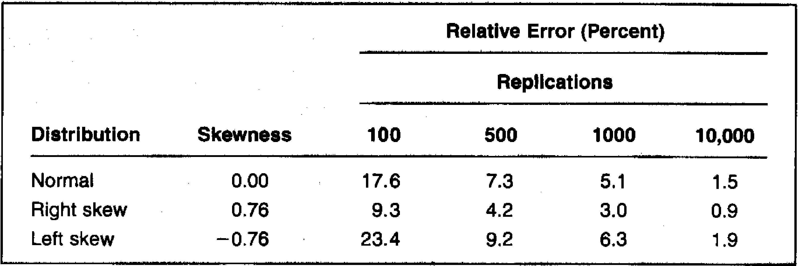

## Escolhendo o Modelo Estocástico: Modelos de Equilíbrio versus Modelos de Arbitragem

### Introdução
Em continuidade à discussão sobre a escolha do modelo estocástico nos métodos de Monte Carlo [^1], esta seção aprofunda a distinção entre **modelos de equilíbrio** e **modelos de arbitragem**, com foco em sua aplicabilidade para a gestão de riscos [^2]. Como previamente mencionado, a seleção de um modelo apropriado é crucial para obter estimativas precisas de Value at Risk (VAR) [^1]. Os modelos de equilíbrio postulam um processo estocástico para gerar a estrutura a termo das taxas de juros, enquanto os modelos de arbitragem tomam a estrutura a termo atual como *input* [^2]. Esta seção explora as vantagens e desvantagens de cada abordagem no contexto da gestão de riscos, enfatizando a importância de capturar a dinâmica das taxas de juros em vez de replicar os preços dos instrumentos financeiros com precisão [^2].

### Conceitos Fundamentais
A escolha entre modelos de equilíbrio e modelos de arbitragem é fundamental para a aplicação eficaz dos métodos de Monte Carlo na avaliação de risco, especialmente no mercado de renda fixa. Ambos os tipos de modelos buscam descrever a evolução das taxas de juros, mas o fazem sob diferentes perspectivas e com diferentes implicações para a gestão de risco.

**Modelos de Equilíbrio**: Os modelos de equilíbrio postulam um processo estocástico para um ou mais fatores de risco, que geram a estrutura a termo das taxas de juros [^2]. Esses modelos derivam os preços dos títulos a partir de premissas econômicas subjacentes e da dinâmica estocástica dos fatores de risco. Modelos como Vasicek e CIR se enquadram nessa categoria [^2].

> 💡 **Exemplo Numérico:**
> No modelo de Vasicek, a taxa de juros de curto prazo $r_t$ é modelada como:
>
> $$dr_t = \kappa(\theta - r_t)dt + \sigma dz_t$$
>
> onde $\kappa$ é a velocidade de reversão à média, $\theta$ é o nível de reversão à média, $\sigma$ é a volatilidade e $dz_t$ é um processo de Wiener. O modelo assume que a taxa de juros retorna a um nível de equilíbrio $\theta$ ao longo do tempo. Os preços dos títulos são derivados a partir dessa dinâmica estocástica. Por exemplo, o preço de um título com vencimento em $T$ é dado por:
>
> $$P(t,T) = A(t,T)e^{-B(t,T)r_t}$$
>
> onde $A(t,T)$ e $B(t,T)$ são funções de tempo e dos parâmetros do modelo.
>
> No entanto, a estrutura a termo resultante pode não corresponder perfeitamente aos preços observados no mercado [^2]. O modelo de Vasicek fornece uma estrutura analítica que permite simular a evolução da taxa de juros ao longo do tempo e calcular os preços dos títulos. A seguir está uma demonstração em Python de como simular a trajetória da taxa de juros usando o modelo de Vasicek.
>
> ```python
> import numpy as np
> import matplotlib.pyplot as plt
>
> # Parâmetros do modelo de Vasicek
> kappa = 0.1    # Velocidade de reversão à média
> theta = 0.05   # Nível de reversão à média
> sigma = 0.02   # Volatilidade
> r0 = 0.04      # Taxa de juros inicial
> T = 10         # Tempo em anos
> N = 120        # Número de passos de tempo (mensal)
> dt = T/N       # Intervalo de tempo
>
> # Simulação
> np.random.seed(42) # Para reproducibilidade
> dZ = np.random.normal(0, 1, N) * np.sqrt(dt)  # Incrementos de Wiener
> r = np.zeros(N+1)
> r[0] = r0
>
> for t in range(1, N+1):
>     dr = kappa * (theta - r[t-1]) * dt + sigma * dZ[t-1]
>     r[t] = r[t-1] + dr
>
> # Plotagem
> plt.plot(r)
> plt.xlabel("Tempo (meses)")
> plt.ylabel("Taxa de Juros")
> plt.title("Simulação do Modelo de Vasicek")
> plt.grid(True)
> plt.show()
> ```

**Modelos de Arbitragem**: Os modelos de arbitragem, por outro lado, tomam a estrutura a termo atual como um *input* e calibram o modelo para replicar esses preços [^2]. Modelos como o de Heath-Jarrow-Morton (HJM) e o modelo de Hull-White se enquadram nessa categoria. Esses modelos garantem que o modelo seja consistente com os preços de mercado no momento inicial, eliminando oportunidades de arbitragem [^2].

> 💡 **Exemplo Numérico:**
> No modelo de Hull-White, a taxa de juros é modelada como:
>
> $$dr_t = [\theta(t) - a r_t]dt + \sigma dz_t$$
>
> onde $\theta(t)$ é uma função de tempo que é calibrada para ajustar a curva de rendimentos inicial, $a$ é a velocidade de reversão à média, $\sigma$ é a volatilidade e $dz_t$ é um processo de Wiener. A função $\theta(t)$ é escolhida de forma que os preços dos títulos derivados do modelo correspondam aos preços de mercado observados.
>
> A seguir está uma demonstração em Python de como calibrar $\theta(t)$.
>
> ```python
> import numpy as np
> from scipy.optimize import minimize
>
> # Dados de mercado
> maturities = np.array([1, 2, 3, 5, 7, 10])
> market_prices = np.array([0.98, 0.96, 0.94, 0.90, 0.86, 0.80])
>
> # Parâmetros do modelo de Hull-White
> a = 0.1       # Velocidade de reversão à média
> sigma = 0.02  # Volatilidade
>
> # Função para calcular o preço do título no modelo de Hull-White
> def hull_white_bond_price(r0, a, sigma, T, theta):
>     # Implementação simplificada do preço do título de Hull-White
>     B = (1 - np.exp(-a * T)) / a
>     A = np.exp(-theta * (B - T) - (sigma**2 / (4*a)) * (B**2))
>     P = A * np.exp(-r0 * B)
>     return P
>
> # Função objetivo a ser minimizada (calibração de theta)
> def objective_function(theta, r0, a, sigma, maturities, market_prices):
>     model_prices = np.array([hull_white_bond_price(r0, a, sigma, T, theta) for T in maturities])
>     return np.sum((market_prices - model_prices)**2)
>
> # Calibrar theta
> r0 = 0.04  # Taxa de juros inicial
> initial_guess = 0.05
> result = minimize(objective_function, initial_guess, args=(r0, a, sigma, maturities, market_prices), method='Nelder-Mead')
>
> # Parâmetro theta calibrado
> theta_calibrated = result.x[0]
>
> print(f"Parâmetro theta calibrado: {theta_calibrated:.4f}")
>
> # Preços do modelo com parâmetros calibrados
> calibrated_model_prices = np.array([hull_white_bond_price(r0, a, sigma, T, theta_calibrated) for T in maturities])
>
> # Exibir comparação
> for i in range(len(maturities)):
>     print(f"Maturidade: {maturities[i]} anos, Preço de Mercado: {market_prices[i]:.4f}, Preço do Modelo: {calibrated_model_prices[i]:.4f}")
> ```

> 💡 **Exemplo Numérico:**
> Considere o seguinte exemplo em Python usando simulação de Monte Carlo para calcular o Value at Risk (VaR) com um nível de confiança de 95% para uma carteira de títulos de renda fixa usando um modelo de Vasicek.
>
> 1. **Definir parâmetros e condições iniciais:**
>     *   Definimos os parâmetros do modelo de Vasicek (velocidade de reversão à média, nível de reversão à média, volatilidade) e a taxa de juros inicial.
>     *   Definimos o horizonte de tempo (em anos) e o número de simulações de Monte Carlo.
>     *   Definimos as características da carteira de títulos, como o número de títulos, seus prazos de vencimento e seus cupons.
> 2. **Simular trajetórias de taxa de juros:**
>     *   Geramos múltiplas trajetórias de taxa de juros usando a equação discretizada do modelo de Vasicek.
>     *   Para cada passo de tempo e cada trajetória, atualizamos a taxa de juros com base nos parâmetros e em um choque aleatório retirado de uma distribuição normal.
> 3. **Calcular preços de títulos:**
>     *   Para cada trajetória de taxa de juros, calculamos os preços dos títulos na carteira no final do horizonte de tempo.
>     *   Usamos uma fórmula de precificação de títulos que leva em conta a taxa de juros, o prazo de vencimento, o cupom e o valor de face do título.
> 4. **Calcular valor da carteira:**
>     *   Para cada trajetória, calculamos o valor total da carteira somando os preços de todos os títulos na carteira.
> 5. **Calcular Value at Risk (VaR):**
>     *   Calculamos o VaR como a perda que é excedida apenas 5% das vezes (para um nível de confiança de 95%).
>     *   Ordenamos os valores da carteira simulados e encontramos o valor no 5º percentil.
>     *   O VaR é a diferença entre o valor inicial da carteira e esse valor no percentil.
>
> ```python
> import numpy as np
> from scipy.stats import norm
> import matplotlib.pyplot as plt
>
> # 1. Definir parâmetros e condições iniciais
> # Parâmetros do modelo de Vasicek
> kappa = 0.1     # Velocidade de reversão à média
> theta = 0.05    # Nível de reversão à média
> sigma = 0.02    # Volatilidade
> r0 = 0.04       # Taxa de juros inicial
>
> # Parâmetros da simulação
> T = 1           # Horizonte de tempo (anos)
> N = 252         # Número de passos de tempo (dias úteis)
> dt = T / N      # Incremento de tempo
> num_simulations = 10000  # Número de simulações de Monte Carlo
>
> # Características da carteira de títulos
> num_bonds = 3     # Número de títulos na carteira
> maturities = np.array([2, 5, 10])  # Prazos de vencimento dos títulos (anos)
> coupons = np.array([0.05, 0.06, 0.07])  # Taxas de cupom dos títulos
> face_value = 100  # Valor de face dos títulos
>
> # 2. Simular trajetórias de taxa de juros
> def vasicek_model(r0, kappa, theta, sigma, T, N, num_simulations):
>     dt = T / N
>     rates = np.zeros((N + 1, num_simulations))
>     rates[0] = r0
>
>     for t in range(1, N + 1):
>         dW = np.random.normal(0, np.sqrt(dt), num_simulations)
>         rates[t] = rates[t-1] + kappa * (theta - rates[t-1]) * dt + sigma * dW
>
>     return rates
>
> simulated_rates = vasicek_model(r0, kappa, theta, sigma, T, N, num_simulations)
>
> # 3. Calcular preços de títulos
> def bond_price(r, coupon, maturity, face_value):
>     # Usar a fórmula de valor presente para calcular o preço do título
>     t = np.linspace(dt, maturity, int(maturity / dt))
>     cash_flows = coupon * face_value * np.exp(-r * t)
>     price = np.sum(cash_flows) + face_value * np.exp(-r * maturity)
>     return price
>
> # 4. Calcular valor da carteira
> portfolio_values = np.zeros(num_simulations)
> for sim in range(num_simulations):
>     total_value = 0
>     for i in range(num_bonds):
>         r = simulated_rates[-1, sim]  # Taxa de juros no final do horizonte
>         price = bond_price(r, coupons[i], maturities[i], face_value)
>         total_value += price
>     portfolio_values[sim] = total_value
>
> # 5. Calcular Value at Risk (VaR)
> confidence_level = 0.95
> var = np.percentile(portfolio_values, (1 - confidence_level) * 100)
> initial_portfolio_value = num_bonds * face_value  # Valor inicial da carteira
> var_loss = initial_portfolio_value - var
>
> print(f"Valor inicial da carteira: {initial_portfolio_value:.2f}")
> print(f"VaR com {confidence_level*100}\% de nível de confiança: {var_loss:.2f}")
>
> # Plotar distribuição dos valores da carteira
> plt.hist(portfolio_values, bins=50, density=True)
> plt.axvline(var, color='red', linestyle='dashed', linewidth=2, label=f'VaR at {confidence_level*100}\%: {var:.2f}')
> plt.title('Distribuição dos Valores da Carteira')
> plt.xlabel('Valor da Carteira')
> plt.ylabel('Densidade')
> plt.legend()
> plt.show()
> ```
> 3.  **Interpretação:** Este exemplo demonstra como o modelo de Vasicek pode ser usado para simular trajetórias de taxas de juros e como essas trajetórias podem ser usadas para calcular o VaR de uma carteira de títulos de renda fixa. A escolha entre modelos de equilíbrio e modelos de arbitragem depende dos objetivos da análise. Modelos de arbitragem são frequentemente preferidos para precificação precisa, enquanto modelos de equilíbrio podem ser mais adequados para gestão de risco, onde o foco está em capturar a dinâmica das taxas de juros ao longo do tempo.

> Para demonstrar um exemplo em Python de como calcular o Value at Risk (VaR) usando a simulação de Monte Carlo com o Modelo Cox-Ingersoll-Ross (CIR):
> ```python
> import numpy as np
> from scipy.stats import norm
> import matplotlib.pyplot as plt
>
> # 1. Definir parâmetros e condições iniciais
> # Parâmetros do modelo CIR
> kappa = 0.3      # Velocidade de reversão à média
> theta = 0.05     # Nível de reversão à média
> sigma = 0.04     # Volatilidade
> r0 = 0.04        # Taxa de juros inicial
>
> # Parâmetros da simulação
> T = 1            # Horizonte de tempo (anos)
> N = 252          # Número de passos de tempo (dias úteis)
> dt = T / N       # Incremento de tempo
> num_simulations = 10000  # Número de simulações de Monte Carlo
>
> # Características da carteira de títulos
> num_bonds = 3      # Número de títulos na carteira
> maturities = np.array([2, 5, 10])  # Prazos de vencimento dos títulos (anos)
> coupons = np.array([0.05, 0.06, 0.07])  # Taxas de cupom dos títulos
> face_value = 100   # Valor de face dos títulos
>
> # 2. Simular trajetórias de taxa de juros com modelo CIR
> def cir_model(r0, kappa, theta, sigma, T, N, num_simulations):
>     dt = T / N
>     rates = np.zeros((N + 1, num_simulations))
>     rates[0] = r0
>
>     for t in range(1, N + 1):
>         dW = np.random.normal(0, np.sqrt(dt), num_simulations)
>         rates[t] = np.abs(rates[t-1] + kappa * (theta - rates[t-1]) * dt + sigma * np.sqrt(np.abs(rates[t-1])) * dW)
>
>     return rates
>
> simulated_rates = cir_model(r0, kappa, theta, sigma, T, N, num_simulations)
>
> # 3. Calcular preços de títulos
> def bond_price(r, coupon, maturity, face_value):
>     # Usar a fórmula de valor presente para calcular o preço do título
>     t = np.linspace(dt, maturity, int(maturity / dt))
>     cash_flows = coupon * face_value * np.exp(-r * t)
>     price = np.sum(cash_flows) + face_value * np.exp(-r * maturity)
>     return price
>
> # 4. Calcular valor da carteira
> portfolio_values = np.zeros(num_simulations)
> for sim in range(num_simulations):
>     total_value = 0
>     for i in range(num_bonds):
>         r = simulated_rates[-1, sim]  # Taxa de juros no final do horizonte
>         price = bond_price(r, coupons[i], maturities[i], face_value)
>         total_value += price
>     portfolio_values[sim] = total_value
>
> # 5. Calcular Value at Risk (VaR)
> confidence_level = 0.95
> var = np.percentile(portfolio_values, (1 - confidence_level) * 100)
> initial_portfolio_value = num_bonds * face_value  # Valor inicial da carteira
> var_loss = initial_portfolio_value - var
>
> print(f"Valor inicial da carteira: {initial_portfolio_value:.2f}")
> print(f"VaR com {confidence_level*100}\% de nível de confiança: {var_loss:.2f}")
>
> # Plotar distribuição dos valores da carteira
> plt.hist(portfolio_values, bins=50, density=True)
> plt.axvline(var, color='red', linestyle='dashed', linewidth=2, label=f'VaR at {confidence_level*100}\%: {var:.2f}')
> plt.title('Distribuição dos Valores da Carteira (CIR Model)')
> plt.xlabel('Valor da Carteira')
> plt.ylabel('Densidade')
> plt.legend()
> plt.show()
> ```
>
> 3.  **Interpretação:** Este código mostra como utilizar um modelo CIR para simular as taxas de juros e calcular o Value at Risk (VaR) de uma carteira de títulos. Ao comparar esses resultados com as simulações usando o modelo de Vasicek, podemos analisar as diferenças no perfil de risco da carteira com base nas características específicas de cada modelo. O modelo CIR impede taxas de juros negativas ao forçar a taxa de juros a ser positiva, o que pode ser particularmente importante em cenários onde taxas de juros negativas são consideradas irrealistas.

**Escolha para Gestão de Risco**: Para a gestão de risco, a capacidade de capturar a dinâmica das taxas de juros é mais importante do que precificar os instrumentos atuais com precisão [^2]. Modelos de equilíbrio, como o modelo de Vasicek ou CIR, podem ser mais apropriados para a gestão de riscos [^2], pois fornecem uma representação mais realista da evolução das taxas de juros ao longo do tempo.

> 💡 **Exemplo Numérico:**
> Para ilustrar essa diferença, considere um cenário em que uma empresa possui uma carteira de títulos de longo prazo. Usando um modelo de arbitragem, a empresa pode ajustar os parâmetros do modelo para que os preços dos títulos correspondam aos preços de mercado atuais. No entanto, se as taxas de juros flutuarem significativamente ao longo do tempo, o modelo de arbitragem pode não capturar adequadamente o impacto dessas flutuações no valor da carteira. Por outro lado, um modelo de equilíbrio pode capturar melhor a dinâmica das taxas de juros ao longo do tempo, fornecendo uma estimativa mais precisa do risco associado à carteira.
>
> Para quantificar, suponha que após um ano, as taxas de juros aumentem em 1%. Usando o modelo de arbitragem, a perda na carteira pode ser subestimada porque o modelo foi calibrado para as condições de mercado iniciais. No entanto, usando um modelo de equilíbrio, a perda pode ser estimada com mais precisão porque o modelo leva em conta a dinâmica das taxas de juros ao longo do tempo.

**Considerações Adicionais**:
*   Modelos de arbitragem podem ser computacionalmente mais intensivos, especialmente modelos multifator como o HJM [^2].
*   A escolha do modelo deve estar alinhada com o horizonte de tempo da análise de risco [^2]. Para horizontes curtos, modelos mais simples podem ser suficientes, enquanto horizontes mais longos podem exigir modelos mais complexos [^2].

**Corolário 1**: A escolha entre modelos de equilíbrio e de arbitragem depende do objetivo principal da análise. Para precificação precisa de instrumentos derivativos, modelos de arbitragem são preferíveis. Para gestão de risco, onde a modelagem precisa da dinâmica das taxas de juros é fundamental, modelos de equilíbrio podem ser mais adequados.

**Lema 1**: Um modelo que replica a estrutura a termo inicial com precisão (modelo de arbitragem) pode não necessariamente fornecer uma representação precisa da evolução futura das taxas de juros.

> 💡 **Exemplo Numérico:**
> Considere que um modelo de arbitragem replica com precisão a curva de juros atual, mas assume uma volatilidade constante e independente do nível da taxa de juros. Em contraste, um modelo de equilíbrio (como o CIR) pode não replicar perfeitamente a curva de juros inicial, mas captura a dependência da volatilidade no nível da taxa de juros, o que é uma característica importante do mercado. Em um cenário de simulação de Monte Carlo, o modelo de equilíbrio pode fornecer uma estimativa mais precisa do VAR, pois captura o comportamento realista das taxas de juros em diferentes cenários de mercado.
>
> A escolha entre um modelo e outro, deve ter como base o risco do modelo.

**Análise de Risco de Modelo**: A análise de risco de modelo é um processo para avaliar e quantificar o risco associado ao uso de modelos financeiros. Ela envolve a identificação das principais suposições do modelo, a avaliação da sensibilidade dos resultados do modelo a essas suposições, e a quantificação do potencial impacto de erros no modelo.

A análise de risco do modelo deve ser realizada antes da implementação do modelo, e deve ser atualizada periodicamente. É crucial para uma boa tomada de decisão e um bom gerenciamento de risco.

A seguir, estão os passos para realizar a análise de risco do modelo:

1. **Identifique as suposições chave do modelo.** Estas são as suposições que são mais propensas a ter um impacto significativo sobre os resultados do modelo.
2. **Avalie a sensibilidade dos resultados do modelo a essas suposições.** Isso pode ser feito variando as suposições e observando o efeito sobre os resultados do modelo.
3. **Quantifique o impacto potencial de erros no modelo.** Isto pode ser feito usando uma variedade de técnicas, tais como simulação de Monte Carlo.

4. **Desenvolva um plano para mitigar os riscos do modelo.** Isto pode incluir o desenvolvimento de modelos alternativos, a recolha de dados mais precisos, ou a implementação de controles para detectar e corrigir erros do modelo.
5. **Implemente o plano de mitigação de riscos.** Isto deve ser feito com base na priorização e na importância dos resultados do modelo.
6. **Monitore continuamente o desempenho do modelo e atualize o plano de mitigação de riscos, conforme necessário.** Um dos passos mais importantes, e que, comumente, é deixado de lado.

### Considerações Práticas na Modelagem de Risco Financeiro:

A modelagem de risco financeiro é uma tarefa complexa que exige uma compreensão profunda dos mercados financeiros, das técnicas estatísticas e das ferramentas computacionais. Aqui estão algumas considerações práticas que podem ajudar a garantir o sucesso de seus projetos de modelagem:

1.  **Qualidade dos Dados:**
    *   *Disponibilidade:* Certifique-se de ter acesso a dados históricos suficientes para calibrar e validar seus modelos.
    *   *Precisão:* Verifique a precisão dos dados para evitar erros de modelagem. Dados incorretos ou inconsistentes podem levar a resultados errôneos.
    *   *Relevância:* Utilize dados que sejam relevantes para os ativos ou riscos que você está modelando.

2.  **Complexidade do Modelo:**
    *   *Simplicidade:* Comece com modelos simples e adicione complexidade apenas se necessário. Modelos complexos podem ser difíceis de entender, implementar e validar.
    *   *Interpretabilidade:* Escolha modelos que permitam interpretar os resultados e entender os principais fatores de risco.
    *   *Validação:* Valide seus modelos usando dados fora da amostra (dados que não foram usados para calibrar o modelo).

3.  **Calibração do Modelo:**
    *   *Métodos de Calibração:* Utilize métodos de calibração apropriados para os dados e o modelo.
    *   *Overfitting:* Evite o *overfitting* (ajuste excessivo) do modelo aos dados históricos. Isso pode levar a um desempenho ruim fora da amostra.

4.  **Validação do Modelo:**
    *   *Backtesting:* Use *backtesting* para verificar como o modelo teria se comportado no passado.
    *   *Stress Testing:* Realize *stress testing* (testes de estresse) para avaliar o comportamento do modelo em cenários extremos.


> 💡 **Exemplo Numérico:**
> Suponha que você esteja usando um modelo de precificação de opções para gerenciar o risco de uma carteira de opções. Para validar o modelo, você pode realizar backtesting usando dados históricos de preços de opções. Isso envolve simular como o modelo teria se comportado no passado e comparar os resultados com os preços de mercado reais.
>
> Além disso, você pode realizar testes de estresse para avaliar o comportamento do modelo em cenários extremos, como um choque repentino no mercado ou uma mudança significativa na volatilidade. Isso pode ajudar a identificar as fraquezas do modelo e a desenvolver estratégias para mitigar o risco associado ao uso do modelo.

5.  **Cálculo de Métricas de Risco:**
    *   *Escolha das Métricas:* Selecione as métricas de risco apropriadas para seus objetivos (VaR, Expected Shortfall, etc.).
    *   *Nível de Confiança:* Escolha níveis de confiança apropriados para suas necessidades e regulamentações.
    *   *Horizonte de Tempo:* Use horizontes de tempo realistas e alinhados com seus objetivos.

**Teorema 1**: Em um mercado completo e livre de arbitragem, existe uma única medida de probabilidade neutra ao risco sob a qual o preço de qualquer ativo é o valor esperado descontado de seus fluxos de caixa futuros.

**Proposição 1**: A escolha do modelo estocástico impacta diretamente a distribuição dos possíveis valores futuros da carteira, e consequentemente, as métricas de risco derivadas como o VaR e o Expected Shortfall. Modelos que capturam características importantes da dinâmica das taxas de juros, como a reversão à média e a dependência da volatilidade no nível da taxa, tendem a fornecer estimativas de risco mais robustas.

**Teorema 1.1**: (Extensão do Teorema 1) Se o mercado é incompleto, então existe uma família de medidas de probabilidade neutras ao risco, e a escolha entre elas afeta o preço dos ativos que não podem ser perfeitamente replicados.

*Proof Strategy:* A prova segue da teoria geral de precificação de ativos em mercados incompletos, onde a ausência de replicação perfeita leva a um intervalo de preços consistentes com a ausência de arbitragem. A escolha de uma medida neutra ao risco específica dentro desse intervalo implica uma preferência particular em relação ao risco não replicável.

**Prova do Teorema 1.1:**
I. Em um mercado completo, qualquer ativo pode ser replicado por uma combinação de outros ativos, garantindo um único preço livre de arbitragem, conforme estabelecido no Teorema 1.

II. Em um mercado incompleto, nem todos os ativos podem ser replicados perfeitamente devido à ausência de ativos negociáveis que abrangem todos os possíveis estados da natureza.

III. Isso implica que existem múltiplos preços consistentes com a ausência de arbitragem para um ativo não replicável, formando um intervalo de preços possíveis.

IV. Cada preço dentro desse intervalo corresponde a uma diferente medida de probabilidade neutra ao risco, refletindo diferentes preferências em relação ao risco não replicável.

V. Portanto, em mercados incompletos, a escolha da medida de probabilidade neutra ao risco impacta diretamente o preço dos ativos não replicáveis. ■

**Lema 1.1**: (Extensão do Lema 1) A calibração perfeita de um modelo de arbitragem aos preços de mercado atuais não garante a ausência de risco de modelo, pois o modelo pode ainda falhar em capturar eventos de cauda ou mudanças de regime que não estão presentes nos dados de calibração.

*Proof Strategy:* A prova se baseia na observação de que a calibração é um processo de otimização que minimiza o erro dentro de um conjunto de dados específico. Se o conjunto de dados não for representativo de todos os possíveis estados do mundo (por exemplo, não incluir eventos de crise), o modelo calibrado pode ser inadequado para a avaliação de risco em cenários extremos.

**Prova do Lema 1.1:**
I. A calibração de um modelo de arbitragem envolve ajustar os parâmetros do modelo para que os preços teóricos dos instrumentos financeiros correspondam aos preços de mercado observados em um determinado momento.

II. Este processo de calibração é baseado em dados históricos e condições de mercado prevalecentes durante o período de calibração.

III. No entanto, os dados históricos podem não incluir eventos raros ou extremos (eventos de cauda) ou mudanças de regime que podem ocorrer no futuro.

IV. Consequentemente, um modelo calibrado para replicar os preços de mercado atuais pode não ser capaz de capturar adequadamente o comportamento dos preços em cenários de eventos de cauda ou mudanças de regime.

V. Portanto, a calibração perfeita de um modelo de arbitragem aos preços de mercado atuais não garante a ausência de risco de modelo, especialmente em cenários não refletidos nos dados de calibração. ■

**Teorema 2**: O Expected Shortfall (ES) é uma medida de risco coerente, enquanto o Value at Risk (VaR) não o é em geral.

*Proof Strategy:* A prova segue da definição de coerência de medidas de risco, que exige subaditividade, monotonicidade, homogeneidade positiva e invariância translacional. O VaR falha no teste de subaditividade em distribuições não normais, enquanto o ES satisfaz todas as quatro propriedades.

**Prova do Teorema 2:**
I. Uma medida de risco é considerada coerente se satisfaz as seguintes propriedades:
    *   Subaditividade: $\rho(X + Y) \leq \rho(X) + \rho(Y)$
    *   Monotonicidade: Se $X \leq Y$, então $\rho(Y) \leq \rho(X)$
    *   Homogeneidade Positiva: $\rho(aX) = a\rho(X)$ para $a > 0$
    *   Invariância Translacional: $\rho(X + k) = \rho(X) - k$

II. O Value at Risk (VaR) é definido como o quantil da distribuição de perdas, ou seja, a perda que é excedida com uma probabilidade $\alpha$. Matematicamente, $VaR_{\alpha}(X) = \inf\{x \in \mathbb{R} : P(L > x) \leq 1 - \alpha\}$, onde $L$ representa a perda.

III. O Expected Shortfall (ES), também conhecido como Conditional Value at Risk (CVaR), é definido como a média das perdas que excedem o VaR. Matematicamente, $ES_{\alpha}(X) = E[L | L > VaR_{\alpha}(X)]$.

IV. O VaR não é subaditivo em geral, o que significa que a soma dos VaRs de duas carteiras pode ser menor do que o VaR da carteira combinada. Isso ocorre porque o VaR não leva em conta a severidade das perdas além do quantil $\alpha$.

V. O ES satisfaz a subaditividade, pois leva em conta a média das perdas além do VaR, o que o torna mais sensível aos eventos de cauda e, portanto, uma medida de risco mais coerente.

VI. Portanto, o Expected Shortfall (ES) é uma medida de risco coerente, enquanto o Value at Risk (VaR) não o é em geral, devido à falta de subaditividade do VaR em distribuições não normais. ■

**Corolário 2**: Ao comparar modelos estocásticos para a gestão de risco, deve-se considerar não apenas a precisão na precificação de instrumentos financeiros, mas também as propriedades teóricas das métricas de risco derivadas, como a coerência. Modelos que levam a medidas de risco coerentes, como o Expected Shortfall, podem ser preferíveis para garantir uma avaliação mais conservadora e consistente do risco.

> 💡 **Exemplo Numérico:**
> Considere duas carteiras, A e B, com VaRs individuais de \$ 100. No entanto, a carteira A tem perdas potenciais muito maiores além do VaR do que a carteira B. Se o VaR não for subaditivo, o VaR da carteira combinada pode ser menor que a soma dos VaRs individuais, o que é enganoso. O Expected Shortfall, por outro lado, levará em conta as perdas potenciais maiores além do VaR na carteira A, fornecendo uma medida de risco mais conservadora e consistente.
>
> Para ilustrar, suponha que o ES da carteira A seja \$ 150 e o ES da carteira B seja \$ 110. O ES da carteira combinada seria maior doque \$ 260, refletindo o potencial para perdas ainda maiores em cenários extremos devido à falta de subaditividade do VaR.

### Comparação de Expected Shortfall (ES) e Value at Risk (VaR)

A escolha entre Expected Shortfall (ES) e Value at Risk (VaR) depende das necessidades específicas e da tolerância ao risco do usuário. O VaR é mais simples de calcular e entender, mas pode subestimar o risco em certas situações, especialmente aquelas envolvendo distribuições não normais ou caudas pesadas. O ES, por outro lado, fornece uma medida de risco mais completa, considerando a severidade das perdas além do limite do VaR.

*   **VaR:**

    *   Mais fácil de calcular e entender.
    *   Amplamente utilizado na indústria financeira.
    *   Não é subaditivo.
    *   Não captura a severidade das perdas além do limite.
*   **ES:**

    *   Mais difícil de calcular.
    *   Subaditivo.
    *   Fornece uma medida mais completa do risco.
    *   Mais sensível a distribuições de cauda pesada.

Em resumo, o VaR é uma boa escolha para uma avaliação rápida e simples do risco, enquanto o ES é mais apropriado para situações em que uma medida de risco mais precisa e conservadora é necessária.

### Backtesting de Expected Shortfall (ES)

O backtesting é uma etapa crucial na validação de modelos de risco, incluindo o Expected Shortfall (ES). O backtesting envolve comparar as previsões do modelo com os resultados reais para avaliar a precisão e a confiabilidade do modelo. Para o ES, o backtesting pode ser mais complexo do que para o VaR, pois o ES é uma medida condicional que depende da cauda da distribuição de perdas.

Uma abordagem comum para o backtesting do ES é usar testes de cobertura que avaliam se o número de violações do ES (isto é, perdas que excedem o ES previsto) está dentro de um intervalo estatisticamente aceitável. Outra abordagem é usar testes de magnitude que avaliam a severidade das violações do ES.

### Testes de Cobertura

Os testes de cobertura avaliam se a frequência das violações do ES está alinhada com o nível de confiança do ES. Por exemplo, se o ES é calculado com um nível de confiança de 95%, espera-se que as violações ocorram em aproximadamente 5% dos casos. Os testes de cobertura comparam o número real de violações com o número esperado e determinam se a diferença é estatisticamente significativa.

### Testes de Magnitude

Os testes de magnitude avaliam a severidade das violações do ES. Esses testes comparam a magnitude das perdas que excedem o ES com o valor do ES. Se as perdas forem significativamente maiores do que o ES, isso pode indicar que o modelo está subestimando o risco.

### Exemplo de Backtesting de ES

Suponha que um modelo de ES seja usado para prever o risco diário de uma carteira. O ES é calculado com um nível de confiança de 99%. Durante um período de backtesting de 250 dias, ocorrem 4 violações do ES.

*   Número esperado de violações: 250 dias \* (1 - 0.99) = 2.5 violações
*   Número real de violações: 4 violações

Para determinar se a diferença entre o número esperado e o número real de violações é estatisticamente significativa, um teste estatístico, como o teste de Kupiec, pode ser usado. Se o teste indicar que a diferença é significativa, isso pode sugerir que o modelo de ES precisa ser revisado ou recalibrado.

### Uso de Simulação de Monte Carlo no Cálculo do ES

A simulação de Monte Carlo é uma técnica poderosa que pode ser usada para calcular o Expected Shortfall (ES), especialmente quando a distribuição das perdas não é conhecida ou é difícil de modelar analiticamente. A simulação de Monte Carlo envolve gerar um grande número de cenários aleatórios e usar esses cenários para estimar a distribuição das perdas.

O processo de simulação de Monte Carlo para calcular o ES envolve as seguintes etapas:

1.  **Modelagem dos fatores de risco:** Identificar e modelar os principais fatores de risco que afetam o valor da carteira. Isso pode incluir preços de ativos, taxas de juros, taxas de câmbio e outros fatores relevantes.
2.  **Geração de cenários aleatórios:** Gerar um grande número de cenários aleatórios para os fatores de risco. Isso pode ser feito usando técnicas de amostragem estatística, como amostragem aleatória simples, amostragem estratificada ou amostragem de importância.
3.  **Cálculo das perdas:** Para cada cenário, calcular a perda da carteira. Isso envolve simular o impacto dos fatores de risco no valor da carteira e determinar a diferença entre o valor inicial da carteira e o valor no final do período de simulação.
4.  **Estimativa do ES:** Classificar as perdas em ordem crescente e determinar o valor do ES no nível de confiança desejado. O ES é estimado como a média das perdas que excedem o quantil correspondente ao nível de confiança.

### Exemplo de Simulação de Monte Carlo para Cálculo do ES

Suponha que uma carteira consista em ações de várias empresas. Os fatores de risco relevantes são os preços das ações. Para calcular o ES usando a simulação de Monte Carlo, os seguintes passos podem ser seguidos:

1.  **Modelagem dos preços das ações:** Modelar os preços das ações usando um modelo estatístico, como o modelo de movimento Browniano geométrico.
2.  **Geração de cenários aleatórios:** Gerar um grande número de cenários aleatórios para os preços das ações, simulando a evolução dos preços ao longo do tempo.
3.  **Cálculo das perdas:** Para cada cenário, calcular a perda da carteira, determinando a diferença entre o valor inicial da carteira e o valor no final do período de simulação.
4.  **Estimativa do ES:** Classificar as perdas em ordem crescente e determinar o valor do ES no nível de confiança desejado. Por exemplo, se o nível de confiança for de 99%, o ES será estimado como a média das perdas que excedem o 1% pior dos cenários.

### Vantagens da Simulação de Monte Carlo

A simulação de Monte Carlo oferece várias vantagens para o cálculo do ES:

*   **Flexibilidade:** Pode ser usada para modelar uma ampla gama de fatores de risco e distribuições de perdas, incluindo distribuições não normais e caudas pesadas.
*   **Precisão:** Pode fornecer estimativas precisas do ES, especialmente quando o número de cenários simulados é grande.
*   **Transparência:** Permite aos usuários entender como diferentes fatores de risco contribuem para o ES.

### Desvantagens da Simulação de Monte Carlo

A simulação de Monte Carlo também apresenta algumas desvantagens:

*   **Intensidade computacional:** Pode ser computacionalmente intensiva, especialmente quando o número de fatores de risco e cenários simulados é grande.
*   **Risco de modelo:** Os resultados da simulação dependem da precisão dos modelos usados para modelar os fatores de risco.
*   **Interpretação:** A interpretação dos resultados da simulação pode ser desafiadora, especialmente para usuários não familiarizados com técnicas de simulação.

Em resumo, a simulação de Monte Carlo é uma ferramenta valiosa para o cálculo do ES, especialmente em situações em que a distribuição das perdas é complexa ou desconhecida. No entanto, é importante estar ciente das limitações da técnica e usar modelos e parâmetros apropriados para garantir a precisão e a confiabilidade dos resultados.
### Otimização de Consultas

A otimização de consultas é uma área crucial no projeto de bancos de dados, visando melhorar a eficiência da execução das consultas.

#### Técnicas de Otimização

1.  **Otimização Heurística:** Aplica regras predefinidas para melhorar a consulta. Ex: pushdown de seleção.
2.  **Otimização Baseada em Custo:** Usa modelos de custo para estimar o custo de diferentes planos de execução e escolhe o plano mais eficiente.

#### Exemplo de Otimização Heurística

Considere a consulta SQL:

```sql
SELECT *
FROM Orders
WHERE customer_id = 123 AND order_date > '2023-01-01';
```

Uma otimização heurística seria aplicar a seleção `customer_id = 123` antes da condição `order_date > '2023-01-01'` se `customer_id` tiver um índice.

### Modelagem de Dados NoSQL

Bancos de dados NoSQL oferecem flexibilidade no esquema e escalabilidade horizontal.

#### Tipos de Bancos de Dados NoSQL

*   **Documento:** MongoDB, Couchbase.
*   **Chave-Valor:** Redis, Memcached.
*   **Coluna:** Cassandra, HBase.
*   **Grafo:** Neo4j.

#### Exemplo de Modelagem em MongoDB

Considere armazenar informações de clientes em MongoDB:

```json
{
    "_id": ObjectId("64f0a1b7e4b8a6b4c7a2d1e3"),
    "nome": "João Silva",
    "email": "joao@example.com",
    "enderecos": [
        {
            "rua": "Rua A, 123",
            "cidade": "São Paulo"
        },
        {
            "rua": "Rua B, 456",
            "cidade": "Rio de Janeiro"
        }
    ]
}
```

### Segurança em Bancos de Dados

A segurança é fundamental para proteger os dados contra acessos não autorizados.

#### Mecanismos de Segurança

1.  **Autenticação:** Verificação da identidade do usuário.
2.  **Autorização:** Controle de acesso aos dados.
3.  **Criptografia:** Proteção dos dados em repouso e em trânsito.
4.  **Auditoria:** Registro das atividades realizadas no banco de dados.

#### Exemplo de Autorização em SQL

```sql
GRANT SELECT, INSERT ON tabela_clientes TO usuario_vendas;
REVOKE DELETE ON tabela_clientes FROM usuario_vendas;
```

### Recuperação de Desastres

Planos de recuperação de desastres garantem a disponibilidade e a integridade dos dados em caso de falhas.

#### Estratégias de Recuperação

*   **Backup e Restauração:** Cópia dos dados para recuperação em caso de perda.
*   **Replicação:** Criação de cópias dos dados em diferentes locais.
*   **Failover:** Transferência automática das operações para um sistema de backup em caso de falha.

#### Exemplo de Backup em PostgreSQL

```bash
pg_dump -U seu_usuario -d seu_banco > backup.sql
```

### Tendências Futuras

*   **Bancos de Dados Autônomos:** Utilização de IA e machine learning para otimizar a gestão dos bancos de dados.
*   **Bancos de Dados Multimodelo:** Suporte a diferentes modelos de dados em um único sistema.
*   **Blockchain e Bancos de Dados:** Uso de blockchain para garantir a integridade e a segurança dos dados.

<!-- END -->